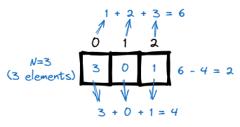
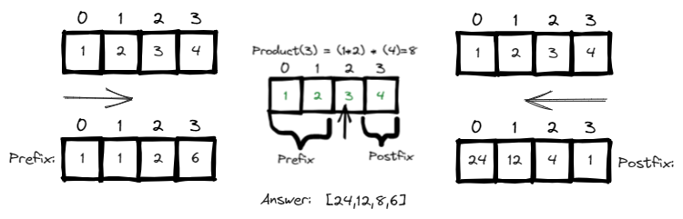

# <a id="home"></a> Arrays and hashing

Данный раздел посвящён задачам на массивы из **[Leetcode Patterns](https://seanprashad.com/leetcode-patterns/)**.\
Кроме того, воспользумся **[Roadmap](https://neetcode.io/roadmap)** от NeetCode.

**Table of Contents:**
1. [Contains duplicate](#duplicate)
2. [Find pivot index](#pivot)
3. [Missing number](#missing)
4. [Two sum](#twosum)
5. [Number of Arithmetic Triplets](#triplets)
6. [Valid Anagram](#anagram)
7. [Group Anagrams](#groupAnagrams)
8. [Top K Frequent Elements](#topFrequent)
9. [Product of Array Except Self](#arrayProduct)
10. [Longest Consecutive Sequence](#longest)
11. [Find all duplicates in Array](#allDuplicates)
12. [First Missing Positive](#missingPositive)
13. [Find All Numbers Disappeared in an Array](#all)
14. [Maximum Difference Between Increasing Elements](#maximum)
15. [Maximum Subarray](#subarray)
16. [Nearby Almost Duplicate](#almostDuplicate)

----

## [↑](#home) <a id="duplicate"></a> Contains duplicate
Рассмотрим задачу **"[Contains duplicate](https://leetcode.com/problems/contains-duplicate/)"**:
> Дан integer array. Определить: есть ли в нём дубликаты (элементы повторяются как минимум дважды). 

Простая задача основанная на применении структуры **Set**:


```java
public boolean containsDuplicate(int[] nums) {
    Set<Integer> seen = new HashSet<>();
    for (int num : nums) {
        if (!seen.add(num)) return true;
    }
    return false; 
}
```
Разбор задачи от NeetCode: **"[Contains Duplicate](https://www.youtube.com/watch?v=3OamzN90kPg)"**.

----

## [↑](#home) <a id="pivot"></a> Find pivot index
Рассмотрим задачу **"[Find pivot index](https://leetcode.com/problems/find-pivot-index/)"**:
> Дан array of integers. Найти pivot - элемент, суммы элементов слева и справа от которого одинаковы.

Мы можем посчитать сумму всех элементов (**total**). Тогда на основе этой суммы мы сможем высчитать половины слева и справа:
```java
int total = 0;
for (int num : nums) {
    total = total + num;
}
```


А дальше просто сдвигаясь вправо накапливаем left и определяем сумму справа:
```java
int left = 0;
for (int i = 0; i < nums.length; i++) {
    if (left == total - nums[i] - left) {
        return i;
    }
    left = left + nums[i];
}
return -1;
```
Разбор задачи от NeetCode: **"[Find pivot index](https://www.youtube.com/watch?v=u89i60lYx8U)"**.

----

## [↑](#home) <a id="missing"></a> Missing number
Рассмотрим задачу **"[Missing Number](https://leetcode.com/problems/missing-number/)"**:
> Дан массив из N уникальных чисел в диапазоне [0, N]. Найти единственное число, которого нехватает.

В контексте данной задачи N=3 означает, что у нас есть 3 числа (размер массива). Мы знаем, что это означает максимальную сумму без пропуска в 1 + 2 + 3 = 6 (то есть сумма порядкового номера элемента). Если мы вычтем из этой суммы текущую сумму, то найдём пропуск:



```java
public int missingNumber(int[] nums) {
    int total = 0, sum = 0;
    for (int i = 0; i < nums.length; i++) {
        total = total + (i + 1);
        sum = sum + nums[i];
    }
    return total - sum;
}
```
Разбор задачи от NeetCode: **"[Missing Number](https://www.youtube.com/watch?v=WnPLSRLSANE)"**.

----

## [↑](#home) <a id="twosum"></a> Two sum
Разберём задачу **"[Two sum](https://leetcode.com/problems/two-sum/)"**:
> Дан array of integers и ожидаемая сумма (target). Вернуть индексы двух элементов дающих такую сумму.

Если ``A + B = Target``, то ``Target - A = B``. Получается, что когда мы смотрим на какой-нибудь элемент, то если из общей суммы вычесть его, то мы получим значение, которое мы должны были видеть ранее (seen). Получается, опять поможет **Set**: 


Точнее, нам понадобится Map, т.к. нам нужно ещё и помнить индексы:
```java
public int[] twoSum(int[] nums, int target) {
    Map<Integer, Integer> map = new HashMap<>();
    // We need indicies, so we need a pointer to the index
    for (int i = 0; i < nums.length; i++) {
        int num2 = target - nums[i];
        if (map.containsKey(num2)) {
            return new int[]{map.get(num2), i};
        }
        map.put(nums[i], i);
    }
    return new int[]{};
}
```
Разбор задачи от NeetCode: **"[Two Sum - Leetcode](https://www.youtube.com/watch?v=KLlXCFG5TnA)"**.

----

## [↑](#home) <a id="triplets"></a> Number of Arithmetic Triplets
Разберём задачу **"[Number of Arithmetic Triplets](https://leetcode.com/problems/number-of-arithmetic-triplets/)"**:
> Дан возрастающий массив чисел и значение diff. Нужно найти количество уникальных триплетов: троек из чисел, которые отличаются друг от друга на значение diff.

Визуализируем пример ``[0,1,4,6,7,10]`` для ``diff = 3``. Существует два триплета:


Получается, т.к. нам известен diff, т.е. шаг с которым у нас должны быть числа, нам достаточно знать одно число и от него этот шаг отмерять. Получается, нам нужно анализировать самое последнее число из триплета, т.к. предыдущие мы должны были видеть уже.

Таким образом решение данной задачи очень похоже на решение задачи **[Two sum](#twosum)**:
```java
public int arithmeticTriplets(int[] nums, int diff) {
    int result = 0;
    Set<Integer> visited = new HashSet<>();
    for (int num : nums) {
        if (visited.contains(num - diff) && visited.contains(num - (diff*2))) {
            result++;
        }
        visited.add(num);
    }
    return result;
}
```

----

## [↑](#home) <a id="anagram"></a> Valid Anagram
Разберём задачу **"[Valid Anagram](https://leetcode.com/problems/valid-anagram/)"**:
> Дано две строки s и t. Вернуть true если t анаграмма строки s, т.е. состоит из тех же символов в том же количестве.

Каждый character в строке может быть приведён к соответствующем коду из [ASCII Table](https://www.cs.cmu.edu/~pattis/15-1XX/common/handouts/ascii.html). Например, ``(int)'a'`` будет равен 97. Кроме того, мы знаем, что всего в английском алфавите 26 букв. Данное значение даже можно не учить, а просто посчитать сколько букв МЕЖДУ a и z и добавить единицу (т.к. дистанция считается не от начала, а от первого элемента), например:
```java
(int)'z' - (int)'a' + 1
```

Получается, мы можем завести массив из 26 элементов. Исходная строка будет инкрементировать значения в ячейках по нужному индексу, а строка анограмма - декрементировать:


Решение:
```java
public boolean isAnagram(String s, String t) {
    if (s.length() != t.length()) return false;
    int[] chars = new int[26];
    for (int i = 0; i < s.length(); i++) {
        chars[s.charAt(i) - 'a']++;
        chars[t.charAt(i) - 'a']--;
    }
    for (int num : chars){
        if (num != 0) return false;
    }
    return true;
}
```
Разбор задачи от NeetCode: **"[Valid Anagram - Leetcode](https://www.youtube.com/watch?v=9UtInBqnCgA)"**.\
Разбор задачи от Nick White: **"[Valid Anagram Solution Explained](https://www.youtube.com/watch?v=IRN1VcA8CGc)"**.

----

## [↑](#home) <a id="groupAnagrams"></a> Group Anagrams
Разберём задачу **"[Group Anagrams](https://leetcode.com/problems/group-anagrams/)"**:
> Дан массив из строк. Нужно сгруппировать строки, которые являются анаграммами по спискам.

Данная задача похожа на задачу **[Valid Anagram](#anagram)**, но для каждого слова мы анаграммы будем запоминать как шаблон. Это позволит использовать такой шаблон как ключ в мапе:


Основная цель - получить по каждой строке её шаблон:
```java
public String getPattern(String str) {
    int[] freq = new int[26];
    for (char chr : str.toCharArray()) {
        freq[chr - 'a']++;
    }
    StringBuilder sb = new StringBuilder();
    for (int i = 0; i < freq.length; i++) {
        if (freq[i] != 0) {
            sb.append((char)(i + 'a'));
            sb.append(freq[i]);
        }
    }
    return sb.toString();
}
```

После этого можно формировать HashMap и с её помощью формировать результат:
```java
public List<List<String>> groupAnagrams(String[] strs) {
    Map<String, List<String>> groups = new HashMap<>();
    for (String str : strs) {
        String key = getPattern(str);
        List<String> list = groups.get(key);
        if (list == null) {
            list = new ArrayList<>();
            groups.put(key, list);
        }
        list.add(str);
    }
    return new ArrayList<>(groups.values());
}
```
Объяснение решение от NeetCode: **"[Group Anagrams - Categorize Strings by Count](https://www.youtube.com/watch?v=vzdNOK2oB2E)"**.\
Ещё вариант от Nikhil Lohia: **"[Group Anagrams](https://www.youtube.com/watch?v=C9V66KyZCP8)"**.

----

## [↑](#home) <a id="topFrequent"></a> Top K Frequent Elements
Разберём задачу **"[Top K Frequent Elements](https://leetcode.com/problems/top-k-frequent-elements/)"**:
> Дан массив чисел и некоторое число k. Нужно вернуть k чисел, которые встречаются чаще отстальных.

Для решения данной задачи нам понадобится сформировать **frequency map**:
```java
Map<Integer, Integer> frequencyMap = new HashMap<>();
for (int num : nums) {
    frequencyMap.put(num, frequencyMap.getOrDefault(num, 0) + 1);
}
```
Благодаря этой мапе мы знаем, сколько было повторений для каждого числа.


Далее мы используем **bucket sort**, где каждый бакет соответствует частоте символа. Минимальное значение = 1, то есть нулевой индекс мы пропускаем. А следовательно, нам нужно подготовить массив длинной N + 1 (т.к. нам нужен ещё один слот взамен нулевого):
```java
List<Integer>[] bucket = new ArrayList[nums.length + 1];
for (Integer key : frequencyMap.keySet()) {
    Integer frequency = frequencyMap.get(key);
    if (bucket[frequency] == null) {
        bucket[frequency] = new ArrayList<>();
    }
    bucket[frequency].add(key);
}
```

Чем более часто встречается элемент, тем он ближе к концу нашего массива bucket'ов. Посчитаем результат.\
Важно не уйти за пределы массива (позиция на индексе 0 или выше) и важно вернуть именно k элементов:
```java
int[] result = new int[k];
int counter = 0;
for (int pos = bucket.length - 1; pos >= 0 && counter < k; pos--) {
    if (bucket[pos] != null) {
        // Found bucket. Pick elements while we can
        for (Integer integer : bucket[pos]) {
            result[counter++] = integer;
            if (counter >= k) break;
        }
    }
}
return result;
```

Объяснение решение от NeetCode: **"[Top K Frequent Elements](https://www.youtube.com/watch?v=YPTqKIgVk-k)"**.\
Разбор от Nikhil Lohia: **"[Top K Frequent Elements](https://www.youtube.com/watch?v=EBNPu0GgM64)"**.

----

## [↑](#home) <a id="arrayProduct"></a> Product of Array Except Self
Разберём задачу **"[Product of Array Except Self](https://leetcode.com/problems/product-of-array-except-self/)"**:
> Дан массив чисел. Вернуть массив, где вместо каждого числа будет произведение всех остальных чисел.

Чтобы понять решение, рассмотрим частный случай:



Можно заметить, что результат для каждого элемента - это произведение префикса на постфикс. Кроме того, для первого элемента префикс 1, а для последнего постфикс тоже 1, чтобы работало умножение.

Решение задачи тогда будет выглядеть следующим образом:
```java
public int[] productExceptSelf(int[] nums) {
    int[] result = new int[nums.length];
    int prefix = 1;
    for (int i = 0; i < nums.length; i++) {
        result[i] = prefix;
        prefix = prefix * nums[i]; // prefix for a next iteration
    }
    int postfix = 1;
    for (int i = nums.length - 1; i >= 0; i--) {
        // Each result item already contains calculated prefix
        result[i] = postfix * result[i];
        postfix = postfix * nums[i]; // postfix for a next iteration
    }
    return result;
}
```
Объяснение решение от NeetCode: **"[Product of Array Except Self](https://www.youtube.com/watch?v=bNvIQI2wAjk)"**.

----

## [↑](#home) <a id="longest"></a> Longest Consecutive Sequence
Рассмотрим задачу **"[Longest Consecutive Sequence](https://leetcode.com/problems/longest-consecutive-sequence/)"**:
> Дан несортированный массив чисел. Нужно получить длину самой длинной последовательности чисел в нём. Например, для [100,4,200,1,3,2] последовательностью будет [1, 2, 3, 4] и ответ будет 4.

Данная задача имеет интересное решение. Чтобы её решить нужно ответить на вопрос: Что такое последовательность?\
Последовательность, это когда у числа есть число+1, число+2 и так далее. А что если сохранить все доступные числа в структуре, откуда можно забирать данные за константу и просто использовать как своего рода "кэш".


Для начала нам нужно подготовить HashSet с элементами:
```java
Set<Integer> set = new HashSet<>();
for (int num : nums) {
    set.add(num);
}
```

Далее при помощи Set будем искать самую длинную последовательность. Ещё одна хитрость - нас интересует поиск только от тех элементов, которые являются началом последовательности, т.к. именно они дадут максимальный результат:
```java
int longest = 0;
for (int num : nums) {
    // If num doesn't have previous number - it's a sequence start
    if (!set.contains(num - 1)) {
        int len = 0;
        while (set.contains(num + len)) {
            len++;
        }
        longest = Math.max(longest, len);
    }
}
return longest;
```
Можно заметить, что подход к решению данной задачи напоминает немного подход из задачи [Number of Arithmetic Triplets](#triplets).

За разбор, как обычно, спасибо NeetCode: **"[Longest Consecutive Sequence](https://www.youtube.com/watch?v=P6RZZMu_maU)"**.

----

## [↑](#home) <a id="allDuplicates"></a> Find all duplicates in Array
Рассмотрим задачу **"[Find all duplicates in Array](https://leetcode.com/problems/find-all-duplicates-in-an-array/)"**:
> Дан массив длинной в N, где числа в диапазоне [1, N] и каждое число появляется один или два раза. Вернуть все дубли.

Данная задача интересна подходом к её решению. По условию задачи мы видим, что у нас нет чисел ноль. Получается, что если из числа вычесть единицу, то мы можем соотнести число с индексом:


Получается, что каждый раз мы берём число, вычитаем из него единицу и получаем индекс. Если по этому индексу положительное число - мы ещё не посещали его. Если же посещали - то мы нашли дубль. Дублем будет число, равное индексу + 1.

В таком случае решить данную задачу можно и без дополнительного массива:
```java
List<Integer> result = new ArrayList<>();
for (int i = 0; i < nums.length; i++) {
    // abs to not get an error for negative indexes
    // minus one to consider the first element in the array also
    int index = Math.abs(nums[i]) - 1;
    if (nums[index] < 0) {
        result.add(index + 1);
    } else {
        nums[index] = -nums[index];
    }
}
return result;
```
Разбор можно посмотреть у Nikhil Lohia: **"[Find all Duplicates in an Array](https://www.youtube.com/watch?v=lFhiz9ntwqk)"**.

----

## [↑](#home) <a id="missingPositive"></a> First Missing Positive
Рассмотрим задачу **"[First Missing Positive](https://leetcode.com/problems/first-missing-positive/)"**:
> Дан неотсортированный массив чисел (положительных и отрицательных). Вернуть пропущенное наименьшее положительное число. Сделать это нужно за время O(n) и за 0(1) по памяти.

Данная задача использует тот же подход, что и задача **[Find all duplicates in Array](#allDuplicates)**. Мы будем использовать исходный массив в качестве нашего hashset. При этом нас интересуют только те числа, которые больше нуля:


Следовательно, отрицательные числа можно предварительно занулить, чтобы они не мешали работе алгоритма:
```java
//We are interested ONLY in positive integers. Set other as zero
for (int i = 0; i < nums.length; i++) {
    if (nums[i] < 0) nums[i] = 0;
}
```

Дальше проходим по исходному массиву, где больше нет отрицательных чисел. Нас интересуют только те элементы, значение которых может быть соотнесено с индексом элемента в массива:
Код решения:
```java
for (int i = 0; i < nums.length; i++) {
    int val = Math.abs(nums[i]);
    // [1,2,3] has n=3. The first number that can be missed = 1
    // It means that values should be in a range [1,n]
    if (val >= 1 && val <= nums.length) {
        if (nums[val - 1] > 0) {
            // Mark corresponding element as negative
            nums[val - 1] = nums[val - 1]  * -1;
        } else if (nums[val - 1] == 0) {
            // If marked element is zero mark it as negative number ouside the range
            // We will not try to handle it because it's outside the available range
            nums[val - 1] = (nums.length + 1) * -1;
        }
    }
}
for (int i = 1; i < nums.length + 1; i++) {
    // Any non-negative values means "sequence was interrupted"
    if (nums[i - 1] >= 0) return i;
}
return nums.length + 1;
```
Как обычно, разбор от NeetCode: **"[First Missing Positive](https://www.youtube.com/watch?v=8g78yfzMlao)"**.

----

## [↑](#home) <a id="all"></a> Find All Numbers Disappeared in an Array
Рассмотрим задачу **"[Find All Numbers Disappeared in an Array](https://leetcode.com/problems/find-all-numbers-disappeared-in-an-array/)"**:
> Дан массив из N чисел, каждое из которых в диапазоне [1, n]. Вернуть массив всех чисел из этого диапазона, которые отсутствуют.

Данная задача похожа на задачу **"[Find all duplicates in Array](#allDuplicates)"**.\
Важной подсказкой для нас является то, что каждое число в диапазоне [1, n]. А значит, что число 0 не задействовано. Получается, мы можем сдвинуть каждое число на 1 и получить индекс элемента, который своим знаком будет показывать посещение числа:


Таким образом, решение может выглядеть так:
```java
public List<Integer> findDisappearedNumbers(int[] nums) {
    List<Integer> result = new ArrayList<>();
    // For first round we don't care about indexes, only care about values
    for (int num : nums) {
        int indexToMark = Math.abs(num)-1;
        nums[indexToMark] = -Math.abs(nums[indexToMark]);
    }
    // For the second round find indexes with positive values
    for (int i = 0; i < nums.length; i++) {
        // There is no value (i+i) which was visited
        if (nums[i] >= 0) {
            result.add(i+1);
        }
    }
    return result;
}
```
Разбор задачи от NeetCode: **"[Find All Numbers Disappeared in an Array](https://www.youtube.com/watch?v=8i-f24YFWC4)"**.

----

## [↑](#home) <a id="maximum"></a> Maximum Difference Between Increasing Elements
Рассмотрим другую задачу: [Maximum Difference Between Increasing Elements](https://leetcode.com/problems/maximum-difference-between-increasing-elements/).


Получается, смотря на каждое число мы должны думать, а не является ли оно минимальным. Если минимальное - то мы смотрим только справа от него, т.к. i должен быть меньше j по условию задачи.

Если же рассматриваемое число больше известного минимума, то между ними уже есть какая-то разница. Нужно лишь проверить, не является ли она самой большой разницей из всех, которых мы посчитали. Таким образом решение может выглядеть так:

```java
public int maximumDifference(int[] nums) {
    int diff = -1;
    int min = Integer.MAX_VALUE; // Any value less
    for (int num : nums) {
        if (num < min) {
            // We found new minimum
            min = num;   
        } else if (num > min) {
            // Probably, we found new max diff?
            int curDiff = num - min;
            if (diff < curDiff) {
                diff = curDiff;
            }
        }
    }
    return diff;
}
```

----

## [↑](#home) <a id="subarray"></a> Maximum Subarray
Рассмотрим ещё одну задачу: [Maximum Subarray](https://leetcode.com/problems/maximum-subarray/).

Поможет её решить опять визуализация задачи.


Нам нужно помнить и различать текущую сумму и максимально посчитанную сумму чтобы вовремя остановиться.
```java
public int maxSubArray(int[] nums) {
    // nums is always not empty
    int max = nums[0], cur = 0;
    for (int num : nums) {
        cur = cur + num;
        if (num >= cur) {
            // New num more profitable. Can skip previous elements
            cur = num;
        }
        // We have new current summ. Should we treat it as new max?
        max = Math.max(max, cur);
    }
    return max;
}
```

----

### [↑](#home) <a id="almostDuplicate"></a> Nearby Almost Duplicate
У поиск ближайших дубликатов есть интересное продолжение - **"[220. Contains Duplicate III](https://leetcode.com/problems/contains-duplicate-iii/)"**.

Для начала нужно понять саму задачу. У нас как обычно есть массив чисел. И наша задача: найти такую пару элементов, что их индексы находятся на расстоянии не большем чем indexDiff (может быть меньше или равно), при этом разница значений этих элементов будет не больше, чем valueDiff (меньше или равно).

Из всех решений мне понравилось с точки зрения подхода решение на основе **[Navigable Set](https://docs.oracle.com/javase/8/docs/api/java/util/NavigableSet.html)**. В этом случае решение задачи сводится к пониманию работы с Navigable Set и к **[Floor and Ceiling Functions](https://www.mathsisfun.com/sets/function-floor-ceiling.html)**. Наиболее удобной реализацией является структура данных TreeSet, где операции выполняются за логарифмическое время. 

Предположим, мы получили элемент num=5. Мы знаем, что разница значений должна быть не более t=2.\
В этом случае нам надо рассмотреть две ситуации:
- Мы знаем про другой элемент X, который расположен на прямой так: ``---[num]---[X]---[num+t]--->``
Т.к. поиск по диапазону влево от X, то выполняем floor(num+t) и накладываем ограничение, что X >= num
- Мы знаем про другой элемент Y, который расположен на прямой так: ``---[num-t]---[Y]---[num]--->``
Т.к. поиск по диапазон вправо от Y, то выполняем ceiling(num-t) и накладываем ограничение, что Y <= num


```java
class Solution {
    public static boolean containsNearbyAlmostDuplicate(int[] nums, int k, int t) {
        /**
         * ---[floor]----[num]----[ceiling]--->
         */
        NavigableSet<Long> treeSet = new TreeSet<>();
        for (int i = 0; i < nums.length; i++) {
            // Use long for num to avoid overflow
            long num = (long) nums[i];
            // --[num]---[floor]---[num+t]--->
            Long floor = treeSet.floor(num + t);
            if (floor != null && floor >= num) return true;
            // --[num-t]---[ceil]---[num]--->
            Long ceil = treeSet.ceiling(num - t);
            if (ceil != null && ceil <= num) return true;

            treeSet.add(num);
            // We store k elements and have one element to analyze (num variable).
            // If we store more then k elements we should remove element at k distance from the current position
            // Adjust for [1,2,3,4] for k=2: if we add 3, then it's already 3 elements inside but should be 2.
            // In this case we should remove 1 from the "window": removeIndex = index - k
            if (i >= k) treeSet.remove((long) nums[i - k]);
        }
        return false;
    }
}
```
Это решение наиболее интересное и интуитивно понятное. Существует решение на основе bucket'ов, но оно сложнее и больше шанс допустить ошибки. Подробнее см. stackoverflow: **"[Contains Duplicate III](https://stackoverflow.com/questions/31119971/leetcode-contains-duplicate-iii/48317895)"**.