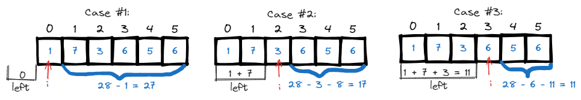

# <a id="home"></a> Arrays and hashing

Данный раздел посвящён задачам на массивы из **[Leetcode Patterns](https://seanprashad.com/leetcode-patterns/)**.\
Кроме того, воспользумся [Roadmap](https://neetcode.io/roadmap) от NeetCode.


**Table of Contents:**
- [Contains duplicate](#duplicate)
- [Find pivot index](#pivot)
- [Missing number](#missing)
- [Two sum](#twosum)
- [Number of Arithmetic Triplets](#triplets)
- [Valid Anagram](#anagram)
- [Group Anagrams](#groupAnagrams)
- [Top K Frequent Elements](#topFrequent)
- [Product of Array Except Self](#arrayProduct)
- [Valid Sudoku](#sudoku)
- [Longest Consecutive Sequence](#longest)
- [Find all duplicates in Array](#allDuplicates)
- [First Missing Positive](#missingPositive)
- [Find All Numbers Disappeared in an Array](#all)

----

## [↑](#home) <a id="duplicate"></a> Contains duplicate
Рассмотрим задачу "[Contains duplicate](https://leetcode.com/problems/contains-duplicate/)".\
Разбор задачи: [NeetCode: Contains Duplicate](https://www.youtube.com/watch?v=3OamzN90kPg).

Простая задача основанная на применении структуры hashset:
```java
public boolean containsDuplicate(int[] nums) {
    Set<Integer> seen = new HashSet<>();
    for (int num : nums) {
        if (!seen.add(num)) return true;
    }
    return false; 
}
```

----

## [↑](#home) <a id="pivot"></a> Find pivot index
Рассмотрим задачу "[Find pivot index](https://leetcode.com/problems/find-pivot-index/)".\
Разбор задачи: [NeetCode: Find pivot index](https://www.youtube.com/watch?v=u89i60lYx8U).



Таким образом, мы делаем своего рода кэширование - предрассчёт всей суммы, чтобы избежать постоянного перебора элементов:
```java
int ttal = 0;
for (int num : nums) {
    total = total + num;
}
```
А дальше просто используем её для определения суммы слева и суммы справа:
```java
int left = 0;
for (int i = 0; i < nums.length; i++) {
    if (left == total - nums[i] - left) {
        return i;
    }
    left = left + nums[i];
}
return -1;
```

----

## [↑](#home) <a id="missing"></a> Missing number
Рассмотрим задачу "[Missing Number](https://leetcode.com/problems/missing-number/)".

По условию задачи, массив из N чисел содержит числа в диапазоне [0, N]. Нужно вернуть пропущенное. Что-то это напоминает:


```java
public int missingNumber(int[] nums) {
    int total = 0;
    for (int i = 0; i <= nums.length; i++) total = total + i;
    int sum = 0;
    for (int num : nums) sum = sum + num;
    return total - sum;
}
```

----

## [↑](#home) <a id="twosum"></a> Two sum
Разберём задачу **"[Two sum](https://leetcode.com/problems/two-sum/)"**.\
Разбор задачи от NeetCode: [Two Sum - Leetcode](https://www.youtube.com/watch?v=KLlXCFG5TnA).


```java
public int[] twoSum(int[] nums, int target) {
    Map<Integer, Integer> map = new HashMap<>();
    // We need indicies, so we need a pointer to the index
    for (int i = 0; i < nums.length; i++) {
        int num2 = target - nums[i];
        if (map.containsKey(num2)) {
            return new int[]{map.get(num2), i};
        }
        map.put(nums[i], i);
    }
    return new int[]{};
}
```

----

## [↑](#home) <a id="triplets"></a> Number of Arithmetic Triplets
Разберём задачу **"[Number of Arithmetic Triplets](https://leetcode.com/problems/number-of-arithmetic-triplets/)"**.

Визуализируем пример ``[0,1,4,6,7,10]`` для ``diff = 3``. Существует два триплета:


Само решение похоже на решение из [Two sum](#twosum):
```java
public int arithmeticTriplets(int[] nums, int diff) {
    int result = 0;
    Set<Integer> visited = new HashSet<>();
    for (int num : nums) {
        if (visited.contains(num - diff) && visited.contains(num - (diff*2))) {
            result++;
        }
        visited.add(num);
    }
    return result;
}
```

----

## [↑](#home) <a id="anagram"></a> Valid Anagram
Разберём задачу **"[Valid Anagram](https://leetcode.com/problems/valid-anagram/)"**.\
Разбор задачи от NeetCode: [Valid Anagram - Leetcode](https://www.youtube.com/watch?v=9UtInBqnCgA)\
Разбор задачи от Nick White: [Valid Anagram Solution Explained](https://www.youtube.com/watch?v=IRN1VcA8CGc)

Решение:
```java
public boolean isAnagram(String s, String t) {
    if (s.length() != t.length()) return false;
    int[] chars = new int[26];
    for (int i = 0; i < s.length(); i++) {
        chars[s.charAt(i) - 'a']++;
        chars[t.charAt(i) - 'a']--;
    }
    for (int num : chars){
        if (num != 0) return false;
    }
    return true;
}
```

----

## [↑](#home) <a id="groupAnagrams"></a> Group Anagrams
Разберём задачу **"[Group Anagrams](https://leetcode.com/problems/group-anagrams/)"**.\
Объяснение решение от NeetCode: [Group Anagrams - Categorize Strings by Count](https://www.youtube.com/watch?v=vzdNOK2oB2E).
Ещё вариант от Nikhil Lohia: [Group Anagrams](https://www.youtube.com/watch?v=C9V66KyZCP8)

Основная цель - получит по каждой строке её шаблон:
```java
public String getPattern(String str) {
    int[] freq = new int[26];
    for (char chr : str.toCharArray()) {
        freq[chr - 'a']++;
    }
    StringBuilder sb = new StringBuilder();
    for (int i = 0; i < freq.length; i++) {
        if (freq[i] != 0) {
            sb.append((char)(i+'a'));
            sb.append(freq[i]);
        }
    }
    return sb.toString();
}
```

После этого можно формировать HashMap и с её помощью формировать результат:
```java
public List<List<String>> groupAnagrams(String[] strs) {
    Map<String, List<String>> groups = new HashMap<>();
    for (String str : strs) {
        String key = getPattern(str);
        List<String> list = groups.get(key);
        if (list == null) {
            list = new ArrayList<>();
            groups.put(key, list);
        }
        list.add(str);
    }
    return new ArrayList<>(groups.values());
}
```

----

## [↑](#home) <a id="topFrequent"></a> Top K Frequent Elements
Разберём задачу **"[Top K Frequent Elements](https://leetcode.com/problems/top-k-frequent-elements/)"**.\
Объяснение решение от NeetCode: [Top K Frequent Elements](https://www.youtube.com/watch?v=YPTqKIgVk-k).\
Разбор от Nikhil Lohia: [Top K Frequent Elements](https://www.youtube.com/watch?v=EBNPu0GgM64).

В любом случае нам придётся посчитать частоту символов:
```java
Map<Integer, Integer> frequencyMap = new HashMap<>();
for (int num : nums) {
    frequencyMap.put(num, frequencyMap.getOrDefault(num, 0) + 1);
}
```

Далее мы используем bucket sort, где каждый бакет соответствует частоте символа. Можно заметить, что при этом массив с бакетами не будет длинее чем длина массива + 1. Например, в массиве [1,1,1] частота встречаемости символа не может быть больше чем N (т.е. чем 3). Так как мы не используем нулевой элемент, то нам нужно взять на 1 элемент больше:
```java
List<Integer>[] bucket = new List[nums.length + 1];
for (Integer key : frequencyMap.keySet()) {
    Integer frequency = frequencyMap.get(key);
    if (bucket[frequency] == null) {
        bucket[frequency] = new ArrayList<>();
    }
    bucket[frequency].add(key);
}
```

И непосредственно само вычисление результата:
```java
int[] result = new int[k];
int counter = 0;
for (int pos = bucket.length - 1; pos >= 0 && counter < k; pos--) {
    if (bucket[pos] != null) {
        for (Integer integer : bucket[pos]) {
            result[counter++] = integer;
            if (counter >= k) break;
        }
    }
}
return result;
```

----

## [↑](#home) <a id="arrayProduct"></a> Product of Array Except Self
Разберём задачу **"[Product of Array Except Self](https://leetcode.com/problems/product-of-array-except-self/)"**.\
Объяснение решение от NeetCode: [Product of Array Except Self](https://www.youtube.com/watch?v=bNvIQI2wAjk).

Чтобы понять решение, нужно для начала рассмотреть частный случай. Например:


Можно заметить, что результат для каждого элемента - это произведение префикса на постфикс. Кроме того, для первого элемента префикс 1, а для последнего постфикс тоже 1, чтобы работало умножение.

Решение задачи тогда будет выглядеть следующим образом:
```java
public int[] productExceptSelf(int[] nums) {
    int[] result = new int[nums.length];
    int prefix = 1;
    for (int i = 0; i < nums.length; i++) {
        result[i] = prefix;
        prefix = prefix * nums[i]; // prefix for a next iteration
    }
    int postfix = 1;
    for (int i = nums.length-1; i >= 0; i--) {
        // Each result item already contains calculated prefix
        result[i] = postfix * result[i];
        postfix = postfix * nums[i]; // postfix for a next iteration
    }
    return result;
}
```

----

## [↑](#home) <a id="longest"></a> Longest Consecutive Sequence
Рассмотрим задачу [Longest Consecutive Sequence](https://leetcode.com/problems/longest-consecutive-sequence/).

За разбор, как обычно, спасибо NeetCode: [Longest Consecutive Sequence](https://www.youtube.com/watch?v=P6RZZMu_maU)

Для начала нам нужно подготовить Set с элементами:
```java
Set<Integer> set = new HashSet<>();
for (int num : nums) {
    set.add(num);
}
```

Далее при помощи Set будем искать самую длинную последовательность:
```java
int longest = 0;
for (int num : nums) {
    // If num doesn't have previous number - it's a sequence start
    if (!set.contains(num - 1)) {
        int len = 0;
        while (set.contains(num + len)) {
            len++;
        }
        longest = Math.max(longest, len);
    }
}
return longest;
```

----

## [↑](#home) <a id="allDuplicates"></a> Find all duplicates in Array
Рассмотрим задачу [Find all duplicates in Array](https://leetcode.com/problems/find-all-duplicates-in-an-array/).\
Разбор можно посмотреть у Nikhil Lohia: [Find all Duplicates in an Array](https://www.youtube.com/watch?v=lFhiz9ntwqk).

Самое главное для решения - увидеть как соотносятся индексы элементов и значения.\
По условию задачи в массиве из N элементов числа будут в диапазоне [1, n]. Тогда можно визуализировать пример из задачи:


Можно увидеть, что если бы у нас был отдельный массив для учёта цифр той же размерности, что и наш массив, то мы могли бы просто из числа вычитать единицу чтобы получить индекс ячейки, где бы мы хранили информацию о посещении. Например, для числа 1 это была бы ячейка с нулевым индексом.

В таком случае решить данную задачу можно и без дополнительного массива:
```java
List<Integer> result = new ArrayList<>();
for (int i = 0; i < nums.length; i++) {
    // abs to not get an error for negative indexes
    // minus one to consider the first element in the array also
    int index = Math.abs(nums[i]) - 1;
    if (nums[index] < 0) {
        result.add(index + 1);
    } else {
        nums[index] = -nums[index];
    }
}
return result;
```

----

## [↑](#home) <a id="missingPositive"></a> First Missing Positive
Рассмотрим задачу [First Missing Positive](https://leetcode.com/problems/first-missing-positive/).

Как обычно, разбор от NeetCode: [First Missing Positive](https://www.youtube.com/watch?v=8g78yfzMlao)

Код решения:
```java
public int firstMissingPositive(int[] nums) {
    //We are interested ONLY in positive integers. Set other as zero
    for (int i = 0; i < nums.length; i++) {
        if (nums[i] < 0) nums[i] = 0;
    }

    for (int i = 0; i < nums.length; i++) {
        int val = Math.abs(nums[i]);
        // [1,2,0] has n=3. The first number that can be missed = 1
        // It means that values should be in a range [1,n]
        if (val >= 1 && val <= nums.length) {
            if (nums[val - 1] > 0) {
                // Mark corresponding element as negative
                nums[val - 1] = nums[val - 1]  * -1;
            } else if (nums[val - 1] == 0) {
                // If marked element is zero mark it as negative number ouside the range
                // We will not try to handle it because it's outside the available range
                nums[val - 1] = (nums.length + 1) * -1;
            }
        }
    }
    for (int i = 1; i < nums.length + 1; i++) {
        // Any non-negative values means "sequence was interrupted"
        if (nums[i - 1] >= 0) return i;
    }
    return nums.length + 1;
}
```

----

## [↑](#home) <a id="all"></a> Find All Numbers Disappeared in an Array
Стоит рассмотреть так же задачу на поиск пропущенных (не обязательно только одного) чисел.\
Задача на LeetCode: [Find All Numbers Disappeared in an Array](https://leetcode.com/problems/find-all-numbers-disappeared-in-an-array/).

Интересно, что решение данной задачи похоже на решение задачи по поиску дубликатов. Разница лишь в том, как получить ответ.

В задаче важно обратить внимание на условие. Дан массив из n чисел, где каждое число в диапазоне [1, n]. Получается, что число 0 не задейстовано. Это позволяет нам числа [1,n] соотнести с индексами [0,n-1]. То есть если из числа вычесть единицу, то мы можем получить индекс. На основе этого мы можем меняя массив маркировать элементы, которые мы посетили:


Таким образом, решение может выглядеть так:
```java
public List<Integer> findDisappearedNumbers(int[] nums) {
    List<Integer> result = new ArrayList<>();
    // For first round we don't care about indexes, only care about values
    for (int num : nums) {
        int indexToMark = Math.abs(num)-1;
        nums[indexToMark] = -Math.abs(nums[indexToMark]);
    }
    // For the second round find indexes with positive values
    for (int i = 0; i < nums.length; i++) {
        // There is no value (i+i) which was visited
        if (nums[i] >= 0) {
            result.add(i+1);
        }
    }
    return result;
}
```