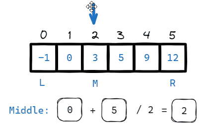
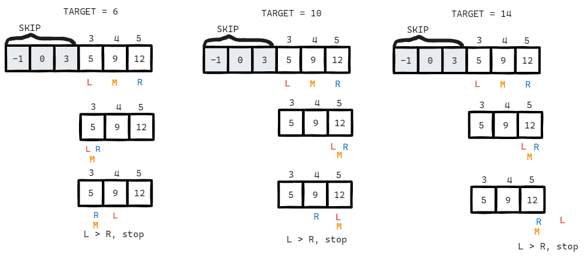
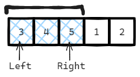
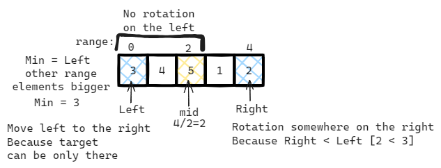

# [←](../../README.md) <a id="home"></a> Arrays: Binary Search

Данный раздел посвящён задачам на массивы и **двоичный поиск**.\
Задачи на LeetCode: **"[Binary Search](https://leetcode.com/problem-list/binary-search/)"**.\
Плэйлист от NeetCode: **"[Binary Search](https://www.youtube.com/watch?v=4sQL7R5ySUU&list=PLot-Xpze53leNZQd0iINpD-MAhMOMzWvO)"**

**Table of Contents:**
- [[704] Binary Search](#search)
- [[35] Search Insert Position](#insertPosition)
- [[374] Guess Number Higher or Lower](#guess)
- [[367] Valid Perfect Square](#perfectSquare)
- [[153] Find Minimum in Rotated Sorted Array](#rotatedMin)
- [[875] Koko Eating Bananas](#koko)

----

## [↑](#home) <a id="search"></a> 704. Binary Search
Рассмотрим базовую задачу на двоичный поиск: **"[704. Binary Search](https://leetcode.com/problems/binary-search/)"**:
> Дан массив целых чисел. Нужно в нём найти элемент и вернуть его индекс за O(log n).

Предположим, нам нужно найти элемент со значением 5:



Как видно, нам нужно завести два указателя, определяющие рабочий диапазон: ``(L)eft`` и ``(R)ight``.\
А так же указатель на середину ``(M)iddle``. Если в середине оказался ответ - возвращаем его.

Если искомое число меньше середины - сдвигаем правую границу левее середины.\
Если искомое число больше середины - сдвигаем левую границу правее середины.\
Конец алгоритма будет тогда, когда число найдено ИЛИ если левая граница выйдет за пределы правой.

<details><summary>Решение</summary>

```java
public int search(int[] nums, int target) {
    int left = 0, right = nums.length - 1;
    while (left <= right) {
        int middle = left + ((right - left)/2);
        if (nums[middle] == target) return middle;
        if (target < nums[middle]) {
            right = middle - 1;
        } else {
            left = middle + 1;
        }
    }
    return -1;
}
```
</details>

Разбор задачи от NeetCode: **"[Binary Search - Leetcode 704](https://www.youtube.com/watch?v=s4DPM8ct1pI)"**.

----

## [↑](#home) <a id="insertPosition"></a> 35. Search Insert Position
Рассмотрим другую задачу на двоичный поиск: **"[35. Search Insert Position](https://leetcode.com/problems/search-insert-position/)"**:
> Дан массив целых чисел. Нужно найти элемент или индекс, где он мог бы стоять. Сделать это за O(log n).

Данная задача похожа на задачу [Binary Search](#search), но она про понимание того, где в какой момент находятся границы диапазона поиска.



<details><summary>Решение</summary>

```java
public int searchInsert(int[] nums, int target) {
        int left = 0, right = nums.length - 1;
        while (left <= right) {
            int mid = left + ((right - left)/2);
            if (target == nums[mid]) return mid;
            if (target < nums[mid]) {
                right = mid - 1;
            } else {
                left = mid + 1;
            }
        }
        return left;
    }
```
</details>

Разбор задачи от NeetCode: **"[Search Insert Position - Binary Search - Leetcode 35](youtube.com/watch?v=K-RYzDZkzCI)"**.

----

## [↑](#home) <a id="guess"></a> 374. Guess Number Higher or Lower
Рассмотрим другую задачу на двоичный поиск: **"[374. Guess Number Higher or Lower](https://leetcode.com/problems/guess-number-higher-or-lower/)"**:
> Ведущий загадывает число между 1 и N. Нужно отгадать при помощи некоторого API.

Данная задача является почти копией задачи [Binary Search](#search).\
Отличие лишь только в том, что у нас не массив, а само число. И результат мы получаем через "API".

<details><summary>Решение</summary>

```java
public int guessNumber(int n) {
    int left = 1, right = n;
    while (left <= right) {
        int mid = left + ((right - left)/2);
        int api = guess(mid);
        if (api == 0) return mid;
        if (api == 1) {
            left = mid + 1; //num (i.e. mid) is lower than the picked number
        } else {
            right = mid - 1; //num (i.e. mid) is higher than the picked number 
        }
    }
    return 0;
}
```
</details>

Разбор задачи от NeetCode: **"[Guess Number Higher or Lower - Leetcode 374](https://www.youtube.com/watch?v=xW4QsTtaCa4)"**

----

## [↑](#home) <a id="perfectSquare"></a> 367. Valid Perfect Square
Рассмотрим другую задачу на двоичный поиск: **"[367. Valid Perfect Square](https://leetcode.com/problems/valid-perfect-square/)"**:
> Дано число N. Нужно вычислить, является ли оно квадратом. Например, 16 является квадратом числа 4.

Данную задачу можно тоже решить при помощи двоичного поиска за O(logn).

Разбор задачи от NeetCode: **"[Valid Perfect Square - Leetcode 367](https://www.youtube.com/watch?v=Cg_wWPHJ2Sk)"**.

Во-первых, если мы хотим использовать двоичный поиск, нам нужно задать диапазон: 1 до N. Ведь если квадрат N, то корень будет точно меньше.\
Во-вторых, проверка заключается в том, что ``M`` x ``M`` должно давать наше N.\
В-третьих, максимальное значение справа 46 340:
```java
System.out.println(Math.sqrt(Integer.MAX_VALUE)); // 46340
int maxResult = 46340 * 46340;
```

<details><summary>Решение</summary>

```java
public boolean isPerfectSquare(int num) {
    int left = 1, right = Math.min(num, 46_340);
    while (left <= right) {
        int mid = left + ((right - left)/2);
        long midSquare = (long)mid * (long)mid;
        if (midSquare > num) {
            right = mid - 1;
        } else if (midSquare < num) {
            left = mid + 1;
        } else {
            return true;
        }
    }
    return false;
}
```
</details>

----

## [↑](#home) <a id="rotatedMin"></a> 153. Find Minimum in Rotated Sorted Array
Рассмотрим задачу **"[153. Find Minimum in Rotated Sorted Array](https://leetcode.com/problems/find-minimum-in-rotated-sorted-array/)"**:
> Дан массив, нужно в нём найти минимум. Но массив непростой, а он провёрнут на сколько-то элементов (как конвеерная лента).

Как обычно в случае с Binary Search у нас два указателя на крайние границы: Left и Right.\
Важно помнить, что элементы упорядочены, т.е. если бы не было разворота, то left всегда был бы меньше right.\
Т.е. если left > right - это признак того, что в последовательности был разворот. Например:



Если взять left и right по краям - мы увидим, что right меньше left, т.к. у нас есть разворот.\
При этом если right сдвинуть на середину, то right будет больше right, т.е. разворота нет и left - самый минимальный элемент в **ЭТОМ** диапазоне.

Данная задача имеет средний уровень сложности, т.к. надо учитывать разные случаи. Например:
1. Массив ``[3,4,5,1,2]``
Как видно, 2 < 3, а значит есть разворот. Ищем в какую сторону искать разворот. До середины у нас упорядоченный подмассив ``[3,4,5]``, тогда мы идём направо. Там у нас упорядоченный подмассив ``[1,2]``, а значит ответ 1.
2. Массив ``[3,1,2]``
Как видно, 2 < 3, а значит есть разворот. Ищем в какую сторону искать разворот. До середины есть разворот, т.к. 1 < 3. Тогда получается, что мидл и есть наш минимум.

Разбор задачи от NeetCode: [Find Minimum in Rotated Sorted Array - Binary Search](https://www.youtube.com/watch?v=nIVW4P8b1VA)



<details><summary>Решение</summary>

```java
public int findMin(int[] nums) {
    int left = 0, right = nums.length - 1;
    int mem = nums[0];
    while (left <= right) {
        // Case 1: ordered sequence WITHOUT rotation
        if (nums[left] <= nums[right]) {
            // Maybe we saw already something smaller in another range
            mem = Math.min(nums[left], mem);
            break;
        }
        // Case 2: Rotation was found. Search for a rotation point
        int mid = left + ((right - left)/2);
        // middle element can be a rotation point
        mem = Math.min(nums[mid], mem);
        if (nums[left] <= nums[mid]) {
            // [left, mid] is sorted. Rotation somewhere on the right
            left = mid + 1;    
        } else {
            // Rotation somewher on the left
            right = mid - 1;
        }
    }
    return mem;
}
```
</details>

----

## [↑](#home) <a id="koko"></a> 875. Koko Eating Bananas
Рассмотрим задачу **"[875. Koko Eating Bananas](https://leetcode.com/problems/koko-eating-bananas/)"**:
> Дан массив целых чисел, где каждое число - кол-во бананов в ячейке. И дан ограничитель времени H.
Нужно найти такое минимальное значение K (бананов в час), которое позволит съесть все бананы и успеть во время H.
За одну единицу времени можно есть только из одной и той же ячейки.

Данная задача на применение двоичного поиска.\
Допустим, у нас есть массив ``[3,6,7,11]`` и ограничение по времени - ``8h``.\
Т.к. за раз мы можем обрабатывать только один элемент массива, то наша максимальная скорость - 11.\
Таким образом на скорости 11 мы справимся за 4 часа (т.к. у нас 4 элемента).


 значит максимальная скорость, которая имеет смысл - 11.\
Т.к. со скоростью 11 мы справимся за 4 часа, а мы ищем минимум - нужно искать что-то меньшее, чем 11.

Когда мы находим mid элемент, мы проходим по всем N элементам массива и считаем, за сколько часов мы уложимся.\
Если мы всё ещё укладываемся, обновляем минимальное значение нашего K, ведь mid будет становиться всё меньше и меньше.

<details><summary>Решение</summary>

```java
public int minEatingSpeed(int[] piles, int h) {
    int maxVal = 0;
    for (int pile : piles) maxVal = Math.max(maxVal, pile);

    int left = 1, right = maxVal;
    int result = right;
    while (left <= right) {
        int mid = left + ((right - left)/2);
        double hours = 0;
        for (int pile : piles) {
            hours = hours + Math.ceil((double)pile / mid);
        }
        if (hours <= h) {
            result = Math.min(result, mid);
            right = mid - 1;
        } else {
            left = mid + 1;
        }
    }
    return result;
}
```
</details>

Разбор задачи от NeetCode: **"[Koko Eating Bananas - Binary Search](https://www.youtube.com/watch?v=U2SozAs9RzA)"**.