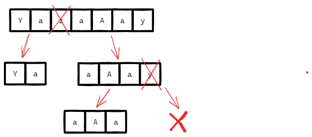

# [←](../../README.md) <a id="home"></a> Arrays: Divide and Conquer

Данный раздел посвящён задачам на массивы из **[Leetcode Patterns](https://seanprashad.com/leetcode-patterns/)**.

**Table of Contents:**
- [[1763] Longest Nice Substring](#nice)
- [[912] Sort an Array](#mergesort)

----

### [↑](#home) <a id="nice"></a> 1763. Longest Nice Substring
Рассмотрим задачу [1763. Longest Nice Substring](https://leetcode.com/problems/longest-nice-substring/description/):
> Дана строка. Нужно найти самую длинную подстроку, в которой символы присутствуют в обоих регистрах: нижнем и верхнем.

Отличная задача на разбиение задачи на подзадачи:



Получается, у каждой задачи "longestNiceSubstring" есть своя строка для обработки.\
Для строки составляется hashset с символами, чтобы легко можно было анализировать символы.

Как только при итерации мы видим, что для некторой позиции нет парного символа из другого регистра - разбиваем в этом месте строку на две подстроки - подзадачи.

<details><summary>Решение</summary>

```java
public String longestNiceSubstring(String s) {
    // should be at least 2 characters like: a + A
    if (s.length() < 2) return "";
    // Create a set for the task to store available characters
    Set<Character> set = new HashSet<>();
    for (char ch : s.toCharArray()) set.add(ch);
    // Iterate over available chars
    for (int i = 0; i < s.length(); i++) {
        Character up = Character.toUpperCase(s.charAt(i));
        Character low = Character.toLowerCase(s.charAt(i));
        if (set.contains(up) && set.contains(low)) continue;
        String left = longestNiceSubstring(s.substring(0, i));
        String right = longestNiceSubstring(s.substring(i+1));
        return left.length() >= right.length() ? left : right;
    }
    return s;
}
```
</details>

Разбор задачи: [Coders Camp: Longest Nice Substring](https://www.youtube.com/watch?v=JUvt_9KMDzk)

----

### [↑](#home) <a id="mergesort"></a> 912. Sort an Array
Рассмотрим задачу [912. Sort an Array](https://leetcode.com/problems/sort-an-array/description/)

Разбор от NeetCode: [Sort an Array](https://www.youtube.com/watch?v=MsYZSinhuFo)

Нам понадобится описать отдельно логику самого алгоритма:
```java
public int[] sortArray(int[] nums) {
    mergeSort(nums, 0, nums.length - 1);
    return nums;
}

private void mergeSort(int[] nums, int left, int right) {
    if (left >= right) return;
    int middle = left + (right - left) / 2;
    mergeSort(nums, left, middle);
    mergeSort(nums, middle + 1, right);
    merge(nums, left, middle, right);
}
```

А теперь логику самой сортировки:
```java
private void merge(int[] nums, int left, int middle, int right) {
    int[] sorted = new int[right - left + 1];
    int pos = 0;
    int leftInd = left;         // left's index
    int rightInd = middle + 1;  // right's index
        
    // Left pointer moves from left to the middle
    // Right pointer moves from the middle to the right
    while (leftInd <= middle && rightInd <= right) {
        if (nums[leftInd] < nums[rightInd]) {
            sorted[pos++] = nums[leftInd++];
        } else {
            sorted[pos++] = nums[rightInd++];
        }
    }

    // Put the possible remaining left part into the sorted array.
    while (leftInd <= middle)
        sorted[pos++] = nums[leftInd++];

    // Put the possible remaining right part into the sorted array.
    while (rightInd <= right)
        sorted[pos++] = nums[rightInd++];
    
    // Copy <sorted array> from the index 0 to the nums array to the left index
    System.arraycopy(sorted, 0, nums, left, sorted.length);
}
```