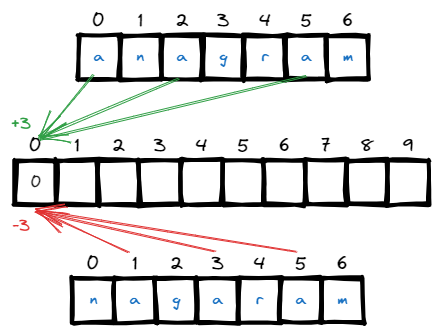
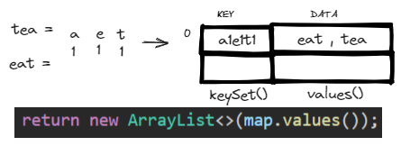

# [←](../../README.md) <a id="home"></a> Arrays: Frequency map

Данный раздел посвящён задачам на массивы и **Frequency map**.\
Задачи на LeetCode: **"[Leetcode: Counting](https://leetcode.com/problem-list/counting/)"**.

**Table of Contents:**
- [[3005] Count Elements With Maximum Frequency](#countmaxfreq) 
- [[347] Top K Frequent Elements](#topfrequent)
- [[242] Valid Anagram](#anagram)
- [[49] Group Anagrams](#groupanagrams)
- [[451] Sort Characters By Frequency](#sortcharacters) 
- [[1647] Minimum Deletions to Make Character Frequencies Unique](#mindelete)
- [[350] Intersection of Two Arrays II](#intersection)

----

## [↑](#home) <a id="countmaxfreq"></a> 3005. Count Elements With Maximum Frequency
Разберём задачу **"[3005. Count Elements With Maximum Frequency](https://leetcode.com/problems/count-elements-with-maximum-frequency/description/)"**:
> Дан массив чисел. Найти самый частовстречаемый элемент/элементы и вернуть их количество.

Видео разбор: **"[Developer Docs: Count Elements With Maximum Frequency](https://www.youtube.com/watch?v=hLk856U1Jfs)"**

Идея решения в том, чтобы посчитать количество встреченных символов и одновременно считать максимум встреченных символов.\
В конце остаётся по карте пройтись и суммировать те посчитанные результаты, которые соответствуют максимуму.

<details><summary>Решение</summary>

```java
public int maxFrequencyElements(int[] nums) {
    Map<Integer, Integer> freqMap = new HashMap<>();
    int max = 0;
    for (int num : nums) {
        int cnt = freqMap.getOrDefault(num, 0) + 1;
        freqMap.put(num, cnt);
        max = Math.max(max, cnt);
    }
    int result = 0;
    for (Integer num : freqMap.values()) {
        if (num == max) result = result + num;
    }
    return result;
}
```
</details>

----

## [↑](#home) <a id="topfrequent"></a> 347. Top K Frequent Elements
Разберём задачу **"[347. Top K Frequent Elements](https://leetcode.com/problems/top-k-frequent-elements/)"**:
> Дан массив чисел и некоторое число k. Нужно вернуть k чисел, которые встречаются чаще отстальных.

Для решения данной задачи нам понадобится сформировать **frequency map**:
```java
private Map<Integer, Integer> asFrequencyMap(int[] nums) {
  Map<Integer, Integer> frequencyMap = new HashMap<>();
  for (int num : nums) frequencyMap.put(num, frequencyMap.getOrDefault(num, 0) + 1);
  return frequencyMap;
}
```
Благодаря этой мапе мы знаем, сколько было повторений для каждого числа.

Далее мы используем **bucket sort**, где каждый бакет соответствует частоте символа.\
Минимальное значение = 1, то есть нулевой индекс мы пропускаем. Следовательно, нам нужно подготовить массив длинной N + 1 (т.к. нам нужен ещё один слот взамен нулевого):
```java
private List<Integer>[] doBucketSort(Map<Integer, Integer> frequencyMap, int size) {
  List<Integer>[] bucket = new ArrayList[size];
  for (Integer key : frequencyMap.keySet()) {
    Integer frequency = frequencyMap.get(key);
    if (bucket[frequency] == null) {
      bucket[frequency] = new ArrayList<>();
    }
    bucket[frequency].add(key);
  }
  return bucket;
}
```

Чем более часто встречается элемент, тем он ближе к концу нашего массива bucket'ов. Посчитаем результат.\
Важно не уйти за пределы массива (позиция должны быть на индексе 0 или выше) и важно вернуть именно k элементов.

<details><summary>Решение</summary>

```java
public int[] topKFrequent(int[] nums, int k) {
  Map<Integer, Integer> frequencyMap = asFrequencyMap(nums);
  List<Integer>[] bucket = doBucketSort(frequencyMap, nums.length + 1);
  int[] result = new int[k];
  int counter = 0;
  for (int pos = bucket.length - 1; pos >= 0 && counter < k; pos--) {
    if (bucket[pos] != null) {
      // Found bucket. Pick elements while we can
      for (Integer integer : bucket[pos]) {
        result[counter++] = integer;
        if (counter >= k) break;
      }
    }
  }
  return result;
}
```
</details>

Объяснение решение от NeetCode: **"[Top K Frequent Elements](https://www.youtube.com/watch?v=YPTqKIgVk-k)"**.\
Разбор от Nikhil Lohia: **"[Top K Frequent Elements](https://www.youtube.com/watch?v=EBNPu0GgM64)"**.

----

## [↑](#home) <a id="anagram"></a> 242. Valid Anagram
Разберём задачу **"[242. Valid Anagram](https://leetcode.com/problems/valid-anagram/)"**:
> Дано две строки s и t. Вернуть true если t анаграмма строки s, т.е. состоит из тех же символов в том же количестве.

Каждый character в строке может быть приведён к соответствующем коду из [ASCII Table](https://www.cs.cmu.edu/~pattis/15-1XX/common/handouts/ascii.html).\
Например, ``(int)'a'`` будет равен 97.\
Кроме того, мы знаем, что всего в английском алфавите 26 букв. Данное значение даже можно не учить, а просто посчитать сколько букв МЕЖДУ a и z и добавить единицу (т.к. дистанция считается не от начала, а от первого элемента), например:
```java
int cnt = 'z' - 'a' + 1;
```

Чтобы решить задачу мы можем идти по исходной строке и считать частоту появления символов.\
В тоже самое время строка анограма должна декрементировать количество.\
Если в конце будут ненулевые значения - значит не анаграма и нужно вернуть false.



<details><summary>Решение</summary>

```java
public boolean isAnagram(String s, String t) {
    if (s.length() != t.length()) return false;
    int[] chars = new int[26];
    for (int i = 0; i < s.length(); i++) {
        chars[s.charAt(i) - 'a']++;
        chars[t.charAt(i) - 'a']--;
    }
    for (int num : chars){
        if (num != 0) return false;
    }
    return true;
}
```
</details>

Разбор задачи от NeetCode: **"[Valid Anagram - Leetcode](https://www.youtube.com/watch?v=9UtInBqnCgA)"**.\
Разбор задачи от Nick White: **"[Valid Anagram Solution Explained](https://www.youtube.com/watch?v=IRN1VcA8CGc)"**.

----

## [↑](#home) <a id="groupanagrams"></a> 49. Group Anagrams
Разберём задачу **"[49. Group Anagrams](https://leetcode.com/problems/group-anagrams/)"**:
> Дан массив из строк. Нужно сгруппировать строки, которые являются анаграммами по спискам.

Данная задача похожа на задачу **[Valid Anagram](#anagram)**, но для каждого слова мы анаграммы будем запоминать как шаблон. Это позволит использовать такой шаблон как ключ в мапе:



Мы помним, что для работы с анограмами важно то, какие символы есть и сколько.\
Тогда мы можем для каждой анаграмы иметь шаблон, который будет представлять эту анаграму.\
Это позволит нам использовать этот шаблон как ключ для группировки:
```java
public String getPattern(String str) {
    int[] freq = new int[26];
    for (char chr : str.toCharArray()) {
        freq[chr - 'a']++;
    }
    StringBuilder sb = new StringBuilder();
    for (int i = 0; i < freq.length; i++) {
        if (freq[i] != 0) {
            sb.append((char)(i + 'a'));
            sb.append(freq[i]);
        }
    }
    return sb.toString();
}
```

После этого можно формировать HashMap и с её помощью формировать результат.

<details><summary>Решение</summary>

```java
public List<List<String>> groupAnagrams(String[] strs) {
    Map<String, List<String>> groups = new HashMap<>();
    for (String str : strs) {
        String key = getPattern(str);
        List<String> list = groups.get(key);
        if (list == null) {
            list = new ArrayList<>();
            groups.put(key, list);
        }
        list.add(str);
    }
    return new ArrayList<>(groups.values());
}
```
</details>

Объяснение решение от NeetCode: **"[Group Anagrams - Categorize Strings by Count](https://www.youtube.com/watch?v=vzdNOK2oB2E)"**.\
Ещё вариант от Nikhil Lohia: **"[Group Anagrams](https://www.youtube.com/watch?v=C9V66KyZCP8)"**.

----

## [↑](#home) <a id="sortcharacters"></a> 451. Sort Characters By Frequency
Разберём задачу **"[451. Sort Characters By Frequency](https://leetcode.com/problems/sort-characters-by-frequency/)"**:
> Дана строка из символов. Нужно вернуть строку, в которой символы будут идти по порядку частоты встречаемости.

Разбор от NeetCode: **"[Sort Characters By Frequency - Leetcode 451](https://www.youtube.com/watch?v=OXdXc9HTrIg)"**

Как обычно в задачах на Frequency Map подготовим её:
```java
private Map<Character, Integer> prepareFrequencyMap(String s) {
    Map<Character, Integer> chars = new HashMap<>();
    for (char chr : s.toCharArray()) {
        int freq = chars.getOrDefault(chr, 0) + 1;
        chars.put(chr, freq);
    }
    return chars;
}
```

Чтобы по карте идти в сортированном по количеству использований порядке нужно карту отсортировать.\
Для этого нам понадобится компаратор:
```java
Comparator<Map.Entry<Character, Integer>> comparator = (e1, e2) -> e2.getValue().compareTo(e1.getValue());
```
С его помощью, например, можно создать список из Map.Entry и идти по ним, формируя итоговую строку.

<details><summary>Решение</summary>

```java
public String frequencySort(String s) {
    // Prepare frequency map
    Map<Character, Integer> chars = prepareFrequencyMap(s);
    // Prepare result
    Comparator<Map.Entry<Character, Integer>> comparator = (e1, e2) -> e2.getValue().compareTo(e1.getValue());
    List<Map.Entry<Character,Integer>> list = new ArrayList<>(chars.entrySet());
    list.sort(comparator);

    StringBuilder sb = new StringBuilder();
    for (Map.Entry<Character,Integer> entry : list) {
        for (int i = 0; i < entry.getValue(); i++) sb.append(entry.getKey());
    }
    return sb.toString();
}
```
</details>

----

## [↑](#home) <a id="mindelete"></a> 1647. Minimum Deletions to Make Character Frequencies Unique
Рассмотрим задачу **"[1647. Minimum Deletions to Make Character Frequencies Unique](https://leetcode.com/problems/minimum-deletions-to-make-character-frequencies-unique/description/)"**:
> Дана строка из символов. Нужно понять, сколько нужно удалить символов, чтобы количество повторений разных символов стало уникальным.

Разбор от NeetCode: **"[Minimum Deletions to Make Character Frequencies Unique](https://www.youtube.com/watch?v=h8AZEN49gTc)**

Как обычно, нам потребуется составить frequency map по символам:
```java
private Map<Character, Integer> getFrequencyMap(String s) {
      Map<Character, Integer> freq = new HashMap<>();
      for (char chr : s.toCharArray()) {
          freq.put(chr, freq.getOrDefault(chr, 0) + 1);
      }
      return freq;
}
```

А дальше остаётся лишь идти по ней и выполнять буквально то, что указано в задании:\
если количество повторов символа уже есть, то мы должны удалить символ, чтобы уменьшить кол-во повторов.\
Будем повторять для каждого символа до тех пор, пока он есть или пока повторы не станут уникальными.

<details><summary>Решение</summary>

```java
public int minDeletions(String s) {
    Map<Character, Integer> freqMap = getFrequencyMap(s);
    int deletions = 0;
    Set<Integer> visited = new HashSet<>();
    for (Map.Entry<Character, Integer> entry : freqMap.entrySet()) {
        while (entry.getValue() > 0 && visited.contains(entry.getValue())) {
            entry.setValue(entry.getValue() - 1);
            deletions = deletions + 1;
        }
        visited.add(entry.getValue());
    }
    return deletions;
}
```
</details>

----

## [↑](#home) <a id="intersection"></a> 350. Intersection of Two Arrays II
Рассмотрим задачу **"[350. Intersection of Two Arrays II](https://leetcode.com/problems/intersection-of-two-arrays-ii/)"**:
> Дано два массива. Вернуть массив из пересекающихся элементов, причём с тем же количеством повторений.

Данная задача очень похожа на задачу **"[Intersection of Two Arrays](https://leetcode.com/problems/intersection-of-two-arrays/)"**, однако использовать просто кэш недостаточно, т.к. нам важно учитывать повторы. Таким образом, нам понадобится Frequency map подход.

<details><summary>Решение</summary>

```java
public int[] intersect(int[] nums1, int[] nums2) {
    Map<Integer, Integer> cache = new HashMap<>();
    for (int i = 0; i < nums1.length; i++) {
        int valueInCache = cache.getOrDefault(nums1[i], 0);
        cache.put(nums1[i], valueInCache + 1);
    }

    int[] result = new int[Math.max(nums1.length, nums2.length)];
    int pos = 0;
    for (int i = 0; i < nums2.length; i++) {
        Integer val = cache.get(nums2[i]);
        if (val == null || val == 0) continue;
        result[pos++] = nums2[i];
        cache.put(nums2[i], val - 1);
    }
    return Arrays.copyOf(result, pos);
}
```
</details>

