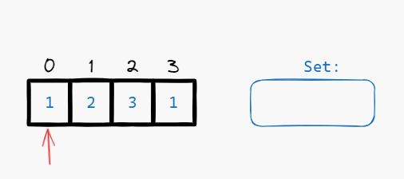
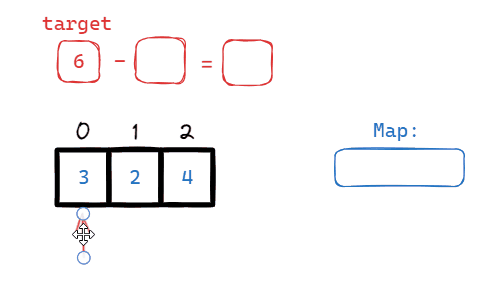
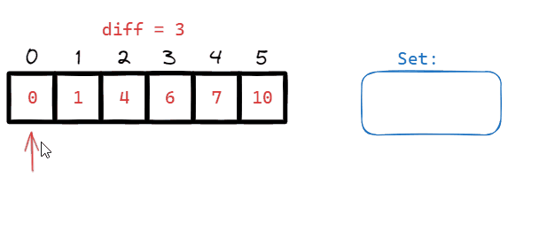
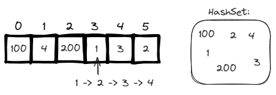
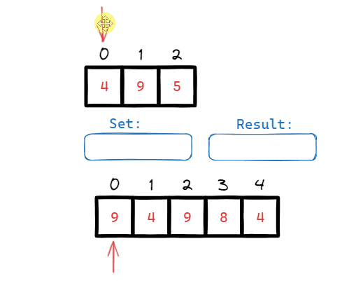
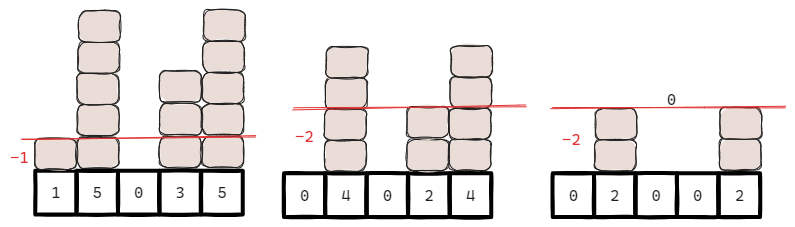
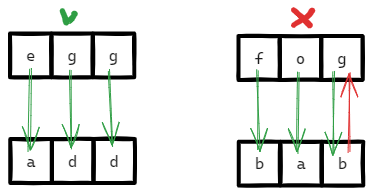

# [←](../../README.md) <a id="home"></a> Arrays: hashing

Данный раздел посвящён задачам на массивы и **хэширование**.\
Задачи на LeetCode: **"[Hash Table](https://leetcode.com/problem-list/hash-table/)"**.

**Table of Contents:**
- [[217] Contains duplicate](#duplicate)
- [[1] Two sum](#twosum)
- [[2367] Number of Arithmetic Triplets](#triplets)
- [[128] Longest Consecutive Sequence](#longest)
- [[349] Intersection of Two Arrays](#intersection)
- [[2357] Make Array Zero by Subtracting Equal Amounts](#subtracting)
- [[454] Four Sum II](#foursum)
- [[205] Isomorphic Strings](#isomorphic)
- [[290] Word Pattern](#pattern)

----

## [↑](#home) <a id="duplicate"></a> 217. Contains Duplicate
Рассмотрим задачу **"[217. Contains duplicate](https://leetcode.com/problems/contains-duplicate/)"**:
> Проверить массив целых чисел на наличие дубликатов (элементы повторяются как минимум дважды). 

Разбор задачи от **NeetCode**: **"[Contains Duplicate](https://www.youtube.com/watch?v=3OamzN90kPg)"**.

Базовая задача на применение структуры **Set** и подхода хэширования:



Рассматривая каждый элемент нужно понять, дубликат ли это. Дубликат == такой элемент мы уже видели.

<details><summary>Решение</summary>

```java
public boolean containsDuplicate(int[] nums) {
    Set<Integer> seen = new HashSet<>();
    for (int num : nums) {
        if (!seen.add(num)) return true;
    }
    return false; 
}
```
</details>

----

## [↑](#home) <a id="twosum"></a> 1. Two sum
Разберём задачу **"[1. Two sum](https://leetcode.com/problems/two-sum/)"**:
> Дан массив целых чисел и число target. Вернуть индексы двух элементов дающих в сумме target.

Разбор задачи от **NeetCode**: **"[Two Sum - Leetcode](https://www.youtube.com/watch?v=KLlXCFG5TnA)"**.

Данная задача похожа на задачу **"[Contains duplicate](#duplicate)"**.\
Для каждого элемента мы проверяем, видели ли ранее число, которое в сумме с текущим даёт target.\
То есть рассматривая элемент ``A``, мы ищем в кэше ``B``, т.к. ``A + B = Target``, а ``Target - B = A``.



Кроме того, нам понадобится Map, т.к. нам нужно ещё и помнить индексы:
<details><summary>Решение</summary>

```java
public int[] twoSum(int[] nums, int target) {
    Map<Integer, Integer> map = new HashMap<>();
    // We need indicies, so we need a pointer to the index
    for (int i = 0; i < nums.length; i++) {
        int num2 = target - nums[i];
        if (map.containsKey(num2)) {
            return new int[]{map.get(num2), i};
        }
        map.put(nums[i], i);
    }
    return new int[]{};
}
```
</details>

----

## [↑](#home) <a id="triplets"></a> 2367. Number of Arithmetic Triplets
Разберём задачу **"[2367. Number of Arithmetic Triplets](https://leetcode.com/problems/number-of-arithmetic-triplets/)"**:
> Дан возрастающий массив чисел и значение diff. 
Нужно найти количество уникальных триплетов: троек из чисел, которые отличаются друг от друга на значение diff.

Как понять смотря на число, что мы нашли нужный триплет?\
Смотря на число ``A``, мы должны были ранее видеть ``A - diff`` и ``A - diffx2``.
Таким образом решение данной задачи очень похоже на решение задачи **"[Two sum](#twosum)"**.

Визуализируем пример ``[0,1,4,6,7,10]`` для ``diff = 3``. Существует два триплета:




<details><summary>Решение</summary>

```java
public int arithmeticTriplets(int[] nums, int diff) {
    int result = 0;
    Set<Integer> visited = new HashSet<>();
    for (int num : nums) {
        if (visited.contains(num - diff) && visited.contains(num - (diff*2))) {
            result++;
        }
        visited.add(num);
    }
    return result;
}
```
</details>

----

## [↑](#home) <a id="longest"></a> 128. Longest Consecutive Sequence
Рассмотрим задачу **"[128. Longest Consecutive Sequence](https://leetcode.com/problems/longest-consecutive-sequence/)"**:
> Дан несортированный массив чисел. Нужно получить длину самой длинной последовательности чисел в нём. Например, для [100,4,200,1,3,2] последовательностью будет [1, 2, 3, 4] и ответ будет 4.

Разбор задачи от **NeetCode**: **"[Longest Consecutive Sequence](https://www.youtube.com/watch?v=P6RZZMu_maU)"**.

Чтобы решить задачу нужно ответить на вопрос: Что такое последовательность?\
Последовательность, это когда у числа есть число+1, число+2 и так далее.



Нам, как всегда, понадобится некоторый кэш, по которому можно быстро искать:
```java
private Set<Integer> toCache(int[] nums) {
    Set<Integer> set = new HashSet<>();
    for (int num : nums) {
        set.add(num);
    }
    return set;
}
```

Теперь при помощи нашего "кэша" будем искать самую длинную последовательность.\
Чтобы найти последовательность нужно найти её начало.\
Начало последовательности - элемент, который не имеет предыдущего элемента в кэше.

<details><summary>Решение</summary>

```java
public int longestConsecutive(int[] nums) {
    int result = 0;
    Set<Integer> cache = toCache(nums);
    for (int num : nums) {
        // Skip non sequence start elements
        if (cache.contains(num - 1)) continue;
        // Calculate length
        int len = 0;
        while (cache.contains(num + len)) {
            len++;
        }
        result = Math.max(result, len);
    }
    return result;
}
```
</details>

Можно заметить, что решение напоминает задачу [Number of Arithmetic Triplets](#triplets).

----

## [↑](#home) <a id="intersection"></a> 349. Intersection of Two Arrays
Разберём задачу **"[349. Intersection of Two Arrays](https://leetcode.com/problems/intersection-of-two-arrays/)"**:
> Дано два массива. Вернуть массив из уникальных элементов, которые встречаются в обоих массивах

Разбор задачи от NeetCode: **"[Intersection of Two Arrays - Leetcode 349](https://www.youtube.com/watch?v=fwUTXaMom6U)"**.

Данная задача тоже решается при помощи кэша, по которому можно искать совпадения.\
Главное - при нахождении элемента удалять его из кэша, чтобы не выводить дубликаты.



<details><summary>Решение</summary>

```java
public int[] intersection(int[] nums1, int[] nums2) {
    Set<Integer> cache = new HashSet<>();
    for (int i = 0; i < nums1.length; i++) {
        cache.add(nums1[i]);
    }
        
    int[] result = new int[Math.max(nums1.length, nums2.length)];
    int pos = 0;
    for (int i = 0; i < nums2.length; i++) {
        if (cache.contains(nums2[i])) {
            result[pos++] = nums2[i];
            cache.remove(nums2[i]);
        }
    }
    return Arrays.copyOf(result, pos);
}
```
</details>

----

## [↑](#home) <a id="subtracting"></a> 2357. Make Array Zero by Subtracting Equal Amounts
Разберём задачу **"[2357. Make Array Zero by Subtracting Equal Amounts](https://leetcode.com/problems/make-array-zero-by-subtracting-equal-amounts)"**:
> Дан массив из чисел. Нужно ответить, за сколько раз весь массив будет равен нулю, если на каждой итерации вычитать из всего массива минимальный элемент.

Данная задача звучит сложно, но если нарисовать её, то мы увидим закономерность:



Т.к. нас интересуют только ненулевые элементы, то можно заметить, что по сути это задача сводится к тому, чтобы найти количество уникальных **НЕ** нулевых значений. Это работает по тому, что если у нас есть два значения, то в большее значение включается меньшее.

<details><summary>Решение</summary>

```java
public int minimumOperations(int[] nums) {
    Set<Integer> cache = new HashSet<>();
    for (int num : nums) {
        if (num > 0) cache.add(num);
    }
    return cache.size();
}
```
</details>

----

## [↑](#home) <a id="foursum"></a> 454. Four Sum II
Разберём задачу **"[454. Four Sum II](https://leetcode.com/problems/4sum-ii)"**:
> Даны 4 массива. Нужно вернуть КОЛИЧЕСТВО четвёрок из их элементов, чтобы сумма значений равнялась нулю.

Разбор задачи от **Orkhan Gasanov**: [LeetCode - 4Sum II | Hash Table](https://www.youtube.com/watch?v=I41LpyxIdE0).

Данная задача просто на реализацию, но нужно выделить несколько требований, которые помогут понять, как решать:
- Нужно посчитать количество
- Чётное количество элементов, можно разбить на пары

Для решения нам понадобится разделить четвёрку на две пары. Сначала посчитаем на одной из половин, какие суммы и сколькими способами получаются.\
Далее, используя другую часть посчитаем финальное количество.

<details><summary>Решение</summary>

```java
public int fourSumCount(int[] nums1, int[] nums2, int[] nums3, int[] nums4) {
    Map<Integer, Integer> variants = new HashMap<>();
    for (int num1 : nums1) {
        for (int num2 : nums2) {
            int sum = num1 + num2;
            variants.put(sum, variants.getOrDefault(sum, 0) + 1);
        }
    }

    int count = 0;
    for (int num3 : nums3) {
        for (int num4 : nums4) {
            int sum = num3 + num4;
            Integer half = variants.get(-sum);
            if (half != null) count = count + half;
        }
    }
    return count;
}
```
</details>

----

## [↑](#home) <a id="isomorphic"></a> 205. Isomorphic Strings
Разберём задачу **"[205. Isomorphic Strings](https://leetcode.com/problems/isomorphic-strings/)"**:
> Даны две строки. Нужно понять, можно ли замеить символы первой на символы второй так, чтобы не нарушить порядок и кол-во символов.

Разбор задачи от **NeetCode**: **"[Isomorphic Strings - Leetcode 205](https://www.youtube.com/watch?v=7yF-U1hLEqQ)"**.

Данная задача тоже основана на хэш таблице и маппинге символов из первой строки на символы из второй. Есть лишь одна хитрость:



То есть там нужно проверять маппинг в обе стороны, т.е. нужно две карты соответствия.

<details><summary>Решение</summary>

```java
public boolean isIsomorphic(String s, String t) {
    HashMap<Character, Character> first = new HashMap<>();
    HashMap<Character, Character> second = new HashMap<>();
    for (int i = 0; i < s.length(); i++) {
        Character left = s.charAt(i);
        Character right = t.charAt(i);
        //put returns the previous value associated with key, or null 
        Character prev = first.put(left, right);
        if (prev != null && prev != right) return false;
        prev = second.put(right, left);
        if (prev != null && prev != left) return false;
    }
    return true;
}
```
</details>

----

## [↑](#home) <a id="pattern"></a> 290. Word Pattern
Разберём задачу **"[290. Word Pattern](https://leetcode.com/problems/word-pattern/)"**:
> Дана строка с шаблоном вида abba и строка со словами. Нужно решить, соответствует ли строка с шаблоном строке со словами. Например, если одна и та же буква повторяется, то и слово должно повторяться. Порядок в шаблоне и в строке со словами должны совпадать.

Разбор задачи от NeetCode: **"[Word Pattern - Leetcode 290](https://www.youtube.com/watch?v=W_akoecmCbM)"**.

Данная задача очень похожа на предыдщую задачу **"[Isomorphic Strings](#isomorphic)"**. Разница лишь в том, что конкретно мы соотносим. В данном случае, это будет не символ - символ, а символ - слово.

<details><summary>Решение</summary>

```java
public boolean wordPattern(String pattern, String s) {
    String[] words = s.split(" ");
    if (words.length != pattern.length()) return false;
    HashMap<Character, String> patToWord = new HashMap<>();
    HashMap<String, Character> wordToPat = new HashMap<>();
    for (int i = 0; i < pattern.length(); i++) {
        Character pat = pattern.charAt(i);
        String word = words[i];
        // put returns the previous value associated with key, or null 
        String prevWord = patToWord.put(pat, word);
        if (prevWord != null && !prevWord.equals(word)) return false;
        Character prevPat = wordToPat.put(word, pat);
        if (prevPat != null && prevPat != pat) return false;
    }
    return true;
}
```
</details>

----
