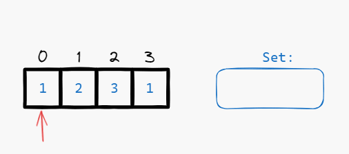
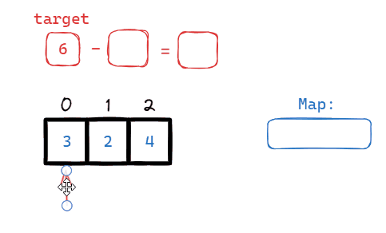
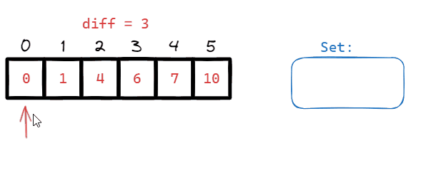
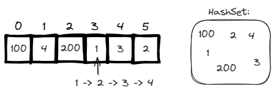
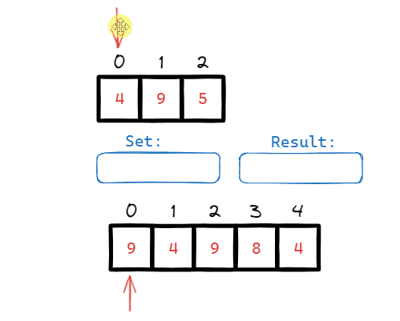
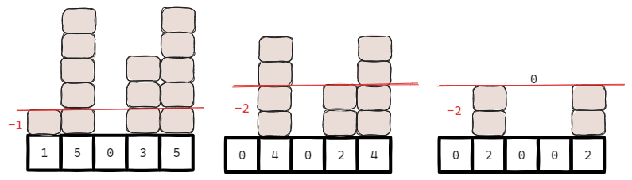
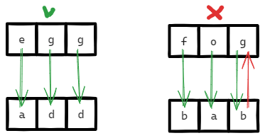

# [←](../../README.md) <a id="home"></a> Arrays: hashing

Данный раздел посвящён задачам на массивы и **кэширование**.\
Задачи на LeetCode: **"[Hash Table](https://leetcode.com/problem-list/hash-table/)"**.

**Table of Contents:**
- [[217] Contains duplicate](#duplicate)
- [[1] Two sum](#twosum)
- [[2367] Number of Arithmetic Triplets](#triplets)
- [[128] Longest Consecutive Sequence](#longest)
- [[349] Intersection of Two Arrays](#intersection)
- [[2357] Make Array Zero by Subtracting Equal Amounts](#subtracting)
- [[454] Four Sum II](#foursum)
- [[205] Isomorphic Strings](#isomorphic)
- [[290] Word Pattern](#pattern)
- [[448] Find All Numbers Disappeared in an Array](#disappeared)
- [[387] First Unique Character in a String](firstUnique)
- [[409] Longest Palindrome](#pattern)

----

## [↑](#home) <a id="duplicate"></a> 217. Contains Duplicate
Рассмотрим задачу **"[217. Contains duplicate](https://leetcode.com/problems/contains-duplicate/description/?envType=problem-list-v2&envId=hash-table)"**:
> Проверить массив целых чисел на наличие дубликатов (элементы повторяются как минимум дважды). 

Это базовая задача на применение структуры **Set** и подхода кэширования.\
Ищем дубликаты, т.е. элементы, которые мы уже ранее видели (**seen**):



Разбор задачи от **NeetCode**: **"[Contains Duplicate](https://www.youtube.com/watch?v=3OamzN90kPg)"**.

<details><summary>Решение</summary>

```java
public boolean containsDuplicate(int[] nums) {
    Set<Integer> seen = new HashSet<>();
    for (int num : nums) {
        if (!seen.add(num)) return true;
    }
    return false; 
}
```
</details>

----

## [↑](#home) <a id="twosum"></a> 1. Two sum
Разберём задачу **"[1. Two sum](https://leetcode.com/problems/two-sum/description/?envType=problem-list-v2&envId=hash-table)"**:
> Дан массив целых чисел и число target. Вернуть индексы двух элементов дающих в сумме target.

Данная задача похожа на задачу **"[Contains duplicate](#duplicate)"**.\
Она основана на том, что любое **target** число состоит из пары чисел, сумма которых даёт **target**.

Когда мы смотрим на элемент, мы проверяем, а не видели ли мы ранее (**seen**) другое число из пары.\
То есть смотря на элемент ``A``, мы проверяем в кэше ``B``, т.к. ``A + B = Target``, а ``Target - B = A``.

Однако, придётся использовать структуру **Hash Map**, т.к. нам нужно ещё и помнить индексы:



Разбор задачи от **NeetCode**: **"[Two Sum - Leetcode](https://www.youtube.com/watch?v=KLlXCFG5TnA)"**.

<details><summary>Решение</summary>

```java
public int[] twoSum(int[] nums, int target) {
    Map<Integer, Integer> map = new HashMap<>();
    // We need indicies, so we need a pointer to the index
    for (int i = 0; i < nums.length; i++) {
        int num2 = target - nums[i];
        if (map.containsKey(num2)) {
            return new int[]{map.get(num2), i};
        }
        map.put(nums[i], i);
    }
    return new int[]{};
}
```
</details>

----

## [↑](#home) <a id="triplets"></a> 2367. Number of Arithmetic Triplets
Разберём задачу **"[2367. Number of Arithmetic Triplets](https://leetcode.com/problems/number-of-arithmetic-triplets/)"**:
> Дан возрастающий массив чисел и значение diff. 
Нужно найти количество уникальных триплетов: троек из чисел, которые отличаются друг от друга на значение diff.

Решение данной задачи тоже про уже увиденные (**seen**) элементы, т.е. похоже на **"[Two sum](#twosum)"**.\
Если там было **target - element = seen**, то здесь **seen1 = element - diff** и **seen2 = element - diff*2**. 

Таким образом, главное ответить на вопрос: "что такое триплет для некоторого числа A?".\
Смотря на число ``A``, мы должны были ранее видеть ``A - diff`` и ``A - diffx2``.

Визуализируем пример ``[0,1,4,6,7,10]`` для ``diff = 3``. Существует два триплета:



<details><summary>Решение</summary>

```java
public int arithmeticTriplets(int[] nums, int diff) {
    int result = 0;
    Set<Integer> visited = new HashSet<>();
    for (int num : nums) {
        if (visited.contains(num - diff) && visited.contains(num - (diff*2))) {
            result++;
        }
        visited.add(num);
    }
    return result;
}
```
</details>

----

## [↑](#home) <a id="longest"></a> 128. Longest Consecutive Sequence
Рассмотрим задачу **"[128. Longest Consecutive Sequence](https://leetcode.com/problems/longest-consecutive-sequence/)"**:
> Дан несортированный массив чисел. Нужно получить длину самой длинной последовательности чисел в нём. Например, для [100,4,200,1,3,2] последовательностью будет [1, 2, 3, 4] и ответ будет 4.

Данная задача добавляет ограничение: ``You must write an algorithm that runs in O(n) time.``.\
Таким образом, любая сортировка нарушит данное ограничение.

Данная задача решается так же при помощи **кэша**.\
Как найти последовательность? Нужно найти элемент, предыдущий элемент перед которым мы **НЕ** видели (опять про **seen**).

```java
private Set<Integer> toCache(int[] nums) {
    Set<Integer> set = new HashSet<>();
    for (int num : nums) {
        set.add(num);
    }
    return set;
}
```

Используя кэш можно за линейное время проходить по элементам.\
Если мы НЕ видели в кэше элемента на 1 меньше текущего - мы нашли начало последовательности.\
Так же это значит, что можно из кэша восстановить последовательность, прибавляя каждый раз единицу к значению.\
Как только мы не находим элемент в кэше - последовательность прервалась.



Разбор задачи от **NeetCode**: **"[Longest Consecutive Sequence](https://www.youtube.com/watch?v=P6RZZMu_maU)"**.

<details><summary>Решение</summary>

```java
public int longestConsecutive(int[] nums) {
    int result = 0;
    Set<Integer> cache = toCache(nums);
    for (int num : nums) {
        // Skip non sequence start elements
        if (cache.contains(num - 1)) continue;
        // Calculate length
        int len = 0;
        while (cache.contains(num + len)) {
            len++;
        }
        result = Math.max(result, len);
    }
    return result;
}
```
</details>

----

## [↑](#home) <a id="intersection"></a> 349. Intersection of Two Arrays
Разберём задачу **"[349. Intersection of Two Arrays](https://leetcode.com/problems/intersection-of-two-arrays/)"**:
> Дано два массива. Вернуть массив из уникальных элементов, которые встречаются в обоих массивах

Данная задача тоже про то, видели ли мы ранее (**seen**) элементы из одного массива в другом массиве.\
Таким образом данная задача тоже решается при помощи кэша, по которому можно искать совпадения.



Нужно **НЕ** забывать удалять из кэша уже обработанные элементы, иначе получим дубликаты!

Разбор задачи от NeetCode: **"[Intersection of Two Arrays - Leetcode 349](https://www.youtube.com/watch?v=fwUTXaMom6U)"**.

<details><summary>Решение</summary>

```java
public int[] intersection(int[] nums1, int[] nums2) {
    Set<Integer> cache = new HashSet<>();
    for (int i = 0; i < nums1.length; i++) {
        cache.add(nums1[i]);
    }
        
    int[] result = new int[Math.max(nums1.length, nums2.length)];
    int pos = 0;
    for (int i = 0; i < nums2.length; i++) {
        if (cache.contains(nums2[i])) {
            result[pos++] = nums2[i];
            cache.remove(nums2[i]);
        }
    }
    return Arrays.copyOf(result, pos);
}
```
</details>

----

## [↑](#home) <a id="subtracting"></a> 2357. Make Array Zero by Subtracting Equal Amounts
Разберём задачу **"[2357. Make Array Zero by Subtracting Equal Amounts](https://leetcode.com/problems/make-array-zero-by-subtracting-equal-amounts)"**:
> Дан массив из чисел. Нужно ответить, за сколько раз весь массив будет равен нулю, если на каждой итерации вычитать из всего массива минимальный элемент.

Данная задача звучит сложно, но если нарисовать её, то мы увидим закономерность:



Т.к. нас интересуют только ненулевые элементы, то можно заметить, что по сути это задача сводится к тому, чтобы найти количество уникальных **НЕ** нулевых значений. Это работает по тому, что если у нас есть два значения, то в большее значение включается меньшее.

<details><summary>Решение</summary>

```java
public int minimumOperations(int[] nums) {
    Set<Integer> cache = new HashSet<>();
    for (int num : nums) {
        if (num > 0) cache.add(num);
    }
    return cache.size();
}
```
</details>

----

## [↑](#home) <a id="foursum"></a> 454. Four Sum II
Разберём задачу **"[454. Four Sum II](https://leetcode.com/problems/4sum-ii)"**:
> Даны 4 массива. Нужно вернуть КОЛИЧЕСТВО четвёрок из их элементов, чтобы сумма значений равнялась нулю.

Данная задача звучит сложно. А если задача сложная, то стоит попробовать разбить на подзадачи.\
Для суммы нужно как минимум 2 элемента, а значит можно разбить задачу на 2 подзадачи.

По условию задачи нам важно **количество** и **сумма**.\
Таким образом, наша первая задача для первой двойки массивов определить, какие есть суммы двоек и сколько способов их получить:
```java
public Map<Integer, Integer> getVariants(int[] nums1, int[] nums2) {
    Map<Integer, Integer> variants = new HashMap<>();
    for (int num1 : nums1) {
        for (int num2 : nums2) {
            int sum = num1 + num2;
            variants.put(sum, variants.getOrDefault(sum, 0) + 1);
        }
    }
    return variants;
}
```

Остаётся теперь написать основное решение.\
Для него нужно рассмотреть остальные пары элементов.\
Для начала, получаем их сумму **sum**.\
Чтобы вышел ноль, нужно, чтобы мы уже видели (**seen**) ранее ``-sum``, т.к. ``sum - sum = 0``.

Если в первой двойке нашли сумму, которая с суммой во второй двойке даёт ноль, значит нашли вариант.\
Мы знаем, сколько способов получить сумму в первой двойке.\
А значит, мы к ней можем прибавить найденные варианты из второй двойки. 

Разбор задачи от **Orkhan Gasanov**: [LeetCode - 4Sum II | Hash Table](https://www.youtube.com/watch?v=I41LpyxIdE0).

<details><summary>Решение</summary>

```java
public int fourSumCount(int[] nums1, int[] nums2, int[] nums3, int[] nums4) {
    Map<Integer, Integer> variants = getVariants(nums1, nums2);

    int count = 0;
    for (int num3 : nums3) {
        for (int num4 : nums4) {
            int sum = num3 + num4;
            Integer half = variants.get(-sum);
            if (half != null) count = count + half;
        }
    }
    return count;
}
```
</details>

----

## [↑](#home) <a id="isomorphic"></a> 205. Isomorphic Strings
Разберём задачу **"[205. Isomorphic Strings](https://leetcode.com/problems/isomorphic-strings/)"**:
> Даны две строки. Нужно понять, можно ли замеить символы первой на символы второй так, чтобы не нарушить порядок и кол-во символов.

Разбор задачи от **NeetCode**: **"[Isomorphic Strings - Leetcode 205](https://www.youtube.com/watch?v=7yF-U1hLEqQ)"**.

Данная задача тоже основана на хэш таблице и маппинге символов из первой строки на символы из второй. Есть лишь одна хитрость:



То есть там нужно проверять маппинг в обе стороны, т.е. нужно две карты соответствия.

<details><summary>Решение</summary>

```java
public boolean isIsomorphic(String s, String t) {
    HashMap<Character, Character> first = new HashMap<>();
    HashMap<Character, Character> second = new HashMap<>();
    for (int i = 0; i < s.length(); i++) {
        Character left = s.charAt(i);
        Character right = t.charAt(i);

        Character prev = null;
        //put returns the previous value associated with key, or null
        prev = first.put(left, right);
        if (prev != null && prev != right) return false;
        prev = second.put(right, left);
        if (prev != null && prev != left) return false;
    }
    return true;
}
```
</details>

----

## [↑](#home) <a id="pattern"></a> 290. Word Pattern
Разберём задачу **"[290. Word Pattern](https://leetcode.com/problems/word-pattern/)"**:
> Дана строка с шаблоном вида "abba" и строка со словами вида "dog cat cat dog". Нужно решить, соответствует ли строка с шаблоном строке со словами. Например, если одна и та же буква повторяется, то и слово должно повторяться. Порядок в шаблоне и в строке со словами должны совпадать.

Данная задача очень похожа на предыдщую задачу **"[Isomorphic Strings](#isomorphic)"**.\
Разница лишь в том, что конкретно мы соотносим. В данном случае, это будет не символ - символ, а символ - слово.\
Так как мы берём пары последовательно, то порядок будет соблюдён.

Разбор задачи от NeetCode: **"[Word Pattern - Leetcode 290](https://www.youtube.com/watch?v=W_akoecmCbM)"**.

<details><summary>Решение</summary>

```java
public boolean wordPattern(String pattern, String s) {
    String[] words = s.split(" ");
    if (words.length != pattern.length()) return false;

    HashMap<Character, String> patToWord = new HashMap<>();
    HashMap<String, Character> wordToPat = new HashMap<>();
    for (int i = 0; i < pattern.length(); i++) {
        Character pat = pattern.charAt(i);
        String word = words[i];
        // put returns the previous value associated with key, or null 
        String prevWord = patToWord.put(pat, word);
        if (prevWord != null && !prevWord.equals(word)) return false;
        Character prevPat = wordToPat.put(word, pat);
        if (prevPat != null && prevPat != pat) return false;
    }
    return true;
}
```
</details>

----

## [↑](#home) <a id="disappeared"></a> 448. Find All Numbers Disappeared in an Array
Рассмотрим задачу **"[448. Find All Numbers Disappeared in an Array](https://leetcode.com/problems/find-all-numbers-disappeared-in-an-array)"**:
> Дан массив из n чисел. В данном массиве числа могут быть в диапазоне от 1 до n. Определить, какие числа из диапазона пропущены.

Например, для ``[4,3,2,7,8,2,3,1]`` ответом будет ``[5,6]``, т.к. массив длиной в 8 элементов (``n=8``).\
Задача опять про то, какие элементы мы ранее видели (**seen**):
```java
Set<Integer> seen = new HashSet<>();
for (int num : nums) seen.add(num);
```

Дальше лишь остаётся создать список ответов.\
Для чисел в диапазоне от 1 до n проверяем, видели ли мы их в массиве или нет.

<details><summary>Решение</summary>

```java
public List<Integer> findDisappearedNumbers(int[] nums) {
    Set<Integer> seen = new HashSet<>();
    for (int num : nums) seen.add(num);

    List<Integer> result = new ArrayList<>();
    for (int i = 1; i <= nums.length; i++) {
        if (!seen.contains(i)) result.add(i);
    }
    return result;
}
```
</details>

----

## [↑](#home) <a id="firstUnique"></a> 387. First Unique Character in a String
Рассмотрим задачу **"[387. First Unique Character in a String](https://leetcode.com/problems/first-unique-character-in-a-string)"**:
> Дана строка. Нужно в ней найти первый уникальный символ.

Данная задача тоже про то, что сначала мы считаем, сколько раз мы увидели каждый символ (**seen**).\
На втором проходе проверяем для каждого индекса слева направо, а не уникальный ли это символ.

Разбор задачи от NeetCode: **[First Unique Character in a String](https://www.youtube.com/watch?v=rBENYgWy3xU)**.

<details><summary>Решение</summary>

```java
public int firstUniqChar(String s) {
    Map<Character, Integer> seen = new HashMap<>();
    for (char chr : s.toCharArray()) {
        seen.put(chr, seen.getOrDefault(chr, 0) + 1);
    }
    for (int ind = 0; ind < s.length(); ind++) {
        if (seen.get(s.charAt(ind)) == 1) return ind;
    }
    return -1;
}
```
</details>

Есть аналогичная задача **[169. Majority Element](https://neetcode.io/problems/majority-element)**, которая отличается лишь тем, по какому условию нужно вернуть результат.

----

## [↑](#home) <a id="pattern"></a> 409. Longest Palindrome
Разберём задачу **"[409. Longest Palindrome](https://leetcode.com/problems/longest-palindrome/?envType=problem-list-v2&envId=hash-table)"**:
> Дана строка. Нужно из её символов составить самый длинный палиндром с учётом регистра.

Основная идея: у каждого символа есть **пара** для чётного кол-ва символов или +1 символ для нечётного.\
**пара** - это когда мы ранее уже **seen** такой элемент.\
Получается, можно использовать HashSet для решения. Будем считать пары и потом добавим +1, если надо.

Разбор задачи от NeetCode: **[Longest Palindrome - Leetcode 409](https://www.youtube.com/watch?v=_g9jrLuAphs)**.

<details><summary>Решение</summary>

```java
public int longestPalindrome(String s) {
    HashSet<Character> seen = new HashSet<>();
    int length = 0;
    
    for (char c : s.toCharArray()) {
        if (seen.contains(c)) {
            seen.remove(c);
            length += 2; // new pair
        } else {
            seen.add(c);
        }
    }

    if (!seen.isEmpty()) length += 1;

    return length;    
}
```
</details>

----


