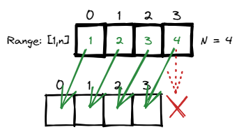

# [←](../../README.md) <a id="home"></a> Arrays: Index Mapping

Данный раздел посвящён задачам на массивы и маппинг на индексы массива из **[Leetcode Patterns](https://seanprashad.com/leetcode-patterns/)**.\
Данная тема является частью **"[Roadmap](https://neetcode.io/roadmap)"** от NeetCode.

**Table of Contents:**
- [[442] Find all duplicates in Array](#allDuplicates)
- [[41] First Missing Positive](#missingPositive)
- [[448] Find All Numbers Disappeared in an Array](#all)

----

## [↑](#home) <a id="allDuplicates"></a> 442. Find all duplicates in Array
Рассмотрим задачу **"[442. Find all duplicates in Array](https://leetcode.com/problems/find-all-duplicates-in-an-array/)"**:
> Дан массив длинной в N, где числа в диапазоне [1, N] и каждое число появляется один или два раза. Вернуть все дубли.

Данная задача интересна подходом к её решению. По условию задачи мы видим, что у нас нет чисел ноль. Получается, что если из числа вычесть единицу, то мы можем соотнести число с индексом:



Получается, что каждый раз мы берём число, вычитаем из него единицу и получаем индекс. Если по этому индексу положительное число - мы ещё не посещали его. Если же посещали - то мы нашли дубль. Дублем будет число, равное индексу + 1.

В таком случае решить данную задачу можно и без дополнительного массива:
<details><summary>Решение</summary>

```java
public List<Integer> findDuplicates(int[] nums) {
    List<Integer> result = new ArrayList<>();
    for (int i = 0; i < nums.length; i++) {
        // abs to not get an error for negative indexes
        // minus one to consider the first element in the array also
        int index = Math.abs(nums[i]) - 1;
        if (nums[index] < 0) {
            result.add(index + 1);
        } else {
            nums[index] = -nums[index];
        }
    }
    return result;
}
```
</details>

Разбор можно посмотреть у Nikhil Lohia: **"[Find all Duplicates in an Array](https://www.youtube.com/watch?v=lFhiz9ntwqk)"**.

----

## [↑](#home) <a id="missingPositive"></a> 41. First Missing Positive
Рассмотрим задачу **"[41. First Missing Positive](https://leetcode.com/problems/first-missing-positive/)"**:
> Дан неотсортированный массив чисел (положительных и отрицательных). Вернуть пропущенное наименьшее положительное число. Сделать это нужно за время O(n) и за 0(1) по памяти.

Данная задача использует тот же подход, что и задача **[Find all duplicates in Array](#allDuplicates)**.\
Мы будем использовать исходный массив в качестве нашего hashset. При этом нас интересуют только те числа, которые больше нуля:


Следовательно, отрицательные числа можно предварительно занулить, чтобы они не мешали работе алгоритма:
```java
//We are interested ONLY in positive integers. Set other as zero
private void removeNegativeValues(int[] nums) {
  for (int i = 0; i < nums.length; i++) {
    if (nums[i] < 0) nums[i] = 0;
  }
}
```

Дальше проходим по исходному массиву, где больше нет отрицательных чисел.\
Нас интересуют только те элементы, значение которых может быть соотнесено с индексом элемента в массива.

<details><summary>Решение</summary>

```java
public int firstMissingPositive(int[] nums) {
    removeNegativeValues(nums);
    for (int i = 0; i < nums.length; i++) {
        int val = Math.abs(nums[i]);
        // [1,2,3] has n=3. The first number that can be missed = 1
        // It means that values should be in a range [1,n]
        if (val >= 1 && val <= nums.length) {
            if (nums[val - 1] > 0) {
                // Mark corresponding element as negative
                nums[val - 1] = nums[val - 1]  * -1;
            } else if (nums[val - 1] == 0) {
                // If marked element is zero mark it as negative number ouside the range
                // We will not try to handle it because it's outside the available range
                nums[val - 1] = (nums.length + 1) * -1;
            }
        }
    }
    for (int i = 1; i < nums.length + 1; i++) {
        // Any non-negative values means "sequence was interrupted"
        if (nums[i - 1] >= 0) return i;
    }
    return nums.length + 1;
}
```
</details>

Как обычно, разбор от NeetCode: **"[First Missing Positive](https://www.youtube.com/watch?v=8g78yfzMlao)"**.

----

## [↑](#home) <a id="all"></a> 448. Find All Numbers Disappeared in an Array
Рассмотрим задачу **"[448. Find All Numbers Disappeared in an Array](https://leetcode.com/problems/find-all-numbers-disappeared-in-an-array/)"**:
> Дан массив из N чисел, каждое из которых в диапазоне [1, n]. Вернуть массив всех чисел из этого диапазона, которые отсутствуют.

Данная задача похожа на задачу **"[Find all duplicates in Array](#allDuplicates)"**.\
Важной подсказкой для нас является то, что каждое число в диапазоне [1, n]. А значит, что число 0 не задействовано. Получается, мы можем сдвинуть каждое число на 1 и получить индекс элемента, который своим знаком будет показывать посещение числа:


<details><summary>Решение</summary>

```java
public List<Integer> findDisappearedNumbers(int[] nums) {
    List<Integer> result = new ArrayList<>();
    // For first round we don't care about indexes, only care about values
    for (int num : nums) {
        int indexToMark = Math.abs(num)-1;
        nums[indexToMark] = -Math.abs(nums[indexToMark]);
    }
    // For the second round find indexes with positive values
    for (int i = 0; i < nums.length; i++) {
        // There is no value (i+i) which was visited
        if (nums[i] >= 0) {
            result.add(i+1);
        }
    }
    return result;
}
```
</details>

Разбор задачи от NeetCode: **"[Find All Numbers Disappeared in an Array](https://www.youtube.com/watch?v=8i-f24YFWC4)"**.

----