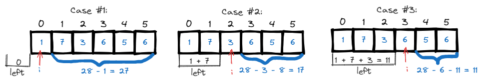
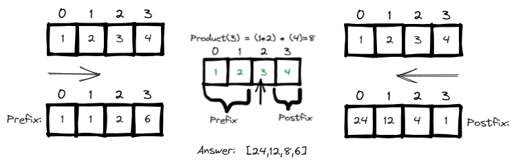
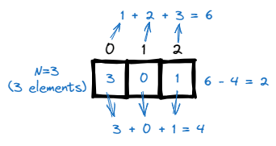
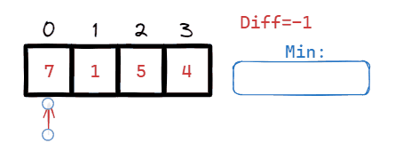
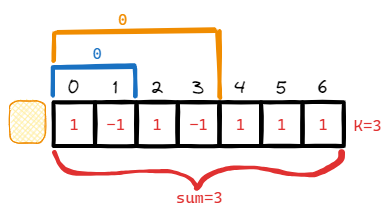
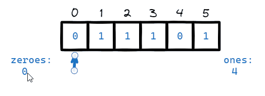

# [←](../../README.md) <a id="home"></a> Arrays: Prefix Sum

Данный раздел посвящён задачам на массивы и **Prefix Sum**.\
Задачи на LeetCode: **"[Prefix Sum](https://leetcode.com/problem-list/prefix-sum/)"**.

**Table of Contents:**
- [[724] Find pivot index](#pivot)
- [[238] Product of Array Except Self](#productarray)
- [[268] Missing number](#missing)
- [[53] Maximum Subarray](#subarray)
- [[2016] Maximum Difference Between Increasing Elements](#maximum)
- [[560] Subarray Sum Equals K](#subarraySum)
- [[1422] Maximum Score After Splitting a String](#maxScore)

----

## [↑](#home) <a id="pivot"></a> 724. Find pivot index
Рассмотрим задачу **"[724. Find pivot index](https://leetcode.com/problems/find-pivot-index/)"**:
> Дан array of integers. Найти pivot - элемент, суммы элементов слева и справа от которого одинаковы.

Разбор задачи от NeetCode: **"[Find pivot index](https://www.youtube.com/watch?v=u89i60lYx8U)"**.

Сумма элементов **ДО**, то есть префикс должен быть равен постфиксу, т.е. сумме элементов **ПОСЛЕ**.



Прежде всего нам нужно посчитать сумму всех элементов (наш **total**).\
Это позволит нам быстро высчитывать, какая сумма остаётся справа от элемента: ``total - left - pivot = right`` 
```java
private int countTotal(int[] nums) {
  int total = 0;
  for (int num : nums) total = total + num;
  return total;
}
```

Каждый раз, когда мы заканчиваем обработку элемента мы можем копить его как "сумма слева".\
Если из **total** вычесть текущее число и эту сумму слева, то получим сумму справа.

<details><summary>Решение</summary>

```java
public int pivotIndex(int[] nums) {
  int total = countTotal(nums);
  int leftSummarized = 0;
  for (int i = 0; i < nums.length; i++) {
    int rightSumm = total - leftSummarized - nums[i];
    if (leftSummarized == rightSumm) return i;
    leftSummarized = leftSummarized + nums[i];
  }
  return -1;
}
```
</details>

----

## [↑](#home) <a id="productarray"></a> 238. Product of Array Except Self
Разберём задачу **"[238. Product of Array Except Self](https://leetcode.com/problems/product-of-array-except-self/)"**:
> Дан массив чисел. Вернуть массив, где вместо каждого числа будет произведение всех остальных чисел.

Объяснение решение от NeetCode: **"[Product of Array Except Self](https://www.youtube.com/watch?v=bNvIQI2wAjk)"**.

Решается через вариацию **prefix sum**, только используется умножение. Т.к. умножение на ноль порушит логику, то prefix по умолчанию единица.\
На каждом шаге мы записываем префикс как результат шага и готовим префикс для следующего шага.\
Таким образом, префикс для следующего шага = ``{текущий префикс} х {текущее число}``.

Чтобы понять решение, рассмотрим частный случай:



```java
int[] result = new int[nums.length];
int prefix = 1;
for (int i = 0; i < nums.length; i++) {
    result[i] = prefix;
    prefix = prefix * nums[i]; // prefix for a next iteration
}
```

Постфикс считаем так же, но с другого конца. Кроме того, в result у нас уже лежит посчитанный префикс.\
То есть в результат мы не просто сохраняем постфикс, а умножаем на сохранённый в результат префикс.

<details><summary>Решение</summary>

```java
public int[] productExceptSelf(int[] nums) {
    int[] result = new int[nums.length];
    int prefix = 1;
    for (int i = 0; i < nums.length; i++) {
        result[i] = prefix;
        prefix = prefix * nums[i]; // prefix for a next iteration
    }
    int postfix = 1;
    for (int i = nums.length - 1; i >= 0; i--) {
        // Each result item already contains calculated prefix
        result[i] = postfix * result[i];
        postfix = postfix * nums[i]; // postfix for a next iteration
    }
    return result;
}
```
</details>

----

## [↑](#home) <a id="missing"></a> 268. Missing number
Рассмотрим задачу **"[268. Missing Number](https://leetcode.com/problems/missing-number/)"**:
> Дан массив из N уникальных чисел в диапазоне [0, N]. Найти единственное число, которого нехватает.

Разбор задачи от NeetCode: **"[Missing Number](https://www.youtube.com/watch?v=WnPLSRLSANE)"**.

На данную задачу тоже можно посмотреть как на подвид prefix sum.\
Предположим, дан массив из трёх чисел, т.е. N = 3.\
Если бы у нас были все числа, то их сумма была бы 1 + 2 + 3 = 6.\
Если у нас пропадёт любое из чисел, то сумма уменшится на это число.\
Тогда, если из суммы без пропусков вычесть сумму с пропусками, то мы найдём ответ.



<details><summary>Решение</summary>

```java
public int missingNumber(int[] nums) {
    int total = 0, sum = 0;
    for (int i = 0; i < nums.length; i++) {
        total = total + (i + 1);
        sum = sum + nums[i];
    }
    return total - sum;
}
```
</details>

----

## [↑](#home) <a id="subarray"></a> 53. Maximum Subarray
Рассмотрим ещё одну задачу: **"[53. Maximum Subarray](https://leetcode.com/problems/maximum-subarray/)"**:
> Дан массив целых чисел. Найти подмассив, дающий наибольшую сумму и вернуть эту сумму. 

Разбор задачи от NeetCode: **"[Maximum Subarray - Leetcode 53](https://www.youtube.com/watch?v=5WZl3MMT0Eg)"**.

Поможет её решить опять визуализация задачи.


Нам нужно помнить и различать текущую сумму и максимально посчитанную сумму чтобы вовремя остановиться.

<details><summary>Решение</summary>

```java
public int maxSubArray(int[] nums) {
    // nums is always not empty
    int max = nums[0], cur = 0;
    for (int num : nums) {
        cur = cur + num;
        if (num >= cur) {
            // New num more profitable. Can skip previous elements
            cur = num;
        }
        // We have new current summ. Should we treat it as new max?
        max = Math.max(max, cur);
    }
    return max;
}
```
</details>

----

## [↑](#home) <a id="maximum"></a> 2016. Maximum Difference Between Increasing Elements
Рассмотрим другую задачу: **"[2016. Maximum Difference Between Increasing Elements](https://leetcode.com/problems/maximum-difference-between-increasing-elements/)"**:
> Дан массив чисел. Нужно найти максимальную разницу между возрастающими элементами.



Получается, что на каждом шаге мы должны проверять, а не является ли число новым минимумом.\
Т.к. мы рассматриваем только возрастающие последовательности, смотрим только справа от минимума.

Если же рассматриваемое число больше известного минимума, то между ними уже есть какая-то разница.\
Нужно лишь проверить, не является ли она самой большой разницей из всех, которых мы посчитали. Таким образом решение может выглядеть так:

<details><summary>Решение</summary>

```java
public int maximumDifference(int[] nums) {
    int diff = -1;
    int min = Integer.MAX_VALUE; // Any value less
    for (int num : nums) {
        if (num < min) {
            // We found new minimum
            min = num;   
        } else if (num > min) {
            // Probably, we found new max diff?
            int curDiff = num - min;
            if (diff < curDiff) {
                diff = curDiff;
            }
        }
    }
    return diff;
}
```
</details>

----

## [↑](#home) <a id="subarraySum"></a> 560. Subarray Sum Equals K
Рассмотрим другую задачу: **"[560. Subarray Sum Equals K](https://leetcode.com/problems/subarray-sum-equals-k/)"**:
> Дан массив чисел. Нужно найти кол-во подмассивов, где сумма элементов равна K.

Это интересная задача на понимание того, как можно использовать "накопленную" сумму:



Как видно, если из накопленной суммы вычесть префикс, то мы получим сумму элементов **ПОСЛЕ** префикса.\
Таким образом, мы должны знать, сколько префиксов мы видели с определённым результатом.\
На примере с картинкой мы видели 3 префикса со значением ноль: нулевой префикс, префикс из 2 элементов и префикс из 4 элементов.

Разбор задачи от NeetCode: **"[Subarray Sum Equals K - Prefix Sums](https://www.youtube.com/watch?v=fFVZt-6sgyo)"**.

<details><summary>Решение</summary>

```java
public int subarraySum(int[] nums, int k) {
    int result = 0;
    Map<Integer, Integer> seenPrefixes = new HashMap();
    seenPrefixes.put(0, 1); // We always have zero prefix
        
    int curPrefix = 0; // Current sum
    for (int num : nums) {
        curPrefix = curPrefix + num;
        // Visited prefix to cut to get the expected K
        int toCut = curPrefix - k;
        // Add the number of subarrays (ie prefixes) to cut:
        int seenPrefixesCount = seenPrefixes.getOrDefault(toCut, 0);
        result = result + seenPrefixesCount;
        // Update seen prefixes (add the current visited prefix)
        seenPrefixes.put(curPrefix, seenPrefixes.getOrDefault(curPrefix, 0) + 1);
    }
    return result;
}
```
</details>

----

## [↑](#home) <a id="contSubarraySum"></a> 523. Continuous Subarray Sum
Рассмотрим другую задачу: **"[523. Continuous Subarray Sum](https://leetcode.com/problems/continuous-subarray-sum/description/)"**:
> Дан массив чисел. Нужно понять, есть ли подмассив из 2 и более элементов, сумма которых без остатка делится на K.

Разбор задачи от NeetCode: **"[Continuous Subarray Sum](https://www.youtube.com/watch?v=OKcrLfR-8mE)"**.

<details><summary>Решение</summary>

```java
public boolean checkSubarraySum(int[] nums, int k) {
    if(nums.length == 0) return false;
    Map<Integer, Integer> seenRemainders = new HashMap<>();
    seenRemainders.put(0, -1);
        
    int runningSum = 0;
    for(int i = 0; i < nums.length; i++){
        // Accumulate sum
        runningSum = runningSum + nums[i];
        // Calculate current remainder
        int remainder = runningSum % k;            
            
        if (!seenRemainders.containsKey(remainder)) {
            seenRemainders.put(remainder, i);
        } else if (i - seenRemainders.get(remainder) > 1) {
            // Check that distance between elements (by index) at least 2
            return true;
        }
    }
    return false;
}
```
</details>

----

## [↑](#home) <a id="maxScore"></a> 1422. Maximum Score After Splitting a String
Рассмотрим другую задачу: **"[1422. Maximum Score After Splitting a String](https://leetcode.com/problems/maximum-score-after-splitting-a-string/description/)"**:
> Дана строка. Нужно её разбить так, чтобы получить максимальную сумму нулей слева и единиц справа.

Разбор задачи от NeetCode: **"[Maximum Score After Splitting a String ](https://www.youtube.com/watch?v=mc_eSStDrWw)"**.



<details><summary>Решение</summary>

```java
public int maxScore(String s) {
    char[] chars = s.toCharArray();
    int zeros = 0, ones = 0;
    for (char chr : chars) {
        if (chr == '1') ones++;  
    }
    int result = 0;
    for (int i = 0; i < chars.length; i++) {
        if (chars[i] == '0') {
            zeros++;
        } else if (chars[i] == '1') {
            ones--;
        }
        result = Math.max(result, zeros + ones);
    }
    return result;
}
```
</details>
