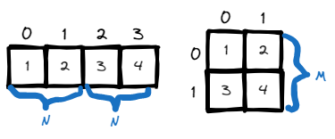
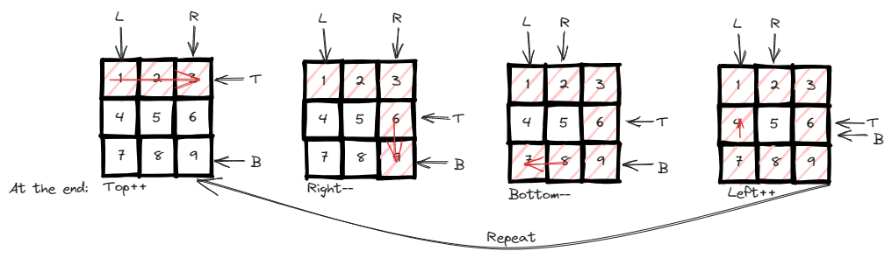
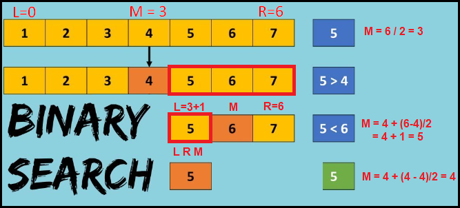
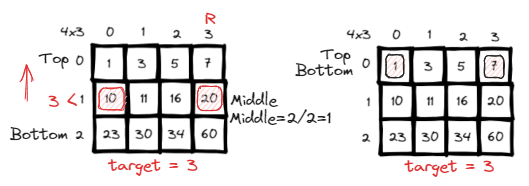
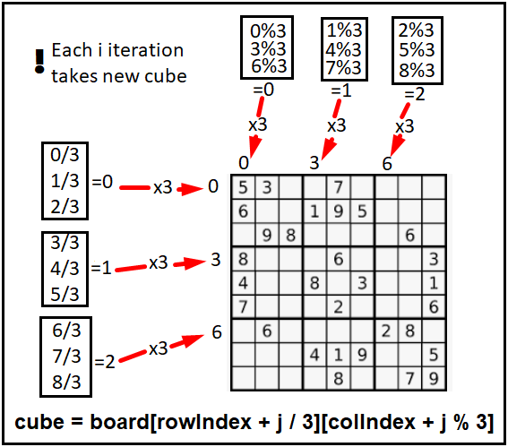

# <a id="home"></a> 2D Arrays

Данный раздел посвящён задачам на двумерные массивы из **[Leetcode Patterns](https://seanprashad.com/leetcode-patterns/)**.\
Кроме того, будем использовать **[Roadmap](https://neetcode.io/roadmap)** от NeetCode.


**Table of Contents:**
1. [Arrays in Java](#arrays)
2. [Convert 1D Array Into 2D Array](#convert)
3. [Spiral Matrix](#spiral)
4. [Search a 2D Matrix](#2dsearch)
5. [Rotate Image](#rotate)
6. [Set Matrix Zeroes](#matrixZeroes)
7. [Valid Sudoku](#sudoku)

----

## [↑](#home) <a id="arrays"></a> Arrays in Java
Прежде чем решать задачи на массивы нужно понимать как они устроены. Рассмотрим применение в Java.

Массив при объявлении должен указывать тип значения и размерность, которую нельзя поменять и нельзя НЕ указать:
```java
int[] array = new int[5];
```
Массивы являются zero based, т.е. самый первый элемент имеет индекс 0, а последний - (N-1).


Однако массив может быть многомерным. По сути многомерный массив - массив массивов:
```java
int[][] array = new int[5][];
```
Стоит отметить, что в данном случае у нас есть основной массив из 5 элементов (zero based), который содержит массивы int по типу. Но так как размерность не указана, то там пока что null. Однако обратиться сейчас нельзя, получим NPE. Чтобы обратиться нунжно создать там массив:
```java
int[][] array = new int[5][];
array[0] = new int[5];
System.out.println(array[0][1]);
```


Таким образом **СТРОКИ есть ВСЕГДА** (первый индекс), а **колонки опциональны** (второй индекс). При этом количество колонок может меняться от строчки к строчке.

----

## [↑](#home) <a id="convert"></a> Convert 1D Array Into 2D Array
Рассмотрим задачу **"[Convert 1D Array Into 2D Array](https://leetcode.com/problems/convert-1d-array-into-2d-array/)"**:
> Дан одномерный массив чисел. Нужно его превратить в двумерный массив из m строк и n столбцов.

На самом деле решение простое. Нам понадобится два счётчика: колонки и столбцы.\
Когда указатель столбца доходит до лимита, то мы просто его сбрасываем и инкрементируем счётчик строк:



Тогда для решения заведём два указателя: row и column. Когда column будет доходить до n то мы будем переходить на новую строку:
```java
public int[][] construct2DArray(int[] original, int m, int n) {
    int expectedSize = m * n; // m rows x n columns
    if (expectedSize != original.length) {
        return new int[0][]; // Return empty array
    }
    int[][] result = new int[m][];
    int row = 0, column = 0;
    for (int num : original) {
        // The row end is reached. Start the new row
        if (column == n) {
            row++;
            column = 0;
        }
        // Each row start create columns
        if (column == 0) result[row] = new int[n];
        // Just put the current num in the proper "cell"
        result[row][column] = num;
        column++;
    }
    return result;
}
```

----

## [↑](#home) <a id="spiral"></a> Spiral Matrix
Рассмотрим задачу **"[Spiral Matrix](https://leetcode.com/problems/spiral-matrix/)"**:
> Дан двумерный массив. Нужно его обойти по спирали.

Для решения нам понадобится завести указатели, которые будут ограничивать наш обход с разных сторон:



Код решения:
```java
public List<Integer> spiralOrder(int[][] matrix) {
    List<Integer> result = new ArrayList<>();
    int left = 0, right = matrix[0].length-1;
    int top = 0, bottom = matrix.length-1;
    while (left <= right && top <= bottom) {
        // Forward
        for (int i = left; i <= right; i++) {
            result.add(matrix[top][i]);
        }
        top++;

        for (int i = top; i <= bottom; i++) {
            result.add(matrix[i][right]);
        }
        right--;

        // Return (if we have elements for that)
        if (left > right || top > bottom) break;
        
        for (int i = right; i >= left; i--) {
            result.add(matrix[bottom][i]);
        }
        bottom--;

        for (int i = bottom; i >= top; i--) {
            result.add(matrix[i][left]);
        }
        left++;
    }
    return result;
}
```
Отличный разбор решения: **"[NeetCode: Spiral Matrix](https://www.youtube.com/watch?v=BJnMZNwUk1M)"**.

----

## [↑](#home) <a id="2dsearch"></a> Search a 2D Matrix
Рассмотрим задачу **"[Search a 2D Matrix](https://leetcode.com/problems/search-a-2d-matrix/)"**:
> Дан двумерный массив. В каждой строке элементы отсортированы по возростоящей. Каждая строка начинается с элемента, который больше чем последний элемент прошлой строки. Ответить на вопрос: есть ли искомый элемент target в двумерном массиве.

Для начала стоит вспомнить как работает бинарный поиск:



Теперь применим его к нашему двумерному массиву. Но при помощи бинарного поиска мы сначала будем искать строки:



Таким образом, мы сначала находим интересующую нас строку:
```java
int top = 0;
int right = matrix[0].length - 1;
int bottom = matrix.length - 1;
// Do a binary search for row
int index = 0;
while (top <= bottom) {
    index = top + (bottom - top)/2;
    if (target > matrix[index][right]) {
        top = index + 1;
    } else if (target < matrix[index][0]) {
        bottom = index - 1;
    } else {
        break;
    }
}
if (top > bottom) return false;
```

Далее, если нашли строчку, выполняем поиск по ней применяя такой же алгоритм:
```java
int left = 0;
while (left <= right) {
    int middle = left + (right - left)/2;
    if (target > matrix[index][middle]) {
        left = middle + 1;
    } else if (target < matrix[index][middle]) {
        right = middle - 1;
    } else {
        return true;
    }
}
return false;
```

Разбор этой задачи, как обычно, можно посмотреть у NeetCode: **"[Search a 2D Matrix](https://www.youtube.com/watch?v=Ber2pi2C0j0)"**.

----

## [↑](#home) <a id="rotate"></a> Rotate Image
Рассмотрим задачу **"[Rotate Image](https://leetcode.com/problems/rotate-image/)"**:
> Дан двумерный массив. Необходимо его повернуть по часовой стрелке. Таким образом числа, которые шли слева направо в первой строке станут образовывать последнюю колонку сверху вниз.

Как обычно, отличный разбор у NeetCode: **"[Rotate Image - Matrix ](https://www.youtube.com/watch?v=fMSJSS7eO1w&t=1s)"**.

Код решения:
```java
public void rotate(int[][] matrix) {
    int left = 0, right = matrix.length - 1;
    while (left < right) {
        for (int i = 0; i < (right - left); i++) {
            int top = left, bottom = right; // Because we have a square
            // Don't forget to use our i as a shifting on each iteration!
            // Save the top left item to tmp
            int topLeft = matrix[top][left + i];
            // Move bottom left into top left (that was saved to the temp)
            matrix[top][left + i] = matrix[bottom - i][left];
            // Move bottom right into bottom left
            matrix[bottom - i][left] = matrix[bottom][right - i];
            // Move top right into bottom right
            matrix[bottom][right - i] = matrix[top + i][right];
            // Move top left into top right
            matrix[top + i][right] = topLeft;
        }
        left++;
        right--;
    }
}
```

----

## [↑](#home) <a id="matrixZeroes"></a> Set Matrix Zeroes
Рассмотрим задачу [Set Matrix Zeroes](https://leetcode.com/problems/set-matrix-zeroes/).

Разбор данной задачи можно посмотреть в видео от NeetCode: [Set Matrix Zeroes In-place](https://www.youtube.com/watch?v=T41rL0L3Pnw).

В качестве решения можно сначала собрать требования о том, какие колонки и строчки занулять:
```java
boolean firstRowIsZero = false;
for (int row = 0; row < matrix.length; row++) {
    for (int col = 0; col < matrix[0].length; col++) {
        // We can store information about column at first row
        if (matrix[row][col] == 0) {
            matrix[0][col] = 0;
            if (row == 0) { // To not overlap with column info
                firstRowIsZero = true;
            } else {
                matrix[row][0] = 0;
            }
        }
    }
}
```

Собрав данные мы можем выполнить очистку. Важно не очищать ячейки с информацией о том, что нужно очищать:
```java
// Clear matrix. Start from x=1, y=1 to not clear our information
for (int row = 1; row < matrix.length; row++) {
    for (int col = 1; col < matrix[0].length; col++) {
        if (matrix[0][col] == 0 || matrix[row][0] == 0) {
            matrix[row][col] = 0;
        }
    }
}
```

Теперь остаётся последовательно очистить колонки и строчки, где раньше мы хранили инорфмацию о том, что нужно чистить:
```java
// Now we can clear first column in each row if needed
if (matrix[0][0] == 0) {
    for (int row = 0; row < matrix.length; row++) {
        matrix[row][0] = 0;
    }
}
// Now we should check the first row
if (firstRowIsZero) {
    for (int col = 0; col < matrix[0].length; col++) {
        matrix[0][col] = 0;
    }
}
```

----

## [↑](#home) <a id="sudoku"></a> Valid Sudoku
Разберём задачу **"[Valid Sudoku](https://leetcode.com/problems/valid-sudoku/)"**.\
Объяснение решение от NeetCode: [Valid Sudoku](https://www.youtube.com/watch?v=TjFXEUCMqI8).\
Разбор задачи от Nick White: [LeetCode: Valid Sudoku](https://www.youtube.com/watch?v=Pl7mMcBm2b8).

Для начала, выполним самую логичную проверку - поиск дублей по горизонтали и вертикали:
```java
for (int i = 0; i < board.length; i++) {
    Set<Character> row = new HashSet<>();
    Set<Character> column = new HashSet<>();
    for(int j = 0; j < 9; j++) {
        // Check row
        if(board[i][j] != '.' && !row.add(board[i][j])){
            return false;
        }
        // Check column
        if(board[j][i] != '.' && !column.add(board[j][i])){
            return false;
        }
        // TODO: Check cube
    }
}
```
Тут можно увидеть интересный подход. Меняя i и j местами мы проверяем одну колонку И одну строку.

Остаётся понять, как обрабатывать области внутри поля:



```java
// Check cube
// Division makes step each 3 iteration
// Remainder makes step each iteration but does it 3 times
int rowIndex = 3 * (i / 3); // row index of current cube
int colIndex = 3 * (i % 3); // col index of current cube
if(board[rowIndex + j / 3][colIndex + j % 3] != '.' &&
    !cube.add(board[rowIndex + j / 3][colIndex + j % 3])){
        return false;
}
```