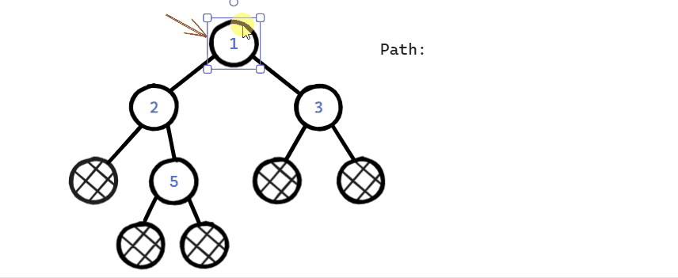
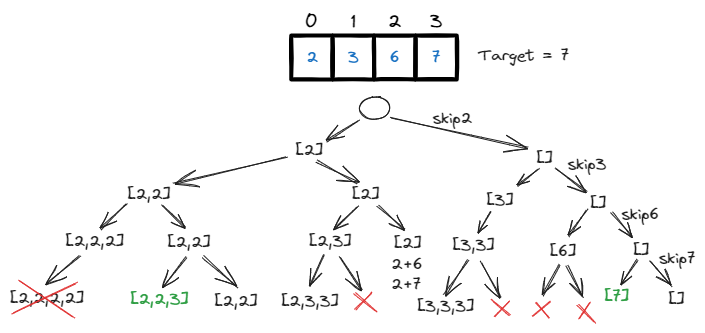
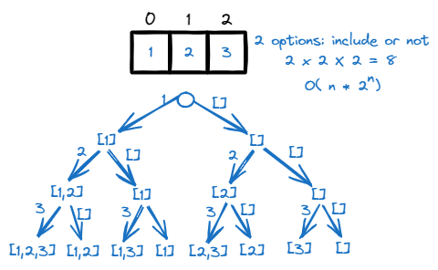
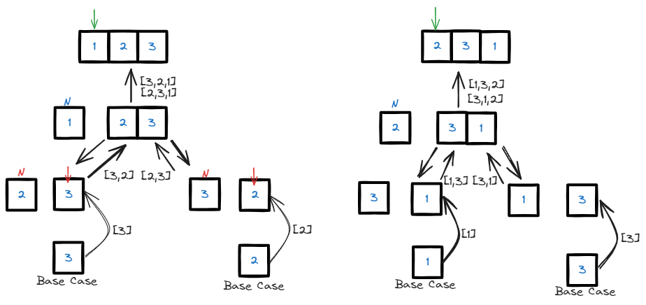

# [←](../README.md) <a id="home"></a> Backtracking

Данный раздел посвящён паттерну Backtracking из **[Leetcode Patterns](https://seanprashad.com/leetcode-patterns/)**.\
У NeetCode есть плэйлист разборов на эту тему: **[Backtracking Playlist](https://www.youtube.com/watch?v=pfiQ_PS1g8E&list=PLot-Xpze53lf5C3HSjCnyFghlW0G1HHXo)**.

**Table of Contents:**
- [[257] Binary Tree Paths](#bintreepaths)
- [[784] Letter Case Permutation](#casePermutation)
- [[17] Letter Combinations of a Phone Number](#lettercomb)
- [[39] Combination Sum](#combination)
- [[40] Combination Sum II](#combination2)
- [[78] Subsets](#subsets)
- [[90] Subsets II](#subsets2)
- [[46] Permutations](#permutations)
- [[47] Permutations II](#permutations2)
- [[79] Word Search](#wordSearch)
- [[51] N-Queens](#N-Queens)
- [[131] Palindrome partitioning](#palindrome)

----

## [↑](#home) <a id="bintreepaths"></a> 257. Binary Tree Paths
Рассмотрим самую простую для понимания задачу **"[257. Binary Tree Paths](https://leetcode.com/problems/binary-tree-paths)"**:
> Дан корневой элемент дерева. Нужно вернуть все пути от корня до листового узла дерева.

Разбор задачи от Nick White: **"[Binary Tree Paths - Backtracking](https://www.youtube.com/watch?v=H2D4HcVZq_g)"**.

Решение данной задачи строится на **Depth-first search (DFS)**, он же "обход в глубину": 

```java
public List<String> binaryTreePaths(TreeNode root) {
    List<String> result = new ArrayList();
    dfs(root, new LinkedList<String>(), result);
    return result;
}
```

На каждом шаге у нас есть некоторая **TreeNode**.\
Для начала ноду добавляем в текущий путь (**path**). Мы хотим в конце этого пути то добавлять, то удалять элементы. Можно для этого использовать связанный список, он же LinkedList.

Каждый шаг (т.е. каждый вызов dfs) нода добавляется в путь.\
Дальше мы должны сделать выбор:
- у ноды нет дочерних нод, мы нашли листовую ноду\
Путь закончен, добавляем его "слепок" в список найденных путей. Т.к. путь найден, мы хотим найти другие пути, в них не должно быть текущей ноды. То есть ноду удаляем из пути
- есть левая и/или правая нода\
Выполняем новый шаг для каждой из дочерних нод. Когда выполнение выполнится, мы знаем, что мы обработали все пути, которые прошли через текущую ноду, а значит из пути её можно удалить. После этого выполнение метода завершается.

Таким образом идея в том, что на каждом шаге мы можем выполнить два действия: пойти налево или пойти направо. Если идти некуда, то мы в листовом узле, а значит дошли до конца пути и должны этот путь занести в результаты.



<details><summary>Решение</summary>

```java
private void dfs(TreeNode node, LinkedList<String> path, List<String> result) {
    if (node == null) return; // Can't do anything without node
    path.add(String.valueOf(node.val)); // Add current node to the path

    // Current node is a leaf node: save path to result, remove node from the path
    if (node.left == null && node.right == null) {
        result.add(String.join("->",path));
        path.removeLast();
        return;
    }

    // Has children
    if (node.left != null) dfs(node.left, path, result);
    if (node.right != null) dfs(node.right, path, result);
    
    // This path was handled. Remove node from the path
    path.removeLast();
}
```
</details>

----

## [↑](#home) <a id="casePermutation"></a> 784. Letter Case Permutation
Рассмотрим задачу [784. Letter Case Permutation](https://leetcode.com/problems/letter-case-permutation/):
> Дана строка s, в которой можно менять регистр каждому символу отдельно. Нужно вернуть список всех возможных вариаций строк с разными регистрами.

Подход к решению можно посмотреть у Aleksandr Stepanenko: **[Решаем Литкод : Letter Case Permutation](https://www.youtube.com/watch?v=wYO4ospshr8)**.

Базовый случай: дошли до конца строки, а значит больше нечего делать и добавляем в результат составленную строку.

Если не базовый случай: в случае цифры просто добавляем в путь цифру как есть. В случае буквы делаем развилку: одну с верхним регистром, одну с нижним.

<details><summary>Решение</summary>

```java
List<String> result = new ArrayList<>();
public List<String> letterCasePermutation(String s) {
    search(s, "", 0);
    return result;
}

public void search(String s, String cur, int ind) {
    // Basecase: the string end was reached
    if (ind == s.length()) {
        result.add(cur);
        return;
    }
    if (Character.isDigit(s.charAt(ind))) {
        search(s, cur + s.charAt(ind), ind+1);
    } else {
        search(s, cur + Character.toUpperCase(s.charAt(ind)), ind+1);
        search(s, cur + Character.toLowerCase(s.charAt(ind)), ind+1);
    }
}
```
</details>

----

## [↑](#home) <a id="lettercomb"></a> 17. Letter Combinations of a Phone Number
Рассмотрим задачу [17. Letter Combinations of a Phone Number](https://leetcode.com/problems/letter-combinations-of-a-phone-number/):
> Дана строка из цифр (от 2 до 9), каждой цифре соответствует некоторый набор букв (как на кнопочном мобильном телефоне). Нужно получить все кобинации, которые можно получить при помощи указанных цифр.

Разбор от NeetCode: "[Letter Combinations of a Phone Number - Backtracking](https://www.youtube.com/watch?v=0snEunUacZY)".

Для начала нам нужно соответствие номеру кнопки и набора символов. Для этого можно обойтись обычным массивом строк:
```java
private String[] digitToChar = {
    "", "", "abc", "def", "ghi", "jkl", "mno", "qprs", "tuv", "wxyz"
};
```

Как обычно, основной метод выполняет backtracking:
```java
public List<String> letterCombinations(String digits) {
    List<String> res = new ArrayList<>();
    if (digits.isEmpty()) return res;
    // Start with empty string
    backtrack(0, "", digits, res);
    return res;  
}
```

Сам backtracking тоже по традиционной логике.\
Базовый случай: составили строку той же длины, что и переданная последовательность нажатых цифр - закончили обработку, добавляем в результат.

Основная логика: получаем из массива соответствий кнопкам букв доступные буквы. Запускаем отдельный backtrack для последовательностей, составленных из полученной на вход строки curStr **ПЛЮС** отдельной буквы с кнопки, не забывая сместить индекс в вызове backtrack.

```java
private void backtrack(int i, String curStr, String digits, List<String> res) {
    // Base Case: Current string has the same length as digits count
    if (curStr.length() == digits.length()) {
        res.add(curStr);
        return;
    }

    String chars = digitToChar[digits.charAt(i) - '0'];
    // Build path with each letter
    for (char c : chars.toCharArray()) {
        backtrack(i + 1, curStr + c, digits, res);
    }
}
```

----

## [↑](#home) <a id="combination"></a> 39. Combination Sum
Рассмотрим задачу [39. Combination Sum](https://leetcode.com/problems/combination-sum/):
> Дан массив из уникальных чисел и некоторое target значение. Нужно вернуть уникальные способы получить суммой заданное target значение. (!) Число может повторяться.

Данная задача похожа на задачу [Binary Tree Paths](#bintreepaths).\
Вместо ноды TreeNode у нас есть массив чисел (кандидатов) и указатель на текущий элемент. Вместо условия "дошли до листового узла" у нас условие "достигли определённой суммы target". 

Есть ещё одно важное отличие в том, какие решения мы можем принимать.\
Если мы достигли target - мы нашли результат. Если мы вышли за target - мы не нашли результат, но по пути дальше идти нельзя. Кроме того, каждый раз мы решаем, включаем ли мы данный элемент ещё раз или нет.

Таким образом, наш dfs метод немного изменит сигнатуру:
```java
public List<List<Integer>> combinationSum(int[] candidates, int target) {
    List<List<Integer>> result = new ArrayList<>();
    dfs(0, candidates, result, new LinkedList<>(), 0, target);
    return result;
}
```

Разбор от NeetCode: "[Combination Sum - Backtracking](https://www.youtube.com/watch?v=GBKI9VSKdGg)".

Лучше всего логику можно увидеть на картинке:



Тогда сам метод dfs сводится к тому, что нам нужно проверит 2 базовые ситуации:
- Накопленная сумма равна target - нашли один из результатов
- Сумма больше target или мы вышли за пределы массива - завершаем работу

А сама работа заключается в том, что сначала мы добавляем элемент и запускаемся с добавленным элементом, а потом мы убираем элемент и запускаемся с пропуском. См. картинку выше.

<details><summary>Решение</summary>

```java
public void dfs(int index, int[] nums, List<List<Integer>> result, LinkedList<Integer> subset, int total, int target) {
    // Base case: total == target. We found the possible solution
    if (target == total) {
        result.add(new ArrayList<Integer>(subset));
        return;
    }
    // Base case: out or array (total is less) OR total is bigger
    if (index >= nums.length || total > target) return;

    // Decision to include
    subset.addLast(nums[index]);
    dfs(index, nums, result, subset, total + nums[index], target);
        
    // Decision to not include
    subset.removeLast();
    dfs(index + 1, nums, result, subset, total, target);
}
```
</details>

Решение можно немного упростить. Не обязательно считать total и сравнивать target. Ведь можно просто вычитать из target, а достижение 0 воспринимать как конец обработки. Тогда:

<details><summary>Решение 2</summary>

```java
public void dfs(int index, int[] nums, List<List<Integer>> result, LinkedList<Integer> subset, int target) {
        // Base case: total == target. We found the possible solution
        if (target == 0) {
            result.add(new ArrayList<Integer>(subset));
        }
        // Base case: can't do anything with target more. Finish the path.
        if (target <= 0 || index >= nums.length) return;

        // Decision to include (add to path AND include to target)
        subset.addLast(nums[index]);
        dfs(index, nums, result, subset, target - nums[index]);
        
        // Decision to not include (remove from path and DO NOT change target)
        subset.removeLast();
        dfs(index + 1, nums, result, subset, target);
    }
```
</details>

----

## [↑](#home) <a id="combination2"></a> 40. Combination Sum II
Рассмотрим задачу [40. Combination Sum II](https://leetcode.com/problems/combination-sum-ii/):
> Дана коллекция из кандидатов - чисел, из которых нужно попытаться получить target число при помощи суммирования. Каждое число можно использовать только один раз. И не должно быть одинаковых комбинаций.

Разбор задачи от NeetCode: **"[Combination Sum II](https://www.youtube.com/watch?v=FOyRpNUSFeA)"**.

Начало у нас такое же, за исключением того, что мы сортируем входные данные:
```java
public List<List<Integer>> combinationSum2(int[] candidates, int target) {
    Arrays.sort(candidates);
    List<List<Integer>> result = new ArrayList<>();
    dfs(0, candidates, result, new LinkedList<>(), target);
    return result;
}
```
Сортировка нам нужна для того, чтобы иметь возможность пропускать дубликаты, ведь одинаковые элементы будут стоять рядом друг с другом.

Само решение похоже на решение задачи [Combination Sum](#combination), но с некоторым доработками. Во-первых, т.к. нельзя повторять включение элемента, то мы всегда вызываем dfs на следующем индексе. Когда мы добавили элемент и обработали все пути с включённым вариантом и исключили его для дальнейшей обработки, нам нужно промотать индекс через все дубликаты, если они идут дальше.

<details><summary>Решение 2</summary>

```java
public void dfs(int index, int[] nums, List<List<Integer>> result,          LinkedList<Integer> subset, int target) {
    // Base case: total == target. We found the possible solution
    if (target == 0) {
        result.add(new ArrayList<Integer>(subset));
    }
    // Base case: can't do anything with target more. Finish the path.
    if (target <= 0 || index >= nums.length) return;

    // Decision to include (add to path AND include to target)
    subset.addLast(nums[index]);
    dfs(index + 1, nums, result, subset, target - nums[index]);

    // Decision to not include (remove from path and DO NOT change target)
    subset.removeLast();
    while (index + 1 < nums.length && nums[index] == nums[index+1]) {
        index = index + 1;
    }
    dfs(index + 1, nums, result, subset, target);
}
```
</details>

Существует ещё одно решение, [рассмотренное у NeetCode](https://www.youtube.com/watch?v=rSA3t6BDDwg), в котором используется цикл. Но оно кажется менее интуитивно понятным, поэтому оставляю просто для истории.

<details><summary>Решение с циклом</summary>

```java
public void dfs(int index, int[] nums, List<List<Integer>> result, LinkedList<Integer> subset, int target) {
    // Base case: We found the possible solution
    if (target == 0) result.add(new ArrayList<Integer>(subset));
    // Base case: Path end. We reach or pass the target
    if (target <= 0) return;

    int prev = -1;
    // Iterate over all elements.
    for (int i = index; i < nums.length; i++) {
        // Requirement: Skip duplicates
        if (prev == nums[i]) continue;
        // Add current element to the path
        subset.addLast(nums[i]);
        // Handle path continuation with INCLUDED element    
        dfs(i + 1, nums, result, subset, target - nums[i]);
        // Remove element from the path.
        // Next iteration continues the path with EXCLUDED element 
        subset.removeLast();
        // Remember element to skip duplicates (if any)
        prev = nums[i];   
    }
}
```
</details>

----

## [↑](#home) <a id="subsets"></a> 78. Subsets
Рассмотрим задачу [78. Subsets](https://leetcode.com/problems/subsets/):
> Дан массив уникальных элементов. Нужно найти все подмассивы.

Данная задача про Subsets. От **permutations (перестановок)** она отличается тем, что [1,2] это тоже самое, что [2,1] и таких повторений быть не должно. Кроме того, от [Combination Sum](#combination) она отличается тем, что использовав элемент мы не можем его включать больше в наш путь.

Понять задачу нам снова поможет NeetCode: **[Subsets - Backtracking](https://www.youtube.com/watch?v=REOH22Xwdkk)**.



У нас нет ограничения по сумме, мы можем лишь принимать решение: включать элемент или не включать, что очень похоже на **DFS** подход.

Тогда:
```java
public List<List<Integer>> subsets(int[] nums) {    
    List<List<Integer>> result = new ArrayList<>();
    dfs(0, nums, result, new LinkedList<>());
    return result;
}
```

Само решение очень похоже на [Combination Sum](#combination). Базовый случай: индекс вышел за пределы массива, а следовательно все решения приняты (т.к. если нет элементов то нечего исключать или включать в путь). В противном случае мы включаем элемент и вызываем dfs дальше на следующем индексе. Далее, когда к нам вернётся исполенение мы исключаем элемент и снова запускаем dfs, но уже с путём, в котором нет элемента.

<details><summary>Решение</summary>

```java
public void dfs(int index, int[] nums, List<List<Integer>> result, LinkedList<Integer> subset) {
    // Base case: out or array, all decisions were made
    if (index >= nums.length) {
        result.add(new ArrayList<Integer>(subset));
        return;
    }
    // Decision to include
    subset.addLast(nums[index]);
    dfs(index + 1, nums, result, subset);
    // Decision to not include
    subset.removeLast();
    dfs(index + 1, nums, result, subset);
}
```
</details>

----

## [↑](#home) <a id="subsets2"></a> 90. Subsets II
Рассмотрим задачу [90. Subsets II](https://leetcode.com/problems/subsets-ii/):
> Дан массив элементов, где элементы могут повторяться. Нужно найти все подмассивы.

Разбор от NeetCode: [Subsets II - Backtracking](https://www.youtube.com/watch?v=Vn2v6ajA7U0).

Подход с избеганием дубликатов похож на задачу [Combination Sum II](#combination2), т.к. мы перед всеми действиями сортируем входящий массив, что даёт расположение дублей рядом друг с другом:
```java
public List<List<Integer>> subsets(int[] nums) {    
    Arrays.sort(nums);
```

По аналогии с [Combination Sum II](#combination2) чтобы пропускать дубли мы после удаления элемента из пути "скролим" массив до тех пор, пока не найдём следующий недублирующийся элемент (т.е. пропускаем дубликаты):
```java
// Decision to not include
subset.removeLast();
while (index + 1 < nums.length && nums[index] == nums[index + 1]) {
    index++;
}
dfs(index + 1, nums, result, subset);
```

----

## [↑](#home) <a id="permutations"></a> 46. Permutations
Рассмотрим задачу [46. Permutations](https://leetcode.com/problems/permutations/):
> Дан массив из уникальных чисел. Найти все возможные варианты из них.

Разбор задачи от Nikhil Lohia: [Permutations](https://www.youtube.com/watch?v=H232aocj7bQ).

Как и всегда в backtracking решении рекурсивно вызываем backtrack метод:
```java
public List<List<Integer>> permute(int[] nums) {
    List<List<Integer>> result = new ArrayList<>();
    // Pass an empty array list to store a signle permutation
    backtrack(result, new ArrayList<>(), nums);
    return result;
}
```

Как будет выглядеть решение? \
Базовый случай: размер обрабатываемого пути равен количеству элементов. Это значит, что все элементы обработаны, можем путь добавлять в результаты:
```java
// BaseCase: path size is the same as numbers count
if (tmp.size() == nums.length) {
    result.add(new ArrayList<>(tmp));
    return;
}
```

Дальше нам нужно начинать путь от каждого элемента в массиве, т.е. в цикле будем по ним идти. Если число уже есть в пути, то просто пропускаем итерацию, т.к. массив из уникальных чисел и значит, что это число уже обработаны ранее. Если же число не было обработано - добавляем его в путь и запускаем backtrack на новом пути. Перед заходом на новую итерацию удаляем из пути элемент.

<details><summary>Решение</summary>

```java
public void backtrack(List<List<Integer>> result, List<Integer> tmp, int[] nums) {
    // BaseCase: path size is the same as numbers count
    if (tmp.size() == nums.length) {
        result.add(new ArrayList<>(tmp));
        return;
    }
    // Iterate over numbers like [1,2,3]
    for (int number : nums) {
        // Distinct integers. Avoid duplication
        if (tmp.contains(number)) continue;
            
        // Add a number to the current permutation
        tmp.add(number);

        backtrack(result, tmp, nums);

        // Remove last element (i.e. current number)
        // It allows to start new iteration without this number
        // For example, iteration [1, 2] continues as [2, 1]
        tmp.remove(tmp.size() - 1);
    }
}
```
</details>

Разбор от NeetCode: [Backtracking: Permutations](https://www.youtube.com/watch?v=s7AvT7cGdSo).

Довольно хитрый подход:



Самое первое, что нам понадобится - немного изменить то, в каком виде у нас входные данные:
```java
public List<List<Integer>> permute(int[] nums) {
    // Convert array to a LinkedList
    LinkedList<Integer> current = new LinkedList<>();
    for (int num : nums) {
        current.add(num);
    }
    return permute(current);
}
```

Нужно это нам для того, чтобы создать другой метод, который будет работать уже не с массивом, а с листом:
```java
public List<List<Integer>> permute(LinkedList<Integer> current) {
    // Each permutation iteration has own portion of data
    List<List<Integer>> result = new ArrayList<>();
    // TODO
    return result;
}
```

Прежде всего в TODO опишем базовый случай, когда у нас есть только 1 элемент:
```java
// Base case: Return single element "as is" 
if (current.size() == 1) {
    result.add(new ArrayList<>(current));
    return result;
}
```
В этом случае мы просто добавляем в результат список из одного единственного элемента и возвращаем результат.

Если же у нас больше чем один элемент - мы должны выполнить столько итераций, сколько у нас есть элементов:
```java
// Iterate over all positions
for (int i = 0; i < current.size(); i++) {
    Integer n = current.removeFirst();
    // Subtask: do the same without first element
    List<List<Integer>> perms = permute(current);
    // Append detached element to all subtask results
    for (List<Integer> perm : perms) {
        perm.add(n);
    }
    // Accumulate results to the current results
    result.addAll(perms);
    // Return detached element as the last element
    current.addLast(n);
}
```

----

## [↑](#home) <a id="permutations2"></a> 47. Permutations II
Рассмотрим задачу [47. Permutations II](https://leetcode.com/problems/permutations-ii/):
> Дан массив из уникальных чисел. Найти все возможные варианты из них. Могут быть дубли.

Разбор от Nikhil Lohia: [Permutations 2](https://www.youtube.com/watch?v=YW5F0WqBBWY)

Отличие самой "точки входа" в алгоритм лишь в том, что нам требуется отсортировать данные:
```java
public List<List<Integer>> permuteUnique(int[] nums) {
    Arrays.sort(nums);
    List<List<Integer>> result = new ArrayList<>();
    // Pass an empty array list to store a signle permutation
    backtrack(result, new ArrayList<>(), nums, new boolean[nums.length]);
    return result;   
}
```

И сам алгоритм:
```java
private void backtrack(List<List<Integer>> resultList, ArrayList<Integer> tempList, int[] nums, boolean[] used) {
    // If we match the length, it is a permutation
    if (tempList.size() == nums.length
        && !resultList.contains(tempList)) {
      resultList.add(new ArrayList<>(tempList));
      return;
    }

    for (int i = 0; i < nums.length; i++) {
      // Skip if we get same element
      if (used[i]) continue;

      // Add the new element and mark it as used
      used[i] = true;
      tempList.add(nums[i]);

      // Go back to try other element
      backtrack(resultList, tempList, nums, used);

      // Remove the element and mark it as unused
      used[i] = false;
      tempList.remove(tempList.size() - 1);
    }
}
```

----

## [↑](#home) <a id="wordSearch"></a> 79. Word Search
Рассмотрим задачу [79. Word Search](https://leetcode.com/problems/word-search/).

Разбор от NeetCode: "[Word Search - Backtracking](https://www.youtube.com/watch?v=pfiQ_PS1g8E)".\
Разбор от Nick White: "[LeetCode Word Search Solution Explained](https://www.youtube.com/watch?v=m9TrOL1ETxI)"

Решение по сути состоит из двух частей. Первая - начиная с каждой ячейки, которая содержит начальную букву слова пытаемся построить всё слово целиком:
```java
public boolean exist(char[][] board, String word) {
    for (int i = 0; i < board.length; i++) {
        for (int j = 0; j < board[0].length; j++) {
            if (board[i][j] == word.charAt(0)) {
                if (search(i,j,0,board,word)) return true;
            }
        }
    }
    return false;
}
```

Сам алгоритм поиска:
```java
public boolean search(int row, int column, int letter, char[][] board, String word) {
    // We reached the end == word was found
    if (word.length() == letter) return true;
    // cell should not be out of board bounds
    if (row < 0 || row >= board.length || column < 0 || column >= board[0].length) return false;
    // also, we should not consider visited cells AND cells with wrong symbol
    if (board[row][column] != word.charAt(letter)) return false;
    // Put out symbol to hide it from other iterations
    char tmp = board[row][column];
    board[row][column] = '#';
    if (search(row+1, column, letter+1, board, word) ||
        search(row-1, column, letter+1, board, word) ||
        search(row, column+1, letter+1, board, word) ||
        search(row, column-1, letter+1, board, word) ) {
        return true;
    }
    board[row][column] = tmp;
    return false;
}
```

----

## [↑](#home) <a id="N-Queens"></a> 51. N-Queens
Рассмотрим задачу [51. N-Queens](https://leetcode.com/problems/n-queens/description/):
> Дана размерность N для доски NxN. Нужно вернуть все возможные расположения n королев на доске, при котором фигуры не могут атаковать друг друга.

Разбор задачи от NeetCode: "[N-Queens - Backtracking ](https://www.youtube.com/watch?v=Ph95IHmRp5M)".

Для начала, нам понадобится метод, чтобы подготовить доску:
```java
public char[][] prepareEmptyBoard(int n) {
    char[][] board = new char[n][n];
    for (int row = 0; row < n; row++) {
        for (int col = 0; col < n; col++) {
            board[row][col] = '.';
        }
    }
    return board;
}
```

Кроме этого нам понадобится метод проверки, можно ли (безопасно ли) поставить фигуру в ячейку в определённой строке и определённой колонке:
```java
private boolean isSafe(int r, int c, char[][] board) {
    // Check rows above, the same column
    // Rows below are empty, don't check them
    for (int i = r - 1; i >= 0; i--) {
        if (board[i][c] == 'Q') return false;
    }
    // Get cell above and before. Check diag to the left
    for (int i = r - 1, j = c - 1; i >= 0 && j >= 0; i--, j--) {
        if (board[i][j] == 'Q') return false;
    }
    // Get cell above and after. Check diag to the right
    for (int i = r - 1, j = c + 1; i >= 0 && j < board.length; i--, j++) {
        if (board[i][j] == 'Q') return false;
    }
    return true;
}
```

После этого, вызовем наш backtracking метод из основного метода:
```java
public List<List<String>> solveNQueens(int n) {
    List<List<String>> res = new ArrayList<>();
    char[][] board = prepareEmptyBoard(n);
    backtrack(0, board, res);
    return res;
}
```

Осталось описать лишь наш backtracking метод:
```java
private void backtrack(int r, char[][] board, List<List<String>> res) {
    // Base case: Row is out of board == all rows was filled
    if (r == board.length) {
        List<String> variant = new ArrayList<>();
        for (char[] row : board) {
            variant.add(new String(row));
        }
        res.add(variant);
        return;
    }
    // Iterate over all columns inside the same row
    for (int c = 0; c < board.length; c++) {
        if (isSafe(r, c, board)) {
            // Option 1: place queen and call recursion for the next row
            board[r][c] = 'Q';
            backtrack(r + 1, board, res);
            // Option 2: Leave this column empty and go to the next column
            board[r][c] = '.';
        }
    }
}
```

----

## [↑](#home) <a id="palindrome"></a> 131. Palindrome partitioning
Рассмотрим задачу [131. Palindrome partitioning](https://leetcode.com/problems/palindrome-partitioning/):
> Дана строка. Нужно вернуть все варианты того, как можно это строку разбить на палиндромы.

Разбор задачи от NeetCode: **"[Palindrome partitioning](https://www.youtube.com/watch?v=3jvWodd7ht0)"**.

Для решения нам, конечно же, понадобится метод для определения палиндромности строки:
```java
private boolean isPali(String s, int l, int r) {
    while (l < r) {
        if (s.charAt(l) != s.charAt(r)) return false;
        l++;
        r--;
    }
    return true;
}
```

Основной метод, как обычно, запускает рекурсивный метод:
```java
public List<List<String>> partition(String s) {
    List<List<String>> res = new ArrayList<>();
    List<String> part = new ArrayList<>();
    dfs(0, s, part, res);
    return res;
}
```

Само решение:
```java
private void dfs(int i, String s, List<String> part, List<List<String>> res) {
    // Base case: Index is out of bounds. Add a new result
    if (i >= s.length()) {
        res.add(new ArrayList<>(part));
        return;
    }

    for (int j = i; j < s.length(); j++) {
        if (isPali(s, i, j)) {
            part.add(s.substring(i, j + 1));
            dfs(j + 1, s, part, res);
            part.remove(part.size() - 1);
        }
    }
}
```