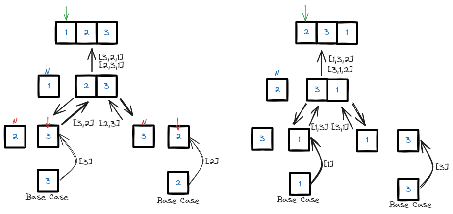

# <a id="home"></a> Backtracking

Данный раздел посвящён паттерну Backtracking из **[Leetcode Patterns](https://seanprashad.com/leetcode-patterns/)**.\
У NeetCode есть плэйлист разборов на эту тему: **[Backtracking Playlist](https://www.youtube.com/watch?v=pfiQ_PS1g8E&list=PLot-Xpze53lf5C3HSjCnyFghlW0G1HHXo)**.

**Table of Contents:**
- [Subsets](#subsets)
- [Subsets II](#subsets2)
- [Combination Sum](#combination)
- [Combination Sum II](#combination2)
- [Permutations](#permutations)
- [Permutations II](#permutations2)
- [Word Search](#wordSearch)
- [Letter Case Permutation](#casePermutation)


----

## [↑](#home) <a id="subsets"></a> Subsets
Рассмотрим задачу [Subsets](https://leetcode.com/problems/subsets/):
> Дан массив уникальных элементов. Нужно найти все подмассивы.

Данная задача про Subsets. От **permutations** она отличается тем, что [1,2] это тоже самое, что [2,1] и таких повторений быть не должно.

Понять задачу нам снова поможет NeetCode: [Subsets - Backtracking](https://www.youtube.com/watch?v=REOH22Xwdkk).


Для решения данной задачи нам пригодится **DFS** подход, он же поиск в глубину.\
Каждый "спуск в глубину" - это принятие решение для очередного индекса. Тогда:
```java
public List<List<Integer>> subsets(int[] nums) {    
    List<List<Integer>> result = new ArrayList<>();
    dfs(0, nums, result, new LinkedList<>());
    return result;
}
```

Самы же dfs тогда будет выглядеть так:
```java
public void dfs(int index, int[] nums, List<List<Integer>> result, LinkedList<Integer> subset) {
    // Base case: out or array, all decisions were made
    if (index >= nums.length) {
        result.add(new ArrayList<Integer>(subset));
        return;
    }
    // Decision to include
    subset.addLast(nums[index]);
    dfs(index + 1, nums, result, subset);
    // Decision to not include
    subset.removeLast();
    dfs(index + 1, nums, result, subset);
}
```
Таким образом, рекурсивно мы продвигаемся по индексам.\
Для каждого индекса dfs выполняет 2 ветвления: с добавляением nums[index] и без добавления.\
А когда каждая ветвь заходит в тупик (т.е. выходит за пределы массива), мы добавляем результат.

----

## [↑](#home) <a id="subsets2"></a> Subsets II
Рассмотрим задачу [Subsets II](https://leetcode.com/problems/subsets-ii/):
> Дан массив элементов, где элементы могут повторяться. Нужно найти все подмассивы.

Разбор от NeetCode: [Subsets II - Backtracking](https://www.youtube.com/watch?v=Vn2v6ajA7U0).

Во-первых, нам нужно как-то пропускать элементы со значением, которое мы уже видели. Например, можно отсортировать входной массив:
```java
public List<List<Integer>> subsets(int[] nums) {    
    Arrays.sort(nums);
```

Далее, когда мы решаем не включать элемент и переходим к следующему элементу, нам нужно "прокрутить" элементы в том случае, если такой элемент только что обрабатывался, чтобы избежать дубли:
```java
// Decision to not include
subset.removeLast();
while (index + 1 < nums.length && nums[index] == nums[index + 1]) {
    index++;
}
dfs(index + 1, nums, result, subset);
```

----

## [↑](#home) <a id="combination"></a> Combination Sum
Рассмотрим задачу [Combination Sum](https://leetcode.com/problems/combination-sum/):
> Дан массив из чисел и некоторое target значение. Нужно вернуть уникальные способы получить суммой заданное target значение.

Разбор от NeetCode: "[Combination Sum - Backtracking](https://www.youtube.com/watch?v=GBKI9VSKdGg)".\


Данная задача похожа на [Subsets](#subsets), разница лишь в том, как принимать решение.

Основной метод остаётся очень похожим:
```java
public List<List<Integer>> combinationSum(int[] candidates, int target) {
    List<List<Integer>> result = new ArrayList<>();
    dfs(0, candidates, result, new LinkedList<>(), 0, target);
    return result;
}
```

И теперь видоизменённый метод принятия решений:
```java
public void dfs(int index, int[] nums, List<List<Integer>> result, LinkedList<Integer> subset, int total, int target) {
    // Base case: total == target. We found the possible solution
    if (target == total) {
        result.add(new ArrayList<Integer>(subset));
        return;
    }
    // Base case: out or array (total is less) OR total is bigger
    if (index >= nums.length || total > target) return;

    // Decision to include
    subset.addLast(nums[index]);
    dfs(index, nums, result, subset, total + nums[index], target);
        
    // Decision to not include
    subset.removeLast();
    dfs(index + 1, nums, result, subset, total, target);
}
```

----

## [↑](#home) <a id="combination2"></a> Combination Sum II
Рассмотрим задачу [Combination Sum II](https://leetcode.com/problems/combination-sum-ii/):
> Дана коллекция из кандидатов - чисел, из которых нужно попытаться получить target число при помощи суммирования. Каждое число можно использовать только один раз. И не должно быть одинаковых комбинаций.

Разбор задачи от NeetCode: "[Combination Sum II](https://www.youtube.com/watch?v=rSA3t6BDDwg)"

Начало у нас такое же, за исключением того, что мы сортируем входные данные:
```java
public List<List<Integer>> combinationSum2(int[] candidates, int target) {
    Arrays.sort(candidates);
    List<List<Integer>> result = new ArrayList<>();
    dfs(0, candidates, result, new LinkedList<>(), target);
    return result;
}
```

Далее начинается расхождение:
```java
public void dfs(int index, int[] nums, List<List<Integer>> result, LinkedList<Integer> subset, int target) {
    // Base case: We found the possible solution
    if (target == 0) result.add(new ArrayList<Integer>(subset));
    // Base case: Path end. We reach or pass the target
    if (target <= 0) return;

    int prev = -1;
    // Iterate over all elements. Each iteration is like train
    for (int i = index; i < nums.length; i++) {
        if (prev == nums[i]) continue;
        // Add element (carriage) to the "train"
        subset.addLast(nums[i]);
        // Send train with the carriage to other elements    
        dfs(i + 1, nums, result, subset, target - nums[i]);
        // Remove element (carriage). Other iteration will handle element without it.
        subset.removeLast();
        prev = nums[i];   
    }
}
```

----

## [↑](#home) <a id="permutations"></a> Permutations
Рассмотрим задачу [Permutations](https://leetcode.com/problems/permutations/):
> Дан массив из уникальных чисел. Найти все возможные варианты из них.

Разбор задачи от Nikhil Lohia: [Permutations](https://www.youtube.com/watch?v=H232aocj7bQ).

Решение:
```java
public List<List<Integer>> permute(int[] nums) {
    List<List<Integer>> result = new ArrayList<>();
    // Pass an empty array list to store a signle permutation
    backtrack(result, new ArrayList<>(), nums);
    return result;
}
```

Сам же backtracking выглядит следующим образом:
```java
public void backtrack(List<List<Integer>> result, List<Integer> tmp, int[] nums) {
    if (tmp.size() == nums.length) {
        result.add(new ArrayList<>(tmp));
        return;
    }
    // Iterate over numbers like [1,2,3]
    for (int number : nums) {
        // Distinct integers. Avoid duplication
        if (tmp.contains(number)) continue;
            
        // Add a number to the current permutation
        tmp.add(number);
            
        backtrack(result, tmp, nums);

        // Remove last element (i.e. current number)
        // It allows to start new iteration without this number
        // For example, iteration [1, 2] continues as [2, 1]
        tmp.remove(tmp.size() - 1);
    }
}
```

Разбор от NeetCode: [Backtracking: Permutations](https://www.youtube.com/watch?v=s7AvT7cGdSo).

Довольно хитрый подход:



Самое первое, что нам понадобится - немного изменить то, в каком виде у нас входные данные:
```java
public List<List<Integer>> permute(int[] nums) {
    // Convert array to a LinkedList
    LinkedList<Integer> current = new LinkedList<>();
    for (int num : nums) {
        current.add(num);
    }
    return permute(current);
}
```

Нужно это нам для того, чтобы создать другой метод, который будет работать уже не с массивом, а с листом:
```java
public List<List<Integer>> permute(LinkedList<Integer> current) {
    // Each permutation iteration has own portion of data
    List<List<Integer>> result = new ArrayList<>();
    // TODO
    return result;
}
```

Прежде всего в TODO опишем базовый случай, когда у нас есть только 1 элемент:
```java
// Base case: Return single element "as is" 
if (current.size() == 1) {
    result.add(new ArrayList<>(current));
    return result;
}
```
В этом случае мы просто добавляем в результат список из одного единственного элемента и возвращаем результат.

Если же у нас больше чем один элемент - мы должны выполнить столько итераций, сколько у нас есть элементов:
```java
// Iterate over all positions
for (int i = 0; i < current.size(); i++) {
    Integer n = current.removeFirst();
    // Subtask: do the same without first element
    List<List<Integer>> perms = permute(current);
    // Append detached element to all subtask results
    for (List<Integer> perm : perms) {
        perm.add(n);
    }
    // Accumulate results to the current results
    result.addAll(perms);
    // Return detached element as the last element
    current.addLast(n);
}
```

----

## [↑](#home) <a id="permutations2"></a> Permutations II
Рассмотрим задачу [Permutations II](https://leetcode.com/problems/permutations-ii/):
> Дан массив из уникальных чисел. Найти все возможные варианты из них. Могут быть дубли.

Разбор от Nikhil Lohia: [Permutations 2](https://www.youtube.com/watch?v=YW5F0WqBBWY)

Отличие самой "точки входа" в алгоритм лишь в том, что нам требуется отсортировать данные:
```java
public List<List<Integer>> permuteUnique(int[] nums) {
    Arrays.sort(nums);
    List<List<Integer>> result = new ArrayList<>();
    // Pass an empty array list to store a signle permutation
    backtrack(result, new ArrayList<>(), nums, new boolean[nums.length]);
    return result;   
}
```

И сам алгоритм:
```java
private void backtrack(List<List<Integer>> resultList, ArrayList<Integer> tempList, int[] nums, boolean[] used) {
    // If we match the length, it is a permutation
    if (tempList.size() == nums.length
        && !resultList.contains(tempList)) {
      resultList.add(new ArrayList<>(tempList));
      return;
    }

    for (int i = 0; i < nums.length; i++) {
      // Skip if we get same element
      if (used[i]) continue;

      // Add the new element and mark it as used
      used[i] = true;
      tempList.add(nums[i]);

      // Go back to try other element
      backtrack(resultList, tempList, nums, used);

      // Remove the element and mark it as unused
      used[i] = false;
      tempList.remove(tempList.size() - 1);
    }
}
```

----

## [↑](#home) <a id="wordSearch"></a> Word Search
Рассмотрим задачу [Word Search](https://leetcode.com/problems/word-search/).

Разбор от NeetCode: "[Word Search - Backtracking](https://www.youtube.com/watch?v=pfiQ_PS1g8E)".\
Разбор от Nick White: "[LeetCode Word Search Solution Explained](https://www.youtube.com/watch?v=m9TrOL1ETxI)"

Решение по сути состоит из двух частей. Первая - начиная с каждой ячейки, которая содержит начальную букву слова пытаемся построить всё слово целиком:
```java
public boolean exist(char[][] board, String word) {
    for (int i = 0; i < board.length; i++) {
        for (int j = 0; j < board[0].length; j++) {
            if (board[i][j] == word.charAt(0)) {
                if (search(i,j,0,board,word)) return true;
            }
        }
    }
    return false;
}
```

Сам алгоритм поиска:
```java
public boolean search(int row, int column, int letter, char[][] board, String word) {
    // We reached the end == word was found
    if (word.length() == letter) return true;
    // cell should not be out of board bounds
    if (row < 0 || row >= board.length || column < 0 || column >= board[0].length) return false;
    // also, we should not consider visited cells AND cells with wrong symbol
    if (board[row][column] != word.charAt(letter)) return false;
    // Put out symbol to hide it from other iterations
    char tmp = board[row][column];
    board[row][column] = '#';
    if (search(row+1, column, letter+1, board, word) ||
        search(row-1, column, letter+1, board, word) ||
        search(row, column+1, letter+1, board, word) ||
        search(row, column-1, letter+1, board, word) ) {
        return true;
    }
    board[row][column] = tmp;
    return false;
}
```

----

## [↑](#home) <a id="casePermutation"></a> Letter Case Permutation
Рассмотрим задачу [Letter Case Permutation](https://leetcode.com/problems/letter-case-permutation/).

Подход к решению можно посмотреть в [Решаем Литкод : Letter Case Permutation](https://www.youtube.com/watch?v=wYO4ospshr8)

Решение задачи:
```java
List<String> result = new ArrayList<>();
public List<String> letterCasePermutation(String s) {
    search(s, "", 0);
    return result;
}

public void search(String s, String cur, int ind) {
    if (ind == s.length()) {
        result.add(cur);
        return;
    }
    if (Character.isDigit(s.charAt(ind))) {
        search(s, cur + s.charAt(ind), ind+1);
    } else {
        search(s, cur + Character.toUpperCase(s.charAt(ind)), ind+1);
        search(s, cur + Character.toLowerCase(s.charAt(ind)), ind+1);
    }
}
```
