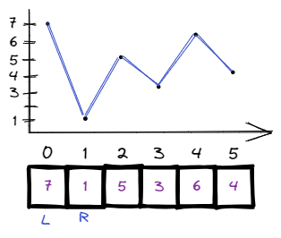
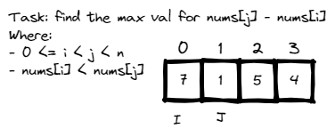
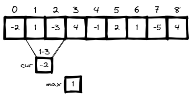
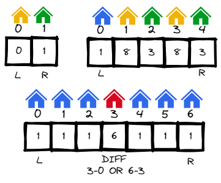
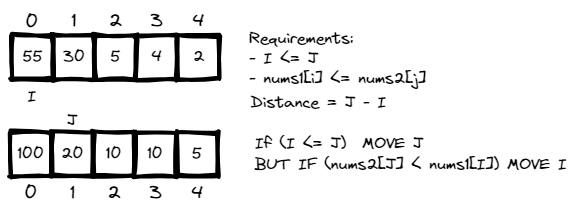
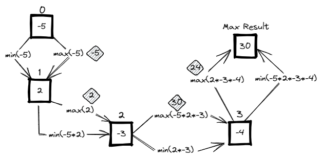
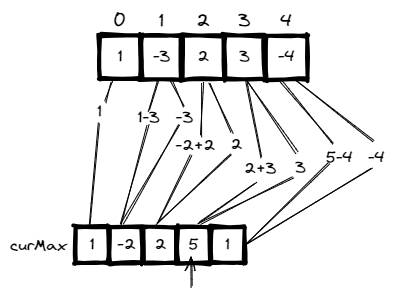

# <a id="home"></a> Best Time to Buy and Sell Stock

Данный раздел посвящён теме "Best Time to Buy and Sell Stock" из **[Leetcode Patterns](https://seanprashad.com/leetcode-patterns/)**.

**Table of Content:**
- [Best Time to Buy and Sell Stock](#bestTime)
- [Best Time to Buy and Sell Stock II](#bestTime2)
- [Maximum Difference Between Increasing Elements](#maximum)
- [Maximum Subarray](#subarray)
- [Two Furthest Houses With Different Colors](#houses)
- [Maximum Distance Between a Pair of Values](#maxDistance)
- [Maximum Absolute Sum of Any Subarray](#any)

----

## [↑](#home) <a id="bestTime"></a> Best Time to Buy and Sell Stock
Разберём задачу **"[Best Time to Buy and Sell Stock](https://leetcode.com/problems/best-time-to-buy-and-sell-stock/)"**.

Дан массив, где каждый элемент - цена на определённый момент времени. В каждый момент можно купить, можно продать, можно ничего не делать. Покупка и продажа должны быть в разные моменты. Можно купить и продать только 1 раз.

Начнём, как обычно, с визуализации примера с LeetCode:



Когда выгодно купить, если мы можем купить всего один раз? Когда цена минимальная.\
Когда выгодно продать, если мы можем продать всего один раз? Когда цена максимальна.

Получаем два указателя (и **two pointers** задачу): L (left, покупка) и R (right, продажа).\
Если покупка (L) меньше продажи (R): считаем выгоду (profit) и запоминаем максимальный профит на текущий момент.\
Если покупка (R) больше продажи (R): найден новый самый минимальный элемент.

```java
public int maxProfit(int[] prices) {
    int maxProfit = 0;
    int l = 0, r = 1;
    while (r < prices.length) {
        if (prices[l] < prices[r]) {
            int profit = prices[r] - prices[l];
            maxProfit = Math.max(maxProfit, profit);
        } else {
            l = r;
        }
        r++;
    }
    return maxProfit;
}
```

Ту же задачу можно решить немного по-другому, не через указатели, а манипулируя только понятиями "минимальный элемент" (ограничивает зону элементов, которые мы рассматриваем) и "максимальная выгода":
```java
public int maxProfit(int[] prices) {
    int maxProfit = 0;
    int minElement = prices[0];

    for (int price : prices) {
        // Profit is when price bigger than min element
        maxProfit = Math.max(maxProfit, price - minElement);
        minElement = Math.min(minElement, price);
    }
    return maxProfit;
}
```

----

## [↑](#home) <a id="bestTime2"></a> Best Time to Buy and Sell Stock II
Разберём задачу **"[Best Time to Buy and Sell Stock II](https://leetcode.com/problems/best-time-to-buy-and-sell-stock-ii)"**.\
В отличии от первой части задачи, теперь мы можем иметь несколько транзакций (т.е. пар купил-продал).

Важно увидеть, что если у нас есть последовательность вроде [1,7,3,5], то если у нас есть несколько транзакций, то всегда выгоднее купить тогда, когда дальше следует рост, т.е. el[i] < el[i+1], а продать тогда, когда дальше следует падение el[i] > el[i+1]. Может захотеть запоминать крайние состояния, но если мы будем просто добавлять к профиту каждый кусочек, то нам не нужно даже ничего запоминать.

```java
public int maxProfit(int[] prices) {
    int profit = 0;
    for (int i = 1; i < prices.length; i++) {
        if (prices[i] > prices[i-1]) {
            profit = profit + (prices[i] - prices[i-1]);
        }
    }
    return profit;
}
```

----

## [↑](#home) <a id="maximum"></a> Maximum Difference Between Increasing Elements
Рассмотрим другую задачу: [Maximum Difference Between Increasing Elements](https://leetcode.com/problems/maximum-difference-between-increasing-elements/).



Получается, смотря на каждое число мы должны думать, а не является ли оно минимальным. Если минимальное - то мы смотрим только справа от него, т.к. i должен быть меньше j по условию задачи.

Если же рассматриваемое число больше известного минимума, то между ними уже есть какая-то разница. Нужно лишь проверить, не является ли она самой большой разницей из всех, которых мы посчитали. Таким образом решение может выглядеть так:

```java
public int maximumDifference(int[] nums) {
    int diff = -1;
    int min = Integer.MAX_VALUE; // Any value less
    for (int num : nums) {
        if (num < min) {
            // We found new minimum
            min = num;   
        } else if (num > min) {
            // Probably, we found new max diff?
            int curDiff = num - min;
            if (diff < curDiff) {
                diff = curDiff;
            }
        }
    }
    return diff;
}
```

----

## [↑](#home) <a id="subarray"></a> Maximum Subarray
Рассмотрим ещё одну задачу: [Maximum Subarray](https://leetcode.com/problems/maximum-subarray/).

Поможет её решить опять визуализация задачи.



Нам нужно помнить и различать текущую сумму и максимально посчитанную сумму чтобы вовремя остановиться.
```java
public int maxSubArray(int[] nums) {
    // nums is always not empty
    int max = nums[0], cur = 0;
    for (int num : nums) {
        cur = cur + num;
        if (num >= cur) {
            // New num more profitable. Can skip previous elements
            cur = num;
        }
        // We have new current summ. Should we treat it as new max?
        max = Math.max(max, cur);
    }
    return max;
}
```

----

## [↑](#home) <a id="houses"></a> Two Furthest Houses With Different Colors
Рассмотрим ещё одну задачу: [Two Furthest Houses With Different Colors](https://leetcode.com/problems/two-furthest-houses-with-different-colors/).

Она интересна тем, что хорошо демонстрирует подход с тем, как иногда полезно идти от простого примера к сложному:



Мы видим, что если крайние дома разные - мы уже нашли ответ. Если же нет - имеет смысл смотреть на дома с противоположной стороны.\
Таким образом решение может выглядеть так:
```java
public int maxDistance(int[] colors) {
    int len = colors.length - 1;
    int leftMost = colors[0];
    int rightMost = colors[len];
    int maxDistance = -1;
    // It's not about index or pointer, it's about shifting/window size
    for (int i = 0; i <= len; i++) {
        // Check the right side of the window
        if (leftMost != colors[len - i]) {
            maxDistance = Math.max(maxDistance, len - i);
        }
        // Check the left side of the window
        if (rightMost != colors[i]) {
            maxDistance = Math.max(maxDistance, len - i);
        }
    }
    return maxDistance;
}
```

----

## [↑](#home) <a id="maxDistance"></a> Maximum Distance Between a Pair of Values
Рассмотрим ещё одну задачу: [Maximum Distance Between a Pair of Values](https://leetcode.com/problems/maximum-distance-between-a-pair-of-values/).

Эта задача интересна тем, что визуализация может подсказать ответ:



Получаем решение:
```java
public int maxDistance(int[] nums1, int[] nums2) {
    int result = 0;
    int i = 0, j = 0;
    while(i < nums1.length && j < nums2.length) {
        if (i<=j) {
            if (nums1[i] <= nums2[j]) {
                // Valid pair
                int distance = j - i;
                result = Math.max(result, distance);
                j++;
            } else {
                // Should decrease first value to be closer to the valid condition
                i++;
            }
        } else {
            // I MUST be less then J. Other cases are not valid
            j++;
        }
    }
    return result;
}
```

----

## [↑](#home) <a id="products"></a> Maximum product subarray
Рассмотрим ещё одну задачу: [Maximum product subarray](https://leetcode.com/problems/maximum-product-subarray/).

Дан некоторый массив чисел, нужно найти подмассив с наибольшим произведением (на английском Product).

Предположим, у нас есть массив **[-5,2,-3,-4]**.\
Решением данной задачи является рассчёт одновременно максимума и минимума на каждом шагу:



Тогда код может выглядеть следующим образом:
```java
class Solution {
    public int max(int n1, int n2, int n3) {
        return Math.max(n1, Math.max(n2, n3));
    }
    public int min(int n1, int n2, int n3) {
        return Math.min(n1, Math.min(n2, n3));
    }
    
    public int maxProduct(int[] nums) {
        int min_prod = nums[0], max_prod = nums[0], ans = nums[0];
        System.out.println(max_prod);
        for (int i = 1; i < nums.length; i++) {
            int num = nums[i];
            int tmp = max_prod;
            max_prod = max(tmp * num, min_prod * num, num);
            min_prod = min(tmp * num, min_prod * num, num);
            System.out.println(max_prod);
            ans = Math.max(ans, max_prod);
        }
        return ans;
    }
}
```

Рекомендуется послушать разбор от NeetCode: [Maximum Product Subarray - Dynamic Programming](https://www.youtube.com/watch?v=lXVy6YWFcRM).

----

## [↑](#home) <a id="any"></a> Maximum absolute sum of any subarray
Рассмотрим ещё одну задачу: [Maximum Absolute Sum of Any Subarray](https://leetcode.com/problems/maximum-absolute-sum-of-any-subarray/).

Интересна она своей идеей поиска ответа. Т.к. нас интересует Abs чисел, то решение задачи сводится к поиску минимума и максимума.\
Вспомнить можно по видео "[Back to Back SWE : Max Contiguous Subarray Sum](https://youtu.be/2MmGzdiKR9Y?t=530)".



```java
public int maxAbsoluteSum(int[] nums) {
    int theMin = 0, theMax = 0;
    int curMin = 0, curMax = 0;
    int answer = Math.abs(nums[0]);

    for (int num : nums) {
        curMin = Math.min(num, curMin + num);
        curMax = Math.max(num, curMax + num);

        theMin = Math.min(curMin, theMin);
        theMax = Math.max(curMax, theMax);

        answer = Math.max(theMax, Math.abs(theMin));
    }
    return answer;
}
```
