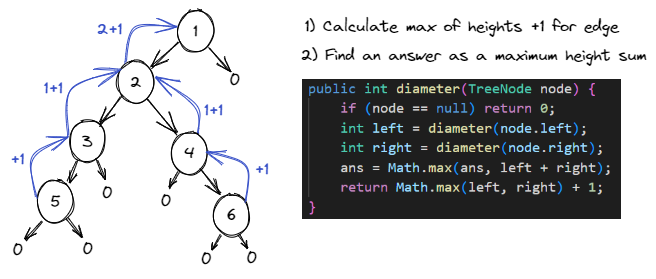

# <a id="home"></a> Binary Search

Данный раздел посвящён задачам на двоичный поиск из **[Leetcode Patterns](https://seanprashad.com/leetcode-patterns/)**.\
Плэйлист разборов от NeetCode: **"[Trees](https://www.youtube.com/watch?v=QfJsau0ItOY&list=PLot-Xpze53ldg4pN6PfzoJY7KsKcxF1jg)"**.\
Так же может быть интересно видео [Binary Tree Algorithms for Technical Interviews](https://www.youtube.com/watch?v=fAAZixBzIAI).

**Table of Contents:**
- [Binary Search](#search)
- [Smallest Letter Greater Than Target](#smallest)
- [Count Elements With Strictly Smaller and Greater Elements](#countElements)
- [Average of Levels in Binary Tree](#average)
- [Maximum Depth of Binary Tree](#maxDepth)
- [Minimum Depth of Binary Tree](#minDepth)
- [Same Tree](#same)
- [Diameter of Binary Tree](#diameter)
- [Merge Two Binary Trees](#merge)
- [Subtree of Another Tree](#subtree)
- [Invert Binary Tree](#invert)
- [Path sum](#sum)
- [Convert to Binary Search Tree](#convert)
- [Lowest Common Ancestor of a Binary Search Tree](#lowest)

----

## [↑](#home) <a id="search"></a> Binary Search
Разберём классическую задачу **"[Binary Search](https://leetcode.com/problems/binary-search/)"**.

Как обычно, разбор можно посмотреть у NeetCode: **[Binary Search ](https://www.youtube.com/watch?v=s4DPM8ct1pI)**.

Идея решения простая: нам нужно два указателя на начало и конец рассматриваемого отрезка данных. Благодаря этому мы можем вычислить, где находится середина:
```java
public int search(int[] nums, int target) {
    int left = 0, right = nums.length-1;
    while (left <= right) {
        int middle = left + (right - left)/2;
        if (nums[middle] > target) {
            right = middle - 1;
        } else if (nums[middle] < target) {
            left = middle + 1;
        } else {
            return middle;
        }
    }
    return -1;
}
```


## [↑](#home) <a id="smallest"></a> Smallest Letter Greater Than Target
Задача на бинарный поиск может быть подана в других терминах. Например: [Find Smallest Letter Greater Than Target](https://leetcode.com/problems/find-smallest-letter-greater-than-target/). Необходимо найти наименьшений символ, который лексикографически больше, чем указанный target.

```java
public char nextGreatestLetter(char[] letters, char target) {
    int n = letters.length;
    // Can't satisfy "lexicographically greater than target"
    if (target >= letters[n-1]) return letters[0];
 
    int ans = -1;
    int left = 0, right = n - 1;
    while (left <= right) {
        int mid = left + (right - left)/2;
        // "if lexicographically greater than target"
        if (letters[mid] > target) {
            ans = mid;
            // Try to find in a new range of smaller values
            right = mid - 1;
        } else {
            left = mid + 1;
        }
    }
    return letters[ans];
}
```


## [↑](#home) <a id="countElements"></a> Count Elements With Strictly Smaller and Greater Elements
Разберём ещё одну вариацию задачи: [Count Elements With Strictly Smaller and Greater Elements](https://leetcode.com/problems/count-elements-with-strictly-smaller-and-greater-elements/)

```java
public int countElements(int[] nums) {
    int cnt = 0;
    int max = nums[0];
    int min = nums[0];
    for (int i = 1; i < nums.length; i++) {
        if (nums[i] > max) {
            max = nums[i];
        } else if (nums[i] < min) {
            min = nums[i];
        }
    }
    for (int i = 0; i < nums.length; i++) {
        if (nums[i] < max && nums[i] > min) cnt++;
    }
    return cnt;
}
```

## [↑](#home) <a id="average"></a> Average of Levels in Binary Tree
Рассмотрим ещё одну задачу: [Average of Levels in Binary Tree](https://leetcode.com/problems/average-of-levels-in-binary-tree/).\
Данная задача решается при помощи **Breadth-first search (BFS)** или "поиск в ширину".

Для начала подготовим структуры данных для складывания результата и очередь для нод (подробнее чуть позже):
```java
List<Double> result = new ArrayList<>();
Queue<TreeNode> queue = new LinkedList<>();
queue.offer(root);
```

Теперь напишем непосредственно саму логику подсчёта:
```java
while (!queue.isEmpty()) {
    double level_sum = 0;
    double size = queue.size(); // Remember current queue size
    for (int i = 0; i < size; i++) {
        TreeNode cur = queue.poll();
        level_sum = level_sum + cur.val;
        //Consider children for next while loop iterations
        if (cur.left != null) queue.offer(cur.left);
        if (cur.right != null) queue.offer(cur.right);
    }
    result.add(level_sum / size);
}
return result;
```
Получается, что выполняя итерацию мы заполняем очередь нодами для следующей итерации. Таким образом в начале каждой итерации мы знаем кол-во нод на текущем уровне и нам нужно лишь сложить их значения и разделить потом на количество. Т.к. очередь будет меняться в процессе, то в начале каждой итерации нужно запомнить размер очереди.

Обзор данной задачи можно посмотреть у Nick White: **"[Average of Levels in Binary Tree](https://www.youtube.com/watch?v=NW3aCTwdXxs)"**.


## [↑](#home) <a id="maxDepth"></a> Maximum Depth of Binary Tree
Ещё одна задача на анализ двоичного дерева: [Maximum Depth of Binary Tree](https://leetcode.com/problems/maximum-depth-of-binary-tree/).\
Разбор данной задачи можно посмотреть у NeetCode: [Maximum Depth of Binary Tree](https://www.youtube.com/watch?v=hTM3phVI6YQ).

Интересно, что решение будет очень похоже на решение предыдущей задачи. Нам понадобится почти такие же стуктуры данных:
```java
if (root == null) return 0;
int result = 0;
Queue<TreeNode> queue = new LinkedList<>();
queue.offer(root);
```

И сам код будет очень похож:
```java
while (!queue.isEmpty()) {
    double size = queue.size(); // Remember current queue size before cycle
    for (int i = 0; i < size; i++) {
        TreeNode cur = queue.poll();
        //Consider children for next while loop iterations
        if (cur.left != null) queue.offer(cur.left);
        if (cur.right != null) queue.offer(cur.right);
    }
    result++;
}
return result;
```


## [↑](#home) <a id="minDepth"></a> Minimum Depth of Binary Tree
Есть аналогичная задача на поиск в двоичном дереве: [Minimum Depth of Binary Tree](https://leetcode.com/problems/minimum-depth-of-binary-tree/).

Данная задача решается при помощи того же подхода. Подробнее см. разбор от Nikhil Lohia: [Study Algorithms:Minimum Depth of Binary Tree](https://www.youtube.com/watch?v=tZS4VHtbYoo).

Традиционно, начинаем с того, что создадим очередь для обрабатываемых нод:
```java
Queue<TreeNode> queue = new LinkedList<>();
queue.offer(root);
```

Остаётся только найти тот самый путь с минимальным количеством нод:
```java
int minNodesInLine = 0;
while (!queue.isEmpty()) {
    minNodesInLine++;
    TreeNode node = queue.poll();
    if (node.left != null) queue.offer(node.left);
    if (node.right != null) queue.offer(node.right);
    if (node.left == null && node.right == null) break;
}
return minNodesInLine++;
```

## [↑](#home) <a id="same"></a> Same Tree
Есть ещё одна задача по теме деревьев. Необходимо сравнить два двоичных дерева: [Same Tree](https://leetcode.com/problems/same-tree/).\
Как обычно, подробнее можно посмотреть [NeetCode: Same Tree](https://www.youtube.com/watch?v=vRbbcKXCxOw).

У данной задачи есть короткое рекурсивное решение:
```java
public boolean isSameTree(TreeNode p, TreeNode q) {
    if (p == null && q == null) return true;
    if (p == null || q == null || p.val != q.val) return false;
    return isSameTree(p.left, q.left) && isSameTree(p.right, q.right); 
}
```

Эту же задачу можно решить при помощи того же подхода с очередью.\
Сформулируем определение того, когда две ноды одинаковы:
```java
private boolean equals(TreeNode p, TreeNode q) {
    if(p == null || q == null) return false;
    if(p.val != q.val) return false;
    return true;
}
```

Далее, подготовимся к выполнению итераций по нодам:
```java
public boolean isSameTree(TreeNode p, TreeNode q) {
    if (p == null && q == null) return true;
    if (!equals(p, q)) return false;
        
    Queue<TreeNode> queue = new LinkedList<>();
    queue.offer(p);
    queue.offer(q);
```

И теперь непосредственно сама проверка:
```java
while(!queue.isEmpty()) {
    p = queue.poll();
    q = queue.poll();
    if(p == null && q == null) continue;
    if(!equals(p, q)) return false;

    queue.add(p.left);
    queue.add(q.left);
    queue.add(p.right);
    queue.add(q.right);
}
return true;
```

Есть отличная визуализация для этого в статье [Alex Murphy: Same Tree (solution with images)](https://blog.devgenius.io/leetcode-100-same-tree-solution-with-images-b35f78487fda).


## [↑](#home) <a id="diameter"></a> Diameter of Binary Tree
Есть ещё одна задача по теме деревьев: [Diameter of Binary Tree](https://leetcode.com/problems/diameter-of-binary-tree/).\
Как обычно, подробнее можно посмотреть [NeetCode: Diameter of Binary Tree](https://www.youtube.com/watch?v=bkxqA8Rfv04).

Решение данной задачи будет рекурсивным:



```java
public int ans = 0;

public int diameterOfBinaryTree(TreeNode root) {
    diameter(root);
    return ans;
}

public int diameter(TreeNode node) {
    if (node == null) return 0;
    int left = diameter(node.left);
    int right = diameter(node.right);
    ans = Math.max(ans, left + right);
    return Math.max(left, right) + 1;
}
```

## [↑](#home) <a id="merge"></a> Merge Two Binary Trees
Рассмотрим задачу [Merge Two Binary Trees](https://leetcode.com/problems/merge-two-binary-trees/).

Как обычно, можно посмотреть разбор данной задачи у NeetCode и Nick White:
- [NeetCode: Merge Two Binary Trees](https://www.youtube.com/watch?v=QHH6rIK3dDQ)
- [Nick White: LeetCode Merge Two Binary Trees](https://www.youtube.com/watch?v=_LJO5nBKC1A)

Решается она при помощи всё той же рекурсии:
```java
public TreeNode mergeTrees(TreeNode root1, TreeNode root2) {
    if (root1 == null && root2 == null) return null;
    // Calculate new value
    int v1 = root1 != null ? root1.val : 0;
    int v2 = root2 != null ? root2.val : 0;
    TreeNode root = new TreeNode(v1+v2);
    // Do the same for other parts
    root.left = mergeTrees(root1 != null ? root1.left : null, root2 != null ? root2.left : null);
    root.right = mergeTrees(root1 != null ? root1.right : null, root2 != null ? root2.right : null);
    return root;
}
```


## [↑](#home) <a id="subtree"></a> Subtree of Another Tree
Рассмотрим задачу [Subtree of Another Tree](https://leetcode.com/problems/subtree-of-another-tree/).\
Разбор задачи как обычно у NeetCode: [Subtree of Another Tree](https://www.youtube.com/watch?v=E36O5SWp-LE)

Эта задача решается при помощи другой задачи, которую мы уже рассматривали ранее:
```java
public boolean isSameTree(TreeNode p, TreeNode q) {
    if (p == null && q == null) return true;
    if (p == null || q == null || p.val != q.val) return false;
    return isSameTree(p.left, q.left) && isSameTree(p.right, q.right);
}
```

А самое решение:
```java
 public boolean isSubtree(TreeNode s, TreeNode t) {
    if (s == null) return false;
    if (isSameTree(s, t)) return true;
    return isSubtree(s.left, t) || isSubtree(s.right, t);
}
```


## [↑](#home) <a id="invert"></a> Invert Binary Tree
Рассмотрим задачу [Invert Binary Tree](https://leetcode.com/problems/invert-binary-tree/).\
Разбор как обычно у Nick White: [Nick White: Invert Binary Tree](https://www.youtube.com/watch?v=fKgZiCXb6zs)

Решение рекурсивное:
```java
public TreeNode invertTree(TreeNode root) {
    if (root == null) return null;
    TreeNode tmp = root.left;
    root.left = root.right;
    root.right = tmp;
    invertTree(root.left);
    invertTree(root.right);
    return root;
}
```


## [↑](#home) <a id="sum"></a> Path sum
Рассмотрим задачу [Path sum](https://leetcode.com/problems/path-sum/).\
Разбор, как обычно, у NeetCode: [Path Sum](https://www.youtube.com/watch?v=LSKQyOz_P8I).

Рекурсивное решение выглядит следующим образом:
```java
public boolean search(TreeNode node, int curSum, int targetSum) {
    if (node == null) return false;
    curSum = curSum + node.val; // Sum including the current node
    if (node.left == null && node.right == null) {
        // Don't have children == leaf node == end of the path == make check
        return curSum == targetSum;
    }
    return search(node.left, curSum, targetSum) || search(node.right, curSum, targetSum);
}
```

Ну и сам вызов:
```java
public boolean hasPathSum(TreeNode root, int targetSum) {
    return search(root, 0, targetSum);
}
```


## [↑](#home) <a id="balance"></a> Balanced Binary Tree
Рассмотрим задачу [Balanced Binary Tree](https://leetcode.com/problems/balanced-binary-tree/).\
Разбор, как обычно, у NeetCode: [Balanced Binary Tree](https://www.youtube.com/watch?v=QfJsau0ItOY&list=PLot-Xpze53ldg4pN6PfzoJY7KsKcxF1jg).

Решение, как обычно, при помощи рекурсии:


Код решения:
```java
public boolean isBalanced(TreeNode root) {
    if(root == null) return true;
    return height(root) != -1;   
}

public int height(TreeNode node) {
    if(node == null) return 0;
    int l = height(node.left);
    int r = height(node.right);
    if(l == -1 || r == -1 || Math.abs(l - r) > 1) return -1;
    return Math.max(l , r) + 1;
}
```


## [↑](#home) <a id="convert"></a> Convert to Binary Search Tree
Рассмотрим задачу [Convert to Binary Search Tree](https://leetcode.com/problems/convert-sorted-array-to-binary-search-tree/).\
Разбор, как обычно, у NeetCode: [Convert Sorted Array to Binary Search Tree](https://www.youtube.com/watch?v=0K0uCMYq5ng).

Решение:
```java
public TreeNode sortedArrayToBST(int[] nums) {
    return helper(nums,0, nums.length-1);
}

public TreeNode helper(int[] nums, int l, int r) {
    if (l > r) return null;
    int middle = l + (r-l)/2;
    TreeNode node = new TreeNode(nums[middle]);
    node.left = helper(nums, l, middle-1);
    node.right = helper(nums, middle+1, r);
    return node;
}
```


## [↑](#home) <a id="lowest"></a> Lowest Common Ancestor of a Binary Search Tree
Рассмотрим задачу [Lowest Common Ancestor of a Binary Search Tree](https://leetcode.com/problems/lowest-common-ancestor-of-a-binary-search-tree/).\
Разбор, как обычно, у NeetCode: [Lowest Common Ancestor of a Binary Search Tree](https://www.youtube.com/watch?v=gs2LMfuOR9k&list=PLot-Xpze53ldg4pN6PfzoJY7KsKcxF1jg&index=19)