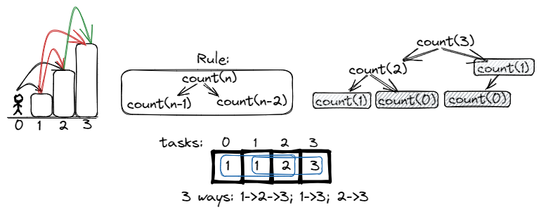
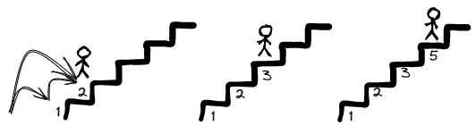
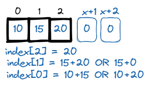
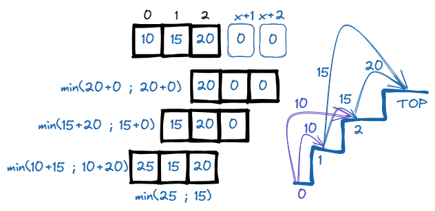
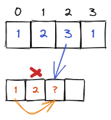
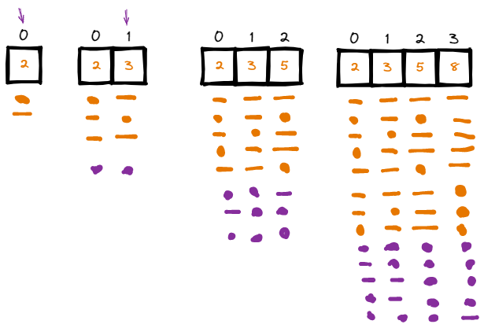

# <a id="home"></a> Climbing Stairs

Данный раздел посвящён теме "Climbing Stairs" из **[Leetcode Patterns](https://seanprashad.com/leetcode-patterns/)**.

**Table of Content:**
- [Climbing Stairs](#climbing)
- [Min Cost Climbing Stairs](#minCost)
- [House Robber](#robber)
- [Number of ways to place houses](#houses)

----

## [↑](#home) <a id="climbing"></a> Climbing Stairs
Самая простая версия задачи про ступеньки - **"[70. Climbing Stairs](https://leetcode.com/problems/climbing-stairs/)"**.

Дано N кол-во ступеней, чтобы добраться до вершины лестницы.\
Каждый раз мы можем сделать ход на 1 или на 2 ступени. Необходимо узнать количество уникальных способов добраться до вершины.

Чтобы узнать кол-во путей до ступеньки N мы должны узнать кол-во путей до ступенек, с которых можно попасть на ступеньку N и просто сложить значения:
 


Простой классический рекурсивный подход "в лоб" может выглядеть так: F(N) = F(N-1) + F(N-2)
```java
public int climbStairs(int n) {
    // We can reach step "n" from steps: "n-1" or "n-2"
    // Each of these steps can be reached also from a distance of 1 or 2 steps
    // Edge case: the start position is always reached in one way.
    // Edge case: the first step can be reached always for 1 step.
    if (n==0 || n==1) return 1;
    return climbStairs(n-1) + climbStairs(n-2);
}
```

Однако, можно заметить, что мы повторяем вычисления, которые мы уже считали. Хорошо бы их где-то запоминать и переиспользовать.\
Кроме этого можно заметить, что продвигаясь на одну позицию вперёд нам нужно помнить лишь про два прошлых шага. А значит нам не нужно держать в памяти целлый массив размера N, хватит лишь две переменные: "одинарный шаг" и "двойной шаг".

Кроме того, стоит подумать, что такое "distinct ways". Если попасть на ступеньку 3 мы продолжаем те же пути, что и ступенька 2 + те же пути, что и ступенька 1. Получается, на ступеньку 3 мы можем попасть по сумме этих всех путей. Важно помнить, что мы считаем не шаги, а именно количество путей:



Тогда решение будет таким (его легко понять, если смотреть на картинку сверху):
```java
public int climbStairs(int n) {
    int shortWay = 1;
    int longWay = 1;
    if (n==1) return longWay;
    for (int i = 2; i <= n; i++) {
        int step = shortWay + longWay;
        // prepare for the next step. We need this summ + the prev step
        shortWay = longWay;
        longWay = step;
    }
    return longWay;
}
```
До первой ступеньки существует только короткий путь. А в финале именно longWay и будет ответом.

Эта задача на самом деле точь в точь задача про **[Fibonacci Number](https://leetcode.com/problems/fibonacci-number/)**:
```java
public int fib(int n) {
    int a = 0, b = 1;
    if (n<2) return n;
    for (int i = 2; i <= n; i++) {
        int step = a + b;
        a = b;
        b = step;
    }
    return b;
}
```

По аналогии можно решить и задачу про **[N-th Tribonacci Number](https://leetcode.com/problems/n-th-tribonacci-number/description/)**:
```java
public int tribonacci(int n) {
    int[] mem = new int[]{0,1,1};
    if (n <= 2) return mem[n]; // already in mem
    for (int i = 3; i <= n; i++) {
        int summ = mem[2] + mem[1] + mem[0];
        mem[0] = mem[1];
        mem[1] = mem[2];
        mem[2] = summ; 
    }
    return mem[2];
}
```

----

## [↑](#home) <a id="minCost"></a> Min Cost Climbing Stairs
Есть продолжение задачи: **[Min Cost Climbing Stairs](https://leetcode.com/problems/min-cost-climbing-stairs/)**.

Чтобы лучше понять решение рекомендуется посмотреть **"[NeetCode : Min Cost Climbing Stairs - Dynamic Programming](https://www.youtube.com/watch?v=ktmzAZWkEZ0&list=PLot-Xpze53lcvx_tjrr_m2lgD2NsRHlNO&index=38)"**.

Вместо n нам дан массив из n чисел, каждое из которых представляет цену посещения этой ступеньки. Нужно найти минимальную цену, которую нужно будет заплатить, чтобы добраться до последней ступеньки.



Можно заметить, что нам достаточно двигать "окно". То есть нам нужно 2 слота для запоминания и вычисление текущей минимальной суммы:



В таком случае код может выглядеть так:
```java
public int minCostClimbingStairs(int[] cost) {
    int step1 = 0, step2 = 0; // On top = free
    for (int i = cost.length - 1; i >= 0; i--) {
        int minCost = cost[i] + Math.min(step1, step2);
        step2 = step1;
        step1 = minCost;
    }
    return Math.min(step1, step2);
}
```

Если подход с "окном" не очень понятен, то можно решить по-другому.\
Можно посмотреть объяснение тут: **"[NeetCode : Min Cost Climbing Stairs - Dynamic Programming](https://youtu.be/ktmzAZWkEZ0?t=641)"**.
```java
public int minCostClimbingStairs(int[] cost) {
    //[10,15,20] [0] On top = free
    int step1 = cost[cost.length - 1], step2 = 0;
    for (int i = cost.length - 2; i >= 0; i--) {
        int minCost = cost[i] + Math.min(step1, step2);
        step2 = step1;
        step1 = minCost;
    }
    return Math.min(step1, step2);
}
```

----

## [↑](#home) <a id="robber"></a> House Robber
Есть классическая задача про грабителя - **[House Robber](https://leetcode.com/problems/house-robber/)**.

Задача заключается в том, что дан массив, где каждый элемент представляет собой дом, а значение элемента - ценность, которую можно украсть. При этом нельзя красть из соседних элементов:



В таких задачах стоит понять правила происходящего.\
Если мы рассматриваем дом, то мы не можем его складывать с предыдущем, но в любом случае складываем с домом перед предыдущим.

Для решения стоит так же отметить условие задачи: ``1 <= nums.length <= 100``. Это означает, что за пределы INTEGER мы не выходим.

```java
public int rob(int[] nums) {
    // To remember our profit according to position near houses
    int[] mem = new int[nums.length+1];
    // Visit first house as a default state. Leave one space for calculation for "far" house
    mem[1] = nums[0];
    // Calculate all positions in mem. That's why we interate till mem.length
    // (!) house 2 has index 1 in original array and index 2 in our mem array
    for (int i = 2; i < mem.length; i++) {
        mem[i] = Math.max(mem[i-1], nums[i-1] + mem[i-2]); 
    }
    // Last element has maximum value
    return mem[nums.length];
}
```

Данное решение можно улучшить, т.к. нам не нужно помнить про все шаги. Нам важно рассматривать текущий предыдущий результат или сумма текущего дома и результата перед предыдущим. Тогда:
```java
public int rob(int[] nums) {
    // We have ate least one house
    int near = 0, far = 0;
    for (int num : nums) {
        int bestResult = Math.max(num + far, near);
        far = near; // shift for the next step,
        near = bestResult;
    }
    return near; // Because of the best result
}
```

У задачи про house robber есть интересное продолжение: **"[213. House Robber II](https://leetcode.com/problems/house-robber-ii/)"**.\
Её особенность в том, что дома идут по кругу, т.е. первый дом считается соседним с последним домом.\
Разбор данной задачи можно посмотреть как обычно у **NeetCode**: **[House Robber II - Dynamic Programming](https://www.youtube.com/watch?v=rWAJCfYYOvM)**.

----

## [↑](#home) <a id="houses"></a> Number of ways to place houses
Более сложной задачей из той же области является задача **"[Count Number of Ways to Place Houses](https://leetcode.com/problems/count-number-of-ways-to-place-houses)".**

Во-первых, нужно понимать, как выполнить требование: **"return it modulo 10^9 + 7"**:
> The modulo operation is represented by the ‘%’ operator in most programming languages

Идея этого проста. Используя % (Remainder) мы можем указать ограничение на значение числа. Например:
```java
System.out.println(12%10 + " and " + 3%10); // 2 and 3
```

С одной стороны, решить задачу на подсчёт количества комбинаций расположения домов можно на основе наблюдения:



```java
public int countHousePlacements(int n) {
    // Use Long because of module and big numbers.
    long mod = (long)Math.pow(10,9) + 7;
    long a = 2;
    long b = 3;
    if (n==1) return (int)(a*a);
    if (n==2) return (int)(b*b);
    for (int i = 3; i <=n; i++) {
        long sum = (a + b) % mod;
        a = b;
        b = sum;
    }
    return (int) ((b * b) % mod);
}
```