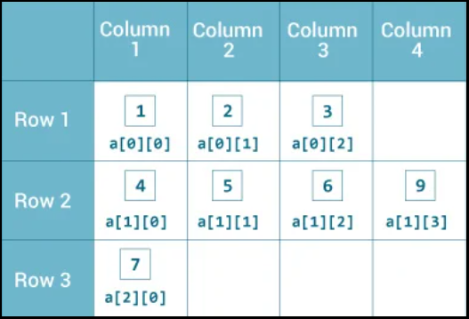

# <a id="home"></a> Convert 1D Array Into 2D Array

Данный раздел посвящён задаче Convert 1D Array Into 2D Array из **[Leetcode Patterns](https://seanprashad.com/leetcode-patterns/)**.

**Table of Contents:**
- [Arrays in Java](#arrays)
- [Convert 1D Array Into 2D Array](#convert)
- [Spiral Matrix](#spiral)
- [Rotate Image](#rotate)

----

## [↑](#home) <a id="arrays"></a> Arrays in Java
Прежде чем решать задачи на массивы нужно понимать как они устроены. Рассмотрим применение в Java.
```java
int[] array = new int[5];
```
В такой формулировке массив состоит из int'ов и больше ничего положить внутрь нельзя. В таком случае массив у нас одномерный.

Однако массив может быть многомерным. По сути многомерный массив - массив массивов:
```java
int[][] array = new int[5][];
```
Стоит отметить, что в данном случае у нас есть основной массив из 5 элементов (zero based), который содержит массивы int по типу. Но так как размерность не указана, то там пока что null. Однако обратиться сейчас нельзя, получим NPE. Чтобы обратиться нунжно создать там массив:
```java
int[][] array = new int[5][];
array[0] = new int[5];
System.out.println(array[0][1]);
```



Таким образом мы всегда имеем строки (первый индекс), а потом колонки (второй индекс). При этом количество колонок может меняться от строчки к строчке.

----

## [↑](#home) <a id="convert"></a> Convert 1D Array Into 2D Array
Рассмотрим задачу [Convert 1D Array Into 2D Array](https://leetcode.com/problems/convert-1d-array-into-2d-array/).

На самом деле решение простое. Нам понадобится два счётчика: колонки и столбцы.\
Когда указатель столбца доходит до лимита, то мы просто его сбрасываем и инкрементируем счётчик строк:

```java
public int[][] construct2DArray(int[] original, int m, int n) {
    int expectedSize = m * n; // m rows x n columns
    if (expectedSize != original.length) {
        return new int[0][]; // Return empty array
    }
    int[][] result = new int[m][];
    int row = 0, column = 0;
    for (int num : original) {
        // The row end is reached. Start the new row
        if (column == n) {
            row++;
            column = 0;
        }
        // Each row start create columns
        if (column == 0) result[row] = new int[n];
        // Just put the current num in the proper "cell"
        result[row][column] = num;
        column++;
    }
    return result;
}
```

----

## [↑](#home) <a id="spiral"></a> Spiral Matrix
Рассмотрим задачу [Spiral Matrix](https://leetcode.com/problems/spiral-matrix/).

Как обычно, отличный разбор [NeetCode: Spiral Matrix](https://www.youtube.com/watch?v=BJnMZNwUk1M).

Код решения:
```java
public List<Integer> spiralOrder(int[][] matrix) {
    List<Integer> result = new ArrayList<>();
    int left = 0, right = matrix[0].length-1;
    int top = 0, bottom = matrix.length-1;
    while (left <= right && top <= bottom) {
        // Forward
        for (int i = left; i <= right; i++) {
            result.add(matrix[top][i]);
        }
        top++;

        for (int i = top; i <= bottom; i++) {
            result.add(matrix[i][right]);
        }
        right--;

        // Return (if we have elements for that)
        if (left > right || top > bottom) break;
        for (int i = right; i >= left; i--) {
            result.add(matrix[bottom][i]);
        }
        bottom--;

        for (int i = bottom; i >= top; i--) {
            result.add(matrix[i][left]);
        }
        left++;
    }
    return result;
}
```

----

## [↑](#home) <a id="rotate"></a> Rotate Image
Рассмотрим задачу [Rotate Image](https://leetcode.com/problems/rotate-image/).

Как обычно, отличный разбор у NeetCode: [Rotate Image - Matrix ](https://www.youtube.com/watch?v=fMSJSS7eO1w&t=1s).

Код решения:
```java
public void rotate(int[][] matrix) {
    int left = 0, right = matrix.length - 1;
    while (left < right) {
        for (int i = 0; i < (right - left); i++) {
            int top = left, bottom = right; // Because we have a square
            // Don't forget to use our i as a shifting on each iteration!
            // Save the top left item to tmp
            int topLeft = matrix[top][left + i];
            // Move bottom left into top left (that was saved to the temp)
            matrix[top][left + i] = matrix[bottom - i][left];
            // Move bottom right into bottom left
            matrix[bottom - i][left] = matrix[bottom][right - i];
            // Move top right into bottom right
            matrix[bottom][right - i] = matrix[top + i][right];
            // Move top left into top right
            matrix[top + i][right] = topLeft;
        }
        left++;
        right--;
    }
}
```