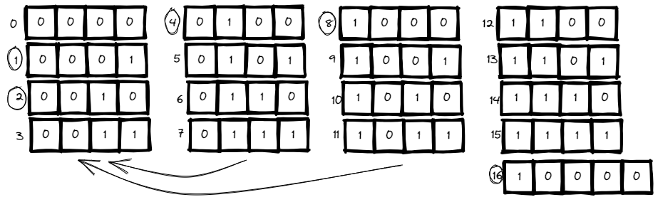

# <a id="home"></a> Counting Bits

Данный раздел посвящён теме "Counting Bits" из **[Leetcode Patterns](https://seanprashad.com/leetcode-patterns/)**.

**Table of Content:**
- [Counting Bits](#bits)
- [Number of 1 Bits](#numberbits)

----

## [↑](#home) <a id="bits"></a> Counting Bits
Разберём задачу **"[Counting Bits](https://leetcode.com/problems/counting-bits/)"**.

По условиям задачи, нам дают некоторое число n и нам нужно вернуть массив, где каждый индекс - это количество единиц в двоичном представлении числа от 0 до n. То есть если n=5, то мы вернём массив из шести элементов: [0,1,1,2,1,2]

Чтобы решить данную задачу не зная её решения, нужно быть наблюдательным. Распишем каждую цифру:



Если присмотреться, то можно увидеть некоторую закономерность. При достижении индекса по степени двойки мы начинаем использовать результат, полученный по смещению на эту степень двойки:

```java
public int[] countBits(int n) {
    int[] dp = new int[n+1];
    int offset = 1; //[1,2,4,8,16,32 ...]
    // For N=5 should iterate over 1,2,3,4,5
    for (int i = 1; i <= n; i++) {
        // Set new offset if we reach new power of two
        if ((offset * 2) == i) {
            offset = offset * 2;
        }
        // Each non zero position has at least one 1 + the same amount by offset
        dp[i] = 1 + dp[i - offset];
    }
    return dp;
}
```

Отличный разбор решения как обычно от NeetCode: **"[NeetCode - Counting Bits - Dynamic Programming](https://www.youtube.com/watch?v=RyBM56RIWrM)"**.

Есть ещё один подход к решению данной задачи основанный на побитовых операциях.\
Есть операция Bit Shifting (она же bitwise shifting) - сдвиг битов влево или вправо.\
Например, ``4 >> 1`` сдвинет битовое представление на один шаг вправо. И, как мы видим по картинке, мы получим 2.\
А если сдвинуть ``6 >> 1``, то мы получим 3. То есть с точки зрения результата это похоже на деление на 2.

Кроме того, приглядевшись к картинке сверху можно заметить, что на конце у всех нечётных цифр последний бит всегда единица.\
Тогда:
```java
public int[] countBits(int n) {
    int[] dp = new int[n+1];
    for (int i = 1; i <= n; i++) {
        dp[i] = dp[i >> 1] + (i % 2);
    }
    return dp;
}
```

----

## [↑](#home) <a id="numberbits"></a> Number of 1 Bits
Разберём задачу **"[Number of 1 Bits](https://leetcode.com/problems/number-of-1-bits/)"**.

Идея задачи проста: дано некоторое число, нужно посчитать кол-во единиц в двоичном представлении этого числа.\
И тут опять на помощь придёт двоичный сдвиг.

Основа решения - побитовое AND. Если мы будем выполнять побитовое AND любого числа с единицей, то получим в результате 1 тогда, когда число имеет последним битом единицу, а иначе получим ноль. Так как в задаче дан integer, у которого 32 разряда, то мы итерируемся по каждому биту, выполняя смещение и проверяем, есть ли единица в последнем бите.

Более подробно объяснение можно посмотреть здесь:
- [NeetCode Number of 1 Bits](https://www.youtube.com/watch?v=5Km3utixwZs)
- [Vladimir Balun - number of 1 bits](https://www.youtube.com/watch?v=OviVg7YQf_A)

```java
public int hammingWeight(int n) {
    int counter = 0;
    for (int i = 0; i < 32; i++) {
        counter = counter + ((n >> i) & 1);
    }
    return counter;
}
```