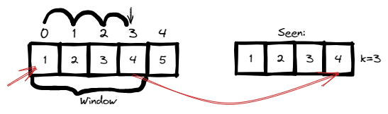
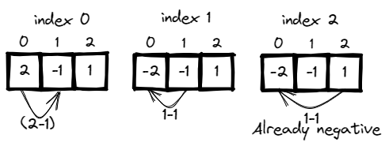
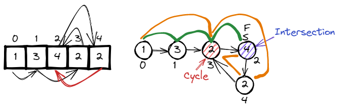
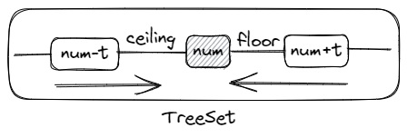

# <a id="home"></a> Duplicate

Данный раздел посвящён теме поиска дубликатов, самой первой теме **[Leetcode Patterns](https://seanprashad.com/leetcode-patterns/)**.

**Table of Content:**
- [Contains Duplicate](#duplicate)
    - [Two Number Sum](#twoNumber)
- [Nearby Duplicate](#nearby)
- [Find All Duplicates in an Array](#all)
- [Find the duplicate number](#duplicateNumber)
- [Nearby Almost Duplicate](#almostDuplicate)
----


## [↑](#home) <a id="duplicate"></a> Contains Duplicate
Самая простая версия задачи на поиск дубликатов - **"[217. Contains Duplicate](https://leetcode.com/problems/contains-duplicate/)"**.\
У нас есть массив чисел. Нужно ответить на вопрос: есть ли в массиве дубликаты.

Дубликат - это что-то, что мы уже видели (**seen**). Самая простая реализация - на основе структуры данных **Set**:
```java
public boolean containsDuplicate(int[] nums) {
    Set<Integer> seen = new HashSet<>();
    for (int num : nums) {
        if (!seen.add(num)) return true;
    }
    return false; 
}
```
В Java по контракту **Set** метод **add** возвращает false если не удалось добавить элемент (т.е. элемент уже был добавлен ранее).

В Java можно решить через стримы, но чем проще, тем лучше. Кроме того, решения через стримы проигрывают в производительности. Например:
```java
return Arrays.stream(nums).anyMatch(num -> !seen.add(num));
```
или 
```java
return Arrays.stream(nums).distinct().count() != nums.length;
```

### [↑](#home) <a id="twoNumber"></a> Two Number Sum
Есть задача, которая по механике похожа на поиск дубликатов, но сам по себе не про это: **[Two Sum](https://leetcode.com/problems/two-sum/)**.

Задача: даны массив и некоторое целевое число (target). Нужно найти элементы, сумма которых даёт target.

Рассмотрим решение на примере ``[2,7,11,15], target = 9``:\
Чтобы найти сумму, мы должны увидеть два числа как минимум.\
Кроме того, если мы рассматриваем число (назовём его number), то мы ищем среди других увиденных чисел то, которое получим при вычислении **"target - number"**.

```java
public static int[] twoNumberSum(int[] array, int targetSum) {
    Set<Integer> seen = new HashSet<>();
	for (int num : array) {
		int potential = targetSum - num;
		if (seen.contains(potential)) {
            return new int[]{potential, num};
		} else {
			seen.add(num);
		}
	}
    return new int[0];
}
```

---------

## [↑](#home) <a id="nearby"></a> Nearby Duplicate
Есть усложнённая версия поиска дубликатов: **"[219. Contains Duplicate II](https://leetcode.com/problems/contains-duplicate-ii/)"**.
Необходимо найти не просто дубликат, а ближайший дубликат в определённом диапазоне длинной k.

Нужно смотреть на дубликаты только в определённом диапазоне, т.е. нужно рассматривать только некоторую ограниченную область.\
Такую область называют "окном", а название подхода - **"[Window Sliding](https://www.geeksforgeeks.org/window-sliding-technique/)"**.



Как видно, мы анализируем на 1 элемент больше, чем размер окна. При этом перед следующим заходом мы должны компенсировать это различие:
```java
public boolean containsNearbyDuplicate(int[] nums, int k) {
    Set<Integer> seen = new HashSet<>();
    // It's important for us to know about current index (i.e. current position)
    for (int i = 0; i < nums.length; i++) {
        if (!seen.add(nums[i])) {
            return true;
        }
        // Maintain window size. Remove element by value of element that is
        // For [1,2,3,4,5] and k=3 after addition of 4 we should remove inxed 3-3=0
        if (seen.size() > k) seen.remove(nums[i-k]);
    }
    return false;
}
```

---------

## [↑](#home) <a id="all"></a> Find All Duplicates in an Array
Рассмотрим другую задачу про поиск дубликатов: **"[442. Find All Duplicates in an Array](https://leetcode.com/problems/find-all-duplicates-in-an-array/)"**.

По условию задачи в массиве из n чисел значения могут быть только в диапазоне [1,n].\
По такому диапазону видно, что не используется значение 0, при этом мы начинаем с нулевого индекса.

Предположим, есть массив из n=3 (вида ``[1,2,3]``).\
Мы не можем напрямую соотнести индекс элемента и значение, т.к. элемент со значением n будет указывать на индекс вне массива. Но т.к. ноль не задействован, то мы можем вычитать единицу из значения. Например, значение 1 будет указателем на индекс 0 (т.к. 1-1).\
В таком случае мы сможем при посещении значения интерпретировать его как указатель и отмечать, что мы его посещали:



Рекомендуется посмотреть объяснение: **"[LeetCode 442. Find All Duplicates in an Array](https://www.youtube.com/watch?v=aMsSF1Il3IY)"**.

```java
class Solution {
    public List<Integer> findDuplicates(int[] nums) {
        List<Integer> result = new ArrayList<>();
        for (int i = 0; i < nums.length; i++) {
            // abs to not get an error for negative indexes
            // minus one to consider the first element in the array also
            int index = Math.abs(nums[i]) - 1;
            if (nums[index] < 0) {
                result.add(index + 1);
            } else {
                nums[index] = -nums[index];
            }
        }
        return result;
    }
}
```

---------

## [↑](#home) <a id="duplicateNumber"></a> Find the duplicate number
У задачи по поиску дубликатов есть ещё одна интересная версия: **"[287. Find the Duplicate Number](https://leetcode.com/problems/find-the-duplicate-number/)"**. 

В этой задаче важно то, что все числа в диапазоне **[1,n]** включая n, но при этом размер массива **n+1**.\
Учитывая это условие видно, что имея любой массив (например, для n=3 будет ```[1,2,3]```) у нас всегда будет дубль, чтобы размер был n+1.\
Кроме этого, любое значение (даже n) может быть использовано в качестве индекса, т.к. не выходит за массив.

Начинаем с индекса 0. Числа 0 у нас нет, то есть в любом случае индекс ``0`` ведёт на какой-то другой индекс.\
Получается, на массив можно посмотреть как на связанный список:



Получается, что можно применить тот же алгоритм поиска цикла с двумя указателями: медленным и быстрым. Благодаря этому мы сможем найти точку пересечения указателей и определить, что у нас есть цикл. Далее оказывается, что от точки пересечения до места образования цикла (т.е. до дубля) такое же расстояние, как и от начала массива.

Подробное объяснение: **"[Find the Duplicate Number - Floyd's Cycle Detection](https://www.youtube.com/watch?v=wjYnzkAhcNk)"**.

Таким образом задача делится на 2 этапа:
- Находим точку пересечения быстрого и медленного указателя (совпадает с пониманием факта обнаружения цикла)
```java
// Move pointers to the start position
int slow = 0, fast = 0;
do {
    slow = nums[slow];
    fast = nums[nums[fast]];
} while(fast != slow);
```
- Заменяем быстрый указатель медленным. Когда он встретится с медленным - мы найдём дубль
```java
// Make fast pointer as slow pointer
fast = 0;
while (fast != slow) {
    slow = nums[slow];
    fast = nums[fast];
}
return slow;
```

---------

### [↑](#home) <a id="almostDuplicate"></a> Nearby Almost Duplicate
У поиск ближайших дубликатов есть интересное продолжение - **"[220. Contains Duplicate III](https://leetcode.com/problems/contains-duplicate-iii/)"**.

Для начала нужно понять саму задачу. У нас как обычно есть массив чисел. И наша задача: найти такую пару элементов, что их индексы находятся на расстоянии не большем чем indexDiff (может быть меньше или равно), при этом разница значений этих элементов будет не больше, чем valueDiff (меньше или равно).

Из всех решений мне понравилось с точки зрения подхода решение на основе **[Navigable Set](https://docs.oracle.com/javase/8/docs/api/java/util/NavigableSet.html)**. В этом случае решение задачи сводится к пониманию работы с Navigable Set и к **[Floor and Ceiling Functions](https://www.mathsisfun.com/sets/function-floor-ceiling.html)**. Наиболее удобной реализацией является структура данных TreeSet, где операции выполняются за логарифмическое время. 

Предположим, мы получили элемент num=5. Мы знаем, что разница значений должна быть не более t=2.\
В этом случае нам надо рассмотреть две ситуации:
- Мы знаем про другой элемент X, который расположен на прямой так: ``---[num]---[X]---[num+t]--->``
Т.к. поиск по диапазону влево от X, то выполняем floor(num+t) и накладываем ограничение, что X >= num
- Мы знаем про другой элемент Y, который расположен на прямой так: ``---[num-t]---[Y]---[num]--->``
Т.к. поиск по диапазон вправо от Y, то выполняем ceiling(num-t) и накладываем ограничение, что Y <= num



```java
class Solution {
    public static boolean containsNearbyAlmostDuplicate(int[] nums, int k, int t) {
        /**
         * ---[floor]----[num]----[ceiling]--->
         */
        NavigableSet<Long> treeSet = new TreeSet<>();
        for (int i = 0; i < nums.length; i++) {
            // Use long for num to avoid overflow
            long num = (long) nums[i];
            // --[num]---[floor]---[num+t]--->
            Long floor = treeSet.floor(num + t);
            if (floor != null && floor >= num) return true;
            // --[num-t]---[ceil]---[num]--->
            Long ceil = treeSet.ceiling(num - t);
            if (ceil != null && ceil <= num) return true;

            treeSet.add(num);
            // We store k elements and have one element to analyze (num variable).
            // If we store more then k elements we should remove element at k distance from the current position
            // Adjust for [1,2,3,4] for k=2: if we add 3, then it's already 3 elements inside but should be 2.
            // In this case we should remove 1 from the "window": removeIndex = index - k
            if (i >= k) treeSet.remove((long) nums[i - k]);
        }
        return false;
    }
}
```
Это решение наиболее интересное и интуитивно понятное. Существует решение на основе bucket'ов, но оно сложнее и больше шанс допустить ошибки. Подробнее см. stackoverflow: **"[Contains Duplicate III](https://stackoverflow.com/questions/31119971/leetcode-contains-duplicate-iii/48317895)"**.