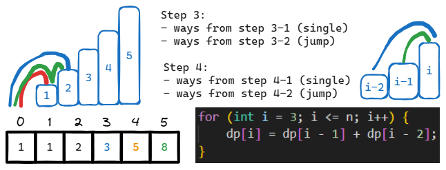
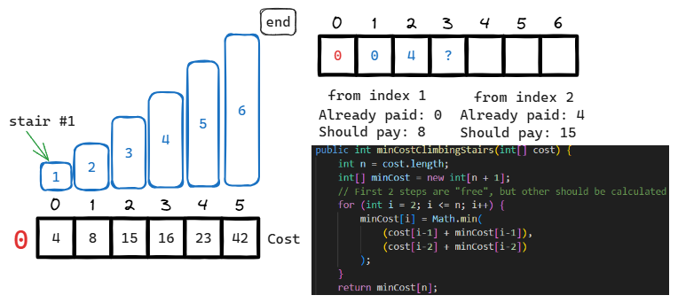
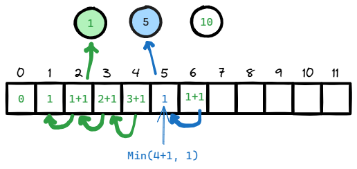
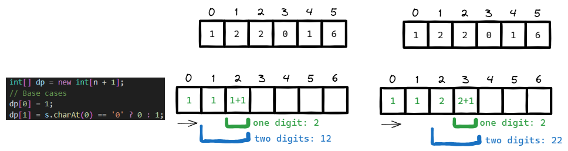
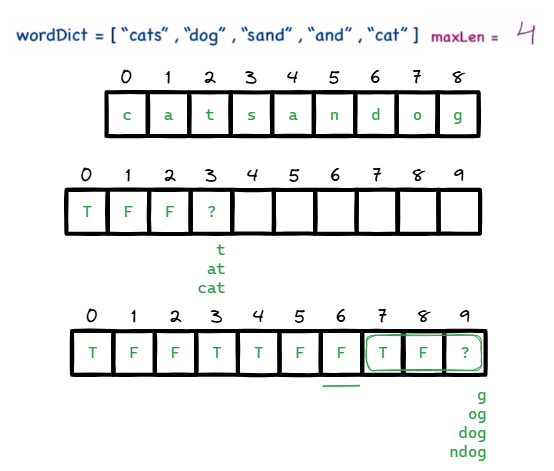
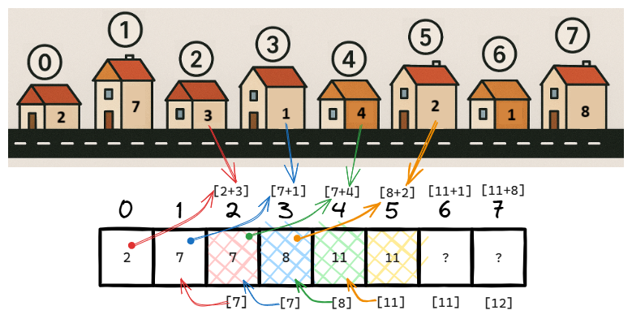
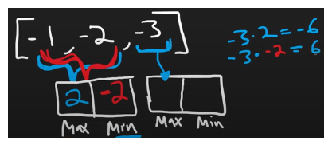
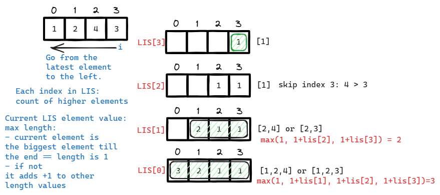

# [←](../README.md) <a id="home"></a> Dynamic programming

Данный раздел посвящён задачам на "динамическое программирование".\
Им отведён свой раздел в **[Leetcode Patterns](https://seanprashad.com/leetcode-patterns/)**.

Кроме того, как всегда, их можно найти в **[NeetCode Roadmap](https://neetcode.io/roadmap)**.

**Table of Contents:**
- [[70] Climbing Stairs](#climbing)
- [[746] Min Cost Climbing Stairs](#minCost)
- [[322] Coin Change](#coin)
- [[91] Decode Ways](#decode)
- [[139] Word Break](#word)
- [[198] House Robber (1 and 2)](#robber)
- [[416] Partition Equal Subset Sum](#subsetsum)
- [[152] Maximum Product Subarray](#maxproduct)
- [[300] Longest Increasing Subsequence](#increasing)
- [[647] Palindromic Substrings](#palindromic)

----

## [↑](#home) <a id="climbing"></a> 70. Climbing Stairs
Рассмотрим самую простую для понимания задачу **"[70. Climbing Stairs](https://leetcode.com/problems/climbing-stairs)"**:
> Дано некоторое число ступенек n, нужно добраться до последней ступеньки. Можно совершать шаг на 1 ступеньку или сразу на 2 ступеньки. Нужно найти кол-во уникальных путей, которыми можно дойти до последней ступеньки.

Самое хорошее объяснение от Nikhil Lohia: **[Climbing Stairs | Dynamic Easy](https://www.youtube.com/watch?v=UUaMrNOvSqg)**.

Итак, нам нужно решить задачу **[climbing stairs](https://neetcode.io/problems/climbing-stairs)**:



С точки зрения любой ступеньки с индексом i к ней можно прийти со ступеньки ``i-1`` и ``i-2``.\
Это значит, что все те пути, которые ведут к этим ступенькам ведут и к ступеньке i. А значит их можно суммировать.

Получается, нам нужен массив, чтобы считать сумму путей к каждому индексу, где индекс - номер ступеньки:
```java
int[] dp = new int[n + 1];
```
Массив получается n+1, т.к. каждый индекс - это ступенька. Нулевой индекс - ground floor, мы с него начинаем до подъёма на ступеньку.

Для рассчёта нам нужно указать вручную 2 базовых случая, на основе которых считаются остальные значения:
```java
dp[1] = 1;
dp[2] = 2;
```

Тогда для индекса 3 и выше мы можем посчитать сумму путей для двух предыдущих ступенек:
```java
for (int i = 3; i <= n; i++) {
    dp[i] = dp[i - 1] + dp[i - 2];
}
return dp[n];
```

Данное решение можно оптимизировать, т.к. нам не нужно помнить все рассчёты.\
Мы могли заметить, что чтобы сделать рассчёт нужно знать 2 вещи: сколько к нам ведёт путей со ступеньки на 1 ниже, и со ступеньки на 2 ниже.

Тогда, для любой ступеньки справедливо:
```
- Посчитать сумму путей, которые к нам ведут со ступеньки на 1 ниже (**one_before**) и со ступеньки на 2 ниже (**two_before**). Это наш **total**.
- Значения путей должны быть готовы ПЕРЕД рассчётом шага, т.е. для следующего шага эти значения считает прошлый шаг.
- В конце итерации для ступеньки обновляем two_before для следующей ступеньки, записав туда прошлую ступеньку для текущей ступеньки. Мы отойдём от ней на 1 шаг на следующей итерации и она как раз станет two_before-
- В one_before запишем текущий total, ведь с текущей ступеньки все пути будут по прежнему вести к следующей.
```

<details><summary>Решение</summary>

```java
public int climbStairs(int n) {
    if (n < 1) return 0;
        
    // We have at least 1 stair
    int one_before = 1, two_before = 0;
    int total = 0;

    for (int i = 1; i <= n; i++) {
        total = one_before + two_before;
        two_before = one_before;
        one_before = total;
    }
    return total;
}
```
</details>

Как мы видим, one_before и two_before - это одновременно и количество путей до этих ступенек, НО и что более важно, количество путей с этим ступенек до текущей рассматриваемой ячейки.

В динамике на это можно посмотреть в разборе: **"[Algo Engine: Climbing Stairs](https://www.youtube.com/watch?v=4ikxUxiEB10)"**.

----

## [↑](#home) <a id="minCost"></a> 746. Min Cost Climbing Stairs
Рассмотрим продолжение предыдущей задачи **"[746. Min Cost Climbing Stairs](https://neetcode.io/problems/min-cost-climbing-stairs)"**:
> Дан массив со стоимостью шага с каждой ступеньки. Заплатив стоимость, можно совершить шаг в 1 или в 2 ступеньки. Кроме того, можно начать с нулевой или с первой ступеньки. Нужно найти минимальную стоимость, которую надо "заплатить", чтобы дойти до последней ступеньки.

Итак, приступим к решению задачи **"[Min Cost Climbing Stairs](https://neetcode.io/problems/min-cost-climbing-stairs)"**.

Чтобы понять решение данной задачи обратимся за помощью к Nikhil Lohia: **[Min Cost Climbing Stairs](https://www.youtube.com/watch?v=WeO_E5Q1kGw)**.



Так как мы можем начать с первой или второй ступеньки - минимальная цена для них 0.\
Т.к. нам нужно добраться до лестничной площадки над ступеньками - мы создаём массив на 1 больше, чем нам дан по умолчанию.\
Для каждой ступеньки, как и в задаче [Climbing Stairs](#climbing) мы смотрим на ступеньку на 1 уровень ниже и на 2 уровня ниже.\
Из массива с рассчётами мы берём текущий накопленный "долг" или текущую накопленную плату, которую мы минимально должны заплатит.\
Кроме того, мы так же должны взять и цену, которую мы должны заплатить, чтобы продолжить путь со ступеньки.

```java
public int minCostClimbingStairs(int[] cost) {
    int n = cost.length;
    int[] minCost = new int[n + 1];
    // First 2 steps are "free", but other should be calculated
    for (int i = 2; i <= n; i++) {
        minCost[i] = Math.min(
            (cost[i-1] + minCost[i-1]),
            (cost[i-2] + minCost[i-2])
        );
    }
    return minCost[n];
}
```

Данное решение, как и для [Climbing Stairs](#climbing), можно оптимизировать:
```java
public int minCostClimbingStairs(int[] cost) {
    int n = cost.length;
    if (n <= 1) return 0; // First steps are free
        
    // We have at least 1 stair
    int one_before = 0, two_before = 0;
    int total = 0;

    // Iterate over steps by cost array
    for (int i = 2; i <= n; i++) {
        total = Math.min(
            (cost[i-1] + one_before),
            (cost[i-2] + two_before)
        );
        // Prepare for next iteration
        two_before = one_before;
        one_before = total;
    }
    return total;
}
```

----

## [↑](#home) <a id="coin"></a> 322. Coin Change
Рассмотрим усложнённую задачу **"[322. Coin Change](https://leetcode.com/problems/coin-change/)"**:
> Дан массив с доступными номиналами монет и некоторое значение. Нужно определить, какое наименьшее количество монет потребуется, чтобы сложить это значение.

Итак, приступим к решению задачи **"[Coin Change](https://neetcode.io/problems/coin-change)"**.

По традиции, если раньше мы выполняли рассчёт для каждой ступеньки, то теперь мы выполняем рассчёт для каждой суммы.\
Для каждой суммы проверяем все доступные монеты. Если из суммы вычесть монету, то получится меньшая сумма. А раз так, то мы её уже ранее рассчитывали.



Можно увидеть, как интересно складывается работа алгоритма.\
Для каждой суммы мы можем запоминать минимальное количество монет и потом переиспользовать.\
Для каждой суммы мы рассматриваем все монеты в цикле. Когда из суммы вычитаем монету, у нас остатёся некоторый остаток. Дальше просто учитываем его минимум.

Разбор можно посмотреть тут: **"[Greg Hogg: Coin Change](https://www.youtube.com/watch?v=koE9ly1CFDc)"**

```java
public int coinChange(int[] coins, int amount) {
    int[] dp = new int[amount + 1]; // store non-zero amount, skip zero
        
    // Default value, to distinguish it from calculation
    int no_calc = Integer.MAX_VALUE - 1;
        
    // Calculate for each amount
    for (int a = 1; a <= amount; a++) { 
        dp[a] = no_calc;
        for (int coin: coins) {
            // make sense ONLY if coin less than calculated amount
            if (coin <= a) {
                // 1 for current coin + remainder as previously calcualted amount
                dp[a] = Math.min(dp[a], 1 + dp[a - coin]);
            }
        }
    }
    return dp[amount] != no_calc ? dp[amount] : -1;
}
```

----

## [↑](#home) <a id="decode"></a> 91. Decode Ways
Рассмотрим задачу **"[91. Decode Ways](https://leetcode.com/problems/decode-ways)"**:
> Дана цифровая строка, которой можно закодировать разные буквы, т.к. при помощи некоторых цифр можно сложить как один символ (с кодом 11) так и два символа с кодом 1. Нужно узнать, сколько вариаций может быть закодировано при помощи указанной строки.

Решить задачу **"[Decode Ways](https://neetcode.io/problems/decode-ways)"** можно при помощи динамического программирования.\
Интересно, как разные задачи могут быть на самом деле похожи.



Получается, что идея "сколько путей ведёт к ступеньке" тоже самое, что "сколько путей ведёт к текущему значению.\
Шаг в 1 ступеньку тоже самое что "число из одной цифры", а шаг в 2 ступеньки тоже самое, что "число из двух цифр".

Подробный разбор от Nikhil Lohia: **"[Decode Ways (LeetCode 91)](https://www.youtube.com/watch?v=FEkZxCl_-ik)"**.

Решение:
```java
public int numDecodings(String s) {
    int n = s.length();
    int[] dp = new int[n + 1];
    // Base cases
    dp[0] = 1;
    dp[1] = s.charAt(0) == '0' ? 0 : 1; // Should not have leading zero

    for (int i = 2; i <= n; i++) {
        int oneDigit = Integer.valueOf(s.substring(i - 1, i));
        int twoDigits = Integer.valueOf(s.substring(i - 2, i));

        if (oneDigit >= 1) {
            dp[i] = dp[i] + dp[i - 1]; // The same way as previous number
        }
        if (twoDigits >= 10 && twoDigits <= 26) {
            dp[i] = dp[i] + dp[i - 2];
        }
    }
    return dp[n];
}
```

----

## [↑](#home) <a id="word"></a> 139. Word Break
Рассмотрим задачу **"[139. Word Break](https://leetcode.com/problems/word-break/)"**:
> Дана некоторая строка и список слов. Нужно проверить, является ли строка составленной из данных слов или нет.

Задача **"[Word Break](https://neetcode.io/problems/word-break)"** так же решается при помощи динамического программирования.

Разбор можно посмотреть у Nikhil Lohia: **"[Word Break](https://www.youtube.com/watch?v=hK6Git1o42c)"**



В данной задаче на каждом шаге мы пытаемся вычислить, можно ли до этой позиции разбить строку на известные слова.\
Важно, что если мы нашли слово, то состояние ДО этого слова тоже должно разбиваться на слова.

```java
public boolean wordBreak(String s, List<String> wordDict) {
    Set<String> wordSet = new HashSet<>(wordDict);
    int maxLen = 0;
    for (String word: wordDict) maxLen = Math.max(maxLen, word.length());

    int n = s.length();
    boolean[] dp = new boolean[n+1];
    dp[0] = true; // Base case for empty string

    for (int i = 1; i <= n; i++) {
        for (int j = i - 1; j >= Math.max(0, i - maxLen); j--) {
            if (dp[j] && wordSet.contains(s.substring(j, i))) {
                dp[i] = true;
                break; // No need to check other prefixes
            }
        }
    }
    return dp[n];
}
```

----

## [↑](#home) <a id="robber"></a> 198. House Robber

Рассмотрим ещё одну классическую задачу **"[198. House Robber](https://leetcode.com/problems/house-robber/)"**:
> Дан массив, представляющий из себя последовательность домов. Каждый элемент представляет ценность дома. Можно воровать ТОЛЬКО из НЕ смежных домов. Нужно определить максимальную добычу. 

Задача **"[House Robber](https://neetcode.io/problems/house-robber)"** может быть решена при помощи динамического программирования.

Разбор можно посмотреть у Nikhil Lohia: **"[House Robber](https://www.youtube.com/watch?v=VXqUQYGMnQg)"**



Идея такая же. На каждом шаге нам нужно знать максимальный накопленный результат.\
Ранее, на каждой ступеньки мы суммировали накопленные пути до вершины лестницы.
Здесь же мы суммируем количество награбленного. На каждом доме мы можем или взять или только то, что накопили для прошлого дома ИЛИ накопить больше, взяв всё накопленное из дома ПЕРЕД предыдущего + взять всё из текущего дома.

```java
public int rob(int[] nums) {
    // Single house -> Just take it
    if (nums.length < 2) return nums[0];
        
    // Array to accumulate result per house pos
    int[] dp = new int[nums.length];

    // Base cases
    dp[0] = nums[0];
    dp[1] = Math.max(nums[0], nums[1]);

    for (int i = 2; i < nums.length; i++) {
        dp[i] = Math.max(dp[i-2] + nums[i], dp[i-1]);
    }
    return dp[nums.length-1];
}
```

Из интересного - данный алгоритм можно переиспользовать в задаче **"[213. House Robber II](https://leetcode.com/problems/house-robber-ii/)"**.\
Так же можно данную задачу рассмотреть тут: **"[NeetCode: House Robber II](https://neetcode.io/problems/house-robber-ii)"**.

----

## [↑](#home) <a id="subsetsum"></a> 416. Partition Equal Subset Sum

Рассмотрим интересную задачу **"[416. Partition Equal Subset Sum](https://leetcode.com/problems/partition-equal-subset-sum/)"**:
> Дан массив. Нужно понять, можно ли его разбить так, чтобы получить две половины, где сумма элементов будет равна.

Задача **"[Partition Equal Subset Sum](https://neetcode.io/problems/partition-equal-subset-sum)"** интересна необычным подходом к тому, как реализуется динамическое программирование.

Разбор можно посмотреть у NeetCode: **"[Partition Equal Subset Sum](https://www.youtube.com/watch?v=snue4L5WrJ4)"**.

Если обычно у нас есть массив, где каждый элемент представляет собой накопленный результат, то для этой задачи нам понадобится Set:
```java
public boolean canPartition(int[] nums) {
    Set<Integer> dp = new HashSet<>();
    dp.add(0); // Default case: Nothing is selected

    int sum = 0;
    for (int num : nums) {
        sum = sum + num;

        Set<Integer> nextDp = new HashSet();
        for (Integer dpNum : dp) {
            nextDp.add(dpNum);
            nextDp.add(num + dpNum);
        }
        dp = nextDp;
    }
    // Now we iterate over all items and know the final sum
    if (sum % 2 != 0) return false;
        
    int target = sum / 2;
    return dp.contains(target);
}
```

----

## [↑](#home) <a id="maxproduct"></a> 152. Maximum Product Subarray

Рассмотрим интересную задачу **"[152. Maximum Product Subarray](https://leetcode.com/problems/maximum-product-subarray/)"**:
> Дан массив. Нужно найти подмассив с максимальным производением элементов.

Задача **"[Maximum Product Subarray](https://neetcode.io/problems/maximum-product-subarray)"** так же решается через динамическое программирование.

Основная идея - на каждом шаге мы считаем максимум и минимум на текущий момент времени, т.к. в случае нескольких отрицательных чисел знак будет меняться.\
Разбор можно посмотреть у NeetCode: **"[Maximum Product Subarray](https://www.youtube.com/watch?v=lXVy6YWFcRM)"**.



```java
public int maxProduct(int[] nums) {
    int result = nums[0];
    int curMin = 1, curMax = 1; // 1 for multiplication
        
    for (int num : nums) {
        // Reset
        if (num == 0) {
            curMin = curMax = 1;
            result = Math.max(result, 0);
            continue;
        }

        int curMaxState = curMax;
        curMax = Math.max(num * curMin, num * curMax);
        curMax = Math.max(curMax, num);
        curMin = Math.min(num * curMin, num * curMaxState);
        curMin = Math.min(curMin, num);

        result = Math.max(curMax, result);
    }
    return result;
}
```

----

## [↑](#home) <a id="increasing"></a> 300. Longest Increasing Subsequence

Рассмотрим интересную задачу **"[300. Longest Increasing Subsequence](https://leetcode.com/problems/longest-increasing-subsequence/)"**:
> Дан массив из элементов. Нужно найти наибольшую длину последовательности возрастающих элементов.

Задача **"[Longest Increasing Subsequence](https://neetcode.io/problems/longest-increasing-subsequence)"** так же решается через динамическое программирование.

Разбор можно посмотреть у NeetCode: **"[Longest Increasing Subsequence](https://www.youtube.com/watch?v=cjWnW0hdF1Y)"**.



```java
public int lengthOfLIS(int[] nums) {
        int[] LIS = new int[nums.length];
        
        int max = 0;
        for (int i = nums.length - 1; i >= 0; i--) {
            if (LIS[i] == 0) LIS[i] = 1;
            for (int j = i + 1; j < nums.length; j++) {
                if (nums[i] < nums[j]) {
                    LIS[i] = Math.max(LIS[i], 1 + LIS[j]);
                }
            }
            max = Math.max(max, LIS[i]);
        }
        return max;
        //return Arrays.stream(LIS).max().getAsInt();
    }
```

----

## [↑](#home) <a id="palindromic"></a> 647. Palindromic Substrings

Рассмотрим задачу **"[647. Palindromic Substrings](https://leetcode.com/problems/palindromic-substrings/)"**:
> Дана строка. Нужно посчитать, сколько внутри неё есть палиндромов. Каждый символ тоже считается палиндромом сам по себе.

Задача **"[Palindromic Substrings](https://neetcode.io/problems/palindromic-substrings)"** немного не похожа решением на "традиционные" задачи.

Разбор можно посмотреть в данном видео: **"[Palindromic Substrings](https://www.youtube.com/watch?v=FsmwSuQuGxE)"**.

Решение же может выглядеть следующим образом:
```java
public int countSubstrings(String s) {
    int count = 0;
    for (int i = 0; i < s.length(); i++) {
        // For odd length
        count = count + count(s, i, i);
        // For even length
        count = count + count(s, i, i + 1);
    }
    return count;
}

private int count(String s, int left, int right) {
    int cnt = 0;
    while (left >= 0 && right < s.length()
        && s.charAt(left) == s.charAt(right)) {
            cnt++;
            left--;
            right++;
    }
    return cnt;
}
```

Есть вариация на эту же тему: **[Longest Palindromic Substring](https://neetcode.io/problems/longest-palindromic-substring)**.\
Разбор: **[NeetCode: Longest Palindromic Substring](https://www.youtube.com/watch?v=XYQecbcd6_c)**

```java
public String longestPalindrome(String s) {
    String result = "";
    for (int i = 0; i < s.length(); i++) {
        // For odd length
        String odd = palindrom(s, i, i, result.length()); 
        if (odd.length() > result.length()) result = odd;
        // For even length
        String even = palindrom(s, i, i + 1, result.length());
        if (even.length() > result.length()) result = even;
    }
    return result;        
}

private String palindrom(String s, int left, int right, int resLen) {
    String result = "";
    while (left >= 0 && right < s.length()
        && s.charAt(left) == s.charAt(right)) {
            int curLen = right - left + 1;
            if (resLen < curLen) {
                resLen = curLen;
                result = s.substring(left, right + 1);
            }
            left--;
            right++;
    }
    return result; 
}
```

----