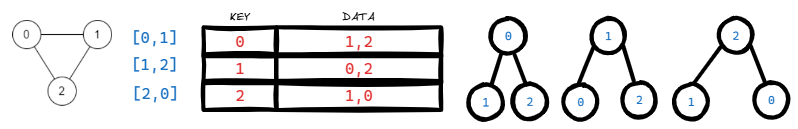
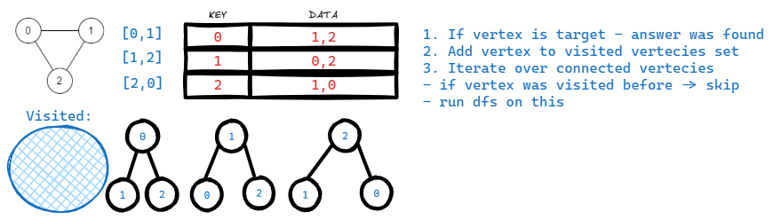
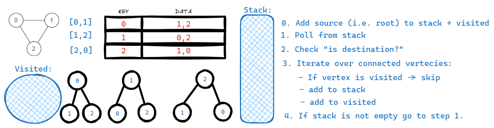

# <a id="home"></a> Graphs

Данный раздел посвящён задачам на графы.\
Их можно найти в **[NeetCode Roadmap](https://neetcode.io/roadmap)** или **[Leetcode Patterns](https://seanprashad.com/leetcode-patterns/)**.

**Table of Contents:**
- [[1971] Find if Path Exists in Graph](#findPath) 
    - [Adjacency list](#adjacency)
    - [Depth First Search](#dfs)
    - [Breadth First Search](#bfs)
    - [Union Find](#union)
- [Number of Connected Components in an Undirected Graph](#connected)
- [Graph Valid Tree](#validTree)

----


## [↑](#home) <a id="findPath"></a> 1971. Find if Path Exists in Graph
Разберём задачу **"[1971. Find if Path Exists in Graph](https://leetcode.com/problems/find-if-path-exists-in-graph)"**:
> Дано количество вершин N и массив рёбер. Нужно узнать, есть ли маршрут между source элементом и target элементом.

Данная задача позволяет рассмотреть разные подходы работы с графами.

### [↑](#home) <a id="adjacency"></a> Adjacency list
На основе массива рёбер графа, соединяющих вершины графа, можно составить **Adjacency list**.\
Для этих целей удобно использовать **Map**, т.к. связь **один-ко-многим**, т.е. с одной вершиной соединены многие другие вершины.

Предположим, нам дан массив рёбер: ``[[0,1],[1,2],[2,0]]``.\
Можно при помощи **Adjacency list** взглянуть на каждую вершину как на дерево:



Как видно, в Map в качестве ключа лежит вершина, а в качестве значений - вершины, доступные через грани.\
**Adjacency list** позволяет тогда на графах применить подходы, работающие на деревьях: DFS и BFS.

Для реализации **Adjacency list** нужно создать саму Map (удобнее всего использовать HashMap) и положить в качестве ключей вершины.\
Затем, проходя по каждому ребру ``[u, v]`` добавлять в каждый ключ (т.е. в ключи u, v) соответствующие вершины в качестве соединений:
```java
private Map<Integer, List<Integer>> getAdjacencyList(int[][] edges, int n) {
    Map<Integer, List<Integer>> graph = new HashMap<>();
    // Init Keys: Each key is Vertex
    for (int i = 0; i < n; i++) {
        graph.put(i, new ArrayList<>());
    }
    // Each edge presented as [left, right]. Graph is bi-directional, add linkage for both sides: 
    for (int[] edge : edges) {
        int u = edge[0];
        int v = edge[1];
        graph.get(u).add(v);
        graph.get(v).add(u);
    }
    return graph;
}
```


### [↑](#home) <a id="dfs"></a> Depth First Search
Начнём с **Depth First Search** (он же **DFS** или **"Поиск в глубину**).\
Данный подход предполагает спускаться максимально "глубоко" по связям вершин.\
Это позволяет проследить, можно ли пройти от одной вершины до другой или как далеко можно пройти от определённой вершины.

Подход в **DFS** опирается на **Adjacency list**.\
Кроме того нам понадобится помнить вершины, которые мы посетили, чтобы избежать зацикливания:
```java
public boolean validPath(int n, int[][] edges, int source, int destination) {
    Map<Integer, List<Integer>> graph = getAdjacencyList(edges, n);
    Set<Integer> visited = new HashSet<>();
    return dfs(graph, source, destination, visited);        
}
```

Сама логика dfs следующая:\
Берём вершину и проверяем, не является ли она искомой вершиной. Если да - мы нашли ответ.\
Если вершина не является искомой - берём все связанные вершины и выполняем для них dfs, есть раньше мы для этой вершины этого не делали.



Код будет выглядеть следующим образом:
```java
private boolean dfs(Map<Integer, List<Integer>> graph, int source, int destination, Set<Integer> visited) {
    // Base case: Destination is reached
    if (source == destination) {
        return true;
    }

    // Mark current position (source position) as visited BEFORE neighbors visiting!
    visited.add(source);
    
    // Visit path for all neighbors
    for (int neighbor : graph.get(source)) {
        // Skip vertex if it was already visited
        if (visited.contains(neighbor)) continue;
        // Go deep per each neighbor
        if (dfs(graph, neighbor, destination, visited)) {
            return true;
        }
    }
    return false;
}
```


### [↑](#home) <a id="bfs"></a> Breadth First Search
Теперь рассмотрим **Breadth First Search** (он же **BFS** или **"Поиск в ширину"**).

Разбор **BFS** можно посмотреть у Alpha-Code в разборе задачи **"[Find if Path Exists in Graph](https://www.youtube.com/watch?v=Y4GZPLs1LKU)"**.

**BFS** основан на использовании стэка. В Java для этого рекомендуется **[ArrayDeque](https://docs.oracle.com/javase/8/docs/api/java/util/ArrayDeque.html)**.\
Идея состоит в том, что мы начинаем с некоторой вершины, которая является для нас своего рода корневым элементом.\
Мы добавляем стартовую вершину в посещённые элементы.\
Далее мы получаем все связанные вершины и если они не посещены ранее - добавляем их в стэк.\
Выполняем алгоритм до тех пор, пока в стэке есть элементы и пока не найдём нужный элемент.



Решение будет выглядеть следующим образом:
```java
private boolean bfs(Map<Integer, List<Integer>> graph, int source, int destination, Set<Integer> visited) {
    // Create stack
    Deque<Integer> stack = new ArrayDeque<Integer>();
    // BFS always handle children. It means that parent should be handled before the children loop
    stack.add(source);
    visited.add(source);
    // Iterate while stack has something inside
    while (!stack.isEmpty()) {
        // Poll element from stack and check if it's the answer
        int node = stack.pollFirst();
        if (node == destination) return true;
        // If not - iterate over all connected vertecies
        for (int child : graph.get(node)) {
            if (visited.contains(child)) continue; // Skip already visited vertecies
            // Add to visited (because vertex is visited right now)
            visited.add(child);
            // Add to stack to analyze vertex connections
            stack.add(child);
        }
    }
    return false;
}
```
Решение через BFS будет немного более эффективным, согласно LeetCode.


### [↑](#home) <a id="union"></a> Union Find
Рассмотрим алгоритм **Union Find**.\
Разбор алгоритма можно посмотреть в видео **"[Union Find](https://www.youtube.com/watch?v=8f1XPm4WOUc)"**.

Данный алгоритм требует в некоторый структуре данных (например, в массиве) хранить информацию о том, для какой вершины какая вершина является родителем:
```java
private int[] prepareParentsInfo(int n) {
    int[] parents = new int[n];
    for (int i = 0; i < n; i++) {
        parents[i] = i; // Each vertex is a parent to itself 
    }
    return parents;
}
```
Стартовое положение - каждая вершина "знает" только про саму себя. Таким образом в массиве ``parents`` каждый индекс соответствует вершине и каждая вершина является родителем сама для себя.

Алгоритм состоит из двух частей: объединение вершин в группу (**union**) и поиск родителя (**find**).

Метод поиска **find** нужен для того, чтобы по связям от дочерних вершин продвигаться к родительским. Это позволяет дойти до "корня", т.е. когда у вершины родителем является она сама. В таком случае такая вершина считается **"представителем"** группы. Т.е. вершины с одинаковым представителем являются вершинами из одной группы. Одна группа - это означает, что из одной вершины можно попасть в другую вершину.

Самая простая реализация:
```java
private int find(int[] parents, int x) {
    int vertex = parents[x];
    // Vertex is not a parent to itself - check vertex parent
    if (vertex != x) {
        return find(parents, vertex);
    }
    return vertex;
}
```
Как видно, на вход дают вершину ``x``, для которой надо найти вершину - представителя.\
Получаем информацию о том, кто является родителем вершины. Если родитель кто-то другой - эта вершина не представитель группы.\
Если родитель какая-то другая вершина - выполняем туже проверку для неё. То есть перевызываем метод поиска для родительской вершины.

Однако, данную реализацию можно немного улучшить. Например, LeetCode такую реализацию не примет, т.к. для больших графов работать это будет медленно.\
Т.к. поиск внутри одной и той же группы может выполнятся по одним и тем же вершинам, то пути можно "сжать" (**"path compression"**).

**"Path Compression"** работает следующим образом:\
Если для проверяемой вершины родителем является кто-то ещё - мы при поиске обновляем информацию о том, кто же является родителем.\
Это позволяет в качестве родителя каждый раз иметь именно "представителя" группы, т.е. корневой элемент:
```java
private int find(int[] parents, int x) {
    if (parents[x] != x) {
        parents[x] = find(parents, parents[x]); // Recurse to find the root of the set and apply path compression
    }
    return parents[x]; 
}
```

Теперь в основном методе мы можем выполнять другую часть алгоритма: **union**.\
Каждое ребро представляет собой связь двух вершин.\
Мы можем объединять группы этих вершин. Например, в качестве родителя первой вершины указываем родителя второй вершины.

Тогда решение будет выглядеть следующим образом:
```java
public boolean validPath(int n, int[][] edges, int source, int destination) {
    int[] parents = prepareParentsInfo(n);

    // Union operation: merge the sets containing the two nodes of each edge
    for (int[] edge : edges) {
        parent[find(parents, edge[0])] = find(parents, edge[1]);
    }

    // If the source and destination nodes have the same parent/root, they are connected; otherwise, they are not
    return find(parents, source) == find(parents, destination);        
}
```

Данный подход можно немного оптимизировать, сбалансировав объединение.\
При объединении можно запоминать, сколько раз вершина была использована в качетсве представителя для группы (т.е. сколько раз в группу добавили вершины).\
При объединении будет в большую группу включать меньшую.

Кроме того, существует ещё одна оптимизация. Чтобы структура была более сбалансированной, можно учитывать то, какая из объединяемых частей больше и присоединять меньшую к корню большей. Это позволит держать "высоту" дерева минимальной, что ускорит поиск:
```java
public boolean validPath(int n, int[][] edges, int source, int destination) {
    int[] parent = new int[n];
    int[] rank = new int[n];
    for (int i = 0; i < n; i++) {
        parent[i] = i; // Each vertex is a parent to itself 
    }
    // Union operation: merge the sets containing the two nodes of each edge
    for (int[] edge : edges) {
        int firstRoot = find(parent, edge[0]);
        int secondRoot = find(parent, edge[1]);
            
        if (firstRoot != secondRoot) {
            if (rank[firstRoot] > rank[secondRoot]) {
                parent[secondRoot] = firstRoot; // Attach smaller tree (second) to larger tree (first)
                rank[firstRoot]++;
            } else if (rank[firstRoot] < rank[secondRoot]) {
                parent[firstRoot] = secondRoot; // Attach smaller tree (first) to larger tree (second)
                rank[secondRoot]++;
            } else {
                parent[secondRoot] = firstRoot; // If equal rank, attach second to first
                rank[firstRoot]++;
            }
        }
    }
    // If the source and destination nodes have the same parent/root, they are connected; otherwise, they are not
    return find(parent, source) == find(parent, destination);        
}
```
Но стоит учитывать, что rank оптимизация создаёт целый массив, который потребует доп память в соответствии с тем, сколько дано объектов!


----

## [↑](#home) <a id="connected"></a> Number of Connected Components in an Undirected Graph
Разберём задачу **"[Number of Connected Components in an Undirected Graph](https://neetcode.io/problems/count-connected-components)"**:
> Дано количество вершин N и массив рёбер. Нужно узнать, сколько есть групп соединённых вершин. Т.е. группы не должны пересекаться.

Данная задача использует подход **[Union Find](#union)**, который мы рассмотрели ранее.

Разбор данной задачи от NeetCode: **"[Number of Connected Components in an Undirected Graph - Union Find](https://www.youtube.com/watch?v=8f1XPm4WOUc)"**.

Нам так же понадобится метод поиска:
```java
private int find(int[] parents, int v) {
    int vertex = v;                                 // Take vertex
    while (vertex != parents[vertex]) {             // While vertex has another parent
        // Apply Path compression: skip one level
        parents[vertex] = parents[parents[vertex]]; // Parent of this vertex now parent of this parent vertex (to skip one level)
        vertex = parents[vertex];                   // Continue search: current vertex is parent of the vertex.
    }
    return vertex; // After the loop vertex will be group representative
}
```

Вспомним, что до выполнения **union** у нас каждая вершина - это группа. То есть до выполнения алгоритма количество групп равно N.\
Тогда, при каждом объединении у нас уменьшается кол-во групп:
```java
public int countComponents(int n, int[][] edges) {
    int[] groups = new int[n];
    // Each vertex is a parent to itself
    for (int i = 0; i < n; i++) groups[i] = i;

    int result = n; // Before union each vertex is a separate group
    // Union operation: merge the sets containing the two nodes of each edge
    for (int[] edge : edges) {
        int group1 = find(groups, edge[0]);
        int group2 = find(groups, edge[1]);
        if (group1 != group2) {
            result--;
            groups[group1] = group2;
        }
    }
    return result;
}
```

----

## [↑](#home) <a id="validTree"></a> Graph Valid Tree
Разберём задачу **"[Graph Valid Tree](https://neetcode.io/problems/valid-tree)"**:
> Дано количество вершин N и массив рёбер. Нужно узнать, является ли граф корректным деревом (не должно быть циклов и "оторванных" вершин).

Разбор задачи от NeetCode: **"[Graph Valid Tree - Leetcode 261](https://www.youtube.com/watch?v=bXsUuownnoQ)"**.

Данную задачу поможет решить [Depth First Search](#dfs) подход:
```java
private boolean dfs(Map<Integer, List<Integer>> graph, int vertex, int prev, Set<Integer> visited) {
    // Base case: Already visited == cycle == not a tree
    if (visited.contains(vertex)) return false;
        
    // Mark current vertex as visited BEFORE neighbors visiting!
    visited.add(vertex);
    
    // Visit path for all neighbors
    for (int neighbor : graph.get(vertex)) {
        // Skip previous position in grapth
        if (neighbor == prev) continue;
        // Go deep per each neighbor
        if (!dfs(graph, neighbor, vertex, visited)) {
            return false;
        }
    }
    return true;
}
```

Тогда метод проверки:
```java
public boolean validTree(int n, int[][] edges) {
    Map<Integer, List<Integer>> adjList = new HashMap<>();
    for (int i = 0; i < n; i++) adjList.put(i, new ArrayList<Integer>());
    for (int[] edge : edges) {
        if (edge[0] == edge[1]) return false;
        adjList.get(edge[0]).add(edge[1]);
        adjList.get(edge[1]).add(edge[0]);
    }
    Set<Integer> visited = new HashSet<>();
    boolean canDfs = dfs(adjList, 0, 0, visited);
    return canDfs && (visited.size() == n); 
}
```

----

