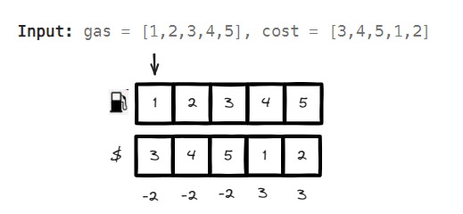

# <a id="home"></a> Greedy

Данный раздел посвящён задачам на "жадные алгоритмы" из **[Leetcode Patterns](https://seanprashad.com/leetcode-patterns/)**.\
**Жадные алгоритмы** - это алгоритмы, которые на каждом своём шаге/этапе пытаются сделать оптимальный выбор предполагая, что в таком случае в конце будет найдено оптимальное решение для всей задачи.

**Table of Contents:**
- [Maximum Subarray (Kadanes algorithm)](#maximumSubarray)
- [Jump Game](#jumpGame)
- [Jump Game II](#jumpGame2)
- [Gas station](#gas)
- [Hand of Straights](#hand)
- [Merge Triplets to Form Target Triplet](#triplets)
- [Partition Labels](#partition)
- [Valid parenthesis string](#parenthesis)

----

## [↑](#home) <a id="maximumSubarray"></a> Maximum Subarray (Kadanes algorithm)
Разберём задачу **"[Maximum Subarray](https://leetcode.com/problems/maximum-subarray/)"**:
> Дан массив. Нужно найти подмассив, который даёт максимальную сумму.

Разбор задачи от NeetCode: [Maximum Subarray](https://www.youtube.com/watch?v=5WZl3MMT0Eg)


Как видно, на каждой итерации мы обновляем текущее понимание максимума. Ожидаем, что на последней итерации получим тот самый максимум, который и будет ответом.

Каждую итерацию мы накапливаем сумму. Если накопленная сумма меньше текущего числа - значит предыдущие значения только мешают и мы про них забываем.

Код решения:
```java
public int maxSubArray(int[] nums) {
    int max = nums[0];   // Our maximum (final result)
    int cur = 0;        // Current sum
    for (int num : nums) {
        cur = cur + num;// Calculate current summ (add current number to it)
        if (num >= cur) {
            // New num more profitable. Can skip previous elements
            cur = num;
        }
        // Calculate maximum profit AT EACH stage
        max = Math.max(max, cur);
    }
    return max;
}
```

----

## [↑](#home) <a id="jumpGame"></a> Jump Game
Разберём задачу **"[Jump Game](https://leetcode.com/problems/jump-game/description/)"**:
> Дан массив, где каждый элемент указывает на сколько элементов с данного элемента можно перемещаться. Нужно ответить, можно ли с первого элемента добраться до последнего.

Разбор задачи от NeetCode: [Jump Game - Greedy](https://www.youtube.com/watch?v=Yan0cv2cLy8)


Код решения:
```java
public boolean canJump(int[] nums) {
    // Init at the last position
    int position = nums.length - 1;
    for (int i = position; i >=0; i--) {
        // Check if we can do nums[i] steps from index i to get position
        if (i + nums[i] >= position) {
            position = i; // If so, we should check that we can get the i index
        }
    }
    return position == 0;
}
```

----

## [↑](#home) <a id="jumpGame2"></a> Jump Game II
Разберём задачу **"[Jump Game 2](https://leetcode.com/problems/jump-game-ii/)"**:
> Дан массив, где каждый элемент указывает на то, на сколько элементов можно перейти с данного элемента. Нужно ответить, какое минимальное количество переходов можно сделать, чтобы попасть на последний элемент.

Разбор от NeetCode: [Jump Game II - Greedy](https://www.youtube.com/watch?v=dJ7sWiOoK7g)


```java
public int jump(int[] nums) {
    int l = 0, r = 0;
    int result = 0;
    
    while (r < nums.length - 1) {
        int maxRightPos = 0;
        for (int i = l; i <= r; i++) {
            maxRightPos = Math.max(maxRightPos, i + nums[i]);
        }
        l = r + 1;
        r = maxRightPos;
        result++;
    }
    return result;
}
```

----

## [↑](#home) <a id="gas"></a> Gas station
Разберём задачу **"[Gas station](https://leetcode.com/problems/gas-station/)"**:
> Дано два массива. Элемент из одного массива показывает, на сколько можно заправиться на данном этапе. А второй - сколько нужно потратить топлива, чтобы перейти на следующий. Дано, что массивы зациклены. Нужно ответить, с какой позиции можно начать, чтобы пройти полный круг (т.е. чтобы хватило бензина).

Разбор от NeetCode: [Gas Station - Greedy](https://www.youtube.com/watch?v=lJwbPZGo05A)

Решение строится на нескольких идеях:
- Если пройти по всем элементам, то сумма всех gas[i]-cost[i] должна быть положительной\
Это гарантирует, что мы точно можем пройти целый круг с какой-то позиции
- Считаем текущий бак. Если бак пуст - значит, нужно пробовать со следующей позиции\
Мы точно знаем, что позиция точно есть. Поэтому где мы не выйдем в минус, там и ответ



```java
public int canCompleteCircuit(int[] gas, int[] cost) {
    int cur = 0, total = 0;
    int start = 0;
    for (int i = 0; i < gas.length; i++) {
        total = total + (gas[i] - cost[i]);
        cur = cur + gas[i] - cost[i];
        if (cur < 0) {
            start = i + 1;
            cur = 0;
        }
    }
    return total >=0 ? start : -1;
}
```

----

## [↑](#home) <a id="hand"></a> Hand of Straights
Разберём задачу **"[Hand of Straights](https://leetcode.com/problems/hand-of-straights/description/)"**:
> Дан массив с номиналом карт и размер группы. Нужно узнать, можно ли массив разбить на группы с учётом размера группы. Карты в группе должны идти по порядку номинала.

Разбор от Nick White: [Hand of Straights](https://www.youtube.com/watch?v=K7n_BQihPCM)

```java
public boolean isNStraightHand(int[] hand, int groupSize) {
    // At first, card array should be divisible by groupSize
    if (hand.length % groupSize != 0) return false;
    // Sorted Map to remember card and cards count
    TreeMap<Integer, Integer> map = new TreeMap<>();
    for (int card : hand) {
        map.put(card, map.getOrDefault(card, 0) + 1);
    }
    // While we have something to check (i.e. map is not empty)
    while (!map.isEmpty()) {
        // Go from min to max (from left to right). Starting position
        int minCard = map.firstKey();
        for (int i = minCard; i < minCard + groupSize; i++) {
            // If we can't find card in map == invalid group, with gap
            if (!map.containsKey(i)) return false;
            // Take out ONE card from the map
            int cardCount = map.get(i);
            map.put(i, cardCount - 1);
            // Remove from map to make "firstKey" work
            if (cardCount - 1 == 0) map.remove(i);
        }
        // Group was finished. Go to the next iteration == new group. We don't need to store them
    }
    return true;
}
```

----

## [↑](#home) <a id="triplets"></a> Merge Triplets to Form Target Triplet
Разберём задачу **"[Merge Triplets to Form Target Triplet](https://leetcode.com/problems/merge-triplets-to-form-target-triplet/description/)"**:
> Даны триплеты (тройки чисел). И дан целевой триплет. Нужно узнать, можно ли получить целевой триплет, если можно взять любые два триплета и выполнить их слияние. Слияние происходит таким образом, что для каждого элемента выбирается максимум среди триплетов, для которых выполняется слияние.

Разбор от NeetCode: [Merge Triplets to Form Target Triplet](https://www.youtube.com/watch?v=kShkQLQZ9K4)

Код решения:
```java
public boolean mergeTriplets(int[][] triplets, int[] target) {
    int[] result = new int[3];

    for(int i = 0; i < triplets.length; i++){
        // If triplet's element is too big - skip it. We cant' merge with such triplets
        if(triplets[i][0] > target[0] || triplets[i][1] > target[1] || triplets[i][2] > target[2]) continue;
        // Check triplet elements
        for(int j = 0; j < 3; j++){
            if (triplets[i][j] == target[j]) result[j] = 1;
        }
    }
    return (result[0] + result[1] + result[2]) == 3;
}
```

----

## [↑](#home) <a id="partition"></a> Partition Labels
Разберём задачу **"[Partition Labels](https://leetcode.com/problems/partition-labels/description/)"**:
> Дана строка. Её нужно разбить на символы так, чтобы получить как можно больше частей, но при этом чтобы каждый символ содержался только лишь в одной части.

Разбор от NeetCode: [Partition Labels](https://www.youtube.com/watch?v=B7m8UmZE-vw)


Решение:
```java
public List<Integer> partitionLabels(String s) {
    Map<Character, Integer> map = new HashMap<>();
    for (int i = 0; i < s.length(); i++) {
        map.put(s.charAt(i), i);
    }
    List<Integer> result = new ArrayList<>();
    int size = 0;
    int partEnd = 0;
    for (int i = 0; i < s.length(); i++) {
        size++;
        partEnd = Math.max(partEnd, map.get(s.charAt(i)));
        if (i == partEnd) {
            result.add(size);
            size=0;
        }
    }
    return result;
}
```

----

## [↑](#home) <a id="parenthesis"></a> Valid parenthesis string
Разберём задачу **"[Valid parenthesis string](https://leetcode.com/problems/valid-parenthesis-string/description/)"**:
> Дана строка. Каждый символ это открывающая скобка, закрывающая ИЛИ *. Символ * может быть заменить или открывающую скобку или закрывающую. Нужно решить, корректная ли дана строка. Корректная означает, что закрывающим скобкам есть парные открывающие и перед закрывающей должна быть открывающая.

Разбор задачи от NeetCode: [Valid Parenthesis String](https://www.youtube.com/watch?v=QhPdNS143Qg)


Код решения:
```java
public boolean checkValidString(String s) {
    int leftMin = 0, leftMax = 0;
    for (char chr : s.toCharArray()) {
        if (chr == '(') {
            leftMin++;
            leftMax++;
        } else if (chr == ')') {
            leftMin--;
            leftMax--;
        } else {
            leftMin--;
            leftMax++;
        }
        if (leftMax < 0) return false;
        if (leftMin < 0) leftMin = 0;
    }
    return leftMin == 0; 
}
```
