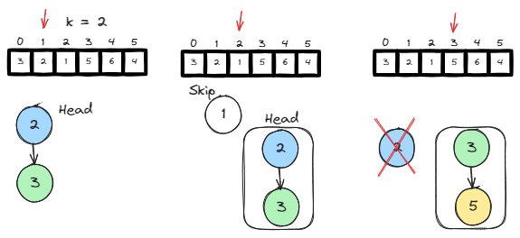

# <a id="home"></a> Heap / Priority Queue

Данный раздел посвящён задачам на Heap / Priority Queue из **[Leetcode Patterns](https://seanprashad.com/leetcode-patterns/)**.

**Table of Contents:**
- [Kth Largest Element in an Array](#kLargestInArray)
- [Kth Largest Element in a Stream](#kLargest)
- [Last Stone Weight](#lastStone)
- [K Closest Points to Origin](#points)
- [Task Scheduler](#scheduler)
- [Design twitter](#twitter)
- [Find Median from Data Stream](#median)

----

## [↑](#home) <a id="kLargestInArray"></a> Kth Largest Element in an Array
Разберём задачу **"[Kth Largest Element in an Array](https://leetcode.com/problems/kth-largest-element-in-an-array)"**.



Код решения:
```java
public int findKthLargest(int[] nums, int k) {
    PriorityQueue<Integer> minHeap = new PriorityQueue<>();
    for (int val : nums) {
        if (minHeap.size() < k) {
            // Min Heap still have space to add values
            minHeap.offer(val);
        } else if (val > minHeap.peek()) {
            // Val is bigger than current min == we should add it
            // BUT we out of K size. Trim heap to K size
            // Remove the top element (i.e. remove the smallest element)
            minHeap.poll();
            // Now we have available space. Add the new element 
            minHeap.add(val);
        }
    }
    // Return head (i.e. the smallest element)
    return minHeap.peek();
}
```

----

## [↑](#home) <a id="kLargest"></a> Kth Largest Element in a Stream
Разберём задачу **"[Kth Largest Element in a Stream](https://leetcode.com/problems/kth-largest-element-in-a-stream/)"**.

Разбор задачи от NeetCode: [Kth Largest Element in a Stream](https://www.youtube.com/watch?v=hOjcdrqMoQ8)

Код решения:
```java
class KthLargest {
    final PriorityQueue<Integer> minHeap = new PriorityQueue<>();
    final int k;

    public KthLargest(int k, int[] nums) {
        this.k = k;
        for (int n : nums) add(n);
    }

    public int add(int val) {
        if (minHeap.size() < k) {
            minHeap.offer(val);    // We still can add arrays
        } else if (val > minHeap.peek()) {
            minHeap.poll();        //remove the top element (i.e. remove the smallest element)
            minHeap.add(val);      //add the new element
        }
        return minHeap.peek();
    }
}
```

----

## [↑](#home) <a id="lastStone"></a> Last Stone Weight
Разберём задачу **"[Last Stone Weight](https://leetcode.com/problems/last-stone-weight/)"**.

Разбор задачи от NeetCode: [Last Stone Weight - Priority Queue](https://www.youtube.com/watch?v=B-QCq79-Vfw)

Код решения:
```java
public int lastStoneWeight(int[] stones) {
    PriorityQueue<Integer> maxHeap = new PriorityQueue<>(Collections.reverseOrder());
    for (int stone : stones) maxHeap.offer(stone);

    while (maxHeap.size() > 1) {
        // first >= second because we use Max Heap
        int first = maxHeap.poll();
        int second = maxHeap.poll();
        if (first > second) {
            int diff = first - second;
            maxHeap.offer(diff); // Put difference as new element
        }
    }
    // The last remaining stone OR zero if there are no stones left
    return maxHeap.peek() != null ? maxHeap.peek() : 0;
}
```

----

## [↑](#home) <a id="points"></a> K Closest Points to Origin
Разберём задачу **"[K Closest Points to Origin](https://leetcode.com/problems/k-closest-points-to-origin/)"**:
> Дан массив из координат точек [x,y]. Дано это при помощи массива, где первая точка задана points[0][0] + " : " + points[0][1]. Нужно найти K-тую ближайшую к началу координат точку.

Разбор задачи от NeetCode: [K Closest Points to Origin - Heap / Priority Queue](https://www.youtube.com/watch?v=rI2EBUEMfTk)

Нам пригодится подход из задачи [Kth Largest Element in an Array](#kLargestInArray):
```java
public int[][] kClosest(int[][] points, int k) {
        // First dimension: point number. Second dimension: X or Y value
        // It means that int[N] stores points as int[2]
        // Array is an object. It means we can store it in heap
        // Use custom comparator, which analyze two arrays: a and b
        PriorityQueue<int[]> maxHeap = new PriorityQueue<>((a, b) ->
            Integer.compare(
                (b[0] * b[0] + b[1] * b[1]),
                (a[0] * a[0] + a[1] * a[1])
            )
        );
        // Iterate over all points
        for (int[] point : points) {
            maxHeap.add(point);
            //remove when size increase k
            if (maxHeap.size() > k) {
                maxHeap.remove();
            }
        }
        
        int[][] ans = new int[k][2];
        for (int i = 0; i < k; i++) {
            int[] cur = maxHeap.poll();
            ans[i][0] = cur[0];
            ans[i][1] = cur[1];
        }
        return ans;
}
```

----

## [↑](#home) <a id="scheduler"></a> Task Scheduler
Разберём задачу **"[Task Scheduler](https://leetcode.com/problems/task-scheduler/)"**:
> Дан массив из символов. Каждый символ представляет из себя задачу. А так же дано число N, которое определяет кол-во итераций, которое должно пройти между выполнением одной и той же задачи. Допустим, при N=2 это выглядит примерно так: A -> B -> idle -> A 

Разбор задачи от NeetCode: [Task Scheduler](https://www.youtube.com/watch?v=s8p8ukTyA2I)

Для начала нам нужно сгруппировать все задачи, чтобы понять, сколько их:
```java
Map<Character, Integer> taskMap = new HashMap<>();
for(Character task: tasks) {
    taskMap.put(task, taskMap.getOrDefault(task,0) + 1);    
}
```

Далее нам понадобится **Max Heap**, ведь мы хотим выполнять сначала самые часто встречаемые задачи:
```java
PriorityQueue<Integer> maxHeap = new PriorityQueue<>(Collections.reverseOrder());
maxHeap.addAll(taskMap.values());
```

Непосредственно рассчёт времени:
```java
int time = 0;
while(!maxHeap.isEmpty()) {
    // Performed tasks that should sceduled again
    List<Integer> add_back = new ArrayList<>();
        
    // loop for grabbing n tasks from  pq or for idle itme only
    // For N we can make N+1 iterations. For example: A -> B -> C -> A  
    for(int i= 0; i <= n; i++) {
        // Grab n tasks from pq 
        if(maxHeap.size() > 0) {
            int count = maxHeap.poll(); // retreives max and removes an element from pq.
            count--;
            if(count > 0) { // needs add_back
                add_back.add(count);
            }  
        }
        time++; // accounts for idle time and real task too.
        // If we have nothing to do we should exit the loop
        if(maxHeap.size() == 0 && add_back.size() == 0) {
            break;
        }  
    }   
    // Add tasks back if they still have something to do
    maxHeap.addAll(add_back);
}
return time;
```

----

## [↑](#home) <a id="twitter"></a> Design twitter
Разберём занятную задачу **"[Design twitter](https://leetcode.com/problems/design-twitter/)"**:

Разбор задачи от NeetCode: [Design Twitter](https://www.youtube.com/watch?v=pNichitDD2E)

Для начала, заведём Map чтобы соотносить follower'ов и followee:
```java
class Twitter {
    HashMap<Integer, HashSet<Integer>> followerMap = new HashMap<>();

    public void follow(int followerId, int followeeId) {
        HashSet<Integer> followers = followerMap.get(followerId);
        if (followers == null) {
            followers = new HashSet<>();
            followerMap.put(followerId, followers);
        }
        followers.add(followeeId);
    }
  
    public void unfollow(int followerId, int followeeId) {
        HashSet<Integer> followers = followerMap.get(followerId);
        if (followers != null) {
            followers.remove(followeeId);
        } 
    }
```

Далее добавим аналогичную мапу для твитов:
```java
HashMap<Integer, List<int[]>> tweetMap = new HashMap<>();
int timestamp;

public void postTweet(int userId, int tweetId) {
    List<int[]> tweets = tweetMap.get(userId);
    if (tweets == null) {
        tweets = new ArrayList<>();
        tweetMap.put(userId, tweets);
    }
    tweets.add(new int[]{timestamp, tweetId});
    timestamp++;
}
```

Теперь остаётся самое сложное - реализовать метод, который будет возвращать самые свежие твиты:
```java
public List<Integer> getNewsFeed(int userId) {
    // Max heap to sort tweets by timestamp
    PriorityQueue<int[]> maxHeap = new PriorityQueue<>((a, b) -> 
        Integer.compare(b[0], a[0])
    );

    // Put initial latest tweets to heap
    HashSet<Integer> followers = followerMap.getOrDefault(userId, new HashSet());
    // Must be posted by users who the user followed OR(!) by the user themself
    followers.add(userId);
        
    followers.forEach((followeeId) -> {
        List<int[]> tweets = tweetMap.get(followeeId);
        if (tweets != null) {
            int lastTweetIndex = tweets.size() - 1;
            int[] tweet = tweets.get(lastTweetIndex);
            // timestamp, tweet ID, follower ID, next index to handle
            maxHeap.offer(new int[]{tweet[0], tweet[1], followeeId, lastTweetIndex - 1});
        }
    });
    
    // Find results
    List<Integer> res = new ArrayList<>();
    while (!maxHeap.isEmpty() && res.size() < 10) {
        int[] data = maxHeap.poll();
        res.add(data[1]); // Add tweet ID
        // If we can get other tweets for this followee, prepare the next tweet to get
        if (data[3] >= 0) {
            List<int[]> tweets = tweetMap.get(data[2]); // Get tweets for this followee
            int[] tweet = tweets.get(data[3]);          // Get tweet
            maxHeap.offer(new int[]{tweet[0], tweet[1], data[2], data[3] - 1});
        }
    }
    return res;    
}
```

----

## [↑](#home) <a id="median"></a> Find Median from Data Stream
Разберём занятную задачу **"[Find Median from Data Stream](https://leetcode.com/problems/find-median-from-data-stream/)"**:
> Нужно написать структуру, которая позволяет эффективно добавлять элементы, а затем искать медиану.

Разбор задачи от NeetCode: [Find Median from Data Stream - Heap & Priority Queue](https://www.youtube.com/watch?v=itmhHWaHupI)

Код решения:
```java
class MedianFinder {
    // Small elements - maxHeap - we need to get the biggest element
    private Queue<Integer> smallHeap = new PriorityQueue<>((a, b) -> b - a);
    // Large elements - minHeap - we need to get the smallest element
    private Queue<Integer> largeHeap = new PriorityQueue<>((a, b) -> a - b);

    public void addNum(int num) {
        // Always add elements at "small" section
        smallHeap.add(num);
        // If small heap is much more bigger than large heap
        if (smallHeap.size() - largeHeap.size() > 1) {
            largeHeap.add(smallHeap.poll());
        // If small heap contains bigger element than large heap
        } else if (!largeHeap.isEmpty() && smallHeap.peek() > largeHeap.peek()) {
            largeHeap.add(smallHeap.poll());
        }
        // Check that difference between small/large heaps size is not too big
        if (largeHeap.size() - smallHeap.size() > 1) {
            smallHeap.add(largeHeap.poll());
        } 
    }
    
    public double findMedian() {
        if (smallHeap.size() == largeHeap.size()) {
            return (double) (largeHeap.peek() + smallHeap.peek()) / 2;
        } else if (smallHeap.size() > largeHeap.size()) {
            return (double) smallHeap.peek();
        } else {
            return (double) largeHeap.peek();
        }
    }
}
```