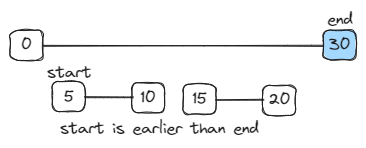
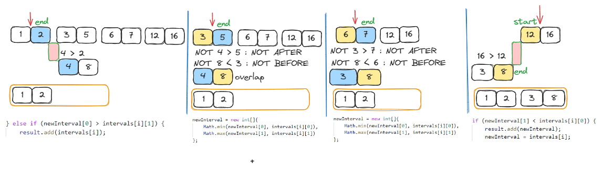
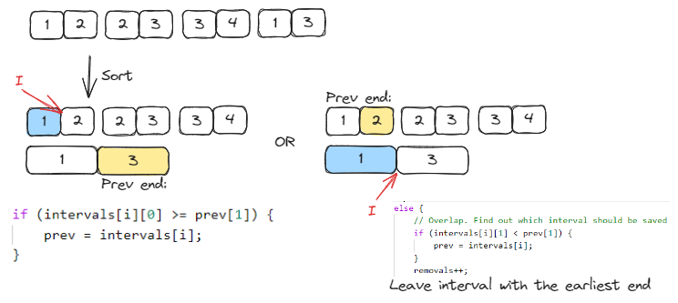
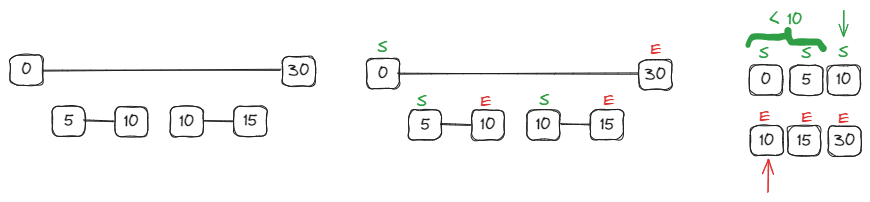
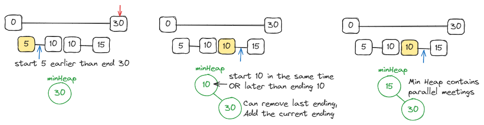
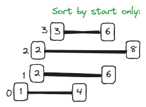
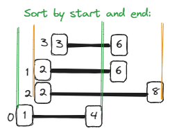
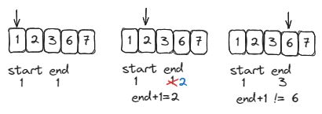

# <a id="home"></a> Intervals

Данный раздел посвящён задачам на работу с интервалами из из **[Leetcode Patterns](https://seanprashad.com/leetcode-patterns/)**.\
Кроме того, воспользуемся **[Roadmap](https://neetcode.io/roadmap)** от NeetCode.

**Table of Contents:**
1. [Meeting Rooms](#rooms)
2. [Merge intervals](#merge)
3. [Insert Interval](#insert)
4. [Non Overlapping Intervals](#noOverlap)
5. [Meeting Rooms II](#rooms2)
6. [Remove Covered Intervals](#covered)
7. [Data Stream as Disjoint Intervals](#stream)
8. [Minimum Interval to Include Each Query](#query)

----

## [↑](#home) <a id="rooms"></a> Meeting Rooms
Начать разбор задач на интервалы стоит с классической задачи **Meeting Rooms**.

Найти эту задачу можно на [lintcode](https://www.lintcode.com/problem/920/) (лучше использовать регистрацию через почту и пароль, а не гугл):
> Даны интервалы, представляющие начало и конец митингов. Нужно посчитать, какое минимальное количество комнат им нужно.

Разбор от NeetCode: [Meeting Rooms](https://www.youtube.com/watch?v=PaJxqZVPhbg)



Решение:
```java
public boolean canAttendMeetings(List<Interval> intervals) {
    // Sort intervals by meeting star time
    intervals.sort(Comparator.comparingInt(interval -> interval.start));

    for (int i = 1; i < intervals.size(); i++) {
        if (intervals.get(i).start < intervals.get(i-1).end) {
            return false;
        }
    }
    return true;
}
```

----

## [↑](#home) <a id="merge"></a> Merge intervals
Рассмотрим задачу **"[Merge intervals](https://leetcode.com/problems/merge-intervals/)"**:
> Дан массив из интервалов [start, end]. Нужно объединить все пересекающиеся интервалы и вернуть список непересекающихся интервалов.

Разбор задачи от NeetCode: [Merge Intervals - Sorting](https://www.youtube.com/watch?v=44H3cEC2fFM)
Разбор задачи от Nick White: [Merge Intervals (Algorithm Explained)](https://www.youtube.com/watch?v=qKczfGUrFY4)


Идея решение заклчается в следующем. Для начала нам нужно отсортировать данные нам интервалы. Это позволит нам определить, где произошли наслоения:
```java
public int[][] merge(int[][] intervals) {
    if (intervals.length <= 1) return intervals;
    // Sort intervals by their start. each int[] element contains arr[0, 1]
    Arrays.sort(intervals, (arr1, arr2) -> Integer.compare(arr1[0], arr2[0]));
```

Дальше, мы можем создать переменную, куда будем складывать непересекающиеся интервалы.\
Мы заранее не знаем, сколько их будет. Поэтому будем использовать не массив, а список:
```java
// We can't know the size in advance. So we can use only list
List<int[]> result = new ArrayList<>();
// Let's put the first interval. Currently, we don't have enough to do something
result.add(intervals[0]);
```

Теперь мы можем итерировать по всем остальным интервалам и сравнивать их с предыдущим.\
Если есть пересечение - обновляем последний интервал. Если нет - добавляем новый интервал в результат.
```java    
// We can start from the seconf interval
for (int i = 1; i < intervals.length; i++) {
    int curIndex = result.size() - 1;
    int lastEnd = result.get(curIndex)[1];

    if (intervals[i][0] <= lastEnd) {
        // Change end of the last range
        result.get(curIndex)[1] = Math.max(intervals[i][1], lastEnd);
    } else {
        result.add(intervals[i]);
    }
}
```

Остаётся вернуть результат. Превращаем список в массив:
```java
return result.toArray(new int[result.size()][]);
```

Сортировку можно выполнить ещё и таким случаем:
```java
// Sort intervals by their start. each int[] element contains arr[0, 1]
Arrays.sort(intervals, Comparator.comparingInt(arr -> arr[0]));
```

----

## [↑](#home) <a id="insert"></a> Insert Interval
Рассмотрим задачу **"[Insert Interval](https://leetcode.com/problems/insert-interval/)"**:
> Дан массив из отсортированных непересекающихся интервалов [start, end]. Нужно вставить новый интервал не нарушая сортировку и при пересечении нужно объединить интервалы (выполнить merge).

Разбор задачи от NeetCode: [Insert Interval](https://www.youtube.com/watch?v=A8NUOmlwOlM)



Итак, как обычно, заранее мы не знаем о том, сколько у нас получится интервалов, поэтому воспользуемся списком:
```java
public int[][] insert(int[][] intervals, int[] newInterval) {
    List<int[]> result = new ArrayList<>();
```

Нам необходимо пройтись по всем данным интервалам и каждый сверять с новым интервалом, который мы хотим вставить:
```java
for (int i = 0; i < intervals.length; i++) {
    // Logic is here
}
```

Первый случай: конец нового интервала МЕНЬШЕ/РАНЬШЕ начала рассматриваемого == новый интервал раньше:
```java
// Case 1: new interval end BEFORE interval[i] start == interval goes first, no overlap
if (newInterval[1] < intervals[i][0]) {
    result.add(newInterval);
    newInterval = intervals[i];
}
```
Мы знаем, что интервалы отсортированы. Значит, мы можем новый интервал передвинуть на рассматриваемый, ведь он пойдёт дальше. И так мы будем сдвигать каждый раз новый интервал на один вперёд.

Второй случай: начало нового интервала БОЛЬШЕ/ПОЗЖЕ конца рассматриваемого == новый интервал будет позже
```java
} else if (newInterval[0] > intervals[i][1]) {
    result.add(intervals[i]);
}
```

Если же новый интервал идёт не раньше рассматриваемого И не позже - значит у нас наслоение (overlap):
```java
} else {
    // Case 3: overlap. Get min start + max end. This is merge
    newInterval = new int[]{
        Math.min(newInterval[0], intervals[i][0]),
        Math.max(newInterval[1], intervals[i][1])
    };
}
```
Таким образом, если у нас наслоение - мы просто объединяем в новом интервале новый интервал и рассматриваемый.

Заканчиваем алгоритм тем, что добавляем в результат новый интервал, который был рассчитан на момент завершения алгоритма:
```java
result.add(newInterval);
return result.toArray(new int[result.size()][]);
```

----

## [↑](#home) <a id="noOverlap"></a> Non Overlapping Intervals
Рассмотрим задачу **"[Non Overlapping Intervals](https://leetcode.com/problems/non-overlapping-intervals/)"**:
> Даны интервалы. Нужно посчитать, сколько интервалов нужно удалить, чтобы пересечений не было.

Разбор задачи от NeetCode: [Non Overlapping Intervals](https://www.youtube.com/watch?v=nONCGxWoUfM)



Идеа алгоритма в том, что мы всегда помним про предыдущий интервал. Изначально им выбираем самый первый интервал.\
Дальше, на каждом новом интервале сравниваем start интервала И end предыдущего. Если мы начинаемся позже - для новых шагов запоминаем текущий интервал как предыдущий.
В противном случае у нас пересечение. Чтобы минимизировать кол-во удалений для следующих итераций оставляем самый короткий интервал (с наименьшим end). Другой интервал считаем "удалённым". 

Решение:
```java
public int eraseOverlapIntervals(int[][] intervals) {
    Arrays.sort(intervals, Comparator.comparingInt(arr -> arr[0]));
    int removals = 0;
    int[] prev = intervals[0];
    for (int i = 1; i < intervals.length; i++) {
        if (intervals[i][0] >= prev[1]) {
            prev = intervals[i];
        } else {
            // Overlap. Find out which interval should be saved
            if (intervals[i][1] < prev[1]) {
                prev = intervals[i];
            }
            removals++;
        }
    }
    return removals;
}
```

----

## [↑](#home) <a id="rooms2"></a> Meeting Rooms II
Рассмотрим задачу **[Meeting Rooms II](https://www.lintcode.com/problem/919/)**.\
Задачу можно найти также на [interviewbit](https://www.interviewbit.com/problems/meeting-rooms/) или [codingninjas](https://www.codingninjas.com/studio/problems/meeting-room-ii_893289?interviewProblemRedirection=true):
> Даны интервалы времени начала и окончания митингов. Нужно посчитать, сколько нужно минимум комнат для проведения всех митингов.

Разбор от NeetCode: [Meeting Rooms II](https://www.youtube.com/watch?v=FdzJmTCVyJU)

Данная задача интересна подходом к её решению:



Для решения задачи нам нужно перестать смотреть на интервалы, а смотреть только на отдельные точки, различая их по типу: start или end. Тогда:
```java
public int minMeetingRooms(List<Interval> intervals) {
    int[] start = new int[intervals.size()];
    int[] end = new int[intervals.size()];
    for (int i = 0; i < intervals.size(); i++) {
        start[i] = intervals.get(i).start;
        end[i] = intervals.get(i).end;
    }
    Arrays.sort(start);
    Arrays.sort(end);
```

Теперь, нам понадобится два указателя: start index для обхода массива start, и end index для обхода массива end.\
Мы будем выполнять логику до тех пор, пока наш указатель на начало митинга не выйдет за пределы списка интервалов:
```java
// Count rooms
int startInd = 0, endInd = 0;
int rooms = 0, counter = 0;
while (startInd < intervals.size()) {
    if (start[startInd] < end[endInd]) {
        startInd++;
        counter++;
    } else {
        endInd++;
        counter--;
    }
    rooms = Math.max(counter, rooms);
}
return rooms;
```
Используя указатели сравниваем значения старта и окончания митинга. Пока старт митинга раньше окончания - количество митингов в процессе увеличивается.\
Как только старт происходит позже или в тоже время, что и конец - значит, один из ранее начатых митингов закончился. Это позволяет уменьшить кол-во начатых митингов.

Кроме такого решение есть интересное решение через minHeap:



Код решения:
```java
public int minMeetingRooms(List<Interval> intervals) {
    if (intervals == null || intervals.size() == 0) return 0;
    // Sort by start time
    intervals.sort(Comparator.comparingInt(interval -> interval.start));

    PriorityQueue<Integer> minHeap = new PriorityQueue<>();
    minHeap.add(intervals.get(0).end);

    for (int i = 1; i < intervals.size(); i++) {
        Integer lastEnd = minHeap.peek();
        if (intervals.get(i).start >= lastEnd) {
            minHeap.remove();
        }
        minHeap.add(intervals.get(i).end);
    }
        
    return minHeap.size();
}
```

----

## [↑](#home) <a id="covered"></a> Remove Covered Intervals
Рассмотрим задачу **[Remove Covered Intervals](https://leetcode.com/problems/remove-covered-intervals/)**:
> Даны интервалы. Нужно удалить интервалы, которые полностью входят в другой интервал. Ответ: кол-во оставшихся интервалов.

Решение задачи простое, но до решения нужно довести ход своих логический рассуждений.\
Нам нужно знать, покрыт наш интервал другим интервалом или нет. То есть чтобы интервал был покрыт - нужно как минимум отсортировать по старту. Тогда каждый интервал будет знать, что предыдущий интервал начался раньше. То есть как миниму покрывает его с левой стороны:



Однако, мы видим, что если у нас интервалы начинаются в одно время, мы можем их добавлять в произвольном порядке и это ломает логику. Мы хотим предыдущим интервалом иметь интервал, который нас покрывает. Получается, сортировать нужно и по старту + по окончанию, если старт одинаковый:



Таким образом, главное - написать правильно компаратор для сортировки:
```java
public int removeCoveredIntervals(int[][] intervals) {
    Arrays.sort(intervals, (a, b) -> a[0] == b[0] ? b[1] - a[1] : a[0] - b[0]);   
```

Теперь остаётся лишь пройтись по отсортированному списку интервалов и посчитать, сколько из них нужно оставить:
```java
int count = 0;
int prevEnd = 0;
for (int[] interval : intervals) {
    // Current interval is not covered by the previous interval.
    if (prevEnd < interval[1]) {
        ++count;
        prevEnd = interval[1];
    }
}   
return count;
```

----

## [↑](#home) <a id="stream"></a> Data Stream as Disjoint Intervals
Рассмотрим задачу **[Data Stream as Disjoint Intervals](https://leetcode.com/problems/data-stream-as-disjoint-intervals/)**:
> Нужно реализовать структуру, которая позволяет добавлять числа. Если числа находятся рядом, то они начинают образовывать интервал (например, [1,2]). Данная структура в том числе должна позволять получить список всех текущих интервалов.

Разбор задачи от NeetCode: [Data Stream as Disjoint Intervals](https://www.youtube.com/watch?v=FavoZjPIWpo)

На самом деле, данная задача кажется по условию сложной, но имеет простое решение.\
В качестве структуры нам нужно что-нибудь, что будет хранить числа отсортированно. Т.к. добавляя одинаковые числа диапазоны не изменяются мы можем использовать Set, а точнее реализацию TreeSet:
```java
class SummaryRanges {
    Set<Integer> values = new TreeSet();
    
    public void addNum(int value) {
        values.add(value);
    }
```

Теперь остаётся лишь реализовать метод получения диапазонов.\
Логика такова:



Тогда, код решения будет следующим:
```java
public int[][] getIntervals() {
    List<int[]> result = new ArrayList<>();
        
    // Set doesn't have index and can be only iterated
    Iterator<Integer> iter = values.iterator();
    if (!iter.hasNext()) return new int[0][];

    // Add first interval
    int firstValue = iter.next();
    result.add(new int[]{firstValue, firstValue});
        
    for (Integer val : values) {
        int ind = result.size() - 1;
        if (result.get(ind)[1] == val || result.get(ind)[1] + 1 == val) {
            result.get(ind)[1] = val;
        } else {
            result.add(new int[]{val, val});
        }
    }

    return result.toArray(new int[result.size()][]);
}
```

----

## [↑](#home) <a id="query"></a> Minimum Interval to Include Each Query
Рассмотрим задачу **[Minimum Interval to Include Each Query](https://leetcode.com/problems/minimum-interval-to-include-each-query/)**.

Разбор задачи от NeetCode: [Minimum Interval to Include Each Query](https://www.youtube.com/watch?v=5hQ5WWW5awQ)

Начнём, как обычно, с сортировки интервалов по времени начала:
```java
public int[] minInterval(int[][] intervals, int[] queries) {
    // Sort intervals based on their start
    Arrays.sort(intervals, (interval1, interval2) -> interval1[0] - interval2[0]);
```

Дальше, нам нужно с одной стороны - отсортировать запросы, чтобы идти по запрашиваемым значениям слева направо. С другой стороны - нам нужно знать, индекс.\
Можно было бы воспользоваться TreeMap, т.к. нам нужно отсортированные значения. Но можно сделать и при помощи массива:
```java
// Map each query with its original index before sorting
int[][] queriesWithIndices = new int[numQueries][];
for (int i = 0; i < numQueries; ++i) {
    queriesWithIndices[i] = new int[] { queries[i], i };
}
// Sort queries based on their values
Arrays.sort(queriesWithIndices, (query1, query2) -> query1[0] - query2[0]);
```

Подготовим массив для хранения результата:
```java
// Initialize the answer array with -1 (indicating no interval found)
int[] answer = new int[numQueries];
Arrays.fill(answer, -1);
```

Подготовим MinHeap, при помощи которого мы будем отбирать подходящие нам минимальные интервалы:
```java
// MinHeap to store intervals with smallest size (end - start + 1) on top
PriorityQueue<int[]> minHeap = new PriorityQueue<>((interval1, interval2) -> interval1[0] - interval2[0]);
```

Нам также понадобится индекс - указатель на текущий рассматриваемый интервал. Потому что мы итерироваться будем по запросам, а для каждого конкретного интервала не все запросы могут подходить.
```java
int index = 0;
```

Теперь можно выполнять сам алгоритм:
```java
// Iterate over all queries
for (int[] queryWithIndex : queriesWithIndices) {
    int queryValue = queryWithIndex[0];
          
    // Fill minHeap with intervals with start LESS or EQUAL to query value
    while (index < numIntervals && intervals[index][0] <= queryValue) {
        int start = intervals[index][0];
        int end = intervals[index][1];
        int length = end - start + 1;
        minHeap.offer(new int[] { length, end });
        // Switch to the next interval
        ++index;
    }
          
    // Remove intervals from the queue which end before the query value
    while (!minHeap.isEmpty() && minHeap.peek()[1] < queryValue) {
        minHeap.poll();
    }
          
    // If the queue is not empty, there is an interval covering the query value
    if (!minHeap.isEmpty()) {
        int smallestSize = minHeap.peek()[0];
        // The size of the smallest interval covering the query is stored in the answer array
        answer[queryWithIndex[1]] = smallestSize;
    }
}
      
return answer; // Return the array containing the size of smallest interval covering each query
```
