# [←](../README.md) <a id="home"></a> Linked List problems

Данный раздел посвящён задачам на **[Linked List](https://leetcode.com/tag/linked-list/)** из **[Leetcode Patterns](https://seanprashad.com/leetcode-patterns/)**.\
Playlist разборов от NeetCode: **[NeetCode - Linked List playlist](https://www.youtube.com/watch?v=S5bfdUTrKLM&list=PLot-Xpze53leU0Ec0VkBhnf4npMRFiNcB)**.\
Карточка на LinkedList: **[Introduction to Data Structure: Linked List](https://leetcode.com/explore/learn/card/linked-list/)**.

**Table of Contents:**
- [[203] Remove Linked List Elements](#remove)
- [[19] Remove Nth Node From End of List](#removen)
- [[21] Merge Two Sorted Lists](#merge)
- [[876] Middle of the Linked List](#middle)
- [[206] Reverse Linked List](#reverse)
- [[92] Reverse Linked List II](#reverse2)
- [[160] Intersection of Two Linked Lists](#intersection)
- [[141] Linked List Cycle](#cycle)
- [[142] Linked List Cycle II](#cycle2)
- [[287] Find the duplicate number](#duplicateNumber)
- [[138] Copy List with Random Pointer](#copyList)
- [[24] Swap Nodes in Pairs](#swap)
- [[2] Add Two Numbers](#twoNumbers)
- [[61] Rotate Linked List](#rotate)
- [[328] Odd Even Linked List](#oddEven)
- [[86] Partition List](#partition)
- [[148] Sort List](#sortList)
- [[234] Palindrome Linked List](#palindrome)
- [Reorder List](#reorder)
- [LRU Cache](#LRU)
- [Merge k Sorted Lists](#mergek)

----

## [↑](#home) <a id="remove"></a> 203. Remove Linked List Elements
Разберём задачу **"[203. Remove Linked List Elements](https://leetcode.com/problems/remove-linked-list-elements/)"**.

Отличная задача на основы обращения с Linked List и на использование **Dummy Node** подхода.

Нарисуем 2 ситуации: удаление первого элемента и удаление не первого элемента:

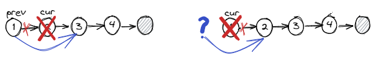

Получается, нам всегда нужен предыдущий элемент, чтобы без доп проверок работал алгоритм.\
Как решение - можем использовать подход с так называемым **"Dummy"** элементом. 

```java
public ListNode removeElements(ListNode head, int val) {
    ListNode dummy = new ListNode(0, head);

    ListNode cur = head;
    ListNode prev = dummy;
    while(cur != null) {
        if (cur.val == val) {
            // prev.next = cur.next means detach current from sequence
            prev.next = cur.next;
        } else {
            prev = cur; // current node will be previous node for next iteration
        }
        cur = cur.next; // New current element for next iteration
    }
    return dummy.next;
}
```
Закрепить можно разбором от NeetCode: **"[NeetCode - Remove Linked List Elements](https://www.youtube.com/watch?v=JI71sxtHTng)"**

----

## [↑](#home) <a id="removen"></a> 19. Remove Nth Node From End of List
Разберём задачу **"[19. Remove Nth Node From End of List](https://leetcode.com/problems/remove-nth-node-from-end-of-list/)"**:
> Дан LinkedList из как минимум одного элемента, нужно удалить n-ный элемент с конца данного списка.

Это отличная задача на понимание основ задач на Linked List.

Во-первых, на примере этой задачи можно понять, зачем нужен подход с **Dummy Node**.\
Представим крайний случай, когда у нас всего лишь 1 элемент и нам нужно 

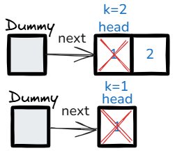

Кроме этого, данна задача учит **"удалять"** элементы:

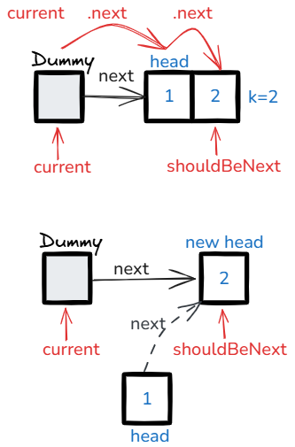

Важно понимать, что удаление элемента не совсем удаление. У нас есть некоторый **head**, голова, которой мы смотрим на Linked List.\
Удалить элемент - значит сделать так, чтобы предыдущий элемент начал видеть не "удаляемый" элемент, а следующий за ним.

Получается, что если нам нужно удалить 2ой элемент с конца, то мы должны это делать "от лица" 3тьего элемента с конца:

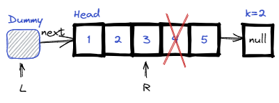

Таким образом алгоритм будет работать следующим образом:

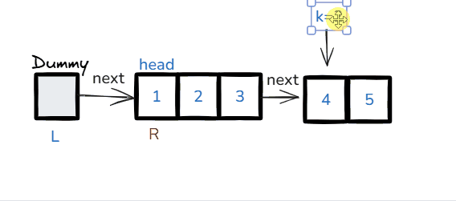

Разбор данной задачи от NeetCode: **[Remove Nth Node from End of List](https://www.youtube.com/watch?v=XVuQxVej6y8)**

Решение:
```java
public ListNode removeNthFromEnd(ListNode head, int n) {
    ListNode dummy = new ListNode(0, head); // "head" as next
    ListNode left = dummy;
    ListNode right = head;
    // Shift right on specified distance
    while(n > 0) {
        right = right.next;
        n = n - 1;
    }
    // Move pointers
    while (right != null) {
        right = right.next;
        left = left.next;
    }
    // Remove left.next
    left.next = left.next.next;
    return dummy.next;
}
```

----

## [↑](#home) <a id="merge"></a> 21. Merge Two Sorted Lists
Разберём задачу **"[21. Merge Two Sorted Lists](https://leetcode.com/problems/merge-two-sorted-lists/)"**:
> Дано два связных списка (2 Linked List'а), элементы в которых отсортированы. Нужно из них сделать один, где элементы так же будут идти по порядку.

Разбор задачи от NeetCode: [NeetCode - Merge Two Sorted Lists](https://www.youtube.com/watch?v=XIdigk956u0).

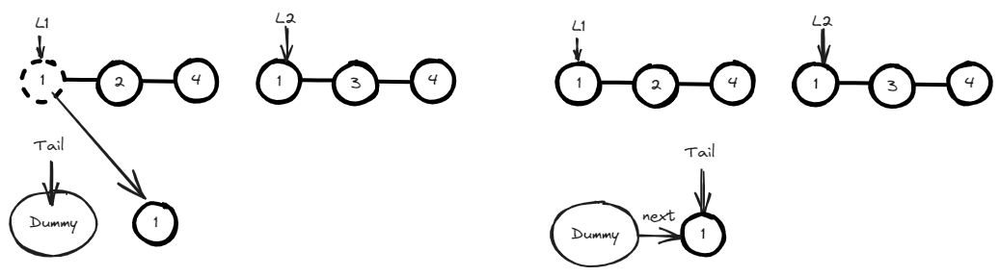

Данная задача использует тот же подход с Dummy node, который нам позволит избежать каждый раз доп проверок, есть ли уже элемент, который можно использовать или нужно его инициализировать. 

Кроме этого, нам нужно помнить, где сейчас находится место, куда мы присоединяем элемент. Как в игре змейка, когда новый блок добавлялся к "хвосту" (tail): 
```java
ListNode dummy = new ListNode();
ListNode tail = dummy;
```

Чтобы склеивать списки, мы должны сравнивать элемент из первого и второго. То есть мы должны выполнять "склейку" до тех пор, пока у нас есть два списка. Как только у нас остаётся только один - мы можем его просто "приклеивать" как есть:
```java
while(list1 != null && list2 != null) {
    if (list1.val < list2.val) {
        tail.next = list1;
        list1 = list1.next; 
    } else {
        tail.next = list2;
        list2 = list2.next;
    }
    tail = tail.next;
}
```

Если мы вышли из цикла - значит какой-то список закончился:
```java
if (list1 != null) {
    tail.next = list1;
} else {
    tail.next = list2;
}
return dummy.next;
```

----

## [↑](#home) <a id="middle"></a> 876. Middle of the Linked List
Разберём задачу **"[876. Middle of the Linked List](https://leetcode.com/problems/middle-of-the-linked-list/)"**.

Данна задача основана на факет того, что такое "середина", она же "половина списка".\
Представим, что у нас есть "быстрый" укзатель, который проходит за каждую итерацию 2 элемента.\
Медленный указатель будет проходить за каждую итерацию 1 элемент, т.е. в 2 раза меньше.\
Когда быстрый указатель проделает всю работу, то медленный указатель сделает в 2 раза меньше:

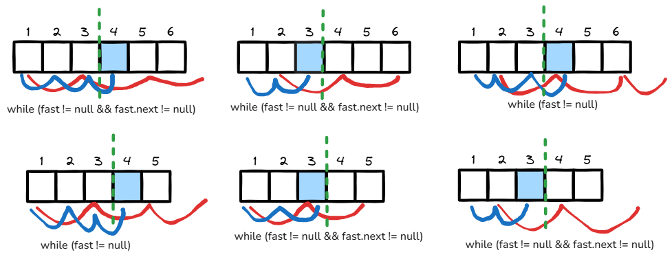

Таким образом, при завершении работы быстрого указателя медленный указатель будет в положении середины списка:

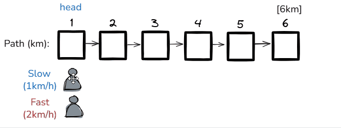

Более подробно про решение можно посмотреть в разборе **[Vladimir Balun - Middle of the linked list](https://www.youtube.com/watch?v=j6p5OUT6798)**.

```java
public ListNode middleNode(ListNode head) {
    ListNode slow = head, fast = head;
    while (fast != null && fast.next != null) {
        slow = slow.next;
        fast = fast.next.next;
    }
    return slow;
}
```

----

## [↑](#home) <a id="reverse"></a> 206. Reverse Linked List
Разберём задачу **"[206. Reverse Linked List](https://leetcode.com/problems/reverse-linked-list/)"**.

Данную задачу можно решить двумя способами: рекурсивно и итеративно.
Начнём с рекурсии, т.к. этот подход наиболее "хитрый" с точки зрения понимания.

Начнём с упрощённой версии: нам нужно просто перевернуть список, не возвращая результат.

Если нода хочет "развернуться", то она меняет связь next ноды на себя.\
Если нода это сделает в самом начале - next нода потеряет связь с остатком списка, т.к. её next связь будет нарушена/изменена.\
Это означает, что сначала нода должна дождаться разворота своего next, а потом выполнить свою работу.

Тогда каждый вызов должен сделать следующее:
- дождаться, когда для next выполнится разворот
- связать next с собой (до этого next был связан с другой нодой)

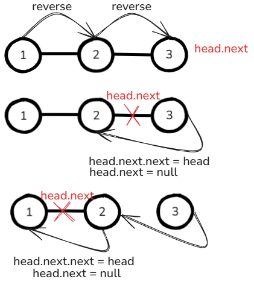

Тогда:
```java
public static void reverseList(ListNode head) {
    if (head == null || head.next == null) return; // base case - nothing to do
    // head.next is available
    reverseList(head.next); // Reverse next node
    head.next.next = head;
    head.next = null;       // Disconnect
}
```

По условию задачи мы должны вернуть ListNode новой head.\
Остаётся лишь добавить проброс последней ноды в изначальном состоянии:
```java
public ListNode reverseList(ListNode head) {
    if (head == null) return null;      // base case - nothing to do
    if (head.next == null) return head; // linked list end found

    ListNode newHead = this.reverseList(head.next);
    head.next.next = head;
    head.next = null;
    return newHead; // return new head 
}
```

Общая картина для рекурсивного вызова:

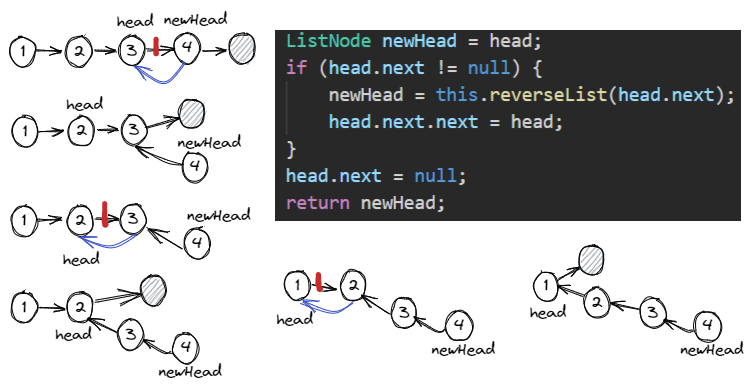

Итеративное решение может быть более понятным и легче запоминаемым.\
Идея заключается в том, чтобы развернуть ноду нужно знать 3 вещи:
- предыдущий нод (prevNode)
- следующий нод (nextNode)
- текущий нод (current)

Когда мы **current.next** разварачиваем на предыдущий нод **prevNode**, мы больше не знаем про остаток списка, т.к. смотрим в другу сторону.\
Но благодаря указателю **nextNode** мы можем "сохранить" это знание.\
Тогда перед переходом к следующей ноде мы можем текущую ноду запоминаем как "предыдущую для следующей".

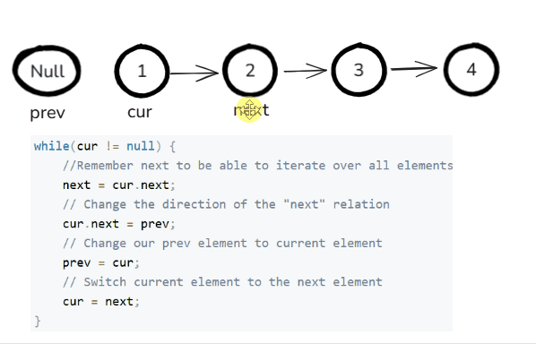

Общая картина тогда:

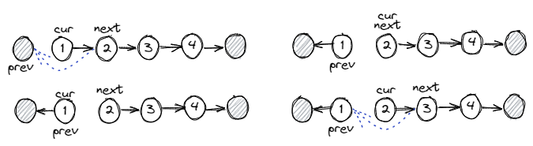

А решение:
```java
public ListNode reverseList(ListNode head) {
    ListNode cur = head;
    ListNode prev = null, next = null;
    while(cur != null) {
        //Remember next to be able to iterate over all elements
        next = cur.next;
        // Change the direction of the "next" relation
        cur.next = prev;
        // Change our prev element to current element
        prev = cur;
        // Switch current element to the next element
        cur = next;
    }
    // Return prev because our exit condition cur == null.
    return prev;
}
```
Разбор данной задачи можно посмотреть и на этих видео:
- [NeetCode - Reverse Linked List - Iterative AND Recursive](https://www.youtube.com/watch?v=G0_I-ZF0S38)
- [Vladimir Balun - Reverse linked list](https://www.youtube.com/watch?v=mjxIuxJQVXM)

----

## [↑](#home) <a id="reverse2"></a> 92. Reverse Linked List II
Разберём задачу **"[92. Reverse Linked List II](https://leetcode.com/problems/reverse-linked-list-ii/)"**:
> Дан LinkedList. Нужно развернуть не весь список, а только часть между индексами left и right.

Разбор данной задачи: **[NeetCode - Reverse Linked List II](https://www.youtube.com/watch?v=RF_M9tX4Eag)**.

Как обычно, нам понадобится dummy node: 
```java
ListNode dummy = new ListNode(0, head);
```

Сначала нам нужно найти "дойти" до места старта:


Помним, что dummy нам нужен для корректной обработки ситуации, когда L у нас первый элемент:
```java
// Step 1: scroll to Left position
ListNode beforeLeft = dummy;
ListNode cur = head;
for (int i = 1; i < left; i++) {
    beforeLeft = cur;
    cur = cur.next;
}
```

Теперь нам нужно для ``(right-left+1)`` нод выполнить разворот:


```java
// Step 2: revert part
ListNode prev = null;
for (int i = 0; i < (right-left+1); i++) {
    ListNode next = cur.next; // Remember next element for next iteration
    cur.next = prev;    // Rotate the current node link
    prev = cur;         // For next iteration cur node will be previous node
    cur = next;         // Consider next node as a next iteration
}
```

Осталось связать все части и вернуть результат:


```java
// Step 3: link all nodes together
beforeLeft.next.next = cur; // Link to the end
beforeLeft.next = prev;     // Link to the beginning
return dummy.next;
```

----

## [↑](#home) <a id="intersection"></a> 160. Intersection of Two Linked Lists
Рассмотрим задачу **[160. Intersection of Two Linked Lists](https://leetcode.com/problems/intersection-of-two-linked-lists/)**:
> Дано два LinkedList'а. Нужно найти ноду, в которой эти списки пересекаются.

Разбор задачи от NeetCode: [Intersection of Two Linked Lists](https://www.youtube.com/watch?v=D0X0BONOQhI).\
Разбор задачи от Nick White: [Intersection of Two Linked Lists Solution Explained](https://www.youtube.com/watch?v=IpBfg9d4dmQ).

Идея заключается в том, что нам нужно пустить указатели с одного места, т.к. размеры списков могут отличаться:

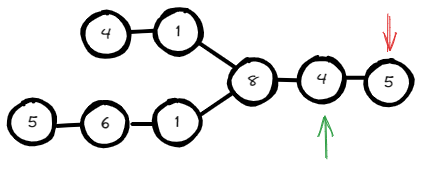

Мы один раз пустим указатели до того момента, пока они не дойдут до конца, а при достижении конца перебросим на другой список. Тогда это позволит нам эти указатели "уравновесить":

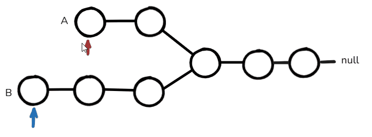

```java
public ListNode getIntersectionNode(ListNode headA, ListNode headB) {
    if (headA == null || headB == null) return null;
    ListNode pointerA = headA, pointerB = headB;
    while (pointerA != pointerB) {
        pointerA = pointerA != null ? pointerA.next : headB;
        pointerB = pointerB != null ? pointerB.next : headA;
    }
    return pointerA; // Can return any pointer here
}
```

----

## [↑](#home) <a id="cycle"></a> 141. Linked List Cycle
Разберём задачу **"[141. Linked List Cycle](https://leetcode.com/problems/linked-list-cycle/)"**:
> Дан Linked List и нужно проверить, нет ли в нём цикла.

Идея проста, но интересна.\
Мы можем завести 2 указателя: медленный (slow) и быстрый (fast).\
Медленный двигается на 1 позицию, а быстрый - на две. Если указатели встретяться - мы нашли цикл. Если fast попадает на null - цикла нет:

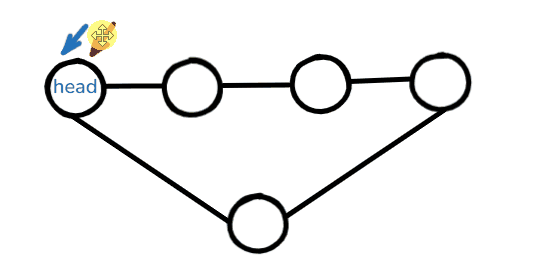

```java
public boolean hasCycle(ListNode head) {
    // Set two pointers
    ListNode fast = head, slow = head;
    while (fast != null && fast.next != null) {
        slow = slow.next;       // 1 step
        fast = fast.next.next;  // 2 steps
        if (slow == fast) return true;
    }
    return false; // no loop
}
```
Интересно, что если найден цикл (т.е. встретились указатель slow и fast), то мы можем превратить fast в медленный указатель (т.е. двигать на единицу) и установить его в начало Linked List. Тогда в следующий раз указатели fast и slow встретятся именно там, где образовался цикл.

Супер понятное объяснение как обычно от NeetCode: **"[Linked List Cycle - Floyd's Tortoise and Hare](https://www.youtube.com/watch?v=gBTe7lFR3vc)"**.

----

## [↑](#home) <a id="cycle2"></a> 142. Linked List Cycle II
Рассмотрим задачу **[142. Linked List Cycle II](https://leetcode.com/problems/linked-list-cycle-ii/)**:
> Дан Linked List. Нужно определить, есть ли цикл. А если есть, то найти место его возникновения.

Данная задача скорее про знать, хотя и имеет математическое объяснение:\
До момента встречи медленный указатель проходит ``L + X``.\
Быстрый указатель делает в 2 раза больше работы,  то его работа - это 2 цикла работы медленного.

Получаетс, быстрый указатель сделал работу медленного указателя + работу соответствующую медленному указателю по объёму.\
Чтобы встретиться с медленным указателем, быстрый сделал некоторое количество кругов (циклов): ``K * C``.

Получается, что в момент встречи медленный указатель проделал по кругу X.\
То есть если запустить медленный указатель снова, то пока он пройдёт до круга, медленный в круге пройдёт какое-то количество кругов.\
И они встретятся как раз в месте начала цикла:

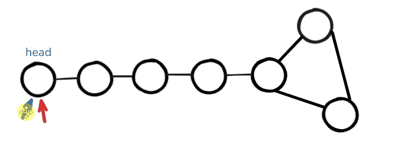

Разбор задачи: [Nikhil Lohia: Linked List Cycle 2](https://www.youtube.com/watch?v=95ZfuoSAUPI).

Решение задачи:
```java
public ListNode detectCycle(ListNode head) {
    // Set two pointers
    ListNode slow = head, fast = head;
    while (fast != null && fast.next != null) {
        slow = slow.next;       // 1 step
        fast = fast.next.next;  // 2 steps
        // The loop was found
        if (slow == fast) {
            while (head != slow) {
                    head = head.next;
                    slow = slow.next;
            }
            return slow;
        }
    }
    return false; // no loop
}
```

----

## [↑](#home) <a id="duplicateNumber"></a> 287. Find the duplicate number
У задачи по поиску дубликатов есть интересная версия: **"[287. Find the Duplicate Number](https://leetcode.com/problems/find-the-duplicate-number/)"**. 

В этой задаче важно то, что все числа в диапазоне **[1,n]** включая n, но при этом размер массива **n+1**.\
Учитывая это условие видно, что имея любой массив (например, для n=3 будет ```[1,2,3]```) у нас всегда будет дубль, чтобы размер был n+1.\
Кроме этого, любое значение (даже n) может быть использовано в качестве индекса, т.к. не выходит за массив.

Начинаем с индекса 0. Числа 0 у нас нет, то есть в любом случае индекс ``0`` ведёт на какой-то другой индекс.\
Получается, на массив можно посмотреть как на связанный список:

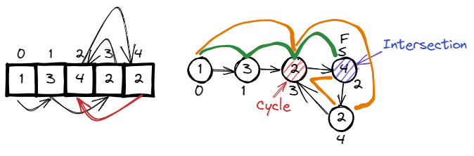

Получается, что можно применить тот же алгоритм поиска цикла с двумя указателями: медленным и быстрым. Благодаря этому мы сможем найти точку пересечения указателей и определить, что у нас есть цикл. Далее оказывается, что от точки пересечения до места образования цикла (т.е. до дубля) такое же расстояние, как и от начала массива.

Подробное объяснение: **"[Find the Duplicate Number - Floyd's Cycle Detection](https://www.youtube.com/watch?v=wjYnzkAhcNk)"**.

Таким образом задача делится на 2 этапа:
- Находим точку пересечения быстрого и медленного указателя (совпадает с пониманием факта обнаружения цикла)
```java
// Move pointers to the start position
int slow = 0, fast = 0;
do {
    slow = nums[slow];
    fast = nums[nums[fast]];
} while(fast != slow);
```
- Заменяем быстрый указатель медленным. Когда он встретится с медленным - мы найдём дубль
```java
// Make fast pointer as slow pointer
fast = 0;
while (fast != slow) {
    slow = nums[slow];
    fast = nums[fast];
}
return slow;
```

----

## [↑](#home) <a id="copyList"></a> 138. Copy List with Random Pointer
Разберём задачу **"[138. Copy List with Random Pointer](https://leetcode.com/problems/copy-list-with-random-pointer/)"**:
> Дан связный список. Нужно сделать его копию. Однако, каждый node имеет не только указатель next, но и ещё указатель random, который может указывать на любоей элемент в этом связном списке.

Классная задача про то, как можно копировать LinkedList.\
Для начала, как бы могло выглядеть обычное копирование Linked List?
```java
public static ListNode copyLinkedList(ListNode origin) {
    ListNode dummy = new ListNode();
    ListNode it = dummy;
    while (origin != null) {
        it.next = new ListNode(origin.val);
        it = it.next;         // to the new copied node
        origin = origin.next; // to the next origin node
    }
    return dummy.next;
}
```

Но в данной задаче ListNode может дополнительно ссылаться на любой ListNode.\
Получается, копируя элемент мы можем ещё не иметь копии ListNode, на которую копия должна ссылаться.\
Тогда, мы можем сохранить заранее соответствие изначального ListNode и его копии:
```java
public Map<Node, Node> getMapping(Node head) {
    // Prepare mapping between origin nodes and copies
    Map<Node, Node> map = new HashMap<>();
    Node cur = head;
    while (cur != null) {
        map.put(cur, new Node(cur.val));
        cur = cur.next;
    }
    return map;
}
```

Тогда, имея такое соответствие, остаётся лишь правильно задать указатели во второй проход:
```java
public Node copyRandomList(Node head) {
    Map<Node, Node> map = getMapping(head);
        
    Node cur = head;
    while(cur != null) {
        Node copy = map.get(cur);           // Get node copy
        copy.next = map.get(cur.next);      // Initialize "next" ref from map
        copy.random = map.get(cur.random);  // Initialize "random" ref from map
        cur = cur.next;                     // Go to the next origin node
    }
    return map.get(head);                   // Return copied head node
}
```

Разбор от NeetCode: [Copy List with Random Pointer](https://www.youtube.com/watch?v=5Y2EiZST97Y).

----

## [↑](#home) <a id="swap"></a> 24. Swap Nodes in Pairs
Разберём задачу **"[24. Swap Nodes in Pairs](https://leetcode.com/problems/swap-nodes-in-pairs/)"**:
> Дан LinkedList. Нужно поменять местами каждую пару элементов, т.е. 1 и 2 ноды, 3 и 4 ноды, и т.д.

Как обычно, нам понадобится Dummy Node:
```java
ListNode dummy = new ListNode(0, head);
```

Предположим, у нас есть 1 пара нод. Как её развернуть?

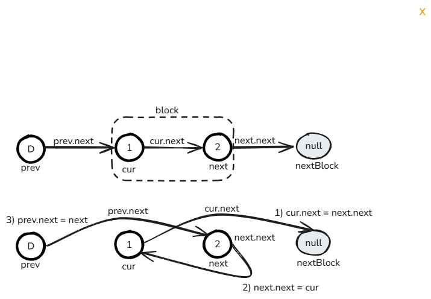

Останется подготовиться к следующей итерации:

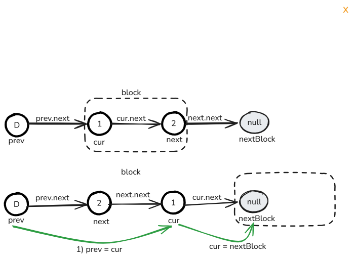

Видео разбор данной задачи: [NeetCode: Swap Nodes in Pairs](https://www.youtube.com/watch?v=o811TZLAWOo&list=PLot-Xpze53leU0Ec0VkBhnf4npMRFiNcB&index=10).

Тогда, решение будет выглядеть следующим образом:
```java
public ListNode swapPairs(ListNode head) {
    ListNode dummy = new ListNode(0, head);
        
    // Iterate while we have two nodes to swap (cur and next)
    ListNode prev = dummy, cur = head;
    while (cur != null && cur.next != null) {
        ListNode next = cur.next;
        ListNode nextPair = next.next; // Remember next pair
        // Change pointers
        cur.next = nextPair;
        next.next = cur;
        prev.next = next;
        // Prepare for the next iteration
        prev = cur;
        cur = nextPair;
    }
    return dummy.next;
}
```

----

## [↑](#home) <a id="twoNumbers"></a> 2. Add Two Numbers
Разберём задачу **"[2. Add Two Numbers](https://leetcode.com/problems/add-two-numbers/)"**:
> Дано два списка представляющих два числа. Эти списки хранят число задом наперёд, то есть 2->4->3 это 342. Нужно сложить эти два числа и вернуть его в виде LinkedList в таком же формате.

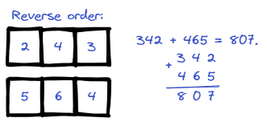

Если поставить числа друг над другом, то мы увидим, что так даже легче, т.к. мы начинаем складывать с самого последнего разряда и нам для этого ничего не надо делать.

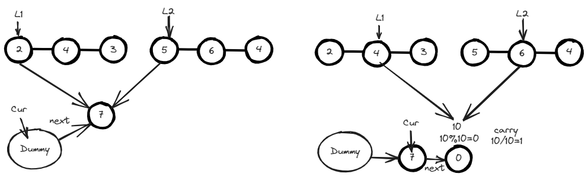

Данная задача про хитрость с [carry](https://en.wikipedia.org/wiki/Carry_(arithmetic)), т.к. при сложении может быть перенос из одной колонки в другую:
```java
public ListNode addTwoNumbers(ListNode l1, ListNode l2) {
    ListNode dummy = new ListNode();
    ListNode cur = dummy;

    int carry = 0; // Carry it as a result of sum for the next iteration
    while (l1 != null || l2 != null || carry != 0) {
        int v1 = (l1 != null) ? l1.val : 0;
        int v2 = (l2 != null) ? l2.val : 0;
        int val = v1 + v2 + carry;
        carry = val / 10; // like 15/10 = 1
        val = val % 10; // like 15%10 = 5
        cur.next = new ListNode(val);

        cur = cur.next; // Prepare cur for the next iteration
        l1 = (l1 != null) ? l1.next : null;
        l2 = (l2 != null) ? l2.next : null;
    }
    return dummy.next;
}
```

----

## [↑](#home) <a id="rotate"></a> 61. Rotate Linked List
Разберём задачу **"[61. Rotate Linked List](https://leetcode.com/problems/rotate-list/)"**:
> Дан Linked List и задача сдвинуть его на несколько позиций. Сдвинуть на несколько позиций - означает взять элементы с конца и переставить их в начало.

Для начала, нам необходимо узнать количество элементов.\
Это нужно знать чтобы понимать, на сколько позиций смещать.\
Ведь смещение может быть больше кол-ва элементов.\
Например, если элементов 10, а смещение 12, то смещение будет на самом деле 2 (остаток от деления 12 % 10).

Находим последний элемент в списке (**tail**), попутно считая количество увиденных элементов, т.е. длину списка:
```java
if (head == null || head.next == null) return head;  // no node OR single node
ListNode tail = head;
int len = 1; // Count seen elements (i.e. list length)
while(tail.next != null) {
    tail = tail.next;
    len++;
}
```

Теперь нам нужно понять, сколько элементов нужно оставить:
```java
k = k % len;
```

Теперь нам нужно ещё 1 раз пройтись по списку, чтобы установить указатель на место смещения на **K** элементов.\
Стоит обратить внимание, что мы делаем поправку на 1, т.к. мы уже находимся на первом элементе и до него идти не надо.
```java
ListNode newTail = head;
for (int i = 0; i < len - k - 1; i++) {
    newTail = newTail.next;
}
```

Итак, у нас есть newTail, на котором список должен закончиться.\
Следующие элементы должны встать в "голову" списка:
```java
tail.next = head;       // Place current head after the tail
head = newTail.next;    // Replace head ref to the new head
newTail.next = null;    // Finish list on newTail node
return head;            // Return new head
```

Подробное объяснение можно посмотреть в разборе от NeetCode: **"[NeetCode - Rotate Linked List](https://www.youtube.com/watch?v=UcGtPs2LE_c)"**.

В догонку можно посмотреть разбор задачи rotate, но про ArrayList, а не LinkedList: **[NeetCode - Rotate Array](https://www.youtube.com/watch?v=BHr381Guz3Y)**.

----

## [↑](#home) <a id="oddEven"></a> 328. Odd Even Linked List
Разберём задачу **"[328. Odd Even Linked List](https://leetcode.com/problems/odd-even-linked-list/)"**:
> Дан LinkedList. Нужно перегруппировать элементы так, что сначала идут все нечётные индексы, а потом все чётные индексы.

Данная задача про последовательное разбиение LinkedList на две части, а потом их склеивание.\
Важно внимательно следить за указателями:

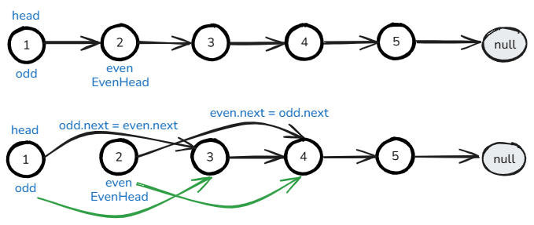

В конце у нас образуется две части, которые нужно склеить:

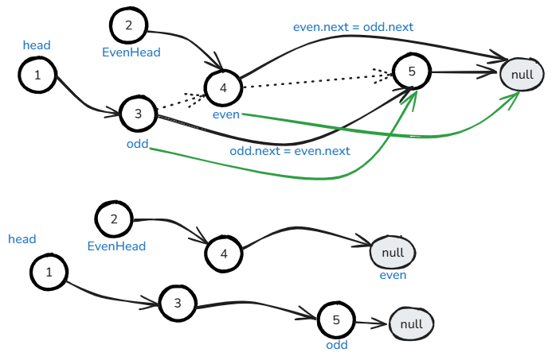

Head нечётных начинается с первого элемента, а Head нечётных - со второго.\
Решение заключается в "жонглировании" указателями. Как найти следующий нечётный элемент?\
Спросить следующий элемент у чётного, ведь за чётным следует нечётный.\
Если теперь у нас есть нечётный, то чётный можем найти таким же образом:
```java
public ListNode oddEvenList(ListNode head) {
    if (head == null || head.next == null) return head;
    ListNode odd = head;        // Odd in the beginning, consider head as a start

    ListNode even = head.next;
    ListNode evenHead = even;
    // Continue while we can find something from even    
    while (even != null && even.next != null) {
        odd.next = even.next;
        odd = odd.next;
        even.next = odd.next;
        even = even.next;
    }
    odd.next = evenHead;
    return head;    
}
```

Разбор можно посмотреть у Nick White: **[Nick White - LeetCode Odd Even Linked List](https://www.youtube.com/watch?v=C_LA6SOwVTM)**.

----

## [↑](#home) <a id="partition"></a> 86. Partition List
Разберём задачу **"[86. Partition List](https://leetcode.com/problems/partition-list/)"**:
> Дан Linked List. Нужно его условно разбить на 2 части: элементы меньше X и все остальные. И сформировать новый Linked List.\

Алгоритм решения выглядит следующим образом:

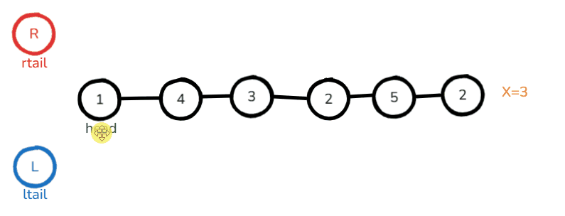

У нас есть два указателя на head двух разных очередей: Left и Right.\
Кроме того, у нас есть два указателя на "хвост" этих очередей, т.е. на те ноды, к которым мы будем цеплять новые элементы.\
Указателем head мы идём по списку и меняем указатели в нодах в списках Left и Right.

Разбор можно посмотреть у NeetCode: **"[NeetCode - Partition List](https://www.youtube.com/watch?v=KT1iUciJr4g)"**.

```java
public ListNode partition(ListNode head, int x) {
    // Create two lists: left and right
    ListNode left = new ListNode(), right = new ListNode();
    ListNode ltail = left, rtail = right;
    while (head != null) {
        if (head.val < x) {
            ltail.next = head;
            ltail = ltail.next;
        } else {
            rtail.next = head;
            rtail = rtail.next;
        }
        head = head.next;
    }
    ltail.next = right.next;
    rtail.next = null;
    return left.next;
}
```

----

## [↑](#home) <a id="sortList"></a> 148. Sort List
Рассмотрим задачу **[148. Sort List](https://leetcode.com/problems/sort-list/)**:
> Дан LinkedList. Нужно в нём элементы отсортировать по значению.

Данную задачу можно решить при помощи подхода **Merge Sort**.\
Мы умеем разбивать LinkedList на половинки и умеем выполнять слияние.

Середину LinkedList найти можно при помощи техники быстрого и медленного указателей:
```java
private ListNode getMid(ListNode head) {
    ListNode slow = head, fast = head.next;
    while (fast != null && fast.next != null) {
        slow = slow.next;
        fast = fast.next.next;
    }
    return slow;
}
```
Стоит обратить внимане, что указатель fast находится **НЕ** там же, где указатель slow.\
Это сделано специально, чтобы при чётной длине списка указатель **slow** был в первой части, а не во второй!\
Это важно, т.к. "отсоединять" можно только от лица предыдущего элемента.

Ещё нам нужен метод, который позволит имея два LinkedList их объединить.\
Нам понадобится опять dummy node, для простоты реализации.\
А так же нам понадобится "трэкать" при помощи указателя **tail** место, куда будем присоединять ноды:

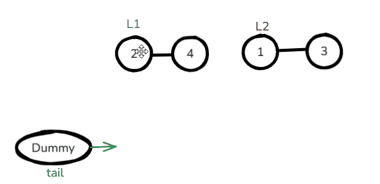

```java
private ListNode merge(ListNode list1, ListNode list2) {
    ListNode dummy = new ListNode();
    ListNode tail = dummy;
    // (!) While both lists are not null
    while (list1 != null && list2 != null) {
        if (list1.val < list2.val) {
            tail.next = list1;
            list1 = list1.next;
        } else {
            tail.next = list2;
            list2 = list2.next;
        }
        tail = tail.next;
    }
    if (list1 != null) tail.next = list1;
    if (list2 != null) tail.next = list2;
    return dummy.next;
}
```

Теперь остаётся написать только саму логику сортировки:
```java
public ListNode sortList(ListNode head) {
    if (head == null || head.next == null) return head;

    //split the list into two halfs
    ListNode left = head;           // Left part
    
    ListNode mid = getMid(head);    // End of left part
    ListNode right = mid.next;      // Right part start 
    mid.next = null;                // Really split lists

    left = sortList(left);
    right = sortList(right);
    return merge(left, right);
}
```

Разбор задачи от NeetCode: [Sort List - Merge Sort](https://www.youtube.com/watch?v=TGveA1oFhrc).\
Разбор задачи от Nick White: [LeetCode Sort List Explained](https://www.youtube.com/watch?v=pNTc1bM1z-4).

----

## [↑](#home) <a id="palindrome"></a> 234. Palindrome Linked List
Разберём задачу **"[234. Palindrome Linked List](https://leetcode.com/problems/palindrome-linked-list/)"**.

Задача на проверку Linked List на свойство палиндрома - это объединение нескольких задач на Linked List.

Для начала, нам нужно найти середину Linked List'а, а это та самая задача **"[Middle of the Linked List](#middle)"**:
```java
public ListNode getMiddle(ListNode head) {
    ListNode slow = head, fast = head;
    while (fast != null && fast.next != null) {
        slow = slow.next;       // 1 step
        fast = fast.next.next;  // 2 steps
    }
    return slow; // return slow as middle
}
```

Дальше нам нужно остаток Linked List'а развернуть. А это та самая задача **"[Reverse Linked List](#reverse)"**:
```java
public ListNode rotate(ListNode head) {
    ListNode prev = null;
    while (head != null) {
        ListNode next = head.next; // Remember next node
        head.next = prev; // Reverse next to prev
        prev = head; // head will be previous for next node
        head = next; // next node will be head for next iteration
    }
    return prev;
}
```
Выглядит эта идея следующим образом:

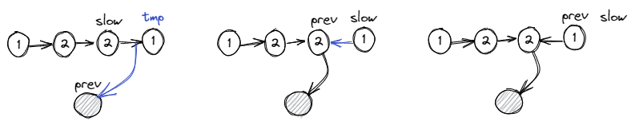

Остаётся сама проверка на палиндром:
```java
public boolean isPalindrome(ListNode head) {
    ListNode left = head;
    ListNode middle = getMiddle(head);
    ListNode right = rotate(middle);
    while (right != null) {
        if (left.val != right.val) return false;
        left = left.next;
        right = right.next;
    }
    return true;
}
```

Более подробно разбор данной задачи можно увидеть в обзоре **[NeetCode - Palindrome Linked List](https://www.youtube.com/watch?v=yOzXms1J6Nk)**.

----


----

## [↑](#home) <a id="reorder"></a> 143. Reorder List
Разберём задачу **"[143. Reorder List](https://leetcode.com/problems/reorder-list/)"**:
> Дан LinkedList. Отсортировать его так, что сначала идёт нод с головы, потом нод с хвоста. И так пока не кончатся элементы.

Данная задача похожа на задачу [Rotate Linked List](#rotate).

Для начала нам нужно разделить список на две части и найти начало второй части
```java
ListNode slow = head, fast = head.next;
while (fast != null && fast.next != null) {
    slow = slow.next;
    fast = fast.next.next;
}
ListNode second = slow.next;
```

Дальше нужно вторую часть развернуть, т.е. это опять наша задача на reverse list:
```java
slow.next = null;
ListNode prev = null;
while(second != null) {
    ListNode tmp = second.next;
    second.next = prev;
    prev = second;
    second = tmp;
}
```

Остаётся теперь только склеить правильно два списка:
```java
ListNode first = head;
ListNode second = prev;
while (second != null) {
    ListNode tmp1 = first.next, tmp2 = second.next;
    first.next = second;
    second.next = tmp1;
    first = tmp1;
    second = tmp2;
}
```

Разбор данной задачи можно посмотреть на канале NeetCode: [NeetCode - Reorder List](https://www.youtube.com/watch?v=S5bfdUTrKLM&t=1s).

----

## [↑](#home) <a id="LRU"></a> LRU Cache
Рассмотрим задачу **[LRU Cache](https://leetcode.com/problems/lru-cache/)**. 

Данная задача интересна с точки зрения "жонглирования" элементами Linked List'а. Одним из подходов является создание по бокам Linked List'а двух "dummy" нод, чтобы в любом случае у любой ноды, даже самой первой, всегда был next и prev.

Разбор задачи от Nick White: [LeetCode LRU Cache](https://www.youtube.com/watch?v=NDpwj0VWz1U).\
Разбор задачи от NeetCode: [LRU Cache Interview Question](https://www.youtube.com/watch?v=7ABFKPK2hD4).

Для начала, нам понадобится создать класс для нод, хранящих данные нашего LRU:
```java
private static class Node {
    Node prev; // Left
    Node next; // Right
    int val;
    int key;
}
```

Дальше - "хитрость", которая поможет решить данную задачу:
```java
private final int capacity;
private final Map<Integer, Node> nodes;
private Node head = new Node(), tail = new Node();

public LRUCache(int capacity) {
    this.nodes = new HashMap<>(capacity);
    this.capacity = capacity;
    head.next = tail;
    tail.prev = head;
}
```
Как ми видим, мы создаём две дополнительные ноды. Одна знает про самую актуальную ноду, а вторая - про самую не актуальную. Кроме того, таким образом мы сможем избежать дополнительных проверок.

Перед самим алгоритмом нам понадобится описать 2 операции: добавить элемент и удалить элемент:
```java
private void add(Node node) {
    // Remember a node on the right side of the new node 
    Node headNext = head.next;        
    node.next = headNext;

    headNext.prev = node;   // New node is the left node
    head.next = node;       // Update head
    node.prev = head;       // Link node to the head
}

private void remove(Node node) {
    // Node ALWAYS has next and prev. Link them
    Node nextNode = node.next;
    Node prevNode = node.prev;
    nextNode.prev = prevNode;
    prevNode.next = nextNode;
}
```
Тут главное не запутаться кто есть prev, кто есть next. Проще всего визуализировать себе в голове/на листочке ноды.

Начнём с самого простого метода - получение значения:
```java
public int get(int key) {
    int result = -1;
    Node node = nodes.get(key);
    if (node != null) {
        result = node.val;
        remove(node);
        add(node);
    }   
    return result;
}
```
Таким образом, при получении значения мы сначала удаляем ноду, а потом добавляем её заново. Таким образом она становится самой актуальной.

Остаётся метод добавления значения:
```java
public void put(int key, int value) {
    Node node = nodes.get(key);
    if (node != null) {
        node.val = value; // Update value
        remove(node);
        add(node);
    } else {
        if (nodes.size() == capacity) {
            // Tail "sees" less actual node that should be deleted
            nodes.remove(tail.prev.key);
            remove(tail.prev);
        }
        Node newNode = new Node();
        newNode.key = key;
        newNode.val = value;
        nodes.put(key, newNode);
        add(newNode);
    }
}
```

----

## [↑](#home) <a id="mergek"></a> Merge k Sorted Lists
Рассмотрим задачу **[Merge k Sorted Lists](https://leetcode.com/problems/merge-k-sorted-lists/)**.

Разбор задачи от NeetCode: [Merge K Sorted Lists - Leetcode](https://www.youtube.com/watch?v=q5a5OiGbT6Q).

Для решения данной задачи вспомним задачу [Merge Two Sorted Lists](#merge):
```java
private ListNode merge(ListNode list1, ListNode list2) {
    ListNode dummy = new ListNode();
    ListNode tail = dummy;
    while(list1 != null && list2 != null) {
        if (list1.val < list2.val) {
            tail.next = list1;
            list1 = list1.next; 
        } else {
            tail.next = list2;
            list2 = list2.next;
        }
        tail = tail.next;
    }
    if (list1 != null) {
        tail.next = list1;
    } else {
        tail.next = list2;
    }
    return dummy.next;
}
```

Переиспользуем это решение для нашей задачи:
```java
public ListNode mergeKLists(ListNode[] lists) {
    if (lists.length == 0) return null;

    while (lists.length > 1) {
        int size = lists.length % 2 == 0 ? lists.length / 2 : lists.length / 2 + 1;
        ListNode[] mergedLists = new ListNode[size];
        int ind = 0;
        for (int i = 0; i < lists.length; i = i + 2) {
            ListNode l1 = lists[i];
            ListNode l2 = i + 1 < lists.length ? lists[i+1] : null;
            mergedLists[ind] = merge(l1, l2);
            ind++;
        }
        lists = mergedLists;
    }
    return lists[0];
}
```

----

## [↑](#home) <a id="reverseKGroup"></a> Reverse Nodes in k-Group
Рассмотрим задачу **[Reverse Nodes in k-Group](https://leetcode.com/problems/reverse-nodes-in-k-group/)**.

Разбор задачи: [NeetCode: Reverse Nodes in K-Group - Linked List](https://www.youtube.com/watch?v=1UOPsfP85V4).

Для решения задачи нам понадобится вспомогательный метод получения элемента через K шагов:
```java
private ListNode getKth(ListNode curr, int k) {
    while (curr != null && k > 0) {
        curr = curr.next;
        k--;
    }
    return curr;
}
```

А теперь выполним сам алгоритм:
```java
public ListNode reverseKGroup(ListNode head, int k) {
    ListNode dummy = new ListNode(0, head);
    ListNode groupPrev = dummy;

    while (true) {
        // Find the next group start - we should change element TILL that element
        ListNode kth = getKth(groupPrev, k);
        if (kth == null) break;
        ListNode groupNext = kth.next;

        // Reverse group
        ListNode curr = groupPrev.next; // Start = element after prev group
        ListNode stickTo = groupNext; // Attach first element to the next group
        while (curr != groupNext) {
            ListNode tmp = curr.next; // Remember element for next iteration
            curr.next = stickTo; // Stick element to the proper element
            stickTo = curr;
            curr = tmp; // Shift current element pointer
        }

        ListNode tmp = groupPrev.next; // Remember previous "next" for previous group
        groupPrev.next = kth; // K-th was changed from farest node to closest
        groupPrev = tmp; // Update previous group border
    }
    return dummy.next;
}
```

----