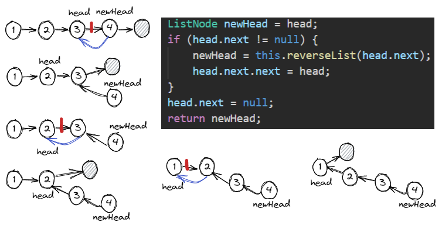

# <a id="home"></a> Linked List problems

Данный раздел посвящён задачам на **[Linked List](https://leetcode.com/tag/linked-list/)** из **[Leetcode Patterns](https://seanprashad.com/leetcode-patterns/)**.\
Playlist разборов от NeetCode: **[NeetCode - Linked List playlist](https://www.youtube.com/watch?v=S5bfdUTrKLM&list=PLot-Xpze53leU0Ec0VkBhnf4npMRFiNcB)**

**Table of Contents:**
- [Remove Nth Node From End of List](#removen)
- [Merge Two Sorted Lists](#merge)
- [Add Two Numbers](#twoNumbers)
- [Linked List Cycle](#cycle)
- [Middle of the Linked List](#middle)
- [Reverse Linked List](#reverse)
- [Remove Linked List Elements](#remove)
- [Palindrome Linked List](#palindrome)
- [Rotate Linked List](#rotate)
- [Odd Even Linked List](#oddEven)
- [Partition List](#partition)
- [Reorder List](#reorder)

----

## [↑](#home) <a id="removen"></a> Remove Nth Node From End of List
Разберём задачу **"[Remove Nth Node From End of List](https://leetcode.com/problems/remove-nth-node-from-end-of-list/)"**.

Дан LinkedList, нужно удалить n-ный элемент с конца данного списка.\
Данная задача про интересный подход с указателями для обхода edge cases:


Идея заключается в том, чтобы ввести Dummy node и два указателя - правый и левый. Сдвинуть правый указатель на n позиций, а дальше мы можем двигать оба указателя одновременно. Когда правый выйдет за границу, то левый будет стоять ровно на том месте, которое нас интересует. Дальше останется соединить левый указатель в обход удаляемого элемента:

```java
public ListNode removeNthFromEnd(ListNode head, int n) {
    ListNode dummy = new ListNode(0, head);
    ListNode right = head;
    ListNode left = dummy;
    while(n > 0) {
        right = right.next;
        n = n - 1;
    }
    while (right != null) {
        right = right.next;
        left = left.next;
    }
    // Remove left.next
    left.next = left.next.next;
    return dummy.next;
}
```


## [↑](#home) <a id="merge"></a> Merge Two Sorted Lists
Разберём задачу **"[Merge Two Sorted Lists](https://leetcode.com/problems/merge-two-sorted-lists/)"**.

Дано два связных списка (2 Linked List'а), элементы в которых отсортированы. Нужно из них сделать один, где элементы так же будут идти по порядку.

Во-первых, нам понадобится некоторый dummy элемент, который нам позволит избежать каждый раз доп проверок, есть ли уже элемент, который можно использовать или нужно его инициализировать. Во-вторых, нам нужно помнить, где сейчас находится место, куда мы присоединяем элемент. Как в игре змейка, когда новый блок добавлялся к "хвосту" (tail): 
```java
ListNode dummy = new ListNode();
ListNode tail = dummy;
```

Чтобы склеивать списки, мы должны сравнивать элемент из первого и второго. То есть мы должны выполнять "склейку" до тех пор, пока у нас есть два списка. Как только у нас остаётся только один - мы можем его просто "приклеивать" как есть:
```java
while(list1 != null && list2 != null) {
    if (list1.val < list2.val) {
        tail.next = list1;
        list1 = list1.next; 
    } else {
        tail.next = list2;
        list2 = list2.next;
    }
    tail = tail.next;
}
```

Если мы вышли из цикла - значит какой-то список закончился:
```java
if (list1 != null) {
    tail.next = list1;
} else {
    tail.next = list2;
}
return dummy.next;
```
Рекомендуется закрепить разбором от NeetCode: [NeetCode - Merge Two Sorted Lists](https://www.youtube.com/watch?v=XIdigk956u0).

----

## [↑](#home) <a id="twoNumbers"></a> Add Two Numbers
Разберём задачу **"[Add Two Numbers](https://leetcode.com/problems/add-two-numbers/)"**.


Данная задача про хитрость с [carry](https://en.wikipedia.org/wiki/Carry_(arithmetic)), т.к. при сложении может быть перенос из одной колонки в другую:
```java
public ListNode addTwoNumbers(ListNode l1, ListNode l2) {
    ListNode dummy = new ListNode();
    ListNode cur = dummy;

    int carry = 0;
    while (l1 != null || l2 != null || carry != 0) {
        int v1 = (l1 != null) ? l1.val : 0;
        int v2 = (l2 != null) ? l2.val : 0;
        int val = v1 + v2 + carry;
        carry = val / 10; // like 15/10 = 1
        val = val % 10; // like 15%10 = 5
        cur.next = new ListNode(val);

        cur = cur.next; // Prepare cur for the next iteration
        l1 = (l1 != null) ? l1.next : null;
        l2 = (l2 != null) ? l2.next : null;
    }
    return dummy.next;
}
```

----

## [↑](#home) <a id="cycle"></a> Linked List Cycle
Разберём задачу **"[Linked List Cycle](https://leetcode.com/problems/linked-list-cycle/)"**.

Дан Linked List и нужно проверить, нет ли в нём цикла.\
Супер понятное объяснение как обычно от NeetCode: **"[Linked List Cycle - Floyd's Tortoise and Hare](https://www.youtube.com/watch?v=gBTe7lFR3vc)"**.

Идея проста, но интересна. Мы можем завести 2 указателя: медленный (slow) и быстрый (fast). Медленный двигается на 1 позицию, а быстрый - на две. Если указатели встретяться - мы нашли цикл. Если fast попадает на null - цикла нет:

```java
public boolean hasCycle(ListNode head) {
    // Set two pointers
    ListNode fast = head, slow = head;
    while (fast != null && fast.next != null) {
        slow = slow.next;       // 1 step
        fast = fast.next.next;  // 2 steps
        if (slow == fast) return true;
    }
    return false;
}
```
Интересно, что если найден цикл (т.е. встретились указатель slow и fast), то мы можем превратить fast в медленный указатель (т.е. двигать на единицу) и установить его в начало Linked List. Тогда в следующий раз указатели fast и slow встретятся именно там, где образовался цикл.

----

## [↑](#home) <a id="middle"></a> Middle of the Linked List
Разберём задачу **"[Middle of the Linked List](https://leetcode.com/problems/middle-of-the-linked-list/)"**.

На самом деле она очень похожа на задачу **[Linked List Cycle](#cycle)**. У нас есть два указателя - быстрый и медленный. Так как цикла нет, то быстрый указатель в 2 раза быстрее достигнет конца списка, а следовательно медленный указатель будет на пол пути, т.е. на середине. Более подробно про решение можно посмотреть в разборе **[Vladimir Balun - Middle of the linked list](https://www.youtube.com/watch?v=j6p5OUT6798)**.

```java
public ListNode middleNode(ListNode head) {
    ListNode slow = head, fast = head;
    while (fast != null && fast.next != null) {
        slow = slow.next;
        fast = fast.next.next;
        if (slow == fast) break;
    }
    return slow;
}
```

## [↑](#home) <a id="reverse"></a> Reverse Linked List
Разберём задачу **"[Reverse Linked List](https://leetcode.com/problems/reverse-linked-list/)"**.

Из интересного: leetcode предлагает решить задачу итеративно и рекурсивно.\
Начнём с рекурсии, т.к. этот подход наиболее "хитрый".

Во-первых, нужно понять, что делать с head, который пришёл в рекурсивный метод. Если он будет указывать на какой-то node, то он получается не последним, а reverse подразумевает, что первый элемент становится последним, т.е. указывает на null. То есть, скорей всего, ссылку head.next в самом конце нужно сбросить на null. Что же ещё нужно сделать до этого?

Предположим, у нас список из двух элементов. Чтобы развернуть его, надо у head (т.е. у первого элемента) взять его next (т.е. второй элемент) и в качестве его next сделать самого head.

Рекурсивное решение может выглядеть следующим образом:



Код решения:
```java
public ListNode reverseList(ListNode head) {
    if (head == null) return null;
    ListNode newHead = head;
    if (head.next != null) {
        newHead = this.reverseList(head.next);
        head.next.next = head;
    }
    head.next = null;
    return newHead;
}
```

Итеративное решение же выглядит более понятным с моей точки зрения и легче запомнить. Развернуть Linked List означает по сути развернуть стрелки и вернуть последний элемент в качестве нового head. В таком случае логика может выглядеть следующим образом:

Имея текущий элемент cur мы должны его направить со следующего элемента на предыдущий. Учитывая что этот факт делает невозможным обратиться к следующему элементу мы вынуждены запоминать отдельно next элемент. Т.к. у нас односвязанный список, то предыдущий элемент (на который мы должны переключить связь) не доступен напрямую, поэтому мы должны запоминать его в переменную prev. Осталось только этим правильно "жонглировать":


```java
public ListNode reverseList(ListNode head) {
    ListNode cur = head;
    ListNode prev = null, next = null;
    while(cur != null) {
        //Remember next to be able to iterate over all elements
        next = cur.next;
        // Change the direction of the "next" relation
        cur.next = prev;
        // Change our prev element to current element
        prev = cur;
        // Switch current element to the next element
        cur = next;
    }
    // Return prev because our exit condition cur == null.
    return prev;
}
```
Разбор данной задачи можно посмотреть и на этих видео:
- [NeetCode - Reverse Linked List - Iterative AND Recursive](https://www.youtube.com/watch?v=G0_I-ZF0S38)
- [Vladimir Balun - Reverse linked list](https://www.youtube.com/watch?v=mjxIuxJQVXM)

Так же можно посмотреть разбор модификации данной задачи: [NeetCode - Reverse Linked List II](https://www.youtube.com/watch?v=RF_M9tX4Eag).


## [↑](#home) <a id="remove"></a> Remove Linked List Elements
Разберём задачу **"[Remove Linked List Elements](https://leetcode.com/problems/remove-linked-list-elements/)"**.

Нарисуем 2 ситуации: удаление первого элемента и удаление не первого элемента:


Получается, нам всегда нужен предыдущий элемент, чтобы без доп проверок работал алгоритм. И как решение - можем использовать подход с так называемым "Dummy" элементом. Он сам нам не нужен, но он нужен нам как тот самый не подлажащий удалению элемент, который избавит нас от доп проверок. Тогда мы сможем применить наш алгоритм:

```java
public ListNode removeElements(ListNode head, int val) {
    ListNode dummy = new ListNode(0);
    dummy.next = head;

    ListNode cur = head, prev = dummy;
    while(cur != null) {
        if (cur.val == val) {
            prev.next = cur.next;
        } else {
            prev = cur;
        }
        cur = cur.next;
    }
    return dummy.next;
}
```
Закрепить можно разбором от NeetCode: **"[NeetCode - Remove Linked List Elements](https://www.youtube.com/watch?v=JI71sxtHTng)"**


## [↑](#home) <a id="palindrome"></a> Palindrome Linked List
Разберём задачу **"[Palindrome Linked List](https://leetcode.com/problems/palindrome-linked-list/)"**.

Задача на проверку Linked List на свойство палиндрома - это объединение нескольких задач на Linked List.

Для начала, нам нужно найти середину Linked List'а, а это та самая задача **"[Middle of the Linked List](#middle)"**:
```java
ListNode fast = head, slow = head;
// Find the middle (slow pointer)
while (fast != null && fast.next != null) {
    fast = fast.next.next;
    slow = slow.next;
}
```

Дальше нам нужно остаток Linked List'а развернуть. А это та самая задача **"[Reverse Linked List](#reverse)"**:
```java
ListNode prev = null;
while(slow != null) {
    ListNode tmp = slow.next;
    slow.next = prev;
    prev = slow;
    slow = tmp;
}
```
Выглядит эта идея следующим образом:


Остаётся сама проверка на палиндром:
```java
ListNode left = head, right = prev;
while (right != null) {
    if (left.val != right.val) return false;
    left = left.next;
    right = right.next;
}
return true;
```

Более подробно разбор данной задачи можно увидеть в обзоре **[NeetCode - Palindrome Linked List](https://www.youtube.com/watch?v=yOzXms1J6Nk)**.


## [↑](#home) <a id="rotate"></a> Rotate Linked List
Разберём задачу **"[Rotate Linked List](https://leetcode.com/problems/rotate-list/)"**.

Ещё одна интересная задача. Дан Linked List и задача сдвинуть его на несколько позиций. Сдвинуть на несколько позиций - означает взять элементы с конца и переставить их в начало.

Во-первых, нам в любом случае придётся узнать количество элементов в LinkedList. Мы до этого не можем сдвигать элементы просто потому что сдвиг может быть выполнен на большее кол-во позиций, чем есть элементов. И это надо учитывать:
```java
if (head == null || head.next == null) return head; 
int len = 1;
ListNode tail = head;
while(tail.next != null) {
    tail = tail.next;
    len++;
}
```

Теперь нам нужно понять, сколько элементов нужно оставить:
```java
k = k % len;
```

И теперь остаётся только дойти до этой точки и переместить "хвост":
```java
ListNode newTail = head;
for (int i = 0; i < len - k - 1; i++) {
    newTail = newTail.next;
}
tail.next = head;
head = newTail.next;
newTail.next = null;
return head;
```
Подробное объяснение можно посмотреть в разборе от NeetCode: **"[NeetCode - Rotate Linked List](https://www.youtube.com/watch?v=UcGtPs2LE_c)"**.

В догонку можно посмотреть разбор задачи rotate, но про ArrayList, а не LinkedList: **[NeetCode - Rotate Array](https://www.youtube.com/watch?v=BHr381Guz3Y)**.


## [↑](#home) <a id="oddEven"></a> Odd Even Linked List
Разберём задачу **"[Odd Even Linked List](https://leetcode.com/problems/odd-even-linked-list/)"**.

Сама задача - простая, но решение - хитрое. По сути нам нужно разбить исходный Linked List на два: с чётными индексами и нечётными индексами. Head нечётных начинается с первого элемента, а Head нечётных - со второго.

Решение заключается в "жонглировании" указателями. Как найти следующий нечётный элемент? Спросить следующий элемент у чётного, ведь за чётным следует нечётный. Если теперь у нас есть нечётный, то чётный можем найти таким же образом:
```java
public ListNode oddEvenList(ListNode head) {
    if (head == null || head.next == null) return head;
    ListNode odd = head;
    ListNode even = head.next;
    ListNode evenHead = even;
    // Continue while we can find something from even    
    while (even != null && even.next != null) {
        odd.next = even.next;
        odd = odd.next;
        even.next = odd.next;
        even = even.next;
    }
    odd.next = evenHead;
    return head;    
}
```

Разбор можно посмотреть у Nick White: **[Nick White - LeetCode Odd Even Linked List](https://www.youtube.com/watch?v=C_LA6SOwVTM)**.


## [↑](#home) <a id="partition"></a> Partition List
Разберём задачу **"[Partition List](https://leetcode.com/problems/partition-list/)"**.

Дан Linked List. Нужно его условно разбить на 2 части: элементы меньше X и все остальные. И сформировать новый Linked List.\
Решение использует подход из задачи [Remove Linked List Elements](#remove).

Мы можем создать для каждого списка некоторый dummy node в качестве head и цеплять к нему элементы. Останется лишь правильно соединить эти два списка:
```java
public ListNode partition(ListNode head, int x) {
    ListNode left = new ListNode(), right = new ListNode();
    ListNode ltail = left, rtail = right;
    while (head != null) {
        if (head.val < x) {
            ltail.next = head;
            ltail = ltail.next;
        } else {
            rtail.next = head;
            rtail = rtail.next;
        }
        head = head.next;
    }
    ltail.next = right.next;
    rtail.next = null;
    return left.next;
}
```
Разбор можно посмотреть у NeetCode: **"[NeetCode - Partition List](https://www.youtube.com/watch?v=KT1iUciJr4g)"**.


## [↑](#home) <a id="reorder"></a> Reorder List
Разберём задачу **"[Reorder List](https://leetcode.com/problems/reorder-list/)"**.

Данная задача похожа на задачу [Rotate Linked List](#rotate).

Для начала нам нужно разделить список на две части и найти начало второй части
```java
ListNode slow = head, fast = head.next;
while (fast != null && fast.next != null) {
    slow = slow.next;
    fast = fast.next.next;
}
ListNode second = slow.next;
```

Дальше нужно вторую часть развернуть, т.е. это опять наша задача на reverse list:
```java
slow.next = null;
ListNode prev = null;
while(second != null) {
    ListNode tmp = second.next;
    second.next = prev;
    prev = second;
    second = tmp;
}
```

Остаётся теперь только склеить правильно два списка:
```java
ListNode first = head;
ListNode second = prev;
while (second != null) {
    ListNode tmp1 = first.next, tmp2 = second.next;
    first.next = second;
    second.next = tmp1;
    first = tmp1;
    second = tmp2;
}
```

Разбор данной задачи можно посмотреть на канале NeetCode: [NeetCode - Reorder List](https://www.youtube.com/watch?v=S5bfdUTrKLM&t=1s).


## [↑](#home) <a id="reverse2"></a> Reverse Linked List II
Разберём задачу **"[Reverse Linked List II](https://leetcode.com/problems/reverse-linked-list-ii/)"**.

Отличие заключается в том, что в данной задаче нужно развернуть лишь некоторую часть Linked List, ограниченная двумя указателями L и R.\
Например:  ``[1]->[2]->[3]->[4]->[5], L = 2, R = 4``.\
Разбор можно посмотреть в видео от NeetCode: [Reverse Linked List II](https://www.youtube.com/watch?v=RF_M9tX4Eag).

Как обычно, нам понадобится dummy node: ``ListNode dummy = new LinstNode(0, head);``.

Сначала нам нужно найти место старта. Помним, что dummy нам нужен для корректной обработки ситуации, когда L у нас первый элемент:
```java
ListNode beforeLeft = dummy, cur = head;
for (int i = 0; i < left; i++) {
    beforeLeft = cur;
    cur = cur.next;
}
```

Дальше нам нужно начиная от места старта развернуть связи у нод:
```java
ListNode prev = null;
for (int i = 0; i < (right-left+1); i++) {
    ListNode tmpNext = cur.next; // Old next link
    cur.next = prev; // Rotate the current node link
    prev = cur; // For next iteration cur node will be previous node
    cur = tmpNext; // Consider next node as a next iteration
} 
```

Осталось связать все части и вернуть результат:
```java
beforeLeft.next.next = cur; // Link to the end
beforeLeft.next = prev; // Link to the beginning
return dummy.next;
```

--------

## [↑](#home) <a id="swap"></a> Swap Nodes in Pairs
Разберём задачу **"[Swap Nodes in Pairs](https://leetcode.com/problems/swap-nodes-in-pairs/)"**.

Как обычно, понять решение нам поможет NeetCode: [Swap Nodes in Pairs Interview Question](ttps://www.youtube.com/watch?v=o811TZLAWOo&list=PLot-Xpze53leU0Ec0VkBhnf4npMRFiNcB&index=10).

Для начала выполним подготовительные действия:
```java
ListNode dummy = new ListNode(0, head);
ListNode prev = dummy, cur = head;
// Iterate while we have two nodes to swap
while (cur != null && cur.next != null) {
    // TODO
}
```

Теперь заполним действиями наш **while**:
```java
while (cur != null && cur.next != null) {
    ListNode nextPair = cur.next.next;  // Remember next pair
    ListNode second = cur.next;         // Remember second node in the current pair
    // Reverse: [prev]->[cur]->[second]->[nextPair]
    second.next = cur;
    cur.next    = nextPair;
    prev.next   = second;
    // Prepare for the next iteration
    prev = cur;     // Cur will be connected to the reversed next pair.
    cur = nextPair; // Start for the next pair (if any)
}
return dummy.next;
```