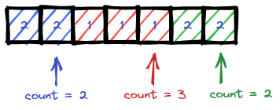

# <a id="home"></a> Majority Element

Данный раздел посвящён задаче Majority Element из **[Leetcode Patterns](https://seanprashad.com/leetcode-patterns/)**.

**Table of Contents:**
- [Majority Element](#majority)
- [Frequency of the Most Frequent Element](#frequency)

----

## [↑](#home) <a id="majority"></a> Majority Element
Рассмотрим задачу [Majority Element](https://leetcode.com/problems/majority-element/).

Эта задача easy по коду, но до её решения нужно додуматься.\
Предположим, у нас есть набор чисел ``[2,2,1,1,1,2,2]``:



Если посмотреть, то можно заметить правильный подход:
```java
public int majorityElement(int[] nums) {
    int cnt = 0, res = 0;
    for (int num : nums) {
        if (cnt == 0) res = num;
        if (res == num) {
            cnt++;
        }  else {
            cnt--;
        }
    }
    return res;
}
```
По умолчанию у нас счётчик нулевой. Каждый раз, когда счётчик в положении ноль мы запоминаем текущее число. И каждый раз, когда текущее число совпадает с тем числом, которые мы запомнили мы увеличиваем счётчик. При этом, если текущее число и то число, которое мы запомнили, различаются, то счётчик мы уменьшаем.

Интересно, что у данной задачи есть продолжение: [229. Majority Element II](https://leetcode.com/problems/majority-element-ii/)


## [↑](#home) <a id="frequency"></a> Frequency of the Most Frequent Element
Разберём задачу [Frequency of the Most Frequent Element](https://leetcode.com/problems/frequency-of-the-most-frequent-element/).\
Разбор можно посмотреть тут: [Frequency of the Most Frequent Element - Sliding Window](https://www.youtube.com/watch?v=vgBrQ0NM5vE).

Код решения:
```java
public int maxFrequency(int[] nums, int k) {
    Arrays.sort(nums); // Put values in order
    int left = 0, right = 0; // Set pointers
    int result = 0;
    long total = 0;
    while (right < nums.length) {
        total = total + nums[right];
        // Shift left pointer while we "out of budget k"
        while (nums[right] * (right - left + 1) > total + k && left <= right) {
            total = total - nums[left]; // Remove left pointer from total
            left++; // Shrink window
        }
        result = Math.max(result, right - left + 1); // Remember max window size
        right++; // Move right pointer further
    }
    return result;
}
```