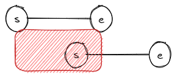
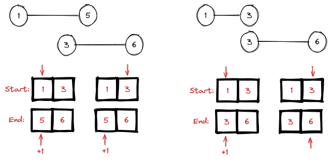

# <a id="home"></a> Meeting Rooms

**Table of Content:**
- [Meeting Rooms](#rooms)

----


## [↑](#home) <a id="rooms"></a> Meeting Rooms
Рассмотрим задачу **[Meeting Rooms](https://www.lintcode.com/problem/920/)**

Задача: дан набор интервалов вида ``[start, end]``. Нужно понять, нет ли среди этих интервалов конфликтов (наложения друг на друга).\
Разбор задачи, как обычно, можно посмотреть у NeetCode: [Meeting Rooms - Leetcode question](https://www.youtube.com/watch?v=PaJxqZVPhbg).

Основная идея: отсортировать за nLogn массив по началу интервалов и проверить, не пересекаются ли они:



Решение:
```java
public boolean canAttendMeetings(Interval[] intervals) {
    Arrays.sort(intervals, new Comparator<Interval>(){
        public int compare(Interval a, Interval b){
            return a.start-b.start;
        }
    });
 
    for(int i=0; i<intervals.length-1; i++){
        if(intervals[i].end>intervals[i+1].start){
            return false;
        }
    }
 
    return true;
}
```

У этой задачи есть продолжение: **[Meeting Rooms II - Leetcode 253](https://www.youtube.com/watch?v=FdzJmTCVyJU)**.\
Необходимо найти количество комнат, чтобы провести все митинги:



```java
public int minMeetingRooms(int[][] intervals) {
    // Prepare sorted arrays of start times AND end times
    int[] startT = new int[intervals.length];
    int[] endT = new int[intervals.length];    
    for (int i = 0; i < intervals.length; i++) {
        startT[i] = intervals[i][0];
        endT[i] = intervals[i][1];
    }
    Arrays.sort(startT);
    Arrays.sort(endT);
    
    // Set two pointers: startIndex and endIndex.
    int rooms = 1;
    int eIdx = 0;    
    for (int sIdx = 1; sIdx < len; sIdx++) {
        if (startT[sIdx] < endT[eIdx]) {
            rooms++;
        } else {
            eIdx++;
        }
    }
        
    return rooms;
}
```