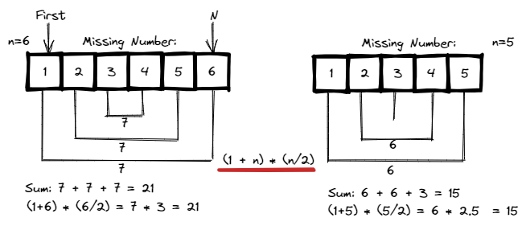

# <a id="home"></a> Missing Number

Данный раздел посвящён теме поиска пропущенного числа из **[Leetcode Patterns](https://seanprashad.com/leetcode-patterns/)**.

**Table of Content:**
- [Missing Number](#missing)
- [Bit Manipulation (XOR)](#bit)
- [Single number problem](#single)
- [Find All Numbers Disappeared in an Array](#all)


## [↑](#home) <a id="missing"></a> Missing Number
Рассмотрим задачу **"[268. Missing Number](https://leetcode.com/problems/missing-number/)"** про поиск пропущенного числа в диапазоне.\
Дан массив из n чисел (допустим из 5), где каждое число в диапазоне [0, n]. Получается, что доступных значений на 1 больше, чем размер массива, а следовательно в любом случае будет какое-то пропущенное число.

Чтобы понять решение, стоит рассмотреть пример:\
Дан массив [1,2,3,4]. Сумма всех чисел 10. Что будет, если убрать какое-нибудь число? Логично, что сумма уменьшится на это число. А вот и решение. Получается, если сложить все числа без пропуска, а затем сложить массив, то разница этих значений и станет ответом:
```java
class Solution {
    public int missingNumber(int[] nums) {
        int expected = 0;
        for (int i = 0; i <= nums.length; i++) {
            expected = expected + i;
        }
        
        int actual = 0;
        for (int num : nums) {
            actual = actual + num;
        }
        return expected - actual; 
    }
}
```

Чтобы упростить это, можно вспомнить школьный курс математики: **"[Формула суммы членов конечной арифметической прогрессии](https://interneturok.ru/lesson/algebra/9-klass/progressii/formula-summy-chlenov-konechnoy-arifmeticheskoy-progressii)"**. Существует легенда:
> Школьный учитель математики, чтобы занять детей на долгое время, предложил им сосчитать сумму чисел от 1 до 100. Юный Гаусс заметил, что попарные суммы с противоположных в одинаковы: 1+100=101, 2+99=101 и т. д., и мгновенно получил результат: 101x50=5050.

И действительно:
- для [1,2,3,4] получаем (1+4)+(2+3) = 5+5 = 10, где каждая сумма равно 5.
- для [1,2,3,4,5,6] получаем (1+6)+(2+5)+(3+4) = 7+7+7 = 21.



Можно заметить, что мало того, что каждые скобки равны, но мы и делать это должны ровно n/2 раз.\
Получается, что можно заменить это формулой: (a1+an) * (n/2). Важно помнить, что Java результат деления может сделать int и тогда вычисление будет неправильным (т.к. нам важно дробное значения деления на 2). Поэтому деление должно быть частью вычислений:
```java
int n = nums.size();
int sum = (n * (1 + n))/2;
```
Дальше останется только из этой суммы вычесть все элементы из массива. Число, которое останется, и будет нашим пропущенным числом.

----

## [↑](#home) <a id="bit"></a> Bit Manipulation (XOR)
Есть на сайте leetcode посмотреть в раздел "Related topics" этой задачи, то мы увидим "Bit Manipulation".\
Причина - возможность использовать для решения "exclusive OR" или же просто "XOR".

Работа XOR заключается в том, что если биты различаются - в результате будет 1. Если одинаковые - будет 0.\
XOR обозначается как ``^`` и имеет несколько важных правил:
- XOR на тоже число даёт ноль: n ^ n = 0 (ведь биты одинаковые)
- XOR на ноль даёт тоже число: n ^ 0 = n (ведь биты разные)
- x ^ y ^ x = y
- нет разницы, в каком порядке указаны числа

Помним, что дано условие: ``каждое число в диапазоне [0, n]``.\
Предположим, что n=3.\
Тогда, если мы пойдём по индексам, то получим: ``0^1^2``. Так как индекс на 1 меньше чем значение n, то там нужно изначально этот n добавить. Ведь может оказаться так, что именно это n и пропущено.

Тогда, наше решение может выглядеть следующим образом:
```java
class Solution {
    public int missingNumber(int[] nums) {
        int missing = nums.length; 
        for  (int i = 0; i < nums.length; i++)  { 
            missing = missing ^ i;
            missing = missing ^ nums[i];
        } 
        return missing ; 
    }
}
```

----

## [↑](#home) <a id="single"></a> Single number problem
После того, как мы ознакомились c решением при помощи XOR мы можем решить задачу **"[136. Single Number](https://leetcode.com/problems/single-number/)"**. В ней сказано, что у нас есть массив, состоящий из парных чисел, но одно из них не имеет пары. Нужно найти это число.

На самом деле эта задача очень похожа на Missing Number. Потому что это по факту та же задача.\
Если присмотреться, то мы в той задаче делали XOR для всех индексов + XOR для всех значений. И мы ожидали, что если у индекса не будет пары, мы его и получим. Получается, что индекс и значение - это и есть пары, а пропущенный элемент - это элемент без пары. 

Решение можно увидеть на таком простом примере:
```java
// [1,2,3,2,1]
System.out.println(0 ^ 1 ^ 2 ^ 3 ^ 2 ^ 1); // result = 3
```

Решением будет имея изначально значение 0 выполнить XOR для всех имеющихся значений:
```java
class Solution {
    public int singleNumber(int[] nums) {
        int result = 0;
        for(int i : nums){
            result = result ^ i;
        }
        return result;
    }
}
```

----

## [↑](#home) <a id="all"></a> Find All Numbers Disappeared in an Array
Стоит рассмотреть так же задачу на поиск пропущенных (не обязательно только одного) чисел.\
Задача на LeetCode: [Find All Numbers Disappeared in an Array](https://leetcode.com/problems/find-all-numbers-disappeared-in-an-array/).

Интересно, что решение данной задачи похоже на решение задачи по поиску дубликатов. Разница лишь в том, как получить ответ.

В задаче важно обратить внимание на условие. Дан массив из n чисел, где каждое число в диапазоне [1, n]. Получается, что число 0 не задейстовано. Это позволяет нам числа [1,n] соотнести с индексами [0,n-1]. То есть если из числа вычесть единицу, то мы можем получить индекс. На основе этого мы можем меняя массив маркировать элементы, которые мы посетили:


Таким образом, решение может выглядеть так:
```java
public List<Integer> findDisappearedNumbers(int[] nums) {
    List<Integer> result = new ArrayList<>();
    // For first round we don't care about indexes, only care about values
    for (int num : nums) {
        int indexToMark = Math.abs(num)-1;
        nums[indexToMark] = -Math.abs(nums[indexToMark]);
    }
    // For the second round find indexes with positive values
    for (int i = 0; i < nums.length; i++) {
        // There is no value (i+i) which was visited
        if (nums[i] >= 0) {
            result.add(i+1);
        }
    }
    return result;
}
```