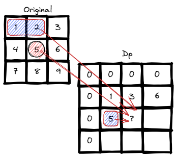

# <a id="home"></a> Other

Задачи из **[Leetcode Patterns](https://seanprashad.com/leetcode-patterns/)**.

**Table of Content:**
- [Two Furthest Houses With Different Colors](#houses)
- [Maximum Distance Between a Pair of Values](#maxDistance)
- [Maximum Absolute Sum of Any Subarray](#any)
- [Range Sum Query - Immutable](#immutable)
- [Range Sum Query 2D - Immutable](#2d)
- [Single number problem](#single)

----

## [↑](#home) <a id="houses"></a> Two Furthest Houses With Different Colors
Рассмотрим ещё одну задачу: [Two Furthest Houses With Different Colors](https://leetcode.com/problems/two-furthest-houses-with-different-colors/).

Она интересна тем, что хорошо демонстрирует подход с тем, как иногда полезно идти от простого примера к сложному:


Мы видим, что если крайние дома разные - мы уже нашли ответ. Если же нет - имеет смысл смотреть на дома с противоположной стороны.\
Таким образом решение может выглядеть так:
```java
public int maxDistance(int[] colors) {
    int len = colors.length - 1;
    int leftMost = colors[0];
    int rightMost = colors[len];
    int maxDistance = -1;
    // It's not about index or pointer, it's about shifting/window size
    for (int i = 0; i <= len; i++) {
        // Check the right side of the window
        if (leftMost != colors[len - i]) {
            maxDistance = Math.max(maxDistance, len - i);
        }
        // Check the left side of the window
        if (rightMost != colors[i]) {
            maxDistance = Math.max(maxDistance, len - i);
        }
    }
    return maxDistance;
}
```

----

## [↑](#home) <a id="maxDistance"></a> Maximum Distance Between a Pair of Values
Рассмотрим ещё одну задачу: [Maximum Distance Between a Pair of Values](https://leetcode.com/problems/maximum-distance-between-a-pair-of-values/).

Эта задача интересна тем, что визуализация может подсказать ответ:


Получаем решение:
```java
public int maxDistance(int[] nums1, int[] nums2) {
    int result = 0;
    int i = 0, j = 0;
    while(i < nums1.length && j < nums2.length) {
        if (i<=j) {
            if (nums1[i] <= nums2[j]) {
                // Valid pair
                int distance = j - i;
                result = Math.max(result, distance);
                j++;
            } else {
                // Should decrease first value to be closer to the valid condition
                i++;
            }
        } else {
            // I MUST be less then J. Other cases are not valid
            j++;
        }
    }
    return result;
}
```

----

## [↑](#home) <a id="products"></a> Maximum product subarray
Рассмотрим ещё одну задачу: [Maximum product subarray](https://leetcode.com/problems/maximum-product-subarray/).

Дан некоторый массив чисел, нужно найти подмассив с наибольшим произведением (на английском Product).

Предположим, у нас есть массив **[-5,2,-3,-4]**.\
Решением данной задачи является рассчёт одновременно максимума и минимума на каждом шагу:


Тогда код может выглядеть следующим образом:
```java
class Solution {
    public int max(int n1, int n2, int n3) {
        return Math.max(n1, Math.max(n2, n3));
    }
    public int min(int n1, int n2, int n3) {
        return Math.min(n1, Math.min(n2, n3));
    }
    
    public int maxProduct(int[] nums) {
        int min_prod = nums[0], max_prod = nums[0], ans = nums[0];
        System.out.println(max_prod);
        for (int i = 1; i < nums.length; i++) {
            int num = nums[i];
            int tmp = max_prod;
            max_prod = max(tmp * num, min_prod * num, num);
            min_prod = min(tmp * num, min_prod * num, num);
            System.out.println(max_prod);
            ans = Math.max(ans, max_prod);
        }
        return ans;
    }
}
```

Рекомендуется послушать разбор от NeetCode: [Maximum Product Subarray - Dynamic Programming](https://www.youtube.com/watch?v=lXVy6YWFcRM).

----

## [↑](#home) <a id="any"></a> Maximum absolute sum of any subarray
Рассмотрим ещё одну задачу: [Maximum Absolute Sum of Any Subarray](https://leetcode.com/problems/maximum-absolute-sum-of-any-subarray/).

Интересна она своей идеей поиска ответа. Т.к. нас интересует Abs чисел, то решение задачи сводится к поиску минимума и максимума.\
Вспомнить можно по видео "[Back to Back SWE : Max Contiguous Subarray Sum](https://youtu.be/2MmGzdiKR9Y?t=530)".


```java
public int maxAbsoluteSum(int[] nums) {
    int theMin = 0, theMax = 0;
    int curMin = 0, curMax = 0;
    int answer = Math.abs(nums[0]);

    for (int num : nums) {
        curMin = Math.min(num, curMin + num);
        curMax = Math.max(num, curMax + num);

        theMin = Math.min(curMin, theMin);
        theMax = Math.max(curMax, theMax);

        answer = Math.max(theMax, Math.abs(theMin));
    }
    return answer;
}
```

----

## [↑](#home) <a id="immutable"></a> Range Sum Query - Immutable
Разберём задачу **"[Range Sum Query - Immutable](https://leetcode.com/problems/range-sum-query-immutable/)"**.

По условию задачи известно, что будут делать множественные запросы к одному и тому же исходному массиву, но запрашивая разные диапазоны. Необходимо сделать обращения максимально эффективными, т.е. не считать сумму каждый раз заново.


То есть мы итерируемся по каждому элементу из изначального массива. У нас есть разница в 1 элемент, про которую нужно помнить:

```java
private int[] sum;

public NumArray(int[] nums) {
    // Make it bigger by one element to avoid range checks
    sum = new int[nums.length + 1];
    // Iterate over original data
    for (int i = 0; i < nums.length; i++) {
        sum[i+1] = sum[i] + nums[i];
    }
}
    
public int sumRange(int left, int right) {
    return sum[right+1] - sum[left];
}
```

----

## [↑](#home) <a id="2d"></a> Range Sum Query 2D - Immutable
Разберём задачу **"[Range Sum Query 2D - Immutable](https://leetcode.com/problems/range-sum-query-2d-immutable/)"**.

Отличная задача, показывающая что одни задачи часто состоят из других.\
Задача похожа на предыдущую, но отличие в том, что теперь у нас массив двумерный.

Во-первых, нам нужно посчитать сумму от самой верхней левой ячейки до самой правой нижней. Логика выглядит примерно так:



Нужно быть осторожным в своих рассуждениях, чтобы не допустить ошибку:
```java
public NumMatrix(int[][] matrix) {
    // Add 1 elemen to columns and rows to be able to always get previous element 
    dp = new int[matrix.length + 1][matrix[0].length + 1];
        
    for (int row = 1; row < matrix.length + 1; row++){
        for (int col = 1; col < matrix[0].length + 1; col++) {
            int num = matrix[row-1][col-1];
            int above = dp[row-1][col];
            int prefix = dp[row][col-1];
            dp[row][col] = num + above + prefix - dp[row-1][col-1];
        }
    }
}
```
Чтобы получить значение в ячейке, мы складываем само число из ячейки, посчитанную сумму до текущей строки (ячейка сверху) и префикс для текущей ячейки (ячейка слева). Однако стоит помнить, что ячейка слева содержит и посчитанную сумму до неё, поэтому мы должны вычесть эту сумму.

Зная сумму нужно теперь посчитать ответ:
```java
public int sumRegion(int row1, int col1, int row2, int col2) {
    return dp[row2+1][col2+1] - dp[row2+1][col1] - dp[row1][col2+1] + dp[row1][col1];    
}
```
Помним про то, что таблица с нашими рассчётами смещена на 1 индекс, поэтому ячейке [row1;col1] соответствует ячейка dp[row1+1;col1+1].

Чтобы выполнить рассчёт, берём [row2;col2] как нашу максимальную сумму (не забывая про смещение в единицу для индексов). Дальше из неё нужно вычесть 2 зоны: сверху и слева. Зона слева ограничена row2+1, т.к. она должна по Y закончится там же, где и искомая зона, а вот по X она должна быть ограничена col1, т.к. это на единицу меньше, чем начало искомой зоны. Аналогично с зоной сверху: она по Y заканчивается row1, т.к. это за 1 индекс до начала искомой зоны, а по X оно заканчивается там же, где и заканчивается искомая зона. А самая хитрость в том, что т.к. эти две зоны пересекаются, то значения из пересечения вычитаются 2 раза, а значит эту зону нужно прибавить: она ограничена ячейкой меньшей на 1 индекс ячейки, с которой начинается искомая зона.


По теме данной задачи есть замечательный разбор: **"[NeetCode - Range Sum Query 2D](https://www.youtube.com/watch?v=KE8MQuwE2yA)"**.

----

## [↑](#home) <a id="single"></a> Single number problem
После того, как мы ознакомились c решением при помощи XOR мы можем решить задачу **"[136. Single Number](https://leetcode.com/problems/single-number/)"**. В ней сказано, что у нас есть массив, состоящий из парных чисел, но одно из них не имеет пары. Нужно найти это число.

На самом деле эта задача очень похожа на Missing Number. Потому что это по факту та же задача.\
Если присмотреться, то мы в той задаче делали XOR для всех индексов + XOR для всех значений. И мы ожидали, что если у индекса не будет пары, мы его и получим. Получается, что индекс и значение - это и есть пары, а пропущенный элемент - это элемент без пары. 

Решение можно увидеть на таком простом примере:
```java
// [1,2,3,2,1]
System.out.println(0 ^ 1 ^ 2 ^ 3 ^ 2 ^ 1); // result = 3
```

Решением будет имея изначально значение 0 выполнить XOR для всех имеющихся значений:
```java
class Solution {
    public int singleNumber(int[] nums) {
        int result = 0;
        for(int i : nums){
            result = result ^ i;
        }
        return result;
    }
}
```