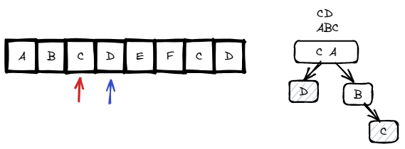

# <a id="home"></a> Index Pairs of a String

Данный раздел посвящён задачам на trie из **[Leetcode Patterns](https://seanprashad.com/leetcode-patterns/)**.\

**Table of Contents:**
- [Implement Prefix Tree](#implement)
- [Index Pairs of a String](#pairsindex)

----

## [↑](#home) <a id="implement"></a> Implement Prefix Tree
Разберём задачу [Implement Prefix Tree](https://leetcode.com/problems/implement-trie-prefix-tree/).\
Её разбор можно посмотреть у [NeetCode: Implement Prefix Tree](https://www.youtube.com/watch?v=oobqoCJlHA0).

Нужно реализовать структуру Trie. И для начала нам нужно определиться с тем, как выглядит эта структура. Благодаря ограничению на только маленькие буквы английского алфавита мы знаем, что у нас может быть не больше 26 значений. Таким образом каждый элемент нашего Trie содержит массив, где каждый индекс соответствует номеру символа. А так же флаг означающий, что это было слово.
```java
class Trie {
    Trie[] ch = new Trie[26];
    boolean end = false;
```

Далее надо реализовать вставку:
```java
public void insert(String word) {
    Trie node = this;
    for (int i = 0; i < word.length(); i++) {
        int ch = word.charAt(i) - 'a'; // 'a' - 'a' = 0
        if (node.ch[ch] == null) node.ch[ch] = new Trie();
        node = node.ch[ch];
    }
    node.end = true;
}
```

Далее нам нужно реализовать поиск слова целиком или префикса. Разница в них лишь в том, нужно ли нам проверять, что последний из найденных элементов имеет флаг node.end или нет:
```java
private boolean search(String word, boolean isWord) {
    Trie node = this;
    for (int i = 0; i < word.length(); i++) {
        int ch = word.charAt(i) - 'a'; // Expected index
        node = node.ch[ch];
        if (node == null) return false;
    }
    if (isWord) return node.end;
    return true;
}
```

Остаётся только использовать данный метод для решения задачи:
```java
public boolean search(String word) {
    return search(word, true);
}
    
public boolean startsWith(String prefix) {
    return search(prefix, false);
}
```


## [↑](#home) <a id="pairsindex"></a> Index Pairs of a String
Разберём задачу **"[Index Pairs of a String](https://www.codingninjas.com/codestudio/problems/ninja-and-index-pairs_1462451)"**.

Для начала создадим структуру Trie:
```java
public static class Trie {
    boolean is = false;
    Trie[] ch = new Trie[26]; //a = 0, z = 25

    void insert(String s) {
        Trie parent = this;
        for (int i = 0; i < s.length(); i++) {
            int ch = s.charAt(i) - 'a';
            if (parent.ch[ch] == null) {
                parent.ch[ch] = new Trie();
            }
            // Each char = new step
            // Each new step uses previous step as parent 
            parent = parent.ch[ch];
        }
        parent.is = true;
    }
}
```

Для начала, нам нужно заполнить эту структуру данными:
```java
public static ArrayList<ArrayList<Integer>> indexPairs(String text, String words[]) {
    Trie root = new Trie();
    for (String word : words) {
        root.insert(word);
    }
```

Теперь остаётся только написать сам алгоритм:



Нам понадобится два указателя:
- Указатель i будет указывать на начало слова. То есть он будет вставать на некоторый символ и таким образом мы будем искать все слова, которые начинаются с этого символа. Это позволит в том числе найти все вхождения слов, которые встречаются несколько раз. Например 'cd' в строке 'abcdefcd'.
- Указатель j будет идти по всем символам начиная с позиции i ожидая найти конец слова. Как только он находит конец слова - добавляем новую запись [i, j]

Решение может выглядеть следующим образом:
```java
ArrayList<ArrayList<Integer>> result = new ArrayList<>();
// Iterate over all character in text
for (int i = 0; i < text.length(); i++) {
    Trie node = root;
    for (int j = i; j < text.length(); j++) {
        int ch = text.charAt(j) - 'a';
        if (node.ch[ch] == null) {
            break;
        }

        node = node.ch[ch];
        if (node.is) {
            ArrayList<Integer> pair = new ArrayList<>();
            pair.add(i);
            pair.add(j);
            result.add(pair);
        }
    }
}
return result;
```
