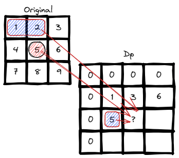
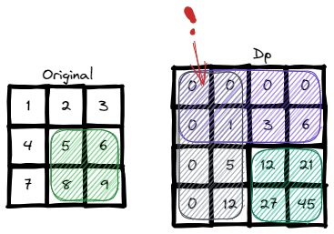

# <a id="home"></a> Range Sum Query

Данный раздел посвящён теме "Range Sum Query - Immutable" из **[Leetcode Patterns](https://seanprashad.com/leetcode-patterns/)**.

**Table of Content:**
- [Range Sum Query - Immutable](#immutable)
- [Range Sum Query 2D - Immutable](#2d)

----

## [↑](#home) <a id="immutable"></a> Range Sum Query - Immutable
Разберём задачу **"[Range Sum Query - Immutable](https://leetcode.com/problems/range-sum-query-immutable/)"**.

По условию задачи известно, что будут делать множественные запросы к одному и тому же исходному массиву, но запрашивая разные диапазоны. Необходимо сделать обращения максимально эффективными, т.е. не считать сумму каждый раз заново.


То есть мы итерируемся по каждому элементу из изначального массива. У нас есть разница в 1 элемент, про которую нужно помнить:

```java
private int[] sum;

public NumArray(int[] nums) {
    // Make it bigger by one element to avoid range checks
    sum = new int[nums.length + 1];
    // Iterate over original data
    for (int i = 0; i < nums.length; i++) {
        sum[i+1] = sum[i] + nums[i];
    }
}
    
public int sumRange(int left, int right) {
    return sum[right+1] - sum[left];
}
```

----

## [↑](#home) <a id="2d"></a> Range Sum Query 2D - Immutable
Разберём задачу **"[Range Sum Query 2D - Immutable](https://leetcode.com/problems/range-sum-query-2d-immutable/)"**.

Отличная задача, показывающая что одни задачи часто состоят из других.\
Задача похожа на предыдущую, но отличие в том, что теперь у нас массив двумерный.

Во-первых, нам нужно посчитать сумму от самой верхней левой ячейки до самой правой нижней. Логика выглядит примерно так:



Нужно быть осторожным в своих рассуждениях, чтобы не допустить ошибку:
```java
public NumMatrix(int[][] matrix) {
    // Add 1 elemen to columns and rows to be able to always get previous element 
    dp = new int[matrix.length + 1][matrix[0].length + 1];
        
    for (int row = 1; row < matrix.length + 1; row++){
        for (int col = 1; col < matrix[0].length + 1; col++) {
            int num = matrix[row-1][col-1];
            int above = dp[row-1][col];
            int prefix = dp[row][col-1];
            dp[row][col] = num + above + prefix - dp[row-1][col-1];
        }
    }
}
```
Чтобы получить значение в ячейке, мы складываем само число из ячейки, посчитанную сумму до текущей строки (ячейка сверху) и префикс для текущей ячейки (ячейка слева). Однако стоит помнить, что ячейка слева содержит и посчитанную сумму до неё, поэтому мы должны вычесть эту сумму.

Зная сумму нужно теперь посчитать ответ:
```java
public int sumRegion(int row1, int col1, int row2, int col2) {
    return dp[row2+1][col2+1] - dp[row2+1][col1] - dp[row1][col2+1] + dp[row1][col1];    
}
```
Помним про то, что таблица с нашими рассчётами смещена на 1 индекс, поэтому ячейке [row1;col1] соответствует ячейка dp[row1+1;col1+1].

Чтобы выполнить рассчёт, берём [row2;col2] как нашу максимальную сумму (не забывая про смещение в единицу для индексов). Дальше из неё нужно вычесть 2 зоны: сверху и слева. Зона слева ограничена row2+1, т.к. она должна по Y закончится там же, где и искомая зона, а вот по X она должна быть ограничена col1, т.к. это на единицу меньше, чем начало искомой зоны. Аналогично с зоной сверху: она по Y заканчивается row1, т.к. это за 1 индекс до начала искомой зоны, а по X оно заканчивается там же, где и заканчивается искомая зона. А самая хитрость в том, что т.к. эти две зоны пересекаются, то значения из пересечения вычитаются 2 раза, а значит эту зону нужно прибавить: она ограничена ячейкой меньшей на 1 индекс ячейки, с которой начинается искомая зона.



По теме данной задачи есть замечательный разбор: **"[NeetCode - Range Sum Query 2D](https://www.youtube.com/watch?v=KE8MQuwE2yA)"**.