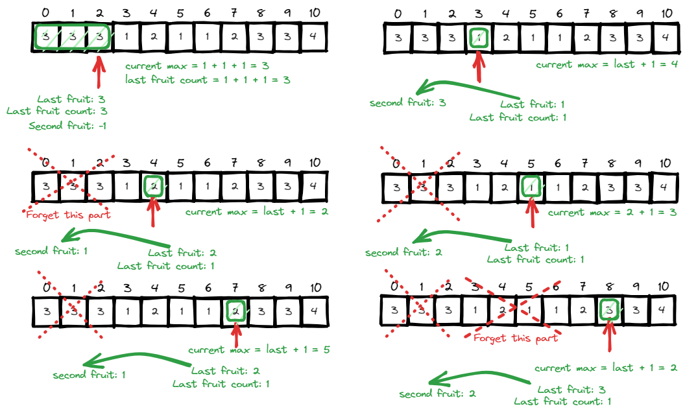
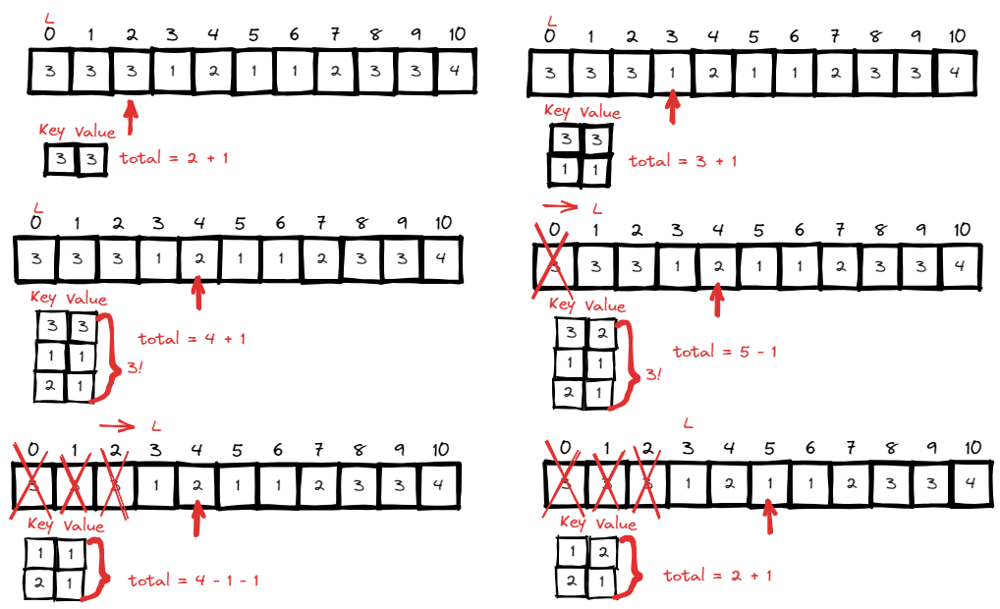
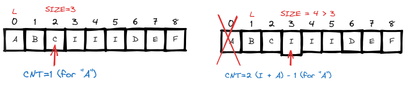
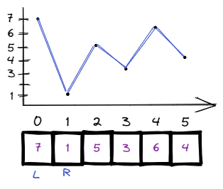
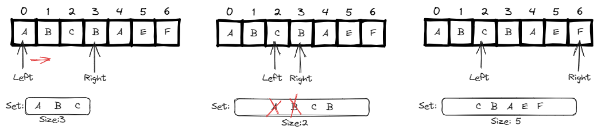
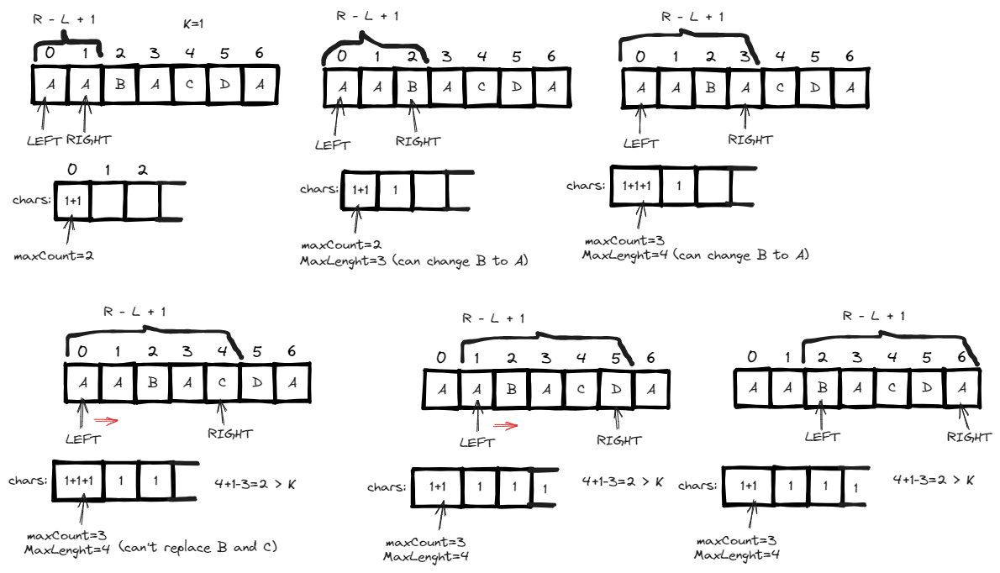
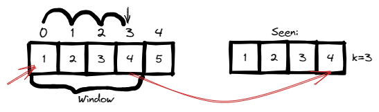

# <a id="home"></a> Sliding Window

Данный раздел посвящён задачам на использование техники Sliding Window.\
Продолжаем двигаться по [Roadmap](https://neetcode.io/roadmap) от NeetCode.\
Данные задачи входят в том числе в **[Leetcode Patterns](https://seanprashad.com/leetcode-patterns/)**.

**Table of Contents:**
- [Max Consecutive Ones](#consecutive)
- [Maximum Average Subarray I](#maxAverage)
- [Minimum Size Subarray Sum](#minSize)
- [Fruit Into Baskets](#fruits)
- [Maximum Number of Vowels in a Substring of Given Length](#vowels) 
- [Max Consecutive Ones III](#consecutive3)
- [Longest Subarray of 1's After Deleting One Element](#afterDeleting)
- [Best Time to Buy And Sell Stock](#bestTime)
- [Best Time to Buy and Sell Stock II](#bestTime2)
- [Longest Substring Without Repeating Characters](#longestSubstring)
- [Longest Repeating Character Replacement](#longestRepeating)
- [Permutation in string](#permutation)
- [Minimum Window Substring](#minWindow)
- [Sliding Window Maximum](#windowMax)
- [Nearby Duplicate](#nearby)

----

## [↑](#home) <a id="consecutive"></a> Max Consecutive Ones
Рассмотрим задачу "[Max Consecutive Ones](https://leetcode.com/problems/max-consecutive-ones/)":
> Дан массив из единиц и нулей. Найти размер самой длинной последовательности из единиц.

Разбор решения от Nick White: [LeetCode Max Consecutive Ones Solution Explained](https://www.youtube.com/watch?v=PLa4tYQhqoU)

Решение:
```java
public int findMaxConsecutiveOnes(int[] nums) {
    int cur = 0, max = 0;
    for (int i = 0; i < nums.length; i++) {
        if (nums[i] == 1) {
            cur++;
            max = Math.max(max, cur);
        } else {
            cur = 0;
        }
    }
    return max;
}
```

----

## [↑](#home) <a id="maxAverage"></a> Maximum Average Subarray I
Рассмотрим задачу "[Maximum Average Subarray I](https://leetcode.com/problems/maximum-average-subarray-i/)":
> Дан массив из чисел и некоторый размер окна k. Нужно найти максимальное среднее значение среди всех "окон".

Разбор задачи: [Coding with Christian: Maximum Average Subarray I](https://www.youtube.com/watch?v=d9bT1paHGHw).

Решение:
```java
public double findMaxAverage(int[] nums, int k) {
    double window = 0;
    // Calculate the sum for the first window position
    for (int i = 0; i < k; i++) {
        window = window + nums[i];
    }
    double result = window;
    for (int i = k; i < nums.length; i++) {
        // Expand window to the right and shrink the left border
        window = window + nums[i] - nums[i - k];
        result = Math.max(result, window);
    }
    return result / k;
}
```

----

## [↑](#home) <a id="minSize"></a> Minimum Size Subarray Sum
Рассмотрим задачу "[Minimum Size Subarray Sum](https://leetcode.com/problems/minimum-size-subarray-sum/)":
> Дан массив положительных чисел и некоторое целевое число target. Найти минимальный размер подмассива, сумма которого равна или больше чем target. Если такого нет - вернуть ноль.

Разбор от NeetCode: [Minimum Size Subarray Sum](https://www.youtube.com/watch?v=aYqYMIqZx5s)

Решение:
```java
public int minSubArrayLen(int target, int[] nums) {
    int total = 0, length = Integer.MAX_VALUE;
    int left = 0;
    for (int right = 0; right < nums.length; right++) {
        total = total + nums[right];
            
        while (total >= target) {
            length = Math.min(length, right - left + 1);
            total = total - nums[left];
            left++;
        }
    }
    return length != Integer.MAX_VALUE ? length : 0;
}
```

----

## [↑](#home) <a id="fruits"></a> Fruit Into Baskets
Рассмотрим задачу "[Fruit Into Baskets](https://leetcode.com/problems/fruit-into-baskets/)":
> У нас есть две карзины, каждая из которых может содержать фрукты только одного типа, но их количество не ограничено. Так же дан ряд деревьев. Можно начать с любого из них, но как только мы достигнем дерево, с которого мы не можем снять фрукт мы останавливаемся. Вернуть максимальное кол-во фруктов, которое можно собрать.

Разбор задачи от NeetCode: [Fruit Into Baskets Solution](https://www.youtube.com/watch?v=yYtaV0G3mWQ).\
Разбор задачи от Nick White: [LeetCode Fruit Into Baskets Solution Explained](https://www.youtube.com/watch?v=s_zu2dOkq80).

К решению данной задачи есть два разных подхода.

Один из них - через набор из разных указателей. Довольно интересный подход, главное не запутаться =)



Решение:
```java
public int totalFruit(int[] fruits) {
    int actFruit = -1, prevFruit = -1;
    int actFruitCnt = 0;
    int curMax = 0, total = 0;

    for (int fruit : fruits) {
        if (fruit == actFruit || fruit == prevFruit) {
            curMax++; // The same sequence
        } else {
            curMax = actFruitCnt + 1; // new element, forget sequence start 
        }
        if (fruit == actFruit) {
            actFruitCnt++;
        } else {
            // Update/switch actual fruit
            prevFruit = actFruit;
            actFruit = fruit;
            actFruitCnt = 1;
        }
        total = Math.max(total, curMax);
    }
    return total;
}
```

Другое решение проще в реализации, но требует дополнительного места:



```java
public int totalFruit(int[] fruits) {
    Map<Integer, Integer> map = new HashMap<>();
    int total = 0, result = 0;
    
    int left = 0;
    for (int fruit : fruits) {
        map.put(fruit, map.getOrDefault(fruit, 0) + 1);
        total++;

        while (map.size() > 2) {
            Integer leftFruit = fruits[left];
            map.put(leftFruit, map.get(leftFruit) - 1);
            total--;
            left++;
            if (map.get(leftFruit) == 0) {
                map.remove(leftFruit);
            }
        }
        result = Math.max(result, total);
    }
    return result;
}
```

----

## [↑](#home) <a id="vowels"></a> Maximum Number of Vowels in a Substring of Given Length
Рассмотрим задачу "[Maximum Number of Vowels in a Substring of Given Length](https://leetcode.com/problems/maximum-number-of-vowels-in-a-substring-of-given-length/)":
> Дана строка S и некоторое число K. Вернуть максимальное число гласных в подстроке длинной в K.

Разбор задачи от NeetCode: [Maximum Number of Vowels in a Substring of Given Length](https://www.youtube.com/watch?v=kEfPSzgL-Ss).



Решение:
```java
public int maxVowels(String s, int k) {
    char[] vowels = {'a', 'e', 'i', 'o', 'u'};
    int cnt = 0;
    int l = 0;
    int result = 0;
    for (int r = 0; r < s.length(); r++) {
        if (Arrays.binarySearch(vowels, s.charAt(r)) >= 0) {
            cnt++;
        }
            
        int size = r - l + 1;
        if (size > k) {
            if (Arrays.binarySearch(vowels, s.charAt(l)) >= 0) {
                cnt--;
            }
            l++;
        }
        result = Math.max(result, cnt);
    }
    return result;
}
```

----

## [↑](#home) <a id="consecutive3"></a> Max Consecutive Ones III
Рассмотрим задачу "[Max Consecutive Ones III](https://leetcode.com/problems/max-consecutive-ones-iii/)":
> Дан массив из единиц и нулей, а так же число K. Вернуть максимальную длину последовательности единиц с учётом того, что мы можем изменить нули на единицу не больше чем K раз.

Разбор решения от Ihor Codes: [Разбор Max Consecutive Ones III](https://www.youtube.com/watch?v=2ZjDR5fjQj8).

```java
public int longestOnes(int[] nums, int k) {
    int zeroes = 0;
    int result = 0;
    int left = 0;
    for (int right = 0; right < nums.length; right++) {
        if (nums[right] == 0) {
            while (zeroes >= k) {
                if (nums[left] == 0) zeroes--;
                left++;
            }
            zeroes++;
        }
        result = Math.max(result, right - left + 1);
    }
    return result;
}
```

----

## [↑](#home) <a id="afterDeleting"></a> Longest Subarray of 1's After Deleting One Element
Рассмотрим задачу "[Longest Subarray of 1's After Deleting One Element](https://leetcode.com/problems/longest-subarray-of-1s-after-deleting-one-element/)":
> Дан массив из единиц и нулей. Вернуть максимальную длину последовательности единиц с учётом того, что мы обязаны удалить ОДИН элемент.

Разбор решения: **"[Solving the 'Longest Subarray of 1's After Deleting One Element' Problem in Java](https://www.youtube.com/watch?v=zuMwPkI4nnU)"**.

```java
public int longestSubarray(int[] nums) {
    int zeroes = 0;
    int result = 0;
    int left = 0;
    for (int right = 0; right < nums.length; right++) {
        if (nums[right] == 0) zeroes++;
        while (zeroes > 1) {
            if (nums[left] == 0) zeroes--;
            left++;
        }
        result = Math.max(result, right - left + 1);
    }
    return result - 1;
}
```

Есть ещё одно хитрое решение:
```java
public int longestSubarray(int[] nums) {
    // Number of ones before and after the last zero
    int beforeZero = 0, afterZero = 0;
    int result = 0;
    for(int i : nums) {
        if(i == 0) {
            result = Math.max(result, beforeZero + afterZero);
            beforeZero = afterZero;
            afterZero = 0;
        } else {
            afterZero++;
        }
    }
    //if there is no 0's in array , then one 1 should be deleted
    if(afterZero == nums.length) return nums.length - 1; 
        
    return Math.max(result, beforeZero + afterZero);
}
```

----

## [↑](#home) <a id="bestTime"></a> Best Time to Buy And Sell Stock
Рассмотрим задачу "[Best Time to Buy And Sell Stock](https://leetcode.com/problems/best-time-to-buy-and-sell-stock/)":
> Дан массив, где каждый элемент - это цена на конкретный день. Нужно найти максимальную выгоду от покупки в один ден и продажи в другой.

Разбор задачи от NeetCode: [Sliding Window: Best Time to Buy and Sell Stock](https://www.youtube.com/watch?v=1pkOgXD63yU).\
Разбор задачи от Сергея Пузанковым: [Лучшее время для покупки акций](https://www.youtube.com/watch?v=wm8hhQyIR9o).

Начнём, как обычно, с визуализации примера с LeetCode:



Когда выгодно купить, если мы можем купить всего один раз? Когда цена минимальная.\
Когда выгодно продать, если мы можем продать всего один раз? Когда цена максимальна.

Получаем два указателя (и **two pointers** задачу): L (left, покупка) и R (right, продажа).\
Если покупка (L) меньше продажи (R): считаем выгоду (profit) и запоминаем максимальный профит на текущий момент.\
Если покупка (R) больше продажи (R): найден новый самый минимальный элемент.

```java
public int maxProfit(int[] prices) {
    int maxProfit = 0;
    int l = 0, r = 1;
    while (r < prices.length) {
        if (prices[l] < prices[r]) {
            int profit = prices[r] - prices[l];
            maxProfit = Math.max(maxProfit, profit);
        } else {
            l = r;
        }
        r++;
    }
    return maxProfit;
}
```

Ту же задачу можно решить немного по-другому, не через указатели, а манипулируя только понятиями "минимальный элемент" (ограничивает зону элементов, которые мы рассматриваем) и "максимальная выгода":
```java
public int maxProfit(int[] prices) {
    int maxProfit = 0;
    int minElement = prices[0];

    for (int price : prices) {
        // Profit is when price bigger than min element
        maxProfit = Math.max(maxProfit, price - minElement);
        minElement = Math.min(minElement, price);
    }
    return maxProfit;
}
```

----

## [↑](#home) <a id="bestTime2"></a> Best Time to Buy and Sell Stock II
Разберём задачу **"[Best Time to Buy and Sell Stock II](https://leetcode.com/problems/best-time-to-buy-and-sell-stock-ii)"**.\
В отличии от первой части задачи, теперь мы можем иметь несколько транзакций (т.е. пар купил-продал).

Важно увидеть, что если у нас есть последовательность вроде [1,7,3,5], то если у нас есть несколько транзакций, то всегда выгоднее купить тогда, когда дальше следует рост, т.е. el[i] < el[i+1], а продать тогда, когда дальше следует падение el[i] > el[i+1]. Может захотеть запоминать крайние состояния, но если мы будем просто добавлять к профиту каждый кусочек, то нам не нужно даже ничего запоминать.

```java
public int maxProfit(int[] prices) {
    int profit = 0;
    for (int i = 1; i < prices.length; i++) {
        if (prices[i] > prices[i-1]) {
            profit = profit + (prices[i] - prices[i-1]);
        }
    }
    return profit;
}
```

----

## [↑](#home) <a id="longestSubstring"></a> Longest Substring Without Repeating Characters
Разберём задачу **"[Longest Substring Without Repeating Characters](https://leetcode.com/problems/longest-substring-without-repeating-characters/)"**:
> Дана строка s. Нужно найти длину максимальной подстроки без повторных символов

Разбор от NeetCode: [Longest Substring Without Repeating Characters](https://www.youtube.com/watch?v=wiGpQwVHdE0).



Получается, что мы управляем "окном" значений, представленный хэшсетом. Если элемента в окне нет - мы расширяем окно. Если элемент есть - сужаем до тех пор, пока все значения в окне не будут уникальны, ведь значения должны идти друг за другом (например окно "ABCB" нужно сжать до "CB" чтобы не было повторений). 

Решение:
```java
public int lengthOfLongestSubstring(String s) {
    int left = 0, right = 0;
    int max = 0;
    Set<Character> set = new HashSet<>();

    while (right < s.length()) {
        if (!set.contains(s.charAt(right))){
            set.add(s.charAt(right));
            right++;
            max = Math.max(max, set.size());
        } else {
            set.remove(s.charAt(left));
            left++;
        }
    }
    return max;
}
```

----

## [↑](#home) <a id="longestRepeating"></a> Longest Repeating Character Replacement
Разберём задачу **"[Longest Repeating Character Replacement](https://leetcode.com/problems/longest-repeating-character-replacement/)"**:
> Дана строка s и некоторое число k. Нужно найти самую длинную строку из одинаковых символов с учётом того, что у нас есть k раз, которые мы можем заменить любой символ на любой другой нужный нам символ.

Разбор от NeetCode: [Longest Repeating Character Replacement](https://www.youtube.com/watch?v=gqXU1UyA8pk).



```java
public int characterReplacement(String s, int k) {
    char[] chars = new char[26]; //A-Z
    int maxCount = 0;
    int maxLength = 0;
        
    int left = 0;
    for (int right = 0; right < s.length(); right++) {
        int curChar = s.charAt(right) - 'A';
        chars[curChar]++;
        int curCharCount = chars[curChar];
            
        maxCount = Math.max(maxCount, curCharCount);
        // Sequence length : right - left + 1 
        while(right - left + 1 - maxCount > k) {
            chars[s.charAt(left) - 'A']--;
            left++;
        }
        maxLength = Math.max(maxLength, right - left + 1);
    }
    return maxLength;
}
```

----

## [↑](#home) <a id="permutation"></a> Permutation in string
Разберём задачу **"[Permutation in string](https://leetcode.com/problems/permutation-in-string/)"**:
> Дано две строки s1 и s2. Вернуть true если строка 2 содержит перестановку строки s1. Например, строка eidbaooo содержит перстановку ab.

Разбор от NeetCode: [Permutation in string](https://www.youtube.com/watch?v=UbyhOgBN834).

Код решения:
```java
public boolean checkInclusion(String s1, String s2) {
    if (s2.length() < s1.length()) return false;
    // Represent strings as "buckets" hash
    int[] source = new int[26];
    int[] target = new int[26];
    // Source string length == sliding window size
    // Count letters in the "window"
    for (int i = 0; i < s1.length(); i++) {
        source[s1.charAt(i) - 'a']++;
        target[s2.charAt(i) - 'a']++;
    }
    // Count matches for the window initial position
    int matches = 0;
    for (int i = 0; i < 26; i++) {
        if (source[i] == target[i]) matches++;
    }
    // Move sliding window
    int left = 0;
    for (int right = s1.length(); right < s2.length(); right++) {
        if (matches == 26) return true;
        // Shift window right boundary
        int index = s2.charAt(right) - 'a';
        target[index]++;
        if (source[index] == target[index]) matches++;
        if (source[index] + 1 == target[index]) matches--; // Found more than we saw
        // Shift window left boundary 
        index = s2.charAt(left) - 'a';
        target[index]--;
        if (source[index] == target[index]) matches++;
        if (source[index] -1 == target[index]) matches--; // See less than before
        left++;
    }
    return (matches == 26);
}
```

----

## [↑](#home) <a id="minWindow"></a> Minimum Window Substring
Разберём задачу **"[Minimum Window Substring](https://leetcode.com/problems/minimum-window-substring/)"**:
> Дано две строки s и t. Нужно вернуть минимальную длину "окна", в котором встретятся все символы из строки t (включая повторы).

Разбор от NeetCode: [Minimum Window Substring](https://www.youtube.com/watch?v=jSto0O4AJbM).

Решение:
```java
public String minWindow(String s, String t) {
    // Create a hash for source string
    Map<Character, Integer> hash = new HashMap<>();
    for (char chr: t.toCharArray()) {
        hash.put(chr, hash.getOrDefault(chr, 0) + 1);
    }
		
    int have = 0, need = hash.size();
    String result = "";
    int left = 0;
        
    Map<Character, Integer> window = new HashMap<>();
    for (int r = 0; r < s.length(); r++) {
        Character chr = s.charAt(r);
        window.put(chr, window.getOrDefault(chr, 0) + 1);
        // PAY ATTENTION: Compare ONLY with equals!
        if (hash.containsKey(chr) && hash.get(chr).equals(window.get(chr))) {
            have++;
            System.out.println("Increment have to " + have);
        }
			
        // If we found match try to shrink the window
        while (have == need) {
            if (result.length() == 0 || (r - left + 1) <= result.length()) {
                result = s.substring(left, r + 1);
            }
            // Shrink window by character from the left
            Character leftChar = s.charAt(left);
            window.put(leftChar, window.get(leftChar) - 1);
            if (hash.containsKey(leftChar) && window.get(leftChar) < hash.get(leftChar)) {
                have--;
            }
            left++;
        }
    }
    return result;
}
```

----

## [↑](#home) <a id="windowMax"></a> Sliding Window Maximum
Разберём задачу **"[Sliding Window Maximum](https://leetcode.com/problems/sliding-window-maximum/)"**:
> Дан массив из чисел и размер "окна" через которое мы смотрим на массив. Окно двигается на 1 позицию вправо каждый раз. Нужно вернуть массив макимумов, которые мы видим на каждой итерации.

Разбор от NeetCode: [Sliding Window Maximum - Monotonic Queue](https://www.youtube.com/watch?v=DfljaUwZsOk).

Решение:
```java
public int[] maxSlidingWindow(int[] nums, int k) {
    int[] result = new int[nums.length - k + 1];
    Deque<Integer> window = new ArrayDeque<>();
    int left = 0;
    for (int right = 0; right < nums.length; right++) {
        // Maintain decreasing order
        while (!window.isEmpty() && nums[window.getLast()] < nums[right]) {
            window.removeLast();
        }
        window.addLast(right);
        // Remove element that are outside window
        if (left > window.getFirst()) {
            window.removeFirst();
        }

        if (right + 1 >= k) {
            result[right + 1 - k] = nums[window.getFirst()];
            left++;
        }
    }
    return result;
}
```

----

## [↑](#home) <a id="nearby"></a> Nearby Duplicate
Есть усложнённая версия поиска дубликатов: **"[219. Contains Duplicate II](https://leetcode.com/problems/contains-duplicate-ii/)"**.
Необходимо найти не просто дубликат, а ближайший дубликат в определённом диапазоне длинной k.

Нужно смотреть на дубликаты только в определённом диапазоне, т.е. нужно рассматривать только некоторую ограниченную область.\
Такую область называют "окном", а название подхода - **"[Window Sliding](https://www.geeksforgeeks.org/window-sliding-technique/)"**.



Как видно, мы анализируем на 1 элемент больше, чем размер окна. При этом перед следующим заходом мы должны компенсировать это различие:
```java
public boolean containsNearbyDuplicate(int[] nums, int k) {
    Set<Integer> seen = new HashSet<>();
    // It's important for us to know about current index (i.e. current position)
    for (int i = 0; i < nums.length; i++) {
        if (!seen.add(nums[i])) {
            return true;
        }
        // Maintain window size. Remove element by value of element that is
        // For [1,2,3,4,5] and k=3 after addition of 4 we should remove inxed 3-3=0
        if (seen.size() > k) seen.remove(nums[i-k]);
    }
    return false;
}
```

----