# [←](../README.md) <a id="home"></a> Sliding Window

Данный раздел посвящён задачам на использование техники Sliding Window.\
Продолжаем двигаться по [Roadmap](https://neetcode.io/roadmap) от NeetCode.\
Данные задачи входят в том числе в **[Leetcode Patterns](https://seanprashad.com/leetcode-patterns/)**.

**Table of Contents:**
- [[485] Max Consecutive Ones](#consecutive)
- [[169] Majority Element](#majority)
- [[1446] Consecutive Characters](#consecutiveChars)
- [[643] Maximum Average Subarray I](#maxAverage)
- [[209] Minimum Size Subarray Sum](#minSize)
- [[219] Contains Duplicate II (Nearby Duplicate)](#nearby)
- [[1456] Maximum Number of Vowels in a Substring of Given Length](#vowels) 
- [[1004] Max Consecutive Ones III](#consecutive3)
- [[1493] Longest Subarray of 1's After Deleting One Element](#afterDeleting)
- [[3] Longest Substring Without Repeating Characters](#longestSubstring)
- [[904] Fruit Into Baskets](#fruits)
- [[424] Longest Repeating Character Replacement](#longestRepeating)
- [[567] Permutation in string](#permutation)
- [[76] Minimum Window Substring](#minWindow)
- [[239] Sliding Window Maximum](#windowMax)
- [[220] Nearby Almost Duplicate](#almostduplicate)
- [[1838] Frequency of the Most Frequent Element](#frequency)

----

## [↑](#home) <a id="consecutive"></a> 485. Max Consecutive Ones
Рассмотрим задачу "[485. Max Consecutive Ones](https://leetcode.com/problems/max-consecutive-ones/)":
> Дан массив из единиц и нулей. Найти размер самой длинной последовательности из единиц.

Базовая задача на понимание техники **Sliding Window**.\
Sliding Window - это "развитие" идеи [Two Pointers](../pages/TwoPointers.md).

Нам нужно найти самый длинный подмассив, который содерджит только единицы.\
Как только мы встречаем единицу - мы начинаем считать подмассив.\
Как только встречаем не единицу - обновлем (если надо) известный максимум и сбрасываем подмассив.

Таким образом, при встрече единицы мы как бы оставляем мысленно один указатель.\
А второй указатель "растягивает" окно, пока удовлетворяется условие - "содержит только единицы".

Визуально представить это можно следующим образом:

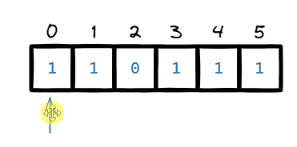

Разбор решения от Nick White: [LeetCode Max Consecutive Ones Solution Explained](https://www.youtube.com/watch?v=PLa4tYQhqoU)

<details><summary>Решение</summary>

```java
public int findMaxConsecutiveOnes(int[] nums) {
    int cur = 0, max = 0;
    for (int num : nums) {
        if (num == 0) {
            cur = 0; // Reset window
        } else {
            cur++; // Extend window (grow)
            max = Math.max(max, cur); // Check for each step
        }
    }
    return max;   
}
```
</details>

----

## [↑](#home) <a id="majority"></a> 169. Majority Element
Рассмотрим задачу [169. Majority Element](https://leetcode.com/problems/majority-element/).

Задача с интересным подходом к Sliding Window.

Эта задача easy по коду, но до её решения нужно додуматься.\
Предположим, у нас есть набор чисел ``[2,2,1,1,1,2,2]``:

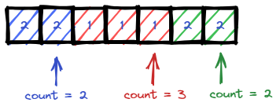

Если посмотреть, то можно заметить правильный подход:
```java
public int majorityElement(int[] nums) {
    int cnt = 0, res = 0;
    for (int num : nums) {
        if (cnt == 0) res = num;
        if (res == num) {
            cnt++;
        }  else {
            cnt--;
        }
    }
    return res;
}
```
По умолчанию у нас счётчик нулевой. Каждый раз, когда счётчик в положении ноль мы запоминаем текущее число. И каждый раз, когда текущее число совпадает с тем числом, которые мы запомнили мы увеличиваем счётчик. При этом, если текущее число и то число, которое мы запомнили, различаются, то счётчик мы уменьшаем.

Разбор задачи: [NeetCode: Majority Element](https://www.youtube.com/watch?v=7pnhv842keE)

Интересно, что у данной задачи есть продолжение: [229. Majority Element II](https://leetcode.com/problems/majority-element-ii/)

----

## [↑](#home) <a id="consecutiveChars"></a> 1446. Consecutive Characters
Рассмотрим задачу "[1446. Consecutive Characters](https://leetcode.com/problems/consecutive-characters/description/)":
> Дан массив из цифр. Нужно найти самую длинную последовательность из одинаковых цифр.

Данная задача очень похожа на [Max Consecutive Ones](#consecutive).\
Единственное, мы должны отслеживать символ текущей последовательности.

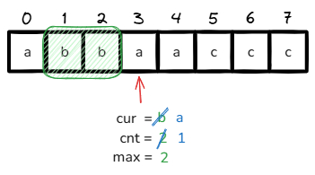

<details><summary>Решение</summary>

```java
public int maxPower(String s) {
    char lastChar = s.charAt(0);
    int power = 0, maxPower = 0;
    for (char chr : s.toCharArray()) {
        if (lastChar == chr) {
            power++; // Increase current power
            maxPower = Math.max(maxPower, power); // Maybe new maximum?
        } else {
            lastChar = chr; // new sequence with different char
            power = 1; // new power calculation
        }
    }
    return maxPower;
}
```
</details>

----

## [↑](#home) <a id="maxAverage"></a> 643. Maximum Average Subarray I
Рассмотрим задачу "[643. Maximum Average Subarray I](https://leetcode.com/problems/maximum-average-subarray-i/)":
> Дан массив из чисел и размер окна k. Нужно найти максимальное среднее значение среди всех "окон".

Разбор задачи: [Coding with Christian: Maximum Average Subarray I](https://www.youtube.com/watch?v=d9bT1paHGHw).

Для решения нам нужно сделать два действия: вычислить окно (из k элементов).\
Дальше нам нужно "двигать" окно вправо.\
Для этого в окно добавляем новый элемент справа (i) и убираем из окна элемент слева (i - k).\
Остаётся найти максимальное окно из k элементов и вычислить для него среднее.

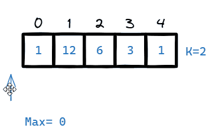

<details><summary>Решение</summary>

```java
public double findMaxAverage(int[] nums, int k) {
    double window = 0;
    // Calculate the sum for the first window position
    for (int i = 0; i < k; i++) {
        window = window + nums[i];
    }

    double result = window;
    for (int i = k; i < nums.length; i++) {
        // Expand window to the right and shrink the left border
        window = window + nums[i] - nums[i - k];
        result = Math.max(result, window);
    }
    return result / k;
}
```
</details>

----

## [↑](#home) <a id="minSize"></a> 209. Minimum Size Subarray Sum
Рассмотрим задачу "[209. Minimum Size Subarray Sum](https://leetcode.com/problems/minimum-size-subarray-sum/)":
> Дан массив положительных чисел и целевое число target. Найти минимальный размер подмассива, сумма которого равна или больше чем target. Если такого нет - вернуть ноль.

То, что мы собираемся найти подмассив подсказывает нам, что тут может подойти Sliding Window.\
Учитывая, что числа только положительные, то чем больше "окно", тем больше будет сумма.\
Получается, что увеличивая справа окно - сумма увеличивается, а уменьшая слева - сумма уменьшается.\
Тогда мы можем адаптировать размер окна, чтобы найти минимальное окно с нужной суммой.

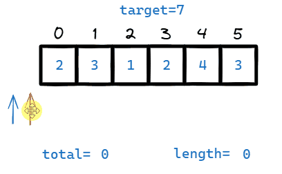

Разбор задачи: **[NeetCode: Minimum Size Subarray Sum](https://www.youtube.com/watch?v=aYqYMIqZx5s)**

<details><summary>Решение</summary>

```java
public int minSubArrayLen(int target, int[] nums) {
    int total = 0, length = Integer.MAX_VALUE;
    int left = 0;
    for (int right = 0; right < nums.length; right++) {
        total = total + nums[right];
        // Adjust window when sum is too big  
        while (total >= target) {
            length = Math.min(length, right - left + 1);
            total = total - nums[left];
            left++;
        }
    }
    return length != Integer.MAX_VALUE ? length : 0;
}
```
</details>

----

## [↑](#home) <a id="nearby"></a> 219. Contains Duplicate II (Nearby Duplicate)
Есть усложнённая версия поиска дубликатов: **"[219. Contains Duplicate II](https://leetcode.com/problems/contains-duplicate-ii/)"**:
> Необходимо проверить массив на дубликаты в пределах подмассива длинной K.

Нужно смотреть на дубликаты только в определённом диапазоне, т.е. нужно рассматривать только некоторую ограниченную область.\
Такую область называют "окном", а название подхода - **"[Window Sliding](https://www.geeksforgeeks.org/window-sliding-technique/)"**.

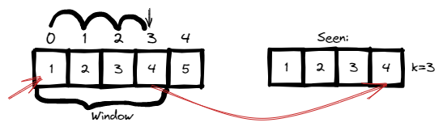

Как видно, мы анализируем на 1 элемент больше, чем размер окна. При этом перед следующим заходом мы должны компенсировать это различие:
```java
public boolean containsNearbyDuplicate(int[] nums, int k) {
    Set<Integer> seen = new HashSet<>();
    // It's important for us to know about current index (i.e. current position)
    for (int i = 0; i < nums.length; i++) {
        if (!seen.add(nums[i])) {
            return true;
        }
        // Maintain window size. Remove element by value of element that is
        // For [1,2,3,4,5] and k=3 after addition of 4 we should remove inxed 3-3=0
        if (seen.size() > k) seen.remove(nums[i-k]);
    }
    return false;
}
```

---

## [↑](#home) <a id="vowels"></a> 1456. Maximum Number of Vowels in a Substring of Given Length
Рассмотрим задачу "[1456. Maximum Number of Vowels in a Substring of Given Length](https://leetcode.com/problems/maximum-number-of-vowels-in-a-substring-of-given-length/)":
> Дана строка S и некоторое число K. Вернуть максимальное число гласных в подстроке длинной в K.

Разбор задачи от NeetCode: [Maximum Number of Vowels in a Substring of Given Length](https://www.youtube.com/watch?v=kEfPSzgL-Ss).

Нам потребуется определять, является ли символ гласной или нет:
```java
private boolean isVowel(char charToTest) {
    return switch(charToTest) {
        case 'a', 'e', 'i', 'o', 'u' -> true;
        default -> false;
    };
}
```

Данная задача похожа на задачу **"[Maximum Average Subarray I](#maxAverage)"**.

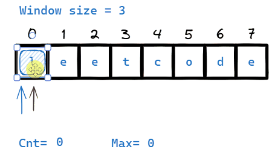

Мы идём правым указателем слева направо. Если встречаем гласную - увеличиваем счётчик.
Дальше мы вычисляем текущую длину окна. Если окно слишком большое - сдвигаем левый указатель.\
**НО** перед сдвигом левого указателя мы смотрим, если из окна убирается гласная - уменьшаем счётчик.\
На каждом сдвиге окна (т.е. правого указателя) вычисляем максимум.

Главная особенность: нам **НЕ** важно сколько конкретно каких гласных мы встретили.\
То есть достаточно логики гласная/не гласная.

<details><summary>Решение</summary>

```java
public int maxVowels(String s, int k) {
    int cnt = 0, result = 0;
    int left = 0;
    for (int right = 0; right < s.length(); right++) {
        if (isVowel(s.charAt(right))) cnt++;

        int size = right - left + 1;
        if (size > k) {
            if (isVowel(s.charAt(left))) cnt--;
            left++; // move left border
        }
        result = Math.max(result, cnt);
    }
    return result;
}
```
</details>

----

## [↑](#home) <a id="consecutive3"></a> 1004. Max Consecutive Ones III
Рассмотрим задачу "[1004. Max Consecutive Ones III](https://leetcode.com/problems/max-consecutive-ones-iii/)":
> Дан массив из единиц и нулей, а так же число K. Вернуть максимальную длину последовательности единиц с учётом того, что мы можем изменить нули на единицу не больше чем K раз.

Разбор решения от Ihor Codes: [Разбор Max Consecutive Ones III](https://www.youtube.com/watch?v=2ZjDR5fjQj8).

Это интересная задача про то, что окно может быть задано не напрямую как размер, а как некоторое условие.\
Например, окно не должно включать в себя больше чем K замен нулей на единицы.

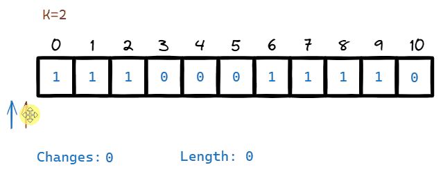

Получается, что мы идём слева направо.\
Если встречаем ноль, то мы уменьшаем кол-во доступных изменений нулей на единицы.\
Если мы не можем заменить ноль на единицу - сокращаем окно до тех пор, пока не сможем.\
Каждый шаг заканчиваем тем, что проверяем, какую максимальную длину последовательности мы знаем.

<details><summary>Решение</summary>

```java
public int longestOnes(int[] nums, int k) {
    int zeroes = 0;
    int result = 0;
    int left = 0;
    for (int right = 0; right < nums.length; right++) {
        if (nums[right] == 0) {
            // No more changes left. Free some swaps (i.e. reduce window size)
            while (zeroes >= k) {
                if (nums[left] == 0) zeroes--;
                left++;
            }
            zeroes++;
        }
        result = Math.max(result, right - left + 1);
    }
    return result;
}
```
</details>

----

## [↑](#home) <a id="afterDeleting"></a> 1493. Longest Subarray of 1's After Deleting One Element
Рассмотрим задачу "[1493. Longest Subarray of 1's After Deleting One Element](https://leetcode.com/problems/longest-subarray-of-1s-after-deleting-one-element/)":
> Дан массив из единиц и нулей. Вернуть максимальную длину последовательности единиц с учётом того, что мы обязаны удалить ОДИН элемент.

Разбор решения: **"[Solving the 'Longest Subarray of 1's After Deleting One Element' Problem in Java](https://www.youtube.com/watch?v=zuMwPkI4nnU)"**.

Вариация на тему задачи "[Max Consecutive Ones III](#consecutive3)", только k всегда будет равен 1.\
У нас есть окно, внутри которого может быть не больше одной замены (т.к. будет лишь одно удаление, т.е. один элемент не важен).
Получается, мы просто ищем максимальную последовательность с одной заменой и возвращаем длину на единицу меньше.

<details><summary>Решение</summary>

```java
public int longestSubarray(int[] nums) {
    int zeroes = 0;
    int result = 0;
    int left = 0;
    for (int right = 0; right < nums.length; right++) {
        if (nums[right] == 0) zeroes++;
        while (zeroes > 1) {
            if (nums[left] == 0) zeroes--;
            left++;
        }
        result = Math.max(result, right - left + 1);
    }
    return result - 1;
}
```
</details>

----

## [↑](#home) <a id="longestSubstring"></a> 3. Longest Substring Without Repeating Characters
Разберём задачу **"[3. Longest Substring Without Repeating Characters](https://leetcode.com/problems/longest-substring-without-repeating-characters/)"**:
> Дана строка s. Нужно найти длину максимальной подстроки без повторных символов

Разбор от NeetCode: [Longest Substring Without Repeating Characters](https://www.youtube.com/watch?v=wiGpQwVHdE0).

Мы ищем substring (т.е. окно), которое удовлетворяет некоторому условию.\
Чтобы устранять дубли подойдёт HashSet.

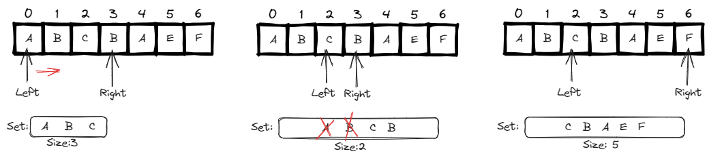

Получается, что мы управляем "окном" значений, представленный хэшсетом.\
Если элемента в окне нет - мы расширяем окно.\
Если элемент есть - сужаем до тех пор, пока все значения в окне не будут уникальны.\
Ведь значения должны идти друг за другом (например окно "ABCB" нужно сжать до "CB" чтобы не было повторений). 

<details><summary>Решение</summary>

```java
public int lengthOfLongestSubstring(String s) {
    int max = 0;

    Set<Character> seen = new HashSet<>();
    int left = 0;
    for (int right = 0; right < s.length(); right++) {
        while (seen.contains(s.charAt(right))) {
            seen.remove(s.charAt(left));
            left++;
        }
        seen.add(s.charAt(right));
        max = Math.max(max, seen.size());
    }
    return max;
}
```
</details>

----

## [↑](#home) <a id="fruits"></a> 904. Fruit Into Baskets
Рассмотрим задачу "[904. Fruit Into Baskets](https://leetcode.com/problems/fruit-into-baskets/)":
> У нас есть две карзины, каждая из которых может содержать фрукты только одного типа, но их количество не ограничено. Так же дан ряд деревьев. Можно начать с любого из них, но как только мы достигнем дерево, с которого мы не можем снять фрукт мы останавливаемся. Вернуть максимальное кол-во фруктов, которое можно собрать.

Разбор задачи от NeetCode: [Fruit Into Baskets Solution](https://www.youtube.com/watch?v=yYtaV0G3mWQ).\
Разбор задачи от Nick White: [LeetCode Fruit Into Baskets Solution Explained](https://www.youtube.com/watch?v=s_zu2dOkq80).

Данная задача похожа не предыдущие, т.к. она тоже про окно.\
Однако, условие его поддержания в правильном состоянии несколько сложнее, т.к. надо учитывать количество элементов с разным значением.\
Поэтому, мы воспользуемся HashMap как вспомогательной структурой данных:

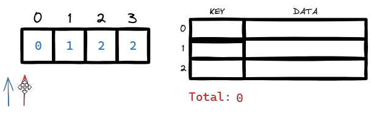

<details><summary>Решение</summary>

```java
public int totalFruit(int[] fruits) {
    Map<Integer, Integer> map = new HashMap<>();
    int total = 0, result = 0;
    
    int left = 0;
    for (int fruit : fruits) {
        map.put(fruit, map.getOrDefault(fruit, 0) + 1);
        total++;

        while (map.size() > 2) {
            Integer leftFruit = fruits[left];
            map.put(leftFruit, map.get(leftFruit) - 1);
            total--;
            left++;
            if (map.get(leftFruit) == 0) {
                map.remove(leftFruit);
            }
        }
        result = Math.max(result, total);
    }
    return result;
}
```
</details>

----

## [↑](#home) <a id="longestRepeating"></a> 424. Longest Repeating Character Replacement
Разберём задачу **"[424. Longest Repeating Character Replacement](https://leetcode.com/problems/longest-repeating-character-replacement/)"**:
> Дана строка s и некоторое число k. Нужно найти самую длинную строку из одинаковых символов с учётом того, что у нас есть k раз, которые мы можем заменить любой символ на любой другой нужный нам символ.

Разбор от NeetCode: [Longest Repeating Character Replacement](https://www.youtube.com/watch?v=gqXU1UyA8pk).

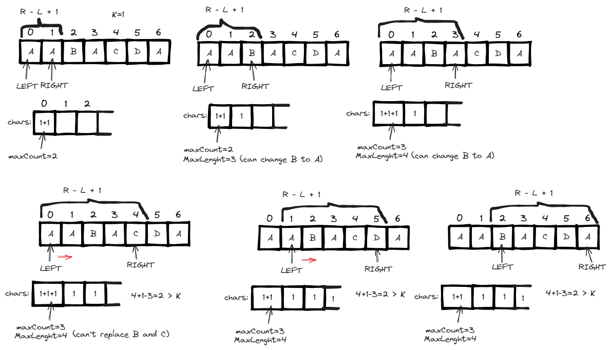

```java
public int characterReplacement(String s, int k) {
    char[] chars = new char[26]; //A-Z
    int maxCount = 0;
    int maxLength = 0;
        
    int left = 0;
    for (int right = 0; right < s.length(); right++) {
        int curChar = s.charAt(right) - 'A';
        chars[curChar]++;
        int curCharCount = chars[curChar];
            
        maxCount = Math.max(maxCount, curCharCount);
        // Sequence length : right - left + 1 
        while((right - left + 1) - maxCount > k) {
            chars[s.charAt(left) - 'A']--;
            left++;
        }
        maxLength = Math.max(maxLength, (right - left + 1));
    }
    return maxLength;
}
```

----

## [↑](#home) <a id="permutation"></a> 567. Permutation in string
Разберём задачу **"[567. Permutation in string](https://leetcode.com/problems/permutation-in-string/)"**:
> Дано две строки s1 и s2. Вернуть true если строка 2 содержит перестановку строки s1. Например, строка eidbaooo содержит перстановку ab.

Разбор от NeetCode: [Permutation in string](https://www.youtube.com/watch?v=UbyhOgBN834).

Получается, нам нужно найти такое "окно" в строке 2, в котором есть точно такие же символы, как в строке 1:

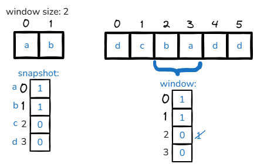


<details><summary>Решение</summary>

```java
public boolean checkInclusion(String s1, String s2) {
    // It should be possible to put s1 into s2:
    if (s2.length() < s1.length()) return false;
        
    // Represent strings as "buckets" hash (alphabet has 26 chars)
    int[] source = new int[26];
    int[] target = new int[26];
    
    // Fill up buckets
    for (int i = 0; i < s1.length(); i++) {
        int charInd = s1.charAt(i) - 'a';
        source[charInd]++;
        target[charInd]++;
    }

    // Buckets are ready. Init the initial window state
    int matches = 0;
    for (int i = 0; i < source.length; i++) {
        if (source[i] == target[i]) matches++;
    }
    
    // Apply sliding window.
    // First iteration from s1.length() already moves window right from initial state
    int left = 0;
    for (int right = s1.length(); right < s2.length(); right++) {
        if (matches == 26) return true;
        
        // Window extension action (move right boundary)
        int index = s2.charAt(right) - 'a';
        target[index]++; // Incremenet the "seen" state for character 
        if (source[index] == target[index]) matches++;
        if (source[index] + 1 == target[index]) matches--; // Found more than we saw. Only for first diff event.
    
        // Move window left boundary
        index = s2.charAt(left) - 'a';
        target[index]--;
        if (source[index] == target[index]) matches++;
        if (source[index] - 1 == target[index]) matches--; // See less than before. Only for first diff event.
        left++;
    }
    // Check that we have all matches
    return (matches == 26);
}
```
</details>

----

## [↑](#home) <a id="minWindow"></a> 76. Minimum Window Substring
Разберём задачу **"[76. Minimum Window Substring](https://leetcode.com/problems/minimum-window-substring/)"**:
> Дано две строки s и t. Нужно вернуть минимальную длину "окна", в котором встретятся все символы из строки t (включая повторы).

Разбор от NeetCode: [Minimum Window Substring](https://www.youtube.com/watch?v=jSto0O4AJbM).

Решение:
```java
public String minWindow(String s, String t) {
    // Create a hash for source string
    Map<Character, Integer> hash = new HashMap<>();
    for (char chr: t.toCharArray()) {
        hash.put(chr, hash.getOrDefault(chr, 0) + 1);
    }
		
    int have = 0, need = hash.size();
    String result = "";
    int left = 0;
        
    Map<Character, Integer> window = new HashMap<>();
    for (int r = 0; r < s.length(); r++) {
        Character chr = s.charAt(r);
        window.put(chr, window.getOrDefault(chr, 0) + 1);
        // PAY ATTENTION: Compare ONLY with equals!
        if (hash.containsKey(chr) && hash.get(chr).equals(window.get(chr))) {
            have++;
            System.out.println("Increment have to " + have);
        }
			
        // If we found match try to shrink the window
        while (have == need) {
            if (result.length() == 0 || (r - left + 1) <= result.length()) {
                result = s.substring(left, r + 1);
            }
            // Shrink window by character from the left
            Character leftChar = s.charAt(left);
            window.put(leftChar, window.get(leftChar) - 1);
            if (hash.containsKey(leftChar) && window.get(leftChar) < hash.get(leftChar)) {
                have--;
            }
            left++;
        }
    }
    return result;
}
```

----

## [↑](#home) <a id="windowMax"></a> 239. Sliding Window Maximum
Разберём задачу **"[239. Sliding Window Maximum](https://leetcode.com/problems/sliding-window-maximum/)"**:
> Дан массив из чисел и размер "окна" через которое мы смотрим на массив. Окно двигается на 1 позицию вправо каждый раз. Нужно вернуть массив макимумов, которые мы видим на каждой итерации.

Разбор от NeetCode: [Sliding Window Maximum - Monotonic Queue](https://www.youtube.com/watch?v=DfljaUwZsOk).

Решение:
```java
public int[] maxSlidingWindow(int[] nums, int k) {
    int[] result = new int[nums.length - k + 1];
    Deque<Integer> window = new ArrayDeque<>();
    
    int left = 0;
    for (int right = 0; right < nums.length; right++) {
        // Maintain decreasing order
        while (!window.isEmpty() && nums[window.getLast()] < nums[right]) {
            window.removeLast();
        }
        window.addLast(right);
        
        // Remove element that are outside window
        if (left > window.getFirst()) {
            window.removeFirst();
        }

        if (right + 1 >= k) {
            result[right + 1 - k] = nums[window.getFirst()];
            left++;
        }
    }
    return result;
}
```

----

### [↑](#home) <a id="almostduplicate"></a> 220. Nearby Almost Duplicate
У поиск ближайших дубликатов есть интересное продолжение - **"[220. Contains Duplicate III](https://leetcode.com/problems/contains-duplicate-iii/)"**.

Для начала нужно понять саму задачу. У нас как обычно есть массив чисел. И наша задача: найти такую пару элементов, что их индексы находятся на расстоянии не большем чем indexDiff (может быть меньше или равно), при этом разница значений этих элементов будет не больше, чем valueDiff (меньше или равно).

Из всех решений мне понравилось с точки зрения подхода решение на основе **[Navigable Set](https://docs.oracle.com/javase/8/docs/api/java/util/NavigableSet.html)**. В этом случае решение задачи сводится к пониманию работы с Navigable Set и к **[Floor and Ceiling Functions](https://www.mathsisfun.com/sets/function-floor-ceiling.html)**. Наиболее удобной реализацией является структура данных TreeSet, где операции выполняются за логарифмическое время. 

Предположим, мы получили элемент num=5. Мы знаем, что разница значений должна быть не более t=2.\
В этом случае нам надо рассмотреть две ситуации:
- Мы знаем про другой элемент X, который расположен на прямой так: ``---[num]---[X]---[num+t]--->``
Т.к. поиск по диапазону влево от X, то выполняем floor(num+t) и накладываем ограничение, что X >= num
- Мы знаем про другой элемент Y, который расположен на прямой так: ``---[num-t]---[Y]---[num]--->``
Т.к. поиск по диапазон вправо от Y, то выполняем ceiling(num-t) и накладываем ограничение, что Y <= num

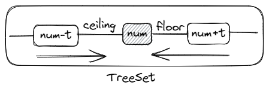

```java
class Solution {
    public static boolean containsNearbyAlmostDuplicate(int[] nums, int k, int t) {
        /**
         * ---[floor]----[num]----[ceiling]--->
         */
        NavigableSet<Long> treeSet = new TreeSet<>();
        for (int i = 0; i < nums.length; i++) {
            // Use long for num to avoid overflow
            long num = (long) nums[i];
            // --[num]---[floor]---[num+t]--->
            Long floor = treeSet.floor(num + t);
            if (floor != null && floor >= num) return true;
            // --[num-t]---[ceil]---[num]--->
            Long ceil = treeSet.ceiling(num - t);
            if (ceil != null && ceil <= num) return true;

            treeSet.add(num);
            // We store k elements and have one element to analyze (num variable).
            // If we store more then k elements we should remove element at k distance from the current position
            // Adjust for [1,2,3,4] for k=2: if we add 3, then it's already 3 elements inside but should be 2.
            // In this case we should remove 1 from the "window": removeIndex = index - k
            if (i >= k) treeSet.remove((long) nums[i - k]);
        }
        return false;
    }
}
```
Это решение наиболее интересное и интуитивно понятное. Существует решение на основе bucket'ов, но оно сложнее и больше шанс допустить ошибки. Подробнее см. stackoverflow: **"[Contains Duplicate III](https://stackoverflow.com/questions/31119971/leetcode-contains-duplicate-iii/48317895)"**.

Видео разбор от Fisher Coder: [LeetCode 220: Contains Duplicate III ](https://www.youtube.com/watch?v=Cu7g9ovYHNI&t=286s).

----

## [↑](#home) <a id="frequency"></a> 1838. Frequency of the Most Frequent Element
Разберём задачу [Frequency of the Most Frequent Element](https://leetcode.com/problems/frequency-of-the-most-frequent-element/).\
Разбор можно посмотреть тут: [Frequency of the Most Frequent Element - Sliding Window](https://www.youtube.com/watch?v=vgBrQ0NM5vE).

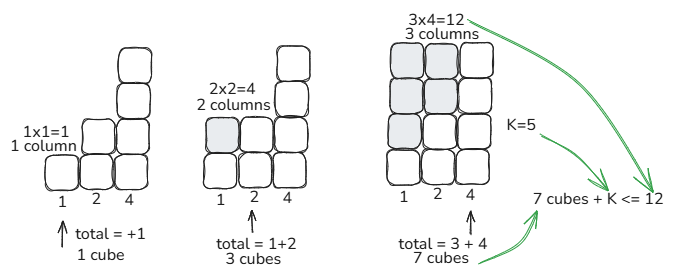

Код решения:
```java
public int maxFrequency(int[] nums, int k) {
    Arrays.sort(nums); // Put values in order
    int left = 0, right = 0; // Set pointers
    int result = 0;
    long total = 0;
    while (right < nums.length) {
        total = total + nums[right];
        int filling = nums[right] * (right - left + 1);
        // Shift left pointer while we "out of budget k"
        while (filling > total + k && left <= right) {
            total = total - nums[left]; // Remove left pointer from total
            left++; // Shrink window
        }
        result = Math.max(result, right - left + 1); // Remember max window size
        right++; // Move right pointer further
    }
    return result;
}
```