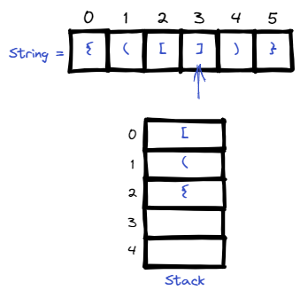
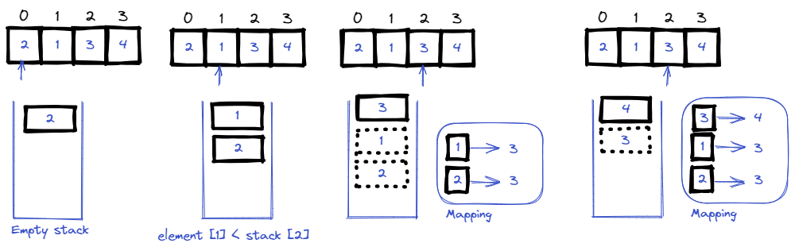
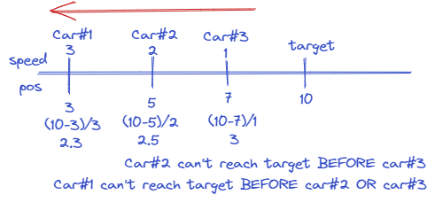
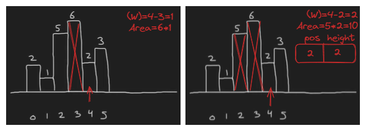

# <a id="home"></a> Stack

Данный раздел посвящён задачам на использование стэка.\
Продолжаем двигаться по [Roadmap](https://neetcode.io/roadmap) от NeetCode.\
Данные задачи входят в том числе в **[Leetcode Patterns](https://seanprashad.com/leetcode-patterns/)**.

**Table of Contents:**
- [Valid Parentheses](#parentheses)
- [Min Stack](#minstack)
- [Reverse Polish Notation](#polish)
- [Generate Parentheses](#genparentheses)
- [Next Greater Element I](#nextGreater)
- [Daily Temperatures](#temp)
- [Car Fleet](#fleet)
- [Decode String](#decode)
- [Largest Area In Histogram](#largest)

----

## [↑](#home) <a id="parentheses"></a> Valid Parentheses
Рассмотрим задачу "[Valid Parentheses](https://leetcode.com/problems/valid-parentheses/)".\
Разбор задачи от NeetCode: [Valid Parentheses](https://www.youtube.com/watch?v=WTzjTskDFMg).\
Разбор задачи от Nick White: [Valid Parentheses Solution Explained](https://www.youtube.com/watch?v=WTzjTskDFMg).

Данная задача про использование [Stack](https://docs.oracle.com/en/java/javase/11/docs/api/java.base/java/util/Stack.html). Стэк - это так называемая **LIFO (last-in-first-out)** структура данных. Согласно Java API, рекомендуется использовать [двустороннюю очередь](https://docs.oracle.com/en/java/javase/11/docs/api/java.base/java/util/Deque.html), которая может выступать в роли LIFO:
>Deque<Integer> stack = new ArrayDeque<Integer>();

Алгоритм же будет выглядеть следующим образом:



Код самого решения:
```java
public boolean isValid(String s) {
    if (s.length() %2 != 0) return false;
    Deque<Character> stack = new ArrayDeque<>();
    for (char chr: s.toCharArray()) {
        if (chr == '{' || chr == '[' || chr == '(') {
            stack.addFirst(chr);
            continue;
        }
        if (chr == '}' && !stack.isEmpty() && stack.getFirst() == '{') {
            stack.removeFirst();
        } else if (chr == ']' && !stack.isEmpty() && stack.getFirst() == '[') {
            stack.removeFirst();
        } else if (chr == ')' && !stack.isEmpty() && stack.getFirst() == '(') {
            stack.removeFirst();
        } else {
            return false;
        }
    }
    return stack.isEmpty();
}
```

----

## [↑](#home) <a id="minstack"></a> Min Stack
Рассмотрим задачу "[Min Stack](https://leetcode.com/problems/min-stack/)".\
Разбор задачи от NeetCode: [Design Min Stack](https://www.youtube.com/watch?v=qkLl7nAwDPo).\
Разбор задачи от Nick White: [Min Stack (Algorithm Explained)](https://www.youtube.com/watch?v=WxCuL3jleUA).

Нам понадобятся структуры, в которых мы будем хранить данные. Решение данной задачи сводится к реализации идеи, когда у нас есть коллекция с элементами, а есть коллекция с минимальным значением, которое доступно на этапе проверки каждого элемента:
```java
private int[] stack = new int[10];
private int[] min = new int[stack.length];
private int pos = -1;
```
Т.е. структура для минимумов содержит столько же позиций, сколько и сам стэк.

Дальше реализуем методы добавления/удаления элемента:
```java
public void push(int val) {
    pos++;
    if (pos == stack.length) {
        stack = Arrays.copyOf(stack, stack.length * 2);
        min = Arrays.copyOf(min, stack.length * 2);
    }
    stack[pos] = val;
    min[pos] = (pos == 0) ? val : Math.min(val, min[pos-1]);
}

public void pop() {
    pos--;
}
```

Остальные методы же просто геттеры:
```java
public int top() {
    return stack[pos];
}
    
public int getMin() {
    return min[pos];
}
```

----

## [↑](#home) <a id="polish"></a> Reverse Polish Notation
Рассмотрим задачу "[Evaluate Reverse Polish Notation](https://leetcode.com/problems/evaluate-reverse-polish-notation/)".\
Разбор задачи от NeetCode: [Reverse Polish Notation](https://www.youtube.com/watch?v=iu0082c4HDE).\
Разбор задачи от Back to Back SWE: [Reverse Polish Notation](https://www.youtube.com/watch?v=qN8LPIcY6K4).

```java
public int evalRPN(String[] tokens) {
    Deque<Integer> stack = new ArrayDeque<>();
    for (String token : tokens) {
        char lastChar = token.charAt(token.length() - 1);
        if (Character.isDigit(lastChar)) {
            stack.addFirst(Integer.valueOf(token));
            continue;
        }
        if (token.equals("+")) {
            stack.addFirst(stack.removeFirst() + stack.removeFirst());
        } else if(token.equals("*")) {
            stack.addFirst(stack.removeFirst() * stack.removeFirst());
        } else if(token.equals("-")) {
            int b = stack.removeFirst(), a = stack.removeFirst();
            stack.addFirst(a - b);
        } else if(token.equals("/")) {
            int b = stack.removeFirst(), a = stack.removeFirst();
            stack.addFirst(a / b);
        } else {
            throw new IllegalStateException("Unknown token: " + token);
        }
    }
    return stack.removeFirst();
}
```
Тут стоит обратить внимание на "подковырку": для вычитания и деления важен порядок элементов!

----

## [↑](#home) <a id="genparentheses"></a> Generate Parentheses
Рассмотрим задачу "[Generate Parentheses](https://leetcode.com/problems/generate-parentheses/)".\
Разбор задачи от NeetCode: [Generate Parentheses](https://www.youtube.com/watch?v=s9fokUqJ76A).\
Разбор задачи от Nick White: [Generate Parentheses](https://www.youtube.com/watch?v=qBbZ3tS0McI).

В принципе, стэк - это просто название структуры, которая использует LIFO. Например, по факту тот же StringBuilder можно использовать в качестве стэка. Например:
```java
StringBuilder stack = new StringBuilder("");
sb.append("(");                 // push [ ( ]
sb.append(")");                 // push [ () ]
sb.deleteCharAt(sb.length()-1); //pop [ ( ]
```

Тогда, можно использовать такой подход и для решения данной задачи, объединив использование стэка и подход backtracking:
```java
public List<String> generateParenthesis(int n) {
    List<String> result = new ArrayList<>();
    StringBuilder stack = new StringBuilder();
    backTracking(result, stack, 0, 0, n);
    return result;
}
```

Сам backtracking состоит из 3 частей: базовый случай (мы использовали все скобки), можем добавлять открывающую скобку, можем добавлять закрывающую скобку. Таким образом, решение будет выглядеть так:
```java
public void backTracking(List<String> result, StringBuilder stack, int open, int close, int n) {
    if (open == n && close == n) { // Base case
        result.add(stack.toString());
        return;
    }
    if (open < n) {
        backTracking(result, stack.append('('), open + 1, close, n);
        stack.deleteCharAt(stack.length() - 1);
    }
    if (open > close) {
        backTracking(result, stack.append(')'), open, close + 1, n);
        stack.deleteCharAt(stack.length() - 1);
    }
}
```

----

## [↑](#home) <a id="nextGreater"></a> Next Greater Element I
Рассмотрим задачу "[Next Greater Element I](https://leetcode.com/problems/next-greater-element-i/)".\
Разбор задачи от:
- [Nikhil Lohia](https://www.youtube.com/watch?v=mJWQjJpEMa4)
- [NeetCode](https://www.youtube.com/watch?v=68a1Dc_qVq4)
- [NickWhite](https://www.youtube.com/watch?v=8BDKB2yuGyg)



Решение:
```java
public int[] nextGreaterElement(int[] nums1, int[] nums2) {
    Deque<Integer> stack = new ArrayDeque<>();
    Map<Integer,Integer> map = new HashMap<>();
    for(int num : nums2){
        while(!stack.isEmpty() && stack.getFirst() < num) {
            map.put(stack.removeFirst(), num);
        }
        stack.addFirst(num);
    }

    int[] ans = new int[nums1.length];
    for(int i = 0; i < nums1.length; i++){
        if(map.containsKey(nums1[i])) {
            ans[i] = map.get(nums1[i]);
        } else {
            ans[i] = -1;
        }
    }
    return ans;
}
```

----

## [↑](#home) <a id="temp"></a> Daily Temperatures
Рассмотрим задачу "[Daily Temperatures](https://leetcode.com/problems/daily-temperatures/)".\
Разбор задачи от NeetCode: [Daily Temperatures](https://www.youtube.com/watch?v=cTBiBSnjO3c).\
Разбор задачи от Nikhil Lohia: [Daily Temperatures: Full solution with animations](https://www.youtube.com/watch?v=ekFs9Nb2RNQ).\
Визуализация решения от Alexander Le: [Leetcode Visualized: Daily Temperatures](https://youtu.be/WGm4Kj3lhRI?t=212).

```java
public int[] dailyTemperatures(int[] temperatures) {
    int[] ans = new int[temperatures.length];
    Deque<Integer> stack = new ArrayDeque<>(); // decreasing stack

    for (int i = 0; i < temperatures.length; ++i) {
      while (!stack.isEmpty() && temperatures[stack.peek()] < temperatures[i]) {
        final int index = stack.pop();
        ans[index] = i - index;
      }
      stack.push(i);
    }

    return ans;
}
```

----

## [↑](#home) <a id="fleet"></a> Car Fleet
Рассмотрим задачу "[Car Fleet](https://leetcode.com/problems/car-fleet/)".\
Разбор задачи от NeetCode: [Car Fleet](https://www.youtube.com/watch?v=Pr6T-3yB9RM).

Для решения данной задачи нам понадобится дополнительный класс для автомобилей. Нам важно обрабатывать автомобили с учётом их позиции. А так же нам важно знать, сколько каждой машине нужно, чтобы доехать до target:



```java
class Car {
    public int pos;
    public double time;

    public Car(int pos, double time) {
        this.pos = pos;
        this.time = time;
    }
}
```

Теперь мы можем подготовить коллекцию машин для работы:
```java
// Prepare cars array in a reverse order
Car[] cars = new Car[position.length];
for (int i = 0; i < position.length; ++i) {
    cars[i] = new Car(position[i], (double) (target - position[i]) / speed[i]);
}
Arrays.sort(cars, (a, b) -> b.pos - a.pos);
```

И соответственой можем воспользоваться стэком:
```java
Deque<Car> stack = new ArrayDeque<>();
for (Car car : cars) {
    if (stack.size() > 0 && stack.getLast().time >= car.time) {
        //skip
        continue;
    }
    stack.addLast(car);
}
return stack.size();
```

----

## [↑](#home) <a id="decode"></a> Decode String
Рассмотрим задачу "[Decode String](https://leetcode.com/problems/decode-string/)".\
Разбор задачи от NeetCode: [Decode String](https://www.youtube.com/watch?v=qB0zZpBJlh8).\
Разбор задачи от Nick White: [LeetCode Decode String](https://www.youtube.com/watch?v=0iQqj5egK9k).

Во-первых, стоит помнить про такой трюк:
```java
int i = (char)'5'; // 53
System.out.println(i - '0'); // 5
```
Потому что разница между int кодом символа 0 и int кодом символа 5 тоже 5.

Во-вторых, нам пригдятся манипуляции с разрядами чисел. Например, возьмём число 543.\
Число 5 нужно умножить 2 раза на 10 (когда увидим 4 и когда увидим 3).\
Число 4 нужно умножить 1 раз на 10 (когда увидим 3). 3 не надо умножать на 10 вообще:
```java
String test = "543";
int result = 0;
for (int i = 0; i < test.length(); i++) {
    result = (10 * result) + (test.charAt(i) - '0');
}
```

Тогда решение может выглядеть следующим образом:
```java
public String decodeString(String s) {
    Deque<Integer> repeats = new ArrayDeque<>();
    Deque<String> text = new ArrayDeque<>();
    String result = "";
    for (int i = 0; i < s.length(); i++) {
        if (Character.isDigit(s.charAt(i))) {
            int cnt = 0;
            while(Character.isDigit(s.charAt(i))) {
                cnt = (10 * cnt) + (s.charAt(i) - '0');
                i++;
            }
            repeats.addLast(cnt);
            i--;
        } else if (s.charAt(i) == ']') {
            StringBuilder sb = new StringBuilder(text.removeLast());
            int cnt = repeats.removeLast();
            for (int r = 0; r < cnt; r++) {
                sb.append(result);
            }
            result = sb.toString();
        } else if (s.charAt(i) == '[') {
            text.addLast(result);
            result = "";
        } else {
            result = result + s.charAt(i);
        }
    }
    return result;
}
```

Тоже решение можно сделать и через один стэк:
```java
public String decodeString(String s) {
    Deque<String> stack = new ArrayDeque<>();
    for (int i = 0; i < s.length(); i++) {
        if (s.charAt(i) != ']') {
            // Accumulate symbols till the closed bracket
            stack.addLast(Character.toString(s.charAt(i)));
        } else {
            // Closed bracket -> go back till we find the open bracket
            String substr = "";
            while (!stack.isEmpty() && !stack.getLast().equals("[")) {
                substr = stack.removeLast() + substr;
            }
            stack.removeLast(); // Remove open bracket [
                
            int digit = 0, cnt = 0;
            while (!stack.isEmpty() && Character.isDigit(stack.getLast().charAt(0))) {
                cnt = cnt + (int)Math.pow(10,digit) * (stack.removeLast().charAt(0) - '0');
                digit++;
            }
            substr = String.join("", Collections.nCopies(cnt, substr));
            stack.addLast(substr);
        }
    }
    return String.join("",stack);
}
```

----

## [↑](#home) <a id="largest"></a> Largest Area In Histogram
Рассмотрим задачу "[Largest Area In Histogram](https://leetcode.com/problems/largest-rectangle-in-histogram/)".

Для решенния данной задачи нам нужно запоминать какие-то прошлые вычисления, к которым мы можем возвращаться. Например, когда следующий блок меньше прошлого, нам нужно посчитать прошлый блок, а возможно и прошлый за ним. Похоже, нам в данной ситуации поможет стэк.\
А точнее нам понадобится 2 стэка: стэк позиций и стэк вершин:



Чтобы понять решение стоит посмотреть разбор [NeetCode: LARGEST RECTANGLE IN HISTOGRAM](https://www.youtube.com/watch?v=zx5Sw9130L0&t=315s) и [Coding Interview Problem: Largest Rectangle in a Histogram](https://www.youtube.com/watch?v=VNbkzsnllsU).
```java
public int largestRectangleArea(int[] heights) {
        Deque<Integer> position = new ArrayDeque();
        Deque<Integer> height = new ArrayDeque();
        int maxArea = 0;
        for (int i = 0; i < heights.length; i++) {
            int start = i;
            while (!height.isEmpty() && height.getLast() >= heights[i]) {
                int p = position.removeLast(), h = height.removeLast();
                maxArea = Math.max(maxArea, h * (i - p));
                start = p;
            }
            position.addLast(start);
            height.addLast(heights[i]);
        }
        int entries = height.size();
        for (int i = 0; i < entries; i++) {
            int p = position.removeLast();
            int h = height.removeLast();
            maxArea = Math.max(maxArea, h * (heights.length - p));
        }
        return maxArea;
    }
```

Можно данную задачу решить немного иначе, через 1 стэк:
- [Largest Rectangle in Histogram | Part - 1 ](https://www.youtube.com/watch?v=X0X6G-eWgQ8)
- [Largest Rectangle in Histogram | Part - 2](https://www.youtube.com/watch?v=jC_cWLy7jSI)

Решение:
```java
public int largestRectangleArea(int[] heights) {
    Deque<Integer> stack = new ArrayDeque();
    int maxArea = 0;
    for (int i = 0; i <= heights.length; i++) {
        while(!stack.isEmpty() && (i == heights.length || heights[stack.getLast()] >= heights[i])) {
            int elIndex = stack.removeLast();
            int width = stack.isEmpty() ? i : i - stack.getLast() - 1;
            int height = heights[elIndex];
            maxArea = Math.max(maxArea, height * width);
        }
        stack.addLast(i);
    }
    return maxArea;
}
```