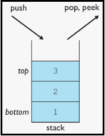
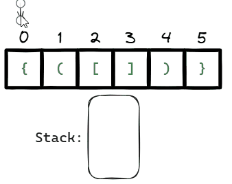
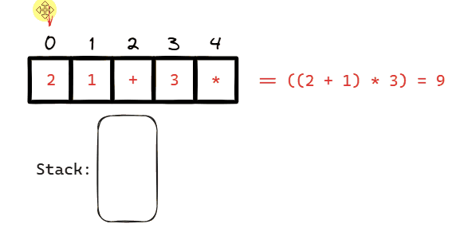
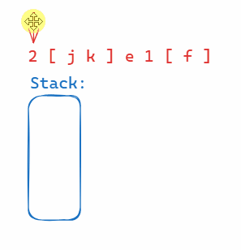
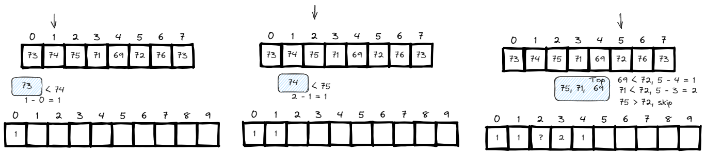
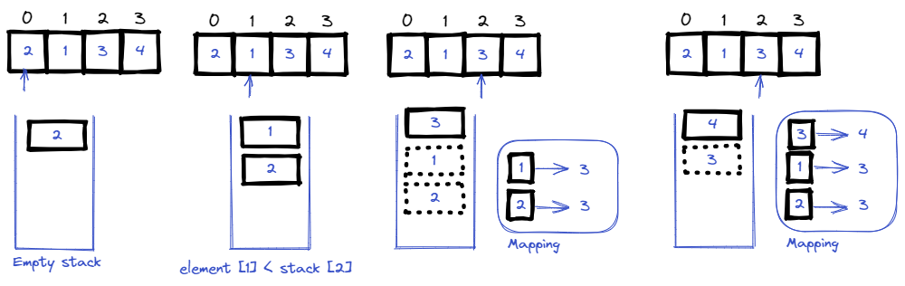
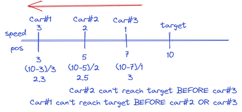

# [←](../README.md) <a id="home"></a> Stack

Данный раздел посвящён задачам на использование **стэка**.\
Данные задачи являются частью **[Roadmap](https://neetcode.io/roadmap)** от NeetCode.\
Данные задачи входят в том числе в **[Leetcode Patterns](https://seanprashad.com/leetcode-patterns/)**.

Стэк является **LIFO (last-in-first-out)** структурой данных:



**Table of Contents:**
- [[20] Valid Parentheses](#parentheses)
- [[150] Reverse Polish Notation](#polish)
- [[394] Decode String](#decode)
- [[155] Min Stack](#minstack)
- [[739] Daily Temperatures](#temp)
- [[496] Next Greater Element I](#nextGreater)
- [[853] Car Fleet](#fleet)
- [[84] Largest Area In Histogram](#largest)
- [[22] Generate Parentheses](#genparentheses)

----

## [↑](#home) <a id="parentheses"></a> 20. Valid Parentheses
Рассмотрим задачу "[20. Valid Parentheses](https://leetcode.com/problems/valid-parentheses/)":
> Дана строка содержащая различные виды скобок. Проверить, корректна ли строка.

Разбор задачи:
- от NeetCode: [Valid Parentheses](https://www.youtube.com/watch?v=WTzjTskDFMg).
- от Nick White: [Valid Parentheses Solution Explained](https://www.youtube.com/watch?v=WTzjTskDFMg).
- от Сергея Пузанкова: [Правильная последовательность скобок](https://www.youtube.com/watch?v=C6CbIReHsNk).

Это классическая задача на использование структуры [Stack](https://docs.oracle.com/en/java/javase/11/docs/api/java.base/java/util/Stack.html).\
**Стэк** - это **LIFO (last-in-first-out)** структура данных.\
Согласно Java API, рекомендуется использовать [двустороннюю очередь](https://docs.oracle.com/en/java/javase/11/docs/api/java.base/java/util/Deque.html), которая может выступать в роли LIFO:
> Deque<Integer> stack = new ArrayDeque<Integer>();

Алгоритм же будет выглядеть следующим образом:



<details><summary>Решение</summary>

```java
public boolean isValid(String s) {
    Deque<Character> stack = new ArrayDeque<>();
    for (char chr: s.toCharArray()) {
        // Push open brackets on stack
        if (chr == '{' || chr == '[' || chr == '(') {
            stack.push(chr);
            continue;
        }
        // We can't check closed brackets if stack is empty
        if (stack.isEmpty()) return false;
        // Closed brackets should have something on the stack
        if (chr == '}' && stack.peek() == '{') {
            stack.pop();
        } else if (chr == ']' && stack.peek() == '[') {
            stack.pop();
        } else if (chr == ')' && stack.peek() == '(') {
            stack.pop();
        } else {
            return false;
        }
    }
    return stack.isEmpty();
}

```
</details>

Ещё можно из метода выходить по условию, если количество символов нечётное: 
```java
if (s.length() %2 != 0) return false;
```

----

## [↑](#home) <a id="polish"></a> 150. Reverse Polish Notation
Рассмотрим задачу "[150. Evaluate Reverse Polish Notation](https://leetcode.com/problems/evaluate-reverse-polish-notation/)":
> Дана строка, представляющая арифметическое выражение в "Reverse Polish Notation". Нужно его вычислить. Например: ["2","1","+","3","*"]
вычисляется как ((2 + 1) * 3) = 9

Разбор задачи:
- от NeetCode: [Reverse Polish Notation](https://www.youtube.com/watch?v=iu0082c4HDE)
- от Back to Back SWE: [Reverse Polish Notation](https://www.youtube.com/watch?v=qN8LPIcY6K4)

Задача по механике похожа на задачу "[Valid Parentheses](#parentheses)".\
Если мы встречаем не числовой символ - идём за данными в стэк.\
Всё остальное считаем числом и просто добавляем в стэк:



<details><summary>Решение</summary>

```java
public int evalRPN(String[] tokens) {
    Deque<Integer> stack = new ArrayDeque<>();
    for (String token : tokens) {
        switch(token) {
            case "+" -> stack.push(stack.pop() + stack.pop());    
            case "*" -> stack.push(stack.pop() * stack.pop());    
            case "-" -> {
                int second = stack.pop(), first = stack.pop();
                stack.push(first - second);
            }
            case "/" -> {
                int second = stack.pop(), first = stack.pop();
                stack.push(first / second);
            }
            default -> stack.push(Integer.valueOf(token));
        }
    }
    return stack.pop();
}
```
</details>
Тут стоит обратить внимание на "подковырку": для вычитания и деления важен порядок элементов!

----

## [↑](#home) <a id="decode"></a> 394. Decode String
Рассмотрим задачу "[394. Decode String](https://leetcode.com/problems/decode-string/)":
> Дана закодированная строка вида "3[a]2[bc]". Нужно её раскодировать в результат вида "aaabcbc"

Разбор задачи:
- от NeetCode: [Decode String](https://www.youtube.com/watch?v=qB0zZpBJlh8)
- от Nick White: [LeetCode Decode String](https://www.youtube.com/watch?v=0iQqj5egK9k)

Во-первых, стоит помнить про такой трюк:
```java
int i = (char)'5'; // 53
System.out.println(i - '0'); // 5
```
Потому что разница между int кодом символа ``0`` и int кодом символа ``5`` такая же, как разница между ``0`` и ``5``.

Во-вторых, нам пригдятся манипуляции с разрядами чисел.\
Например, возьмём число 543.\
Число 5 нужно умножить 2 раза на 10 (когда увидим 4 и когда увидим 3).\
Число 4 нужно умножить 1 раз на 10 (когда увидим 3). 3 не надо умножать на 10 вообще:
```java
String test = "543";
int result = 0;
for (int i = 0; i < test.length(); i++) {
    result = (10 * result) + (test.charAt(i) - '0');
}
```

Данное число можно так же обрабатывать и в обратную сторону. Тогда это будет выглядеть так:
```java
String test = "543";
int result = 0, digit = 0;
for (int i = test.length()-1; i >= 0; i--) {
    result = result + (int)Math.pow(10,digit) * (test.charAt(i) - '0');
    digit++;
}
```

Решение данной задачи в том, что мы в стэк складываем данные до тех пор, пока не достигнем момента их обработки:



Как видно, мы складываем в стэк данные до тех пор, пока не встретим закрывающую скобку.\
Открывающая скобка в стэке позволяет понять момент, когда весь обрабатываемый текст считан.\
Перед скобкой ожидаем некоторое кол-во цифр, которые говорят, сколько надо повторов.\
Как только цифры кончаются - мы можем положить результат обратно в стэк.

Таким образом, решение может выглядеть следующим образом:

<details><summary>Решение</summary>

```java
public String decodeString(String s) {
    Deque<String> stack = new ArrayDeque<>();
    for (int i = 0; i < s.length(); i++) {
        // Only when see closed bracket we should do something   
        // else -> Accumulate symbols till the closed bracket (i.e. push to the stack)
        if (s.charAt(i) != ']') {
            stack.push(Character.toString(s.charAt(i)));
            continue;
        }
            
        // Text that should be copied            
        StringBuilder sb = new StringBuilder();
        while (!stack.isEmpty() && !stack.peek().equals("[")) {
            sb.append(stack.pop());
        }
        stack.pop(); // pop out (i.e. remove) open bracket [
        String substr = sb.toString();
            
        // Then expect repeats count
        int digit = 0, repeats = 0;
        while (!stack.isEmpty() && Character.isDigit(stack.peek().charAt(0))) {
            repeats = repeats + (int)Math.pow(10,digit) * (stack.pop().charAt(0) - '0');
            digit++;
        }
        stack.push(substr.repeat(repeats));
    }

    StringBuilder result = new StringBuilder();
    stack.iterator().forEachRemaining(item -> result.append(item));
    return result.reverse().toString();
}
```
</details>

Реализация через методы стэка (такие как pop, push, peek) помещают элемент в начало (т.к. реализованы через addFirst).\
Из-за этого нам приходится делать reverse. Поэтому, мы можем сами принудительно писать addLast, getLast, removeLast.

<details><summary>Решение</summary>

```java
public String decodeString(String s) {
    Deque<String> stack = new ArrayDeque<>();
    for (int i = 0; i < s.length(); i++) {
        // Only when see closed bracket we should do something. Till that moment - accumulate   
        if (s.charAt(i) != ']') {
            stack.addLast(Character.toString(s.charAt(i)));
            continue;
        }
            
        // Closed bracket -> go back till we find the open bracket
        String substr = "";
        while (!stack.isEmpty() && !stack.getLast().equals("[")) {
            substr = stack.removeLast() + substr;
        }
        stack.removeLast(); // Remove open bracket [

        int digit = 0, cnt = 0;
        while (!stack.isEmpty() && Character.isDigit(stack.getLast().charAt(0))) {
            cnt = cnt + (int)Math.pow(10,digit) * (stack.removeLast().charAt(0) - '0');
            digit++;
        }
        substr = String.join("", Collections.nCopies(cnt, substr));
        stack.addLast(substr);
    }
    return String.join("",stack);
}
```
</details>

----

## [↑](#home) <a id="minstack"></a> 155. Min Stack
Рассмотрим задачу "[155. Min Stack](https://leetcode.com/problems/min-stack/)":
> Нужно написать такой стэк, который помнит самый минимальный добавленный элемент.

Разбор задачи от:
- NeetCode: [Design Min Stack](https://www.youtube.com/watch?v=qkLl7nAwDPo)
- Nick White: [Min Stack (Algorithm Explained)](https://www.youtube.com/watch?v=WxCuL3jleUA)

Стэк можно реализовать на основе массива.\
В случае достижения предельного размера можно увеличивать массив при помощи ``Arrays.copyOf(array, newSize)``.

Нам понадобится один указатель на текущую позицию (``pos``) и два массива: в одном значения, в другом минимальное значение на данной позиции:
```java
private int pos = -1;
private int[] stack = new int[10];
private int[] min = new int[stack.length];
```
Т.е. структура для минимумов содержит столько же позиций, сколько и сам стэк, т.к. в ней мы будем запоминать минимум на момент каждого положения в стэке.

<details><summary>Решение</summary>

```java
public void push(int val) {
    pos++;
    if (pos == stack.length) {
        stack = Arrays.copyOf(stack, stack.length * 2);
        min = Arrays.copyOf(min, stack.length * 2);
    }
    stack[pos] = val;
    min[pos] = (pos == 0) ? val : Math.min(val, min[pos-1]);
}

public void pop() {
    pos--;
}

public int top() {
    return stack[pos];
}
    
public int getMin() {
    return min[pos];
}
```
</details>

----

## [↑](#home) <a id="temp"></a> 739. Daily Temperatures
Рассмотрим задачу "[739. Daily Temperatures](https://leetcode.com/problems/daily-temperatures/)":
> Дан массив целых чисел, представляющих температуру в некоторый день. Вернуть массив ответов, сколько нужно ждать в каждый день более высокой температуру.

Разбор задачи:
- от NeetCode: [Daily Temperatures](https://www.youtube.com/watch?v=cTBiBSnjO3c)
- от Nikhil Lohia: [Daily Temperatures: Full solution with animations](https://www.youtube.com/watch?v=ekFs9Nb2RNQ)
- от Alexander Le: [Leetcode Visualized: Daily Temperatures](https://youtu.be/WGm4Kj3lhRI?t=212)

Что мы складываем в стэк?\
Мы сохраняем элементы (а точнее индексы, по которым их можно найти), для которых ещё неизвестен результат, т.к. мы его узнаем на какой-то следующей итерации.

Мы идём слева направо. Если стэк пуст, то мы просто кладём туда указатель на текущий элемент. Если же в стэке элемент больше, чем текущий - мы не можем пока что для него получить результат, а значит мы просто добавляем в стэк ещё один элемент для рассчёта. Если же в стэке элемент, который меньше текущего - мы нашли элемент в стэке, для которого мы только что узнали день более тёплой температуры. Нам достаточно посчитать дистанцию: взять текущий день (то есть индекс итерации) и вычесть из неё индекс элемента, для которого найден ответ. Естественно, элемент из стэка удаляется, т.к. он уже обработан.



<details><summary>Решение</summary>

```java
public int[] dailyTemperatures(int[] temperatures) {
    int[] ans = new int[temperatures.length];
    Deque<Integer> stack = new ArrayDeque<>(); // decreasing stack

    for (int i = 0; i < temperatures.length; ++i) {
        // When temperature BIGGER than stack top -> save diff to result array 
        while (!stack.isEmpty() && temperatures[stack.peek()] < temperatures[i]) {
            int index = stack.pop();
            ans[index] = i - index;
        }
        stack.push(i);
    }

    return ans;
}
```
</details>

----

## [↑](#home) <a id="nextGreater"></a> 496. Next Greater Element I
Рассмотрим задачу "[496. Next Greater Element I](https://leetcode.com/problems/next-greater-element-i/)":
> Дано 2 массива. Нужно для каждого числа из первого массива найти следующий за ним элемент во втором массиве, при этом этот элемент должен быть больше. Например, массивы [4,1,2] и [2,1,3,4]

Разбор задачи от:
- [Nikhil Lohia](https://www.youtube.com/watch?v=mJWQjJpEMa4)
- [NeetCode](https://www.youtube.com/watch?v=68a1Dc_qVq4)
- [NickWhite](https://www.youtube.com/watch?v=8BDKB2yuGyg)

Решение основано на технике **"[Monotonic Stack](https://www.youtube.com/watch?v=Dq_ObZwTY_Q)"**. Пример решения задач можно увидеть в статье **"[Solving Monotonic Queue/Stack Problems](https://dev.to/vladisov/solving-monotonic-queuestack-problems-k28)"**.

Что значит, что у элемента есть "next greater element"? Это значит, что справа мы видели больший элемент.\
Нас интересует именно next, то есть следующий, а не максимальный. Кроме того, из этого следует, что у самого крайнего справа элемента не может быть такого элемента, то есть для него ответ всегда -1.



```java
// For each input num we should create a pair with next greater number
public Map<Integer,Integer> mapNumberAndNextGreater(int[] nums) {
    Map<Integer,Integer> map = new HashMap<>();
    Deque<Integer> stack = new ArrayDeque<>();
    for(int num : nums){
        // If stack has something that is less then num - we found a new pair
        while(!stack.isEmpty() && stack.peek() < num) { 
            map.put(stack.pop(), num);
        }
        // Store element itself to find a pair for it (if possible)
        stack.addFirst(num);
    }
    return map;
}
```

Тогда мы можем использовать маппинг пар "Число -> Следующее большее число" для получения результата.

<details><summary>Решение</summary>

```java
public int[] nextGreaterElement(int[] nums1, int[] nums2) {
    // Get pairs of: number -> next greater number
    Map<Integer,Integer> map = mapNumberAndNextGreater(nums2);
        
    int[] ans = new int[nums1.length];
    for(int i = 0; i < nums1.length; i++) {
        ans[i] = map.getOrDefault(nums1[i], -1);
    }
    return ans;
}
```
</details>

----

## [↑](#home) <a id="fleet"></a> 853. Car Fleet
Рассмотрим задачу "[853. Car Fleet](https://leetcode.com/problems/car-fleet/)":
> Дано два массива: скорости для машин и их изначальное положение. А так же цель, сколько должны проехать машины. Вернуть количество "car fleet" - группы машин. Группой считаются машины, которые следуют вместе. Если же автомобиль с большей скоростью "утыкается" в более медленные, то они следуют со скоростью более медленного.

Разбор задачи от NeetCode: [Car Fleet](https://www.youtube.com/watch?v=Pr6T-3yB9RM).

Для упрощения жизни добавим класс, который будет описывать машину: её положение и сколько ей осталось до финиша.
```java
class Car {
    public int pos;
    public double time;

    public Car(int pos, double time) {
        this.pos = pos;
        this.time = time;
    }
}
```

Более того, мы можем использовать **Java Record Class**:
```java
class Solution {
    public record Car (int pos, double time) {}
```

Для решения данной задачи нам нужно для каждой машины определить, сколько времени ей нужно, чтобы добраться до финиша.\
Т.к. мы знаем target и позицию машины на стерте - мы знаем расстояние.\
Т.к. мы знаем скорость, то можем получить условное время time, которое нужно машине.

Тогда, мы можем сформировать список машин.\
Нам нужно отсортировать машины по их расстоянию до финиша:
```java
public Car[] getCars(int target, int[] position, int[] speed) {
    Car[] cars = new Car[position.length];
    for (int i = 0; i < position.length; ++i) {
        cars[i] = new Car(position[i], (double) (target - position[i]) / speed[i]);
    }
    Arrays.sort(cars, (a, b) -> b.pos - a.pos);
    return cars;
}
```
Как видно, самая первая машина в массиве будет самая близкая к финишу.\
Это важно, т.к. никто первее неё не может добраться до финиша, т.к. упрётся в эту машину. Именно это будет образовывать порции машин.

Визуализация решения тогда может выглядеть следующим образом:



Складываем в стэк машины.\
Самый последний автомобиль в стэке по факту образует car fleet.\
Дальше у нас два случая:
- предыдущий автомобиль быстрее/такой же, и тогда они образуют один и тот же fleet. Тогда мы просто не добавляем никого в стэк. 
- мы находим следующий car fleet, т.к. машина едет медленнее, а значит другие "упруться" в него и образуют другой car fleet. 

Нам останется потом посчитать лишь количество элементов в стэке.

<details><summary>Решение</summary>

```java
public int carFleet(int target, int[] position, int[] speed) {
    Deque<Car> stack = new ArrayDeque<>();
    for (Car car : getCars(target, position, speed)) {
        if (stack.size() > 0 && stack.getLast().time >= car.time) {
            //skip
            continue;
        }
        stack.addLast(car);
    }
    return stack.size();
}
```
</details>

----

## [↑](#home) <a id="largest"></a> 84. Largest Area In Histogram
Рассмотрим задачу "[84. Largest Area In Histogram](https://leetcode.com/problems/largest-rectangle-in-histogram/)":
> Дан массив с высотами гистограмм. Найти область наибольшего прямоугольника гистрограмм.

Существуют разные способы решить данную задачу.\
Проще всего понять решение, где для каждой позиции мы смотрим, до какого индекса можно продолжить rectangle.

Начнём с левой границы. И для этого нам понадобится стэк.\
Если стэк пуст - это означает, что границу можно продолжить на все доступные элементы, т.е. до индекса 0.

```java
public int[] getLeftBoundaries(int[] heights) {
    int[] left = new int[heights.length];
    Deque<Integer> stack = new ArrayDeque();
    for (int i = 0; i < heights.length; i++) {
        // Remove from stack irrelevant data (heights that can't be boundaries)
        while(!stack.isEmpty() && heights[stack.peek()] >= heights[i]) {
            stack.pop();
        }
        // Empty stack means no boundary, else -> take next element of the element on the stack
        left[i] = stack.isEmpty() ? 0 : stack.peek() + 1;
        // Store current height because it can be a boundary for other elements
        stack.push(i);
    }
    return left;
}
```

Теперь нам нужно сделать тоже самое справа для всех элементов:
```java
public int[] getRightBoundaries(int[] heights) {
    int[] right = new int[heights.length];
    Deque<Integer> stack = new ArrayDeque();
    for (int i = heights.length - 1; i >= 0; i--) {
        while(!stack.isEmpty() && heights[stack.peek()] >= heights[i]) {
            stack.pop(); // Not a boundary
        }
        right[i] = stack.isEmpty() ? heights.length - 1 : stack.peek() - 1;
        stack.push(i);
    }
    return right;
}
```

Теперь остаётся лишь найти максимальную область:
```java
public int largestRectangleArea(int[] heights) {
    int[] left = getLeftBoundaries(heights);
    int[] right = getRightBoundaries(heights);
    int area = 0;
    for (int i = 0; i < heights.length; i++) {
        area = Math.max(area, heights[i] * (right[i] - left[i] + 1));
    }
    return area;
}
```

Супер детальный и понятный разбор данной задачи от **Take U forward**:
- [Largest Rectangle in Histogram | Part - 1 ](https://www.youtube.com/watch?v=X0X6G-eWgQ8)
- [Largest Rectangle in Histogram | Part - 2](https://www.youtube.com/watch?v=jC_cWLy7jSI)

Есть так же альтернативное решение:
- [Coding Interview Problem: Largest Rectangle in a Histogram](https://www.youtube.com/watch?v=VNbkzsnllsU)

----

## [↑](#home) <a id="genparentheses"></a> 22. Generate Parentheses
Рассмотрим задачу "[22. Generate Parentheses](https://leetcode.com/problems/generate-parentheses/)":
> Дано количество пар скобок. Нужно написать функцию, которая генерирует список всех корректных вариантов.

Разбор задачи от NeetCode: [Generate Parentheses](https://www.youtube.com/watch?v=s9fokUqJ76A).\
Разбор задачи от Nick White: [Generate Parentheses](https://www.youtube.com/watch?v=qBbZ3tS0McI).

В принципе, стэк - это просто название структуры, которая использует LIFO. Например, по факту тот же StringBuilder можно использовать в качестве стэка. Например:
```java
StringBuilder stack = new StringBuilder("");
sb.append("(");                 // push [ ( ]
sb.append(")");                 // push [ () ]
sb.deleteCharAt(sb.length()-1); //  pop [ ( ]
```

Тогда, можно использовать такой подход и для решения данной задачи, объединив использование стэка и подход backtracking:
```java
public List<String> generateParenthesis(int n) {
    List<String> result = new ArrayList<>();
    StringBuilder stack = new StringBuilder();
    backTracking(result, stack, 0, 0, n);
    return result;
}
```

Сам backtracking состоит из 3 частей: базовый случай (мы использовали все скобки), можем добавлять открывающую скобку, можем добавлять закрывающую скобку. Таким образом, решение будет выглядеть так:
```java
public void backTracking(List<String> result, StringBuilder stack, int open, int close, int n) {
    if (open == n && close == n) { // Base case
        result.add(stack.toString());
        return;
    }
    if (open < n) {
        backTracking(result, stack.append('('), open + 1, close, n);
        stack.deleteCharAt(stack.length() - 1);
    }
    if (open > close) {
        backTracking(result, stack.append(')'), open, close + 1, n);
        stack.deleteCharAt(stack.length() - 1);
    }
}
```