# <a id="home"></a> Trees

Данный раздел посвящён задачам на работу с деревьями (**"Trees"**).\
Продолжаем двигаться по [Roadmap](https://neetcode.io/roadmap) от NeetCode.\
Данные задачи входят в том числе в **[Leetcode Patterns](https://seanprashad.com/leetcode-patterns/)**.
Плэйлист от NeetCode: [Trees Playlist](https://www.youtube.com/watch?v=QfJsau0ItOY&list=PLot-Xpze53ldg4pN6PfzoJY7KsKcxF1jg)

**Table of Contents:**
- [Convert Sorted Array to Binary Search Tree](#convert)
- [Same tree (DFS)](#sameTree)
- [Symmetric Tree (DFS)](#symmetric)
- [Invert Binary Tree](#invertTree)
- [Minimum Distance between BST Nodes](#minDistance)
- [Subtree of Another Tree](#subtree)
- [Maximum Depth of Binary Tree](#maxDepth)
- [Diameter of Binary Tree](#diameter)
- [Balanced Binary Tree](#balanced)
- [Minimum Depth of Binary Tree](#minDepth)
- [Merge Two Binary Trees](#merge)
- [Path Sum](#pathSum)
- [Binary Tree Paths](#treePaths)
- [Binary Tree Inorder Traversal](#inorder)
- [Binary Tree Postorder Traversal](#postorder)
- [Average of Levels in Binary Tree](#average)
- [Lowest Common Ancestor](#lowest)
- [Binary Tree Level Order Traversal](#levelTraversal)
- [Binary Tree Right Side View](#sideView)
- [Count Good Nodes in Binary Tree](#goodNodes)
- [Validate Binary Search Tree](#validate)
- [Kth Smallest Element in a BST](#smallest)
- [Binary Tree Preorder Traversal](#preorder)
- [Construct Binary Tree From Preorder And Inorder Traversal](#construct)
- [Construct Binary Tree from Inorder and Postorder Traversal](#construct2)
- [Construct Binary Search Tree from Preorder Traversal](#constructPreorder)
- [Construct String from Binary Tree](#constructString)
- [Binary Tree Maximum Path Sum](#maxPathSum)
- [Serialize and Deserialize Binary Tree](#serialize)
- [Delete Node in a BST](#delete)
- [Binary Search Tree Iterator](#iterator)
- [Check Completeness of a Binary Tree (BFS)](#completeness)
- [Flatten Binary Tree to Linked List](#flatten)
- [Trim a Binary Search Tree](#trim)
- [Binary Tree Pruning](#pruning)
- [Binary Tree Zigzag Level Order Traversal](#zigzag)
- [Convert Sorted List to Binary Search Tree](#linkedListToTree)

----

## [↑](#home) <a id="convert"></a> Convert Sorted Array to Binary Search Tree
Рассмотрим задачу [Convert Sorted Array to Binary Search Tree](https://leetcode.com/problems/convert-sorted-array-to-binary-search-tree/):
> Дан отсортированный массив. Нужно его превратить в двоичное дерево поиска.

Разбор задачи от Nick White: [Convert Sorted Array to Binary Search Tree](https://www.youtube.com/watch?v=12omz-VAyRk)

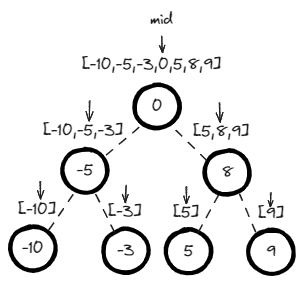

Идея двоичного поиска: найти середину (mid). Значения слева - меньше, значения справа - больше:
```java
public TreeNode sortedArrayToBST(int[] nums) {
    if (nums.length == 0) return null;
    return sortedArrayToBST(nums, 0, nums.length-1);   
}

private TreeNode sortedArrayToBST(int[] nums, int left, int right) {
    if (left > right) return null;
    int mid = left + (right - left)/2;
    TreeNode node = new TreeNode(nums[mid]);
    node.left = sortedArrayToBST(nums, left, mid-1);
    node.right = sortedArrayToBST(nums, mid+1, right); 
    return node;
}
```

----

## [↑](#home) <a id="sameTree"></a> Same tree (DFS)
Рассмотрим задачу "[Same Tree](https://leetcode.com/problems/same-tree/)":
> Дано два дерева. Нужно определить, одинаковы ли они (по структуре и значениям). 

Разбор задачи от NeetCode: **"[Same tree](https://www.youtube.com/watch?v=vRbbcKXCxOw)"**.

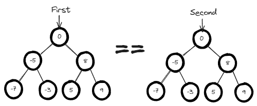

Сравнить деревья == сравнить все ноды дерева. То есть сравниваем каждые пары:
```java
public boolean isSameTree(TreeNode first, TreeNode second) {
    // Case #1: both nodes are null. It means that these places inside trees are equals
    if (first == null && second == null) return true;
    // Case #2: node is absent ONLY in one tree. OR values are different. NOT the same tree.
    if (first == null || second == null || first.val != second.val) return false;
    // Delegate the same check to left part AND to right part. Recursively.
    return isSameTree(first.left, second.left) && isSameTree(first.right, second.right);
}
```

----

## [↑](#home) <a id="symmetric"></a> Symmetric Tree (DFS)
Рассмотрим задачу "[Symmetric Tree](https://leetcode.com/problems/symmetric-tree/)":
> Дано дерево. Нужно понять, симметричное ли оно.

Разбор задачи от NeetCode: [Symmetric Tree](https://www.youtube.com/watch?v=Mao9uzxwvmc)

Задача похожа на задачу [Same tree](#sameTree):

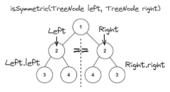

```java
public boolean isSymmetric(TreeNode root) {
    return isSymmetric(root.left, root.right);
}

public boolean isSymmetric(TreeNode left, TreeNode right) {
    if (left == null && right == null) return true;
    if (left == null || right == null) return false;
    return left.val == right.val 
        && isSymmetric(left.left, right.right) 
        && isSymmetric(left.right, right.left);
}
```

----

## [↑](#home) <a id="invertTree"></a> Invert Binary Tree
Рассмотрим задачу "[Invert Binary Tree](https://leetcode.com/problems/invert-binary-tree/)":
> Дан узел, который является корнем дерева. Нужно инвертировать дерево и вернуть новый корень.

Инвертировать означает поменять местами для каждого узла его левый и правый дочерние элементы:

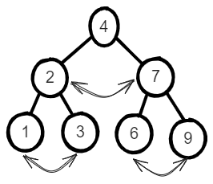

Разбор задачи от NeetCode: **"[Invert Binary Tree - Depth First Search](https://www.youtube.com/watch?v=OnSn2XEQ4MY)"**.\
Ещё более подробный разбор: **"[Nikhil Lohia: Invert Binary Tree](https://www.youtube.com/watch?v=ck23lNqbLjI)"**

```java
public TreeNode invertTree(TreeNode root) {
    if (root == null) return null;
    // Swap left and right nodes
    TreeNode tmp = root.left;
    root.left = root.right;
    root.right = tmp;
    // Do the same logic for left and right nodes
    invertTree(root.left);
    invertTree(root.right);
    return root;
}
```

Есть альтернативное решение без использования рекурсии.\
В этом случае нам понадобится очередь, а точнее её реализация **ArrayDeque**.\
Метод **add** добавляет в конец, а **remove** удаляет из начала.\
Таким образом мы получаем FIFO.

```java
public TreeNode invertTree(TreeNode root) {
    if (root == null) return null;
    Queue<TreeNode> stack = new ArrayDeque<>();
    // put root to the stack
    stack.add(root);
    // Do our work till we have somthing in the stack
    while (!stack.isEmpty()) {
        TreeNode element = stack.remove();
        // Swap left and right nodes
        TreeNode tmp = element.left;
        element.left = element.right;
        element.right = tmp;
        // Push left and right nodes to the stack
        if (element.left != null) stack.add(element.left);
        if (element.right != null) stack.add(element.right);
    }
    return root;
}
```

Чтобы оценить сложность нужно сформулировать правильно описание решения: для каждой ноды поменять местами левую и правую стороны. Для каждой ноды, то есть для каждого n. Получается, что сложность алгоритма будет O(n).

----

## [↑](#home) <a id="minDistance"></a> Minimum Distance between BST Nodes
Рассмотрим задачу "[Minimum Distance between BST Nodes](https://leetcode.com/problems/minimum-distance-between-bst-nodes/)":
> Дано двоичное дерево поиска. Нужно определить минимальное расстояние (т.е. минимальную разницу) между любыми из доступных элементов.

Разбор задачи от NeetCode: [Minimum Distance between BST Nodes](https://www.youtube.com/watch?v=joxx4hTYwcw)

Решение:
```java
class Solution {
    private TreeNode prev;
    private int min = Integer.MAX_VALUE; // To get the max possible diff for the first element

    public int minDiffInBST(TreeNode root) {
        if (root.left != null) minDiffInBST(root.left);
        if (prev != null) min = Math.min(min, root.val - prev.val);
        prev = root; // Visit current node in-order: L -> cur -> R
        if (root.right != null) minDiffInBST(root.right);
        return min;
    }
}
```

----

## [↑](#home) <a id="subtree"></a> Subtree of Another Tree
Рассмотрим задачу "[Subtree of Another Tree](https://leetcode.com/problems/subtree-of-another-tree/)":
> Дано два дерева. Нужно определить, является ли одно дерево поддеревом другого. 

Разбор задачи от NeetCode: **"[Subtree of Another Tree](https://www.youtube.com/watch?v=E36O5SWp-LE)"**.

Данная задача строится на той же логике, что и [Same tree](#sameTree), но с небольшой добавкой:
```java
class Solution {
    public boolean isSameTree(TreeNode p, TreeNode q) {
        if (p == null && q == null) return true;
        if (p == null || q == null || p.val != q.val) return false;
        return isSameTree(p.left, q.left) && isSameTree(p.right, q.right);
    }

    public boolean isSubtree(TreeNode s, TreeNode t) {
        if (s == null) return false;
        if (isSameTree(s, t)) return true;
        return isSubtree(s.left, t) || isSubtree(s.right, t);
    }
}
```

----

## [↑](#home) <a id="maxDepth"></a> Maximum Depth of Binary Tree
Рассмотрим задачу "[Maximum Depth of Binary Tree](https://leetcode.com/problems/maximum-depth-of-binary-tree/)":
> Дано дерево. Нужно найти его максимальную глубину, т.е. длину пути состоящего из бОльшего кол-ва элементов.

Разбор задачи от NeetCode: **"[Maximum Depth of Binary Tree](https://www.youtube.com/watch?v=hTM3phVI6YQ)"**.

Решить задачу можно рекурсивно при помощи **DFS** подхода:

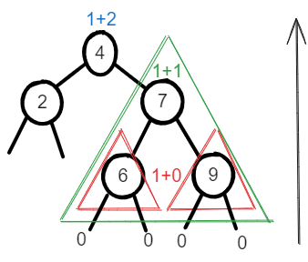

Задача сводится к тому, что каждая нода добавляет себя как "+1" к результату, т.к. она есть в пути. А результат спрашивает у своих дочерних элементов. Причём каждую ноду интересует лишь максимальный из результатов от дочерних элементов:
```java
public int maxDepth(TreeNode root) {
    if (root == null) return 0;
    int left = maxDepth(root.left);
    int right = maxDepth(root.right);
    // Add itself as +1 to the best result
    return 1 + Math.max(left, right);
}
```

Можно решить через **BFS** подход:

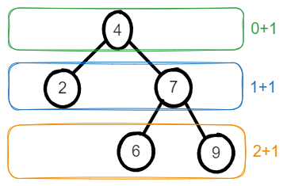

Получается, что мы закидываем в очередь элемент и начинаем итерироваться, пока в очереди что-то лежит.\
На каждой итерации в самом начале мы смотрим, сколько у нас лежит в очереди элементов. Важно это сделать ДО изменения очереди.

```java
public int maxDepth(TreeNode root) {
    if (root == null) return 0;
    int result = 0;
    
    Queue<TreeNode> queue = new ArrayDeque<>();
    queue.add(root);

    while (!queue.isEmpty()) {
        // Calculate BEFORE cycle how many times should we iterate
        double size = queue.size(); 
        for (int i = 0; i < size; i++) {
            TreeNode cur = queue.remove();
            //Consider children for next while loop iterations
            if (cur.left != null) queue.offer(cur.left);
            if (cur.right != null) queue.offer(cur.right);
        }
        result++;
    }
    return result;    
}
```
    
----

## [↑](#home) <a id="diameter"></a> Diameter of Binary Tree
Рассмотрим задачу "[Diameter of Binary Tree](https://leetcode.com/problems/diameter-of-binary-tree/)":
> Дано дерево. Нужно найти его диаметр, то есть максимальную длину пути между двумя элементами.

Отличная задача чтобы понять как один взгляд на дерево помогает увидеть что-то ещё.\
Чтобы решить данную задачу нужно вспомнить задачу [Maximum Depth of Binary Tree](#maxDepth).

Хоть эта задача и Easy, но для решения нужно увидеть, что мы должны учитывать следующее:
1) На каждом элементе максимальный путь == сумме длин самых длинных путей слева И справа
2) Поднимаясь вверх по дереву мы продолжаем рассматривать только самый длинный путь из дочерних элементов
3) Высота считает количество узлов, а ширина - количество соединений/линий!

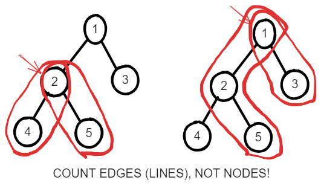

Таким образом, наше видоизменённое решение будет выглядеть так:
```java
class Solution {
    public int ans = 0;

    public int diameterOfBinaryTree(TreeNode root) {
        maxDepth(root);
        return ans;
    }

    public int maxDepth(TreeNode node) {
        if (node == null) return 0;
        int left = maxDepth(node.left);
        int right = maxDepth(node.right);
        // We know length of left and right paths
        ans = Math.max(ans, left + right);
        // Longest path == 1 (for itself) + the longest child
        return 1 + Math.max(left, right);
    }
}
```

Разбор задачи от Xavier Elon: **"[Diameter of a Binary Tree](https://www.youtube.com/watch?v=DcDjYOsjSlg)"**.

----

## [↑](#home) <a id="balanced"></a> Balanced Binary Tree
Рассмотрим задачу "[Balanced Binary Tree](https://leetcode.com/problems/balanced-binary-tree/)":
> Дано дерево. Нужно определить, сбалансированное оно по высоте или нет. Дерево сбалансировано тогда, когда глубина поддеревьев для каждого элемента не отличается больше, чем на единицу.

Разбор задачи от NeetCode: **"[Balanced Binary Tree](https://www.youtube.com/watch?v=QfJsau0ItOY)"**.

```java
class Solution {
    public boolean isBalanced(TreeNode root) {
        if (root == null) return true;
        return height(root) != -1;   
    }

    public int height(TreeNode node) {
        if (node == null) return 0;
        int left = height(node.left);
        int right = height(node.right);

        // Unbalanced state was determined
        if (left == -1 || right == -1) return -1;
        // Check height difference
        if (Math.abs(left - right) > 1) return -1;
        
        return 1 + Math.max(left, right);
    }
}
```

----

## [↑](#home) <a id="minDepth"></a> Minimum Depth of Binary Tree
Рассмотрим задачу "[Minimum Depth of Binary Tree](https://leetcode.com/problems/minimum-depth-of-binary-tree/)":
> Дано дерево. Нужно вычислить минимальную глубину дерева.

Разбор задачи от Nikhil Lohia: **"[Minimum Depth of Binary Tree](https://www.youtube.com/watch?v=tZS4VHtbYoo)"**.

Решение будет выглядеть следующим образом:

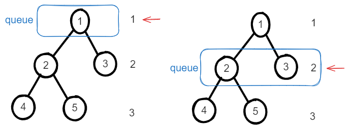

То есть мы итерируемся, как обычно, до тех пор, пока в очереди есть ноды. Каждая итерация увеличивает уровень.
```java
public int minDepth(TreeNode root) {
    if (root == null) return 0;
        
    Queue<TreeNode> queue = new ArrayDeque<>();
    queue.add(root);

    int level = 0;
    while (!queue.isEmpty()) {
        level++;
        int curSize = queue.size();
        // Clean nodes ONLY for the current level
        for (int i = 0; i < curSize; i++) {
            TreeNode node = queue.remove();
            // No children == leaf == this is min level
            if (node.left == null && node.right == null) return level;
            // Add children for next iteration
            if (node.left != null) queue.add(node.left);
            if (node.right != null) queue.add(node.right);
        }
    }
    return level;
}
```

----

## [↑](#home) <a id="merge"></a> Merge Two Binary Trees
Рассмотрим задачу "[Merge Two Binary Trees](https://leetcode.com/problems/merge-two-binary-trees/)":
> Дано два дерева. Нужно сложить их элементы.

Разбор задачи от NeetCode: **"[Merge Two Binary Trees](https://www.youtube.com/watch?v=QHH6rIK3dDQ)"**.

Код решения:
```java
public TreeNode mergeTrees(TreeNode root1, TreeNode root2) {
    // When we can't do nothing? When both nodes are null
    if (root1 == null && root2 == null) return null;

    // Create a new Node and merge current root1 and root2 nodes
    int root1Val = root1 != null ? root1.val : 0;
    int root2Val = root2 != null ? root2.val : 0;
    TreeNode root = new TreeNode(root1Val + root2Val);
        
    // Do the same for other parts
    root.left = mergeTrees(root1 != null ? root1.left : null,
                            root2 != null ? root2.left : null);
    root.right = mergeTrees(root1 != null ? root1.right : null, 
                            root2 != null ? root2.right : null);
    return root;
}
```

----

## [↑](#home) <a id="pathSum"></a> Path Sum
Рассмотрим задачу "[Path Sum](https://leetcode.com/problems/path-sum/)":
> Дано дерево и некоторое значение. Нужно ответить, есть ли такой путь от рута к листу, сумма элементов которого равна этому значению.

Разбор задачи от NeetCode: **"[Path Sum](https://www.youtube.com/watch?v=LSKQyOz_P8I)"**.

Логика решения - если у нас нет ни left, ни right - мы лист, а значит должны проверить сумму, которая накопилась по пути до нас. Если же у нас есть дочерние элементы - мы не лист, а значит не можем принимать решение. А значит мы просто передадим сумму дальше в дочерние элементы и попросим узнать ответ.

Для начала, из изначального метода вызовем такой-же, но с информацией о накопленной сумме:
```java
public boolean hasPathSum(TreeNode root, int targetSum) {
    return hasPathSum(root, targetSum, 0);
}
```

А в нашем методе выполним вычисление:
```java
private boolean hasPathSum(TreeNode node, int targetSum, int curSum) {
    // Null node can't have the target sum
    if (node == null) return false;
        
    curSum = curSum + node.val; // Sum including the current node
    // No children == leaf node, the current sum is the final result for this current branch
    if (node.left == null && node.right == null) {
        return curSum == targetSum;
    } else {
        // Has children - ask them. One of them should return true
        return hasPathSum(node.left, targetSum, curSum) || hasPathSum(node.right, targetSum, curSum);
    }
}
```

----

## [↑](#home) <a id="treePaths"></a> Binary Tree Paths
Рассмотрим задачу "[Binary Tree Paths](https://leetcode.com/problems/binary-tree-paths/)":
> Дано дерево. Нужно вернуть все пути от рута до листа в виде строк вида "1->2->5" в любом порядке.

Разбор задачи от Nick White: [Binary Tree Paths](https://www.youtube.com/watch?v=H2D4HcVZq_g)

Задача главного метода - проверить входные данные и предоставить начальную строку. Это позволит избежать обработку наличия или отсутствия "->" перед первым элементом: 
```java
public List<String> binaryTreePaths(TreeNode root) {
    List<String> result = new ArrayList();
    if (root == null) return result;
    dfs(root, String.valueOf(root.val), result);
    return result;
}
```

Ну а дальше привычный нам dfs:
```java
private void dfs(TreeNode node, String path, List<String> result) {
    if (node == null) return; // Can't do anything without node
    // It's leaf
    if (node.left == null && node.right == null) {
        result.add(path);
        return;
    }
    // Has children
    if (node.left != null) dfs(node.left, path + "->" + String.valueOf(node.left.val), result);
    if (node.right != null) dfs(node.right, path + "->" + String.valueOf(node.right.val), result);
}
```

----

## [↑](#home) <a id="inorder"></a> Binary Tree Inorder Traversal
Рассмотрим задачу "[Binary Tree Inorder Traversal](https://leetcode.com/problems/binary-tree-inorder-traversal/)".

Разбор задачи от NeetCode: [Binary Tree Inorder Traversal](https://www.youtube.com/watch?v=g_S5WuasWUE)

Как всегда, разделим логику на главный метод и вспомогательный:
```java
public List<Integer> inorderTraversal(TreeNode root) {
    List<Integer> result = new ArrayList<>();
    inorderTraversal(root, result);
    return result;
}
```

Наш вспомогательный метод:
```java
private void inorderTraversal(TreeNode node, List<Integer> result) {
    if (node == null) return;
    // "In Order" means that left child should go first
    if (node.left != null) inorderTraversal(node.left, result);
    result.add(node.val);
    // "In Order" means that right child should go last
    if (node.right != null) inorderTraversal(node.right, result);
}
```

Есть ещё итеративное решение при помощи стэка.\
Разбор можно посмотреть у Tushar Roy: **[Iterative Inorder Traversal of Binary Tree](https://www.youtube.com/watch?v=nzmtCFNae9k)**

Код:
```java
public List<Integer> inorderTraversal(TreeNode root) {
    List<Integer> result = new ArrayList<>();
    if (root == null) return result;
        
    Deque<TreeNode> stack = new ArrayDeque<>();
    TreeNode cur = root;
    while(cur != null || !stack.isEmpty()) {
        if (cur != null) {
            stack.addLast(cur);
            cur = cur.left;
        } else {
            // Return through the stack
            cur = stack.removeLast();
            result.add(cur.val);
            cur = cur.right;
        }  
    }
    return result;
}
```

Ещё одно итеративное решение основано на том факте, что мы всегда стараемся максимально глубоко опуститься по левой стороне:
```java
public List<Integer> inorderTraversal(TreeNode root) {
    List<Integer> result = new ArrayList<>();
    Deque<TreeNode> stack = new ArrayDeque<>();
    
    TreeNode cur = root;
    while(cur != null || !stack.isEmpty()) {
        // Go down to the left
        while (cur != null) {
            stack.addLast(cur);
            cur = cur.left;
        }
        cur = stack.removeLast();
        // We are in the middle of L -> Parent -> R
        result.add(cur.val);
        // Try to check right part
        cur = cur.right;
    }
    return result;
}
```

----

## [↑](#home) <a id="postorder"></a> Binary Tree Postorder Traversal
Рассмотрим задачу "[Binary Tree Postorder Traversal](https://leetcode.com/problems/binary-tree-postorder-traversal/)".

Разбор задачи от NeetCode: [Binary Tree Postorder Traversal](https://www.youtube.com/watch?v=QhszUQhGGlA)

Рекурсивное решение такое же, как и у [Inorder Traversal](#inorder), только родитель добавляется после left и right.\
Куда интереснее посмотреть на итеративное решение.

Чтобы не ошибиться с решением стоит вспомнить ещё раз, что Deque, которая нам понадобится для решения, это двусторонняя очередь. Её рекомендуют использовать в том числе для стэков. Важно, что push, pop и peek соответствуют методам addFirst, removeFirst и peekFirst.

Код решения:
```java
public List<Integer> postorderTraversal(TreeNode root) {
    List<Integer> result = new ArrayList<>();
    if (root == null) return result;
        
    TreeNode current = root; // Point to the current node for handling
        
    Deque<TreeNode> stack = new ArrayDeque<>();
    while (current != null || !stack.isEmpty()) {
        if (current != null) {
                stack.push(current);
                current = current.left; // Continue left path
        } else {
            // Don't have current == don't have more left nodes
            TreeNode next = stack.peek().right;
            if (next == null) {
                // Don't have left node, don't have right node. Our root is on the stack
                // Remove it and put into the result
                next = stack.pop();
                result.add(next.val);
                // Return through the right path
                while (!stack.isEmpty() && next == stack.peek().right) {
                    next = stack.pop();
                    result.add(next.val);
                }
            } else {
                current = next;
            }
        }
    }
    return result;
}
```
Идея алгоритма заключается в том, чтобы спускать по левой ветке вниз пока можно, т.к. левая нода добавляется в результат самой первой. Как только мы упираемся в конец (current становится null), мы должны вернуться наверх и переключиться на правую ветку (если можем).

Т.к. мы без рекурсии, то эффект рекурсии мы иммитируем при помощи стэка. Для начала мы смотрим на то, есть ли у элемента на стэке правая нода. Если правая нода есть - мы переключаемся на неё, т.е. делаем current = temp. Если же правой ноды нет, это значит, что идти больше некуда и мы можем смело добавлять элемент из стэка в результат. Возвращаемся по правому пути обратно. 

----

## [↑](#home) <a id="average"></a> Average of Levels in Binary Tree
Рассмотрим задачу "[Average of Levels in Binary Tree](https://leetcode.com/problems/average-of-levels-in-binary-tree/)":
> Дан корень бинарного дерева. Вернуть массив, каждый элемент которого представляет среднее значение всех значений на данном уровне. То есть первый элемент массива - среднее из первого уровня (тут только корень), второй элемент массива - среднее для второго уровня. И так далее.

Разбор задачи от Nick White: [Average of Levels in Binary Tree](https://www.youtube.com/watch?v=NW3aCTwdXxs)

Данная задача очень похожа на задачу [Maximum Depth of Binary Tree](#maxDepth) и решается при помощи **BFS**:
```java
public List<Double> averageOfLevels(TreeNode root) {
    List<Double> result = new ArrayList<>();
    Queue<TreeNode> queue = new LinkedList<>();
    queue.offer(root);
    while (!queue.isEmpty()) {
        double level_sum = 0;
        double size = queue.size(); // Remember current queue size
        for (int i = 0; i < size; i++) {
            TreeNode cur = queue.poll();
            level_sum = level_sum + cur.val;
            //Consider children for next while loop iterations
            if (cur.left != null) queue.offer(cur.left);
            if (cur.right != null) queue.offer(cur.right);
        }
        result.add(level_sum / size);
    }
    return result;
}
```
Получается, нам нужно дать ответ для КАЖДОГО уровня. То есть надо идти по уровням. А это BFS. На каждой итерации (т.е. для каждого уровня) мы складываем суммы всех чисел, считаем их среднее. Пока мы это делаем не забываем добавлять левые и правые дочерние элементы, ведь мы достали из стэка элемент и если потеряем доступ к нему мы больше не сможем вернуться к нему и не сможем перейти на следующий уровень.

----

## [↑](#home) <a id="lowest"></a> Lowest Common Ancestor
Рассмотрим задачу "[Lowest Common Ancestor of a Binary Search Tree](https://leetcode.com/problems/lowest-common-ancestor-of-a-binary-search-tree/)":
> Дан корень бинарного дерева поиска и две ноды. Нужно найти для этих нод ближайшую ноду, которая будет для них общей вверх по дереву.

Разбор задачи от NeetCode: [Lowest Common Ancestor of a Binary Search Tree](https://www.youtube.com/watch?v=gs2LMfuOR9k)

Решение данной задачи упрощено тем, что дано бинарное дерево поиска. Это означает, что мы можем рассчитывать на то, что у любой ноды значения слева меньше, а значения справа больше. Тогда, общий предок - это нода, для которой входные ноды оказались по разные стороны или одна из нод совпала с корнем.

Тогда решение выглядит просто, когда мы поняли подход:
```java
public TreeNode lowestCommonAncestor(TreeNode root, TreeNode p, TreeNode q) {
    while (root != null) {
        if (p.val < root.val && q.val < root.val) {
            root = root.left;
        } else if (p.val > root.val && q.val > root.val) {
            root = root.right;
        } else {
            return root;
        }
    }
    return root;
}
```

Есть ещё рекурсивная версия решения:
```java
public TreeNode lowestCommonAncestor(TreeNode root, TreeNode p, TreeNode q) {  
    // We can't do anything without root
    if (root == null) return root;
    // If we found P or Q - that's all
    if (root == p || root == q) return root;

    TreeNode left = lowestCommonAncestor(root.left, p, q);
    TreeNode right = lowestCommonAncestor(root.right, p, q);

    if (left == null) {
        return right;
    } else if (right == null) {
        return left;
    } else {
        return root;
    }
}
```

----

## [↑](#home) <a id="levelTraversal"></a> Binary Tree Level Order Traversal
Рассмотрим задачу [Binary Tree Level Order Traversal](https://leetcode.com/problems/binary-tree-level-order-traversal/):
> Дан корневой элемент дерева. Вернуть список элементов по уровням.

Разбор задачи от NeetCode: [Binary Tree Level Order Traversal - BFS](https://www.youtube.com/watch?v=6ZnyEApgFYg)

```java
public List<List<Integer>> levelOrder(TreeNode root) {
    List<List<Integer>> result = new ArrayList<List<Integer>>();
    if (root == null) return result;
        
    Deque<TreeNode> queue = new ArrayDeque<>();
    queue.add(root);
    
    while (!queue.isEmpty()) {
        List<Integer> levelList = new ArrayList<>();
        
        int levelSize = queue.size();
        for (int i = 0; i < levelSize; i++) {
            TreeNode node = queue.remove();
            levelList.add(node.val);
            if (node.left != null) queue.add(node.left);
            if (node.right != null) queue.add(node.right);
        }
        result.add(levelList);
    }
    return result;
}
```

----

## [↑](#home) <a id="sideView"></a> Binary Tree Right Side View
Рассмотрим задачу [Binary Tree Right Side View](https://leetcode.com/problems/binary-tree-right-side-view/):
> Дан корень дерева. Нужно вернуть список значений, которые видны, если на дерево посмотреть как-бы с правой стороны.

Разбор задачи от NeetCode: [Binary Tree Right Side View - BFS](https://www.youtube.com/watch?v=d4zLyf32e3I)

Задача похожа по своей логике на другие задачи с использованием подхода BFS:
```java
public List<Integer> rightSideView(TreeNode root) {
    List<Integer> result = new ArrayList<>();
    if (root == null) return result;
    
    Deque<TreeNode> queue = new ArrayDeque<>();
    queue.add(root);
    while(!queue.isEmpty()) {
        int levelSize = queue.size();
        TreeNode lastLevelNode = null;
        for (int i = 0; i < levelSize; i++) {
            lastLevelNode = queue.remove();
            if (lastLevelNode.left != null) queue.add(lastLevelNode.left);
            if (lastLevelNode.right != null) queue.add(lastLevelNode.right);
        }
        result.add(lastLevelNode.val);
    }
    return result;
}
```

----

## [↑](#home) <a id="goodNodes"></a> Count Good Nodes in Binary Tree
Рассмотрим задачу [Count Good Nodes in Binary Tree](https://leetcode.com/problems/count-good-nodes-in-binary-tree/):
> Дан корень дерева. Нужно найти КОЛИЧЕСТВО "good nodes". Good Node - это такая нода, путь до которой от корня дерева не содержит нод, значение которых выше, чем у good node.

Разбор задачи от NeetCode: [Count Good Nodes in a Binary Tree](https://www.youtube.com/watch?v=7cp5imvDzl4)

Для решения нам понадобится DFS подход:
```java
public int goodNodes(TreeNode root) {
    return dfs(root, root.val);
}
```

Сам же рекурсивный DFS будет выглядеть следующим образом:
```java
private int dfs(TreeNode node, int maxValue) {
    int result = 0;
    if (node == null) return result;

    if (node.val >= maxValue) result++;
    maxValue = Math.max(maxValue, node.val);

    result = result + dfs(node.left, maxValue);
    result = result + dfs(node.right, maxValue);
    return result;
}
```

----

## [↑](#home) <a id="validate"></a> Validate Binary Search Tree
Рассмотрим задачу [Validate Binary Search Tree](https://leetcode.com/problems/validate-binary-search-tree/):
> Дан корень дерева. Нужно узнать, является ли дерево двочиным деревом поиска, т.е. когда левый дочерний элемент всегда меньше, а правый - больше.

Разбор задачи от NeetCode: [Validate Binary Search Tree - DFS](https://www.youtube.com/watch?v=s6ATEkipzow)

```java
public boolean isValidBST(TreeNode root) {
    return isValidBST(root, null, null);
}
    

private boolean isValidBST(TreeNode node, Integer min, Integer max) {
    // an empty binary trees is a valid BST.
    if (node == null) return true; 

    if (max != null && node.val >= max) return false;
    if (min != null && node.val <= min ) return false;

    return isValidBST(node.left, min, node.val) && 
        isValidBST(node.right, node.val, max);
}
```
Идея решения заключается в том, что каждая нода сужает диапазон доступных значений для последующей части дерева. Таким образом, в DFS можно передавать знания об этом диапазоне дальше по дереву.

----

## [↑](#home) <a id="smallest"></a> Kth Smallest Element in a BST
Рассмотрим задачу [Kth Smallest Element in a BST](https://leetcode.com/problems/kth-smallest-element-in-a-bst/):
> Дано двоичное дерево поиска. Нужно вернуть k-тый наименьший элемент (индекс начинается с 1).

Разбор задачи от NeetCode: [Kth Smallest Element in a BST](https://www.youtube.com/watch?v=5LUXSvjmGCw)

Данная задача основана на другой задаче: [Binary Tree Inorder Traversal](#inorder):
```java
public int kthSmallest(TreeNode root, int k) {
    int result = 0; //instead of "new ArrayList<>()"
    Deque<TreeNode> stack = new ArrayDeque<>();
    
    TreeNode cur = root;
    while(cur != null || !stack.isEmpty()) {
        // Go down to the left
        while (cur != null) {
            stack.addLast(cur);
            cur = cur.left;
        }
        cur = stack.removeLast();
        // We are in the middle of L -> Parent -> R
        if (++result == k) return cur.val; // instead of result.add(cur.val);
        // Try to check right part
        cur = cur.right;
    }
    return result;
}
```

----
## [↑](#home) <a id="preorder"></a> Binary Tree Preorder Traversal
Рассмотрим задачу [Binary Tree Preorder Traversal](https://leetcode.com/problems/binary-tree-preorder-traversal):
> Дано дерево. Нужно вернуть его элементы в preorder порядке

Разбор задачи от NeetCode: [Binary Tree Preorder Traversal (Iterative)](https://www.youtube.com/watch?v=afTpieEZXck)

Решение:
```java
public List<Integer> preorderTraversal(TreeNode root) {
    TreeNode emptyNode = new TreeNode();
        
    List<Integer> result = new ArrayList<>();
    TreeNode cur = root;
    Deque<TreeNode> queue = new ArrayDeque<>();
    
    while ((cur != null && cur != emptyNode) || !queue.isEmpty()) {
        if (cur != null && cur != emptyNode) {
            result.add(cur.val);
            queue.addLast(cur.right != null ? cur.right : emptyNode);
            cur = cur.left;
        } else {
            cur = queue.removeLast();
        }
    }
    return result;
}
```
Т.к. ArrayDeque не работает с null, то заменяем его специальным элементом emptyNode.

----

## [↑](#home) <a id="construct"></a> Construct Binary Tree From Preorder And Inorder Traversal
Рассмотрим задачу [Construct Binary Tree From Preorder And Inorder Traversal](https://leetcode.com/problems/construct-binary-tree-from-preorder-and-inorder-traversal/):
> Дано два массива чисел, представляющих preorder и inorder представления дерева. Нужно сконструировать дерево.

Разбор задачи от NeetCode: [Construct Binary Tree From Preorder And Inorder Traversal](https://www.youtube.com/watch?v=ihj4IQGZ2zc)\
Разбор задачи от Nikhil Lohia: [Create Binary Tree from pre-order and in-order traversal](https://youtu.be/PbPS460rbMo?si=-_RvTJPLy4Z7HeVd&t=727)

Решение:
```java
public TreeNode buildTree(int[] preorder, int[] inOrder) {
    Map<Integer, Integer> inOrderIndexMap = new HashMap<>();
    for (int i = 0; i < inOrder.length; i++) {
        inOrderIndexMap.put(inOrder[i], i);
    }
    return buildTree(preorder, inOrderIndexMap, 0, 0, inOrder.length - 1);
}

private TreeNode buildTree(int[] preOrder, Map<Integer, Integer> indexMap, int rootIndex, int left, int right) {
    int rootValue = preOrder[rootIndex];
    TreeNode root = new TreeNode(rootValue);
        
    int mid = indexMap.get(rootValue);
    if (mid > left) {
        // Skip visited root index (i.e. increment it). Keep left border, restrict right border
        root.left = buildTree(preOrder, indexMap, rootIndex + 1, left, mid - 1);
    }
    if (mid < right) {
        // Mid is known according to the whole range. We should adapt it.
        // left == how many elements were skipped from the left
        int elementsFromLeft = mid + 1 - left;
        root.right = buildTree(preOrder, indexMap, rootIndex + elementsFromLeft, mid + 1, right);
    }
    return root;
}
```

----

## [↑](#home) <a id="construct2"></a> Construct Binary Tree from Inorder and Postorder Traversal
Рассмотрим задачу [Construct Binary Tree from Inorder and Postorder](https://leetcode.com/problems/construct-binary-tree-from-inorder-and-postorder-traversal):
> Дано два массива чисел, представляющих postorder и inorder представления дерева. Нужно сконструировать дерево.

Разбор задачи от NeetCode: [Construct Binary Tree from Inorder and Postorder Traversal](https://www.youtube.com/watch?v=vm63HuIU7kw)\
Описание решения так же можно прочитать у [TakeUForward](https://takeuforward.org/data-structure/construct-binary-tree-from-inorder-and-postorder-traversal/)

Нам придётся из основного метода вызывать вспомогательный:
```java
public TreeNode buildTree(int[] inorder, int[] postorder) {
        Map<Integer, Integer> map = new HashMap<>();
        // We will use postorder to find root, and inorder to find children
        // We will take value from postorder and search it in inorder. So create the map:
        for (int i = 0; i < inorder.length; i++) {
            map.put(inorder[i], i);
        }
        return buildTree(inorder, 0, inorder.length-1, 
                        postorder, 0, postorder.length-1,map);   
}
```

Вспомогательный метод:
```java
private TreeNode buildTree(int[] inorder, int is, int ie, 
                            int[] postorder, int ps, int pe,
                            Map<Integer,Integer> map) {
    // At first, check that we are still in the boundaries
    if (is > ie || ps > pe) return null;
    // Take last postorder range element as root
    TreeNode root = new TreeNode(postorder[pe]);
    // Now we can find root element index to split inorder to left and right parts
    int rootIndex = map.get(root.val);
    // It's easy to split inorder to left and right by rootIndex
    // [is, rootIndex-1][rootIndex][rootIndex+1, ie]
        
    // Calculate how many elements are on the left side (we need to know it to split postorder to left and right)
    int elOnLeft = rootIndex - is;

    // Keep postorder start (ps) and reduce right as: ps + elOnLeft - 1 (because of zero based index)
    TreeNode leftchild = buildTree(inorder, is, rootIndex - 1, 
                                    postorder, ps, ps + elOnLeft - 1, map);
    // Reduce postorder end by 1 (i.e. by root)
    // Shift postorder start (ps) by element that was separated as left part
    TreeNode rightchild = buildTree(inorder, rootIndex + 1, ie, 
                                    postorder, ps + elOnLeft, pe - 1, map);
    // Just set result to proper side field
    root.left = leftchild;
    root.right = rightchild;
    return root;
}
```

----

## [↑](#home) <a id="constructPreorder"></a> Construct Binary Search Tree from Preorder Traversal
Рассмотрим задачу [Construct Binary Search Tree from Preorder Traversal](https://leetcode.com/problems/construct-binary-search-tree-from-preorder-traversal/):
> Дан массив чисел, представляющих собой Preorder представления дерева. Нужно сконструировать само дерево.

Разбор задачи: [https://www.youtube.com/watch?v=9sw8RRsBw6s](https://www.youtube.com/watch?v=9sw8RRsBw6s)

Код решения:
```java
public TreeNode bstFromPreorder(int[] preorder) {
    if (preorder == null || preorder.length == 0) return null;
    TreeNode index = new TreeNode(0);
    return bstFromPreorder(preorder, Integer.MIN_VALUE, Integer.MAX_VALUE, index);
}

private TreeNode bstFromPreorder(int[] preorder, int minBound, int maxBound, TreeNode index) {
    if (index.val >= preorder.length) return null;
    if (preorder[index.val] < minBound || preorder[index.val] > maxBound) {
        return null;
    }

    TreeNode node = new TreeNode(preorder[index.val]);
    index.val++;

    node.left = bstFromPreorder(preorder, minBound, node.val - 1 , index);
    node.right = bstFromPreorder(preorder, node.val + 1, maxBound, index);
        
    return node;
}
```

Есть ещё и другое решение на основе стэка:

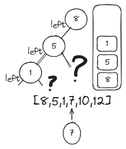

Объяснение от Timothy Chang: [Construct Binary Search Tree from Preorder Traversal](https://www.youtube.com/watch?v=ddXHl0OEaHo)

Код:
```java
public TreeNode bstFromPreorder(int[] preorder) {
    Deque<TreeNode> stack = new ArrayDeque<>();
    TreeNode root = new TreeNode(preorder[0]);
    stack.addLast(root);
        
    for (int i = 1; i < preorder.length; i++) {
        int value = preorder[i];
        if (value < stack.getLast().val) {
            stack.getLast().left = new TreeNode(value);
            stack.addLast(stack.getLast().left);
        } else {
            TreeNode last = null;
            while (!stack.isEmpty() && value > stack.getLast().val) {
                last = stack.removeLast();
            }
            last.right = new TreeNode(value);
            stack.addLast(last.right);
        }
    }
    return root;
}
```

----

## [↑](#home) <a id="constructString"></a> Construct String from Binary Tree
Рассмотрим задачу [Construct String from Binary Tree](https://leetcode.com/problems/construct-string-from-binary-tree/):
> Дано дерево. Нужно вернуть строку в виде Preorder представления, но обрамляя скобками child ноды.

Разбор задачи от NeetCode: [Construct String from Binary Tree](https://www.youtube.com/watch?v=b1WpYxnuebQ)

Нам понадобится дополнительный метод, чтобы его можно было вызывать рекурсивно:
```java
public String tree2str(TreeNode root) {
    StringBuilder result = new StringBuilder();
    buildString(result, root);
    return result.substring(1, result.length() - 1); 
}
```

Сам метод будет выглядеть так:
```java
private void buildString(StringBuilder result, TreeNode node) {
    result.append("(");
    result.append(node.val);
        
    if (node.left == null && node.right != null) {
        result.append("()");
    }
    if (node.left != null) buildString(result, node.left);
    if (node.right != null) buildString(result, node.right);

    result.append(")");
}
```

----

## [↑](#home) <a id="maxPathSum"></a> Binary Tree Maximum Path Sum
Рассмотрим задачу [Binary Tree Maximum Path Sum](https://leetcode.com/problems/binary-tree-maximum-path-sum/):
> Дано дерево. Нужно найти сумму значений максимального по сумме значений пути

Разбор задачи от NeetCode: [Binary Tree Maximum Path Sum - DFS](https://www.youtube.com/watch?v=Hr5cWUld4vU)\
Разбор задачи от Nick White: [Binary Tree Maximum Path Sum (Algorithm Explained)](https://www.youtube.com/watch?v=mOdetMWwtoI)\
Разбор задачи от Michael Muinos: [Binary Tree Maximum Path Sum (Animated Walkthrough)](https://www.youtube.com/watch?v=6cA_NDtpyz8)

Для решения данной задачи нужно для начала вспомнить задачу [Path Sum](#pathSum).\
А так же стоит рассмотреть 3 случая:

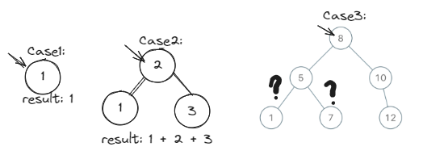

Решение:
```java
public int maxPathSum(TreeNode root) {
    int[] summ = {Integer.MIN_VALUE}; 
    maxPathSum(root, summ);
    return summ[0];
}

private int maxPathSum(TreeNode node, int[] summ) {
    if (node == null) return 0;
    // Avoid negative values. 0 means "do not go this way"
    int left = Math.max(0, maxPathSum(node.left, summ));
    int right = Math.max(0, maxPathSum(node.right, summ));
    // Calculate the best sum for this moment
    summ[0] = Math.max(summ[0], left + right + node.val);
    // Node on top of us can select only one path. Return the best path
    return Math.max(left, right) + node.val;
}
```

----

## [↑](#home) <a id="serialize"></a> Serialize and Deserialize Binary Tree
Рассмотрим задачу [Serialize and Deserialize Binary Tree](https://leetcode.com/problems/serialize-and-deserialize-binary-tree/):
> Нужно написать два метода: создание дерева из строки и создание строки из дерева.

Разбор задачи от NeetCode: [Serialize and Deserialize Binary Tree - Preorder Traversal](https://www.youtube.com/watch?v=u4JAi2JJhI8)

Сериализация дерева в строку по аналогии с задачей [Construct Preorder String from Binary Tree](#constructString):
```java
// Encodes a tree to a single string.
public String serialize(TreeNode root) {
    if (root == null) return "";
    // We should construct string, it means do should build it step by step:
    StringBuilder str = new StringBuilder();
    buildStringFromTree(root, str);
    return str.substring(1);
}

private void buildStringFromTree(TreeNode node, StringBuilder str) {
    str.append(",");
    if (node == null) {
        str.append("N");
        return;
    }; 
    str.append(node.val);
    buildStringFromTree(node.left, str);
    buildStringFromTree(node.right, str);
}
```

Далее превратим строку в дерево по аналогии с [Construct Binary Search Tree from Preorder Traversal](#constructPreorder):
```java
// Decodes your encoded data to tree.
public TreeNode deserialize(String data) {
    String[] preorder = data.split(",");
    if (preorder == null || preorder.length == 0) return null;
    // We have enough information. Just create a tree
    return buildTreeFromString(preorder, new int[]{0});
}

private TreeNode buildTreeFromString(String[] preorder, int[] index) {
    String value = preorder[index[0]];  // Read value under the pointer
    index[0] = index[0] + 1;            // Prepare pointer for next iteration 
    if (value.equals("N") || value.equals("")) return null;   // N means NULL

    TreeNode node = new TreeNode(Integer.valueOf(value));
    node.left = buildTreeFromString(preorder, index);
    node.right = buildTreeFromString(preorder, index);
    return node;
}
```

----

## [↑](#home) <a id="delete"></a> Delete Node in a BST
Рассмотрим задачу [Delete Node in a BST](https://leetcode.com/problems/delete-node-in-a-bst/):
> Дано дерево. Нужно из него удалить значение

Разбор от NeetCode: [Delete Node in a BST](https://www.youtube.com/watch?v=LFzAoJJt92M)

Код решения:
```java
public TreeNode deleteNode(TreeNode root, int key) {
    // Base case: Can't do anything without node
    if (root == null) return root;
    // The easiest case: the deleted node is somewhere else. Just delegate it
    if (key > root.val) {
        root.right = deleteNode(root.right, key);
        return root;
    } else if (key < root.val) {
        root.left = deleteNode(root.left, key);
        return root;
    } 
    // Another easy case: we should be deleted and have ONLY ONE child
    if (root.left == null) return root.right;
    if (root.right == null) return root.left;
    // Worst case: we have two children and we should be deleted
    // At first, we should: switch to right AND find the smallest value
    TreeNode cur = root.right;
    while (cur.left != null) {
        cur = cur.left;
    }
    // Delete node == replace it's value
    root.val = cur.val;
    // Delete the origin node of taken value
    // We've done the right switch. That's why we delegate it to the right
    root.right = deleteNode(root.right, root.val);
        
    return root;
}
```

----

## [↑](#home) <a id="insert"></a> Insert into a Binary Search Tree
Рассмотрим задачу [Insert into a Binary Search Tree](https://leetcode.com/problems/insert-into-a-binary-search-tree/):
> Реализовать вставку элемента в двоичное дерево поиска

Разбор задачи от Nick White: [Insert into a Binary Search Tree (Algorithm Explained)](https://www.youtube.com/watch?v=RIDBLO-S7OA)

```java
public TreeNode insertIntoBST(TreeNode root, int val) {
    if (root == null) return new TreeNode(val);
    TreeNode pointer = root;
    while (true) {
        if (val > pointer.val) {
            if (pointer.right != null) {
                pointer = pointer.right;
            } else {
                pointer.right = new TreeNode(val);
                break;
            }
        } else {
            if (pointer.left != null) {
                pointer = pointer.left;
            } else {
                pointer.left = new TreeNode(val);
                break;
            }
        }   
    }
    return root;    
}
```

----

## [↑](#home) <a id="iterator"></a> Binary Search Tree Iterator
Рассмотрим задачу [Binary Search Tree Iterator](https://leetcode.com/problems/binary-search-tree-iterator/):
> Дано двоичное дерево поиска. Нужно написать для него итератор, обходящий дерево в in-order порядке.

Разбор задачи от NeetCode: [Binary Search Tree Iterator](https://www.youtube.com/watch?v=RXy5RzGF5wo).

Задача похожа на задачу [Binary Tree Inorder Traversal](#inorder). Нам понадобится несколько структур данных для работы:
```java
private Deque<TreeNode> stack = new ArrayDeque<>();
private TreeNode cur;

public BSTIterator(TreeNode root) {
    cur = root; // Set root as a starting point
}
```

Мы можем что-то делать (т.е. итерироваться) только тогда, когда у нас есть или указатель, или элементы в стэке:
```java
public boolean hasNext() {
    return cur != null || !stack.isEmpty();
}
```

Сам метод итерации:
```java
public int next() {
    int result;
    // Get next element
    while (cur != null) {
        stack.addLast(cur);
        cur = cur.left;
    }
    // Exit from cycle == prev. visited node is a LEAF node (no L and R) OR has only R
    cur = stack.removeLast();
    result = cur.val;
    // Try to check right part
    cur = cur.right;
    return result;
}
```

----

## [↑](#home) <a id="completeness"></a> Check Completeness of a Binary Tree (BFS)
Рассмотрим задачу [Check Completeness of a Binary Tree](https://leetcode.com/problems/check-completeness-of-a-binary-tree/):
> Дано дерево. Нужно проверить, является ли оно "complete binary tree", т.е. максимально заполненным слева направо так, что каждый уровень кроме последнего полностью заполнен, а элементы последнего уровня максимально слева.

Разбор задачи от NeetCode: [Check Completeness of a Binary Tree](https://www.youtube.com/watch?v=olbiZ-EOSig)\
Разбор задачи от Nick White: [Check Completeness of a Binary Tree Explained](https://www.youtube.com/watch?v=j16cwbLEf9w)

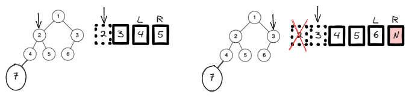

Код решения:
```java
public boolean isCompleteTree(TreeNode root) {
    Queue<TreeNode> queue = new ArrayDeque<>();
    queue.offer(root); // offer allows us to pass null

    TreeNode nullNode = new TreeNode();
    boolean endWasFound = false;
    while (!queue.isEmpty()) {
        TreeNode curNode = queue.poll();
        if (curNode == nullNode) {
            endWasFound = true;
        } else {
            if (endWasFound) return false;
            queue.offer(curNode.left != null ? curNode.left : nullNode);
            queue.offer(curNode.right != null ? curNode.right : nullNode);
        }
    }
    return true;
}
```

----

## [↑](#home) <a id="flatten"></a> Flatten Binary Tree to Linked List
Рассмотрим задачу [Flatten Binary Tree to Linked List](https://leetcode.com/problems/flatten-binary-tree-to-linked-list/):
> Дано двоичное дерево. Нужно из его стуктуры сделать подобие LinkedList.

Разбор решения от NeetCode: [Flatten Binary Tree to Linked List](https://www.youtube.com/watch?v=rKnD7rLT0lI)\

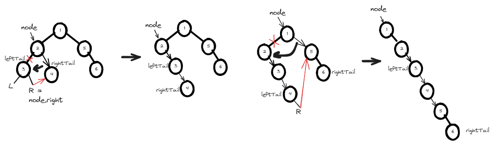

```java
public void flatten(TreeNode root) {
    flat(root);
}

private TreeNode flat(TreeNode node) {
    if (node == null) return null;
    TreeNode leftTail = flat(node.left);
    TreeNode rightTail = flat(node.right);
    // I.E. if left branch should be moved
    if (node.left != null) {
        leftTail.right = node.right;
        node.right = node.left;
        node.left = null;
    }
    TreeNode last;
    if (rightTail != null) {
        last = rightTail;
    } else if (leftTail != null) {
        last = leftTail;
    } else {
        last = node;
    }
    return last;
}
```

Есть ещё одно хитрое решение при помощи [Morris Traversal Algorithm](https://youtu.be/NOKVBiJwkD0?si=uclTUUfDYvnIoNkE&t=705):

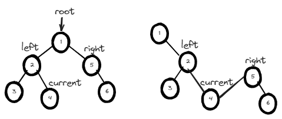

```java
public void flatten(TreeNode root) {
    if (root == null) return;
    while (root != null) {
        // Move the left branch to the right side
        if (root.left != null) {
            // Remember left pointer value before removal
            TreeNode left = root.left; 
            // Find end of the left part of BST
            TreeNode cur = left;
            while (cur.right != null) cur = cur.right;
            // Connect left to right
            cur.right = root.right;
            // Clean left pointer
            root.left = null;
            // Set right pointer to the left beginning
            root.right = left; 
        }
        root = root.right; // Go next to the right
    }
}
```

----

## [↑](#home) <a id="trim"></a> Trim a Binary Search Tree
Рассмотрим задачу [Trim a Binary Search Tree](https://leetcode.com/problems/trim-a-binary-search-tree/):
> Дано двоичное дерево. Дан диапазон в котором должны быть элементы. Нужно вернуть дерево так, чтобы в нём не было элементов вне этого диапазона.

Разбор решения от NeetCode: [Trim a Binary Search Tree](https://www.youtube.com/watch?v=jwt5mTjEXGc)

Код решения:
```java
public TreeNode trimBST(TreeNode root, int low, int high) {
    if (root == null) return null;
    // Our value is less than it can be. Left child is less than we. So ask the right child for result
    if (root.val < low) return trimBST(root.right, low, high);
    // Our value is bigger than it can be. Left child is too big. So ask the left child for result
    if (root.val > high) return trimBST(root.left, low, high);
    // We are ok. Leave node "as is". Just ask to do the same job our children
    // Do not forget to return value!
    root.left = trimBST(root.left, low, high);
    root.right = trimBST(root.right, low, high);
    return root;
}
```

----

## [↑](#home) <a id="pruning"></a> Binary Tree Pruning
Рассмотрим задачу [Binary Tree Pruning](https://leetcode.com/problems/binary-tree-pruning/):
> Дано двоичное дерево из нод нулей или единиц. Нужно удалить те ноды, поддеревья которых не содержат единиц.

Разбор задачи от Nick White: [Binary Tree Pruning Explained](https://www.youtube.com/watch?v=77LJc56bwnE)

Код решения:
```java
public TreeNode pruneTree(TreeNode root) {
    if (root == null) return root;
    TreeNode leftOne = pruneTree(root.left);
    TreeNode rightOne = pruneTree(root.right);
    if (leftOne == null) {
        // No "one" nodes on left --> remove left
        root.left = null;
    }
    if (rightOne == null) {
        // No "one" nodes on right --> remove right
        root.right = null;
    }
    // We should be "one" node OR we should have such nodes on left/right side
    if (root.val == 1 || leftOne != null || rightOne != null) {
        return root;
    }
    // If not - return null
    return null;
}
```

----

## [↑](#home) <a id="zigzag"></a> Binary Tree Zigzag Level Order Traversal
Рассмотрим задачу [Binary Tree Zigzag Level Order Traversal](https://leetcode.com/problems/binary-tree-zigzag-level-order-traversal/):
> Дано двоичное дерево. Нужно обойти его "Зигзагом", т.е. каждый уровень читать то слева направо, то справа налево.

Разбор задачи от NeetCode: [Binary Tree Zigzag Level Order Traversal](https://www.youtube.com/watch?v=igbboQbiwqw)

Решение:
```java
public List<List<Integer>> zigzagLevelOrder(TreeNode root) {
    List<List<Integer>> result = new ArrayList<>();
    if (root == null) return result;

    Deque<TreeNode> queue = new ArrayDeque<>();
    queue.addLast(root);
        
    int level = 0;
    while (!queue.isEmpty()) {
        level++;
            int cnt = queue.size();
            LinkedList<Integer> part = new LinkedList<Integer>();
            for (int i = 0; i < cnt; i++) {
                TreeNode cur = queue.removeFirst();
                if (level % 2 == 0) {
                    part.addFirst(cur.val);
                } else {
                    part.addLast(cur.val);
                }
                if (cur.left != null) queue.addLast(cur.left);
                if (cur.right != null) queue.addLast(cur.right);
            }
        result.add(part);
    }
    return result;
}
```

----

## [↑](#home) <a id="linkedListToTree"></a> Convert Sorted List to Binary Search Tree
Рассмотрим задачу [Convert Sorted List to Binary Search Tree](https://leetcode.com/problems/convert-sorted-list-to-binary-search-tree/):
> Дан отсортированный связанный список. Нужно его превратить в двоичное дерево поиска.

Разбор задачи: [EazyAlgo: Convert Sorted List to BST](https://www.youtube.com/watch?v=0E8Xxu6LV9o)

Код решения:
```java
public TreeNode sortedListToBST(ListNode head) {
    if (head == null) return null;
    // Single node list --> to --> Single node tree
    if (head.next == null) return new TreeNode(head.val);

    ListNode slow, fast, mid;
    slow = fast = mid = head;

    // While we can move the fast pointer
    while (fast != null && fast.next != null) {
        mid = slow;
        fast = fast.next.next;
        slow = slow.next;
    }
    TreeNode node = new TreeNode(slow.val);

    mid.next = null; // Disconnect first part from root
    node.left = sortedListToBST(head);
    node.right = sortedListToBST(slow.next);
    return node;
}
```