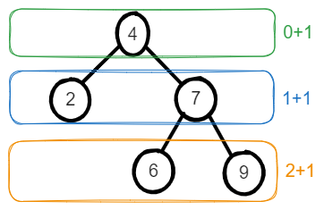
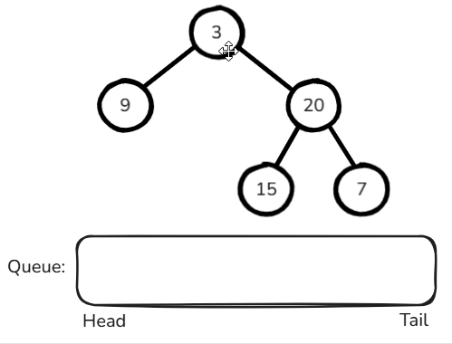
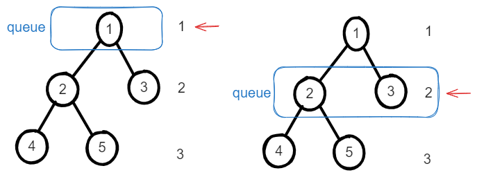
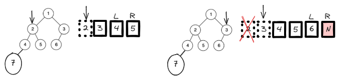

# [←](../../README.md) <a id="home"></a> Trees: Breadth-First Search (BFS)

Данный раздел посвящён задачам на деревья с применением **Breadth-First Search**.\
Задачи на LeetCode: **"[Breadth-First Search](https://leetcode.com/problem-list/breadth-first-search/)"**.\
Плэйлист от NeetCode: **"[Trees](https://www.youtube.com/watch?v=QfJsau0ItOY&list=PLot-Xpze53ldg4pN6PfzoJY7KsKcxF1jg)"**

**Table of Contents:**
- [[102] Binary Tree Level Order Traversal](#levelTraversal)
- [[104] Maximum Depth of Binary Tree](#maxDepth)
- [[111] Minimum Depth of Binary Tree](#minDepth)
- [[637] Average of Levels in Binary Tree](#average)
- [[199] Binary Tree Right Side View](#sideView)
- [[958] Check Completeness of a Binary Tree](#completeness)
- [[103] Binary Tree Zigzag Level Order Traversal](#zigzag)

----

## [↑](#home) <a id="levelTraversal"></a> 102. Binary Tree Level Order Traversal
Рассмотрим задачу [102. Binary Tree Level Order Traversal](https://leetcode.com/problems/binary-tree-level-order-traversal/):
> Дан корневой элемент дерева. Вернуть список элементов по уровням.

Разбор задачи от NeetCode: [Binary Tree Level Order Traversal - BFS](https://www.youtube.com/watch?v=6ZnyEApgFYg)

```java
public List<List<Integer>> levelOrder(TreeNode root) {
    List<List<Integer>> result = new ArrayList<List<Integer>>();
    if (root == null) return result;
        
    Deque<TreeNode> queue = new ArrayDeque<>();
    queue.add(root);
    
    while (!queue.isEmpty()) {
        List<Integer> levelList = new ArrayList<>();
        
        int levelSize = queue.size();
        for (int i = 0; i < levelSize; i++) {
            TreeNode node = queue.remove();
            levelList.add(node.val);
            if (node.left != null) queue.add(node.left);
            if (node.right != null) queue.add(node.right);
        }
        result.add(levelList);
    }
    return result;
}
```

----

## [↑](#home) <a id="maxDepth"></a> 104. Maximum Depth of Binary Tree
Рассмотрим задачу "[104. Maximum Depth of Binary Tree](https://leetcode.com/problems/maximum-depth-of-binary-tree/)":
> Дано дерево. Нужно найти его максимальную глубину, т.е. длину пути состоящего из бОльшего кол-ва элементов.

Если мы посмотрим на дерево, то увидим, что узлы/элементы/ноды образуют уровни:



Таким образом мы можем посмотреть на эти уровни и просто их посчитать.\
Для этого идеально подходит **Breadth-First Search** подход, он же поиск в ширину.

Для решения задач при помощи **BFS** пригодится структура данных - очередь.\
В очередь на обработку будут вставать элементы:



```java
public int maxDepth(TreeNode root) {
    if (root == null) return 0;

    int result = 0;
    Queue<TreeNode> queue = new ArrayDeque<>();
    queue.offer(root);

    while (!queue.isEmpty()) {
        int howManyNodesInLevel = queue.size();
        for (int i = 0; i < howManyNodesInLevel; i++) {
            System.out.println(i);
            TreeNode nodeFromLevel = queue.poll();
            // Add child nodes to the next level
            if (nodeFromLevel.left != null) queue.offer(nodeFromLevel.left);
            if (nodeFromLevel.right != null) queue.offer(nodeFromLevel.right);
        }
        result++; // Level was handled. Increment levels counter for it
    }
            
    return result;
}
```

----

## [↑](#home) <a id="minDepth"></a> 111. Minimum Depth of Binary Tree
Рассмотрим задачу "[111. Minimum Depth of Binary Tree](https://leetcode.com/problems/minimum-depth-of-binary-tree/)":
> Дано дерево. Нужно вычислить минимальную глубину дерева.

Разбор задачи от Nikhil Lohia: **"[Minimum Depth of Binary Tree](https://www.youtube.com/watch?v=tZS4VHtbYoo)"**.

Главное в этой задаче понять, как найти минимальную глубину.\
Минимальная глубина - это тот уровень, на котором элемент не имеет left и right.



То есть мы итерируемся, как обычно, до тех пор, пока в очереди есть ноды. Каждая итерация увеличивает уровень.
```java
public int minDepth(TreeNode root) {
    if (root == null) return 0;

    int level = 0;
    Queue<TreeNode> queue = new ArrayDeque<>();
    queue.offer(root);

    while (!queue.isEmpty()) {
        level++;
        int curSize = queue.size();
        // Clean nodes ONLY for the current level
        for (int i = 0; i < curSize; i++) {
            TreeNode node = queue.remove();
            // No children == leaf == this is min level
            if (node.left == null && node.right == null) return level;
            // Add children for next iteration
            if (node.left != null) queue.add(node.left);
            if (node.right != null) queue.add(node.right);
        }
    }
    return level;
}
```

----

## [↑](#home) <a id="average"></a> 637. Average of Levels in Binary Tree
Рассмотрим задачу "[637. Average of Levels in Binary Tree](https://leetcode.com/problems/average-of-levels-in-binary-tree/)":
> Дан корень бинарного дерева. Вернуть массив, каждый элемент которого представляет среднее значение всех значений на данном уровне. То есть первый элемент массива - среднее из первого уровня (тут только корень), второй элемент массива - среднее для второго уровня. И так далее.

Разбор задачи от Nick White: [Average of Levels in Binary Tree](https://www.youtube.com/watch?v=NW3aCTwdXxs)

Данная задача очень похожа на задачу [Maximum Depth of Binary Tree](#maxDepth) и решается при помощи **BFS**:
```java
public List<Double> averageOfLevels(TreeNode root) {
    List<Double> result = new ArrayList<>();
    Queue<TreeNode> queue = new LinkedList<>();
    queue.offer(root);
    while (!queue.isEmpty()) {
        double level_sum = 0;
        double size = queue.size(); // Remember current queue size
        for (int i = 0; i < size; i++) {
            TreeNode cur = queue.poll();
            level_sum = level_sum + cur.val;
            //Consider children for next while loop iterations
            if (cur.left != null) queue.offer(cur.left);
            if (cur.right != null) queue.offer(cur.right);
        }
        result.add(level_sum / size);
    }
    return result;
}
```
Как видно, вместо того, чтобы считать уровни, мы просто считаем среднее для каждого уровня. И в конце обработки уровня сохраняем результат.

----

## [↑](#home) <a id="sideView"></a> 199. Binary Tree Right Side View
Рассмотрим задачу [199. Binary Tree Right Side View](https://leetcode.com/problems/binary-tree-right-side-view/):
> Дан корень дерева. Нужно вернуть список значений, которые видны, если на дерево посмотреть как-бы с правой стороны.

Разбор задачи от NeetCode: [Binary Tree Right Side View - BFS](https://www.youtube.com/watch?v=d4zLyf32e3I)

Задача похожа по своей логике на другие задачи с использованием подхода BFS:
```java
public List<Integer> rightSideView(TreeNode root) {
    List<Integer> result = new ArrayList<>();
    if (root == null) return result;
    
    Queue<TreeNode> queue = new ArrayDeque<>();
    queue.offer(root);
    
    while(!queue.isEmpty()) {
        int levelSize = queue.size();
        TreeNode lastLevelNode = null;
        for (int i = 0; i < levelSize; i++) {
            lastLevelNode = queue.poll();
            if (lastLevelNode.left != null) queue.offer(lastLevelNode.left);
            if (lastLevelNode.right != null) queue.offer(lastLevelNode.right);
        }
        result.offer(lastLevelNode.val);
    }
    return result;
}
```
На этот раз нам ничего считать не надо, а важно лишь в конце итерации по уровню знать, какой элемент был обработан последним.

----

## [↑](#home) <a id="completeness"></a> 958. Check Completeness of a Binary Tree
Рассмотрим задачу [958. Check Completeness of a Binary Tree](https://leetcode.com/problems/check-completeness-of-a-binary-tree/):
> Дано дерево. Нужно проверить, является ли оно "complete binary tree", т.е. максимально заполненным слева направо так, что каждый уровень кроме последнего полностью заполнен, а элементы последнего уровня максимально слева.

Разбор задачи от NeetCode: [Check Completeness of a Binary Tree](https://www.youtube.com/watch?v=olbiZ-EOSig)\
Разбор задачи от Nick White: [Check Completeness of a Binary Tree Explained](https://www.youtube.com/watch?v=j16cwbLEf9w)



Таким образом, решение похоже на обычный BFS подход.
Добавляем ноды с уровня в очередь. Когда встречается null - после неё не должно быть никого.

Код решения:
```java
public boolean isCompleteTree(TreeNode root) {
    Queue<TreeNode> queue = new ArrayDeque<>();
    queue.offer(root); // offer allows us to pass null

    TreeNode nullNode = new TreeNode();
    boolean endWasFound = false;
    while (!queue.isEmpty()) {
        TreeNode curNode = queue.poll();
        if (curNode == nullNode) {
            endWasFound = true;
        } else {
            if (endWasFound) return false;
            queue.offer(curNode.left != null ? curNode.left : nullNode);
            queue.offer(curNode.right != null ? curNode.right : nullNode);
        }
    }
    return true;
}
```

----

## [↑](#home) <a id="zigzag"></a> 103. Binary Tree Zigzag Level Order Traversal
Рассмотрим задачу [103. Binary Tree Zigzag Level Order Traversal](https://leetcode.com/problems/binary-tree-zigzag-level-order-traversal/):
> Дано двоичное дерево. Нужно обойти его "Зигзагом", т.е. каждый уровень читать то слева направо, то справа налево.

Разбор задачи от NeetCode: [Binary Tree Zigzag Level Order Traversal](https://www.youtube.com/watch?v=igbboQbiwqw)

Решение:
```java
public List<List<Integer>> zigzagLevelOrder(TreeNode root) {
    List<List<Integer>> result = new ArrayList<>();
    if (root == null) return result;

    Deque<TreeNode> queue = new ArrayDeque<>();
    queue.addLast(root);
        
    int level = 0;
    while (!queue.isEmpty()) {
        level++;
            int cnt = queue.size();
            LinkedList<Integer> part = new LinkedList<Integer>();
            for (int i = 0; i < cnt; i++) {
                TreeNode cur = queue.removeFirst();
                if (level % 2 == 0) {
                    part.addFirst(cur.val);
                } else {
                    part.addLast(cur.val);
                }
                if (cur.left != null) queue.addLast(cur.left);
                if (cur.right != null) queue.addLast(cur.right);
            }
        result.add(part);
    }
    return result;
}
```

----