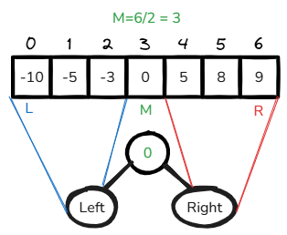
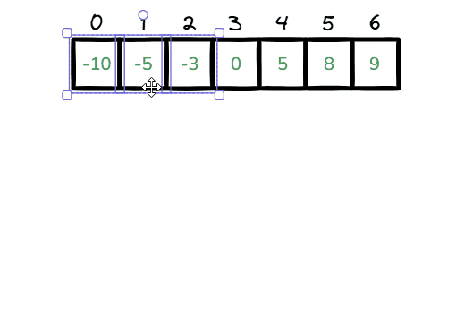
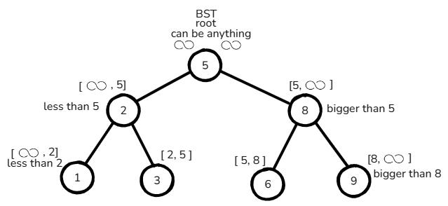
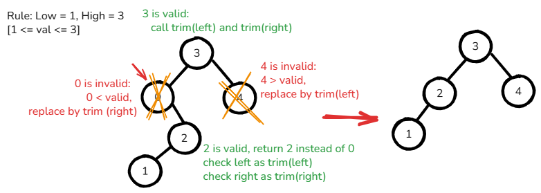
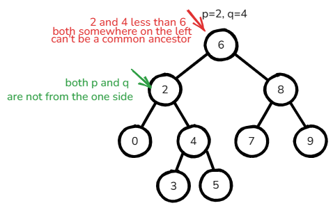
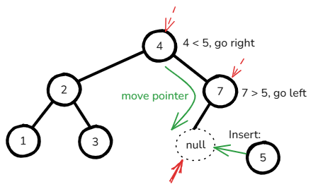
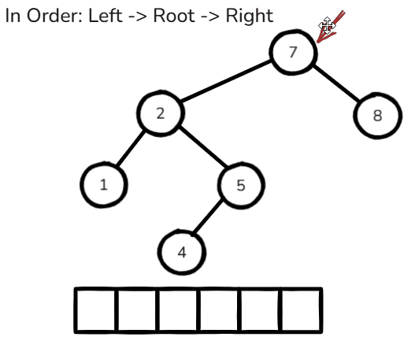
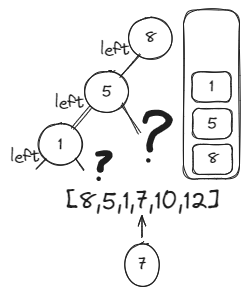

# [←](../../README.md) <a id="home"></a> Trees: Binary Search Trees (BST)

Данный раздел посвящён задачам на двоичные деревья поиска, они же **Binary Search Tree**.\
Задачи на LeetCode: **"[Binary Search Tree](https://leetcode.com/problem-list/binary-search-tree/)"**.\
Плэйлист от NeetCode: **"[Trees](https://www.youtube.com/watch?v=QfJsau0ItOY&list=PLot-Xpze53ldg4pN6PfzoJY7KsKcxF1jg)"**

**Table of Contents:**
- [[108] Convert Sorted Array to Binary Search Tree](#convert)
- [[109] Convert Sorted List to Binary Search Tree](#linkedListToTree)
- [[98] Validate Binary Search Tree](#validate)
- [[669] Trim a Binary Search Tree](#trim)
- [[235] Lowest Common Ancestor of BST](#lowest)
- [[701] Insert into a Binary Search Tree](#insert)
- [[450] Delete Node in a BST](#delete)
- [[783] Minimum Distance between BST Nodes](#minDistance)
- [[230] Kth Smallest Element in a BST](#smallest)
- [[173] Binary Search Tree Iterator](#iterator)
- [[1008] Construct Binary Search Tree from Preorder Traversal](#constructPreorder)

----

## [↑](#home) <a id="convert"></a> 108. Convert Sorted Array to Binary Search Tree
Рассмотрим задачу [108. Convert Sorted Array to Binary Search Tree](https://leetcode.com/problems/convert-sorted-array-to-binary-search-tree/):
> Дан отсортированный массив. Нужно его превратить в ДВОИЧНОЕ дерево поиска.

Двоичное дерево поиска основано на двоичном поиске, т.е. у нас есть середина, есть часть слева и часть справа:



Превращение массива в Binary Search Tree (BST) выглядит следующим образом:



Таки образом каждый раз у нас есть некоторый диапазон [left, right].\
В этом диапазоне выбираем середину **middle**. Это наш текущий **root**.\
Левая часть root - такая же работа, но с диапазоном [left, middle - 1].\
Прева часть root - такая же работа, но с диапазоном [middle + 1, right].

Получается, пока у нас в диапазоне есть значения - мы их обрабатываем.\
Если left и right сходятся - это означает, что у нас есть один элемент, мы всё ещё должны его обработать.\
Если же left зашёл за right, это значит, что больше значений нет. Это наш **base case**.

Разбор задачи можно посмотреть тут:
- [NeetCode: Convert Sorted Array to Binary Search Tree](https://www.youtube.com/watch?v=0K0uCMYq5ng)
- [Nick White: Convert Sorted Array to Binary Search Tree](https://www.youtube.com/watch?v=12omz-VAyRk)

Основной метод запускает рекурсивный метод, т.к. нам нужно при рекурсии знать диапазон:
```java
public TreeNode sortedArrayToBST(int[] nums) {
    if (nums.length == 0) return null;
    return sortedArrayToBST(nums, 0, nums.length-1);   
}
```

Сам же рекурсивный метод может выглядеть следующим образом:
```java
public TreeNode sortedArrayToBST(int[] nums, int left, int right) {
    // Recursion - always describe base case!
    if (left > right) return null; // no elements
    // Middle as root
    int mid = left + (right - left) / 2;
    TreeNode node = new TreeNode(nums[mid]);
    // Split array to left and right parts
    node.left = sortedArrayToBST(nums, left, mid - 1);
    node.right = sortedArrayToBST(nums, mid + 1, right);
    // Return root
    return node;
}
```

----

## [↑](#home) <a id="linkedListToTree"></a> 109. Convert Sorted List to Binary Search Tree
Рассмотрим задачу [109. Convert Sorted List to Binary Search Tree](https://leetcode.com/problems/convert-sorted-list-to-binary-search-tree/):
> Дан отсортированный связанный список. Нужно его превратить в двоичное дерево поиска.

Разбор задачи: [EazyAlgo: Convert Sorted List to BST](https://www.youtube.com/watch?v=0E8Xxu6LV9o)

Данная задача похожа [Convert Sorted Array to Binary Search Tree](#convert), но использует Linked List.

То есть, нам понадобится находить середину Linked List:
```java
public ListNode getMiddle(ListNode head) {
    ListNode slow = head, fast = head;
    ListNode prev = null; // Save prev to detach middle from the list
    while (fast != null && fast.next != null) {
        prev = slow; // previous step before slow
        fast = fast.next.next;
        slow = slow.next;
    }
    prev.next = null; // Disconnect first part from middle
    return slow;
}
```
Прежде чем вернуть середину Linked List мы должны отсоединить её от листа.\
Это позволит разделить Linked List на 3 части: left, middle и right.

Дальше остаётся рекурсивно делить Linked List по аналогии с массивами:
```java
public TreeNode sortedListToBST(ListNode head) {
    if (head == null) return null; // Empty list
    if (head.next == null) return new TreeNode(head.val); // Single node list

    ListNode mid = getMiddle(head);
    TreeNode node = new TreeNode(mid.val);
        
    node.left = sortedListToBST(head);       // head was disconnected in the middle
    node.right = sortedListToBST(mid.next);  // start right from the next element 
    return node;
}
```

----

## [↑](#home) <a id="validate"></a> 98. Validate Binary Search Tree
Рассмотрим задачу [98. Validate Binary Search Tree](https://leetcode.com/problems/validate-binary-search-tree/):
> Дан корень дерева. Нужно узнать, является ли дерево двочиным деревом поиска, т.е. когда левый дочерний элемент всегда меньше, а правый - всегда больше.

Разбор задачи от NeetCode: [Validate Binary Search Tree - DFS](https://www.youtube.com/watch?v=s6ATEkipzow)

Довольно интересная задача.\
Она про то, что спускаясь вниз по дереву мы можем спускать какую-то важную информацию:



Т.к. мы всегда пускаем ноду начиная с root, то:
- в левую часть она попадает, потому что меньше root
- в правую часть она попадает, потому что больше root

Таким образом, смотря на ноду, мы можем проверить, соответствует ли её значение диапазону.\
Ети данные приходят "сверху", от родителя. Потому что родитель собой ограничивает часть этого диапазона.

Тогда:
```java
private boolean isValidBST(TreeNode node, Integer min, Integer max) {
    // Empty Binary Trees == valid BST.
    if (node == null) return true; 
    
    // Condition: strictly bigger than min, strictly less than max
    if (max != null && node.val >= max) return false;
    if (min != null && node.val <= min ) return false;
    
    // Reduce the values ranges.
    return isValidBST(node.left, min, node.val) && 
        isValidBST(node.right, node.val, max);
}
```

Осатётся лишь запустить рекурсивный вызов начиная с root:
```java
public boolean isValidBST(TreeNode root) {
    return isValidBST(root, null, null);
}
```

----

## [↑](#home) <a id="trim"></a> 669. Trim a Binary Search Tree
Рассмотрим задачу [669. Trim a Binary Search Tree](https://leetcode.com/problems/trim-a-binary-search-tree/):
> Дано двоичное дерево. Дан диапазон в котором должны быть элементы. Нужно вернуть дерево так, чтобы в нём не было элементов вне этого диапазона.

Разбор решения от NeetCode: [Trim a Binary Search Tree](https://www.youtube.com/watch?v=jwt5mTjEXGc)

Решение строится на рекурсивном вызове функции.\
Рекурсивная функция вызывается для определённой ноды.\
Функция возвращает либо эту же ноду, либо какую-то другую, вместо изначальной.

Таким образом, если наше значение меньше или больше чем надо - возвращаем другую ноду.\
Если наше значение корректное - вызываем функцию дле левого и правого узла.\
Рекурсивная функция по ним вернёт либо их (если они корректны), либо кого-то вместо них.\
И для этих дочерних элементов логика будет точно такая же.



Тогда код решения:
```java
public TreeNode trimBST(TreeNode root, int low, int high) {
    if (root == null) return null;
    // If our value is less that it can be our left child is also less that it can be.
    // It means that only some Tree Nodes on the right can be valid.
    // Return trimmed result INSTEAD of us (because we are invalid Tree Node). 
    if (root.val < low) return trimBST(root.right, low, high);
    // Our value is bigger than it can be. Right child is also too big. So ask the left child for result
    if (root.val > high) return trimBST(root.left, low, high);
    // We are ok. Leave node "as is". Just ask to do the same job our children
    // Do not replace root node. Return it "as is".
    root.left = trimBST(root.left, low, high);
    root.right = trimBST(root.right, low, high);
    return root;
}
```

----

## [↑](#home) <a id="lowest"></a> 235. Lowest Common Ancestor of BST
Рассмотрим задачу "[235. Lowest Common Ancestor of a Binary Search Tree](https://leetcode.com/problems/lowest-common-ancestor-of-a-binary-search-tree/)":
> Дан корень бинарного дерева поиска и две ноды. Нужно найти для этих нод ближайшую ноду, которая будет для них общей вверх по дереву.

Разбор задачи от NeetCode: [Lowest Common Ancestor of a Binary Search Tree](https://www.youtube.com/watch?v=gs2LMfuOR9k)

Решение данной задачи упрощено тем, что дано бинарное дерево поиска.\
Это означает, что мы можем рассчитывать на то, что у любой ноды значения слева меньше, а значения справа больше.\
Тогда, общий предок - это нода, для которой входные ноды оказались по разные стороны или одна из нод совпала с корнем.



Тогда решение выглядит просто, когда мы поняли подход:
```java
public TreeNode lowestCommonAncestor(TreeNode root, TreeNode p, TreeNode q) {
    while (root != null) {
        if (p.val < root.val && q.val < root.val) {
            root = root.left;
        } else if (p.val > root.val && q.val > root.val) {
            root = root.right;
        } else {
            return root;
        }
    }
    return root;
}
```

Есть ещё рекурсивная версия решения:
```java
public TreeNode lowestCommonAncestor(TreeNode root, TreeNode p, TreeNode q) {  
    // We can't do anything without root
    if (root == null) return root;
    // If we found P or Q - that's all
    if (root == p || root == q) return root;

    TreeNode left = lowestCommonAncestor(root.left, p, q);
    TreeNode right = lowestCommonAncestor(root.right, p, q);

    if (left == null) {
        return right; // Nothing on the left -> root can't be an ancestor
    } else if (right == null) {
        return left; // Nothing on the right -> root can't be an ancestor
    } else {
        return root;
    }
}
```

----

## [↑](#home) <a id="insert"></a> 701. Insert into a Binary Search Tree
Рассмотрим задачу [701. Insert into a Binary Search Tree](https://leetcode.com/problems/insert-into-a-binary-search-tree/):
> Реализовать вставку элемента в двоичное дерево поиска

Разбор задачи от Nick White: [Insert into a Binary Search Tree (Algorithm Explained)](https://www.youtube.com/watch?v=RIDBLO-S7OA)

Вспоминаем основное правило BST: у каждой ноды слева элементы меньше, а справа - больше. А дублей нет.\
Тогда сначала вычисляем, по какую сторону нужно вставить элемент - по правую (значение больше) или по левую (значение меньше).\
Если значение слева или справа уже есть, нужно проверку выполнить снова.

Стоит отметить, что при вставке мы не меняем структуру дерева, как таковую. Мы просто добавляем в конец.\
Тогда мы просто спускаемс по дереву до тех пор, пока по нужную сторону не уткнёмся в null.\
И тогда просто заменяем null на TreeNode с нужным значением val. 



Можно решить рекурсивно:
```java
public TreeNode insertIntoBST(TreeNode root, int val) {
    if (root == null) {
        // Do not have root, return new Tree Node instead of null root
        return new TreeNode(val);
    }
    if (val > root.val) {
        if (root.right == null) {
            root.right = new TreeNode(val);
        } else {
            root.right = insertIntoBST(root.right, val);
        }
    } else if (val < root.val) {
        if (root.left == null) {
            root.left = new TreeNode(val);
        } else {
            root.left = insertIntoBST(root.left, val);
        }
    }
    // Root is valid, do not change the tree structure
    return root;
}
```

Тоже самое решение можно легко переписать на просто управление указателем на текущую обрабатываемую ноду, т.к. рекурсия нам тут не особо нужна:

```java
public TreeNode insertIntoBST(TreeNode root, int val) {
    if (root == null) return new TreeNode(val);
    TreeNode pointer = root;
    while (true) {
        if (val > pointer.val) {
            if (pointer.right == null) {
                pointer.right = new TreeNode(val);
                break;
            } else {
                pointer = pointer.right;
            }
        } else {
            if (pointer.left == null) {
                pointer.left = new TreeNode(val);
                break;
            } else {
                pointer = pointer.left;
            }
        }   
    }
    return root;    
}
```

----

## [↑](#home) <a id="delete"></a> 450. Delete Node in a BST
Рассмотрим задачу [450. Delete Node in a BST](https://leetcode.com/problems/delete-node-in-a-bst/):
> Дано двоичное дерево поиска. Нужно из него удалить значение

Разбор от NeetCode: [Delete Node in a BST](https://www.youtube.com/watch?v=LFzAoJJt92M)

Удаление ноды из BST довольно интересное.\
**Если элемент слева (т.е. меньше root) или справа (т.е. больше root):**\
Мы просто делегируем задачу на нужную сторону.

**Если удаляем себя, но одна из сторон null:**\
Мы просто заменяем себя другой стороной.

**Обе стороны (left и right) не пусты:**\
Мы должны с правой стороны найти самое минимальное число, заменить своё значение им и запустить удаление на правом дереве.

Код решения:
```java
public TreeNode deleteNode(TreeNode root, int key) {
    // Base case: Can't do anything without node
    if (root == null) return root;
    
    // The easiest case: the deleted node is somewhere else. Just delegate it
    if (key > root.val) {
        root.right = deleteNode(root.right, key);
        return root;
    } else if (key < root.val) {
        root.left = deleteNode(root.left, key);
        return root;
    }

    // Another easy case: we should be deleted and have ONLY ONE child
    if (root.left == null) return root.right;
    if (root.right == null) return root.left;
    
    // Worst case: we have two children and we should be deleted
    // At first, we should: switch to right AND find the smallest value
    TreeNode cur = root.right;
    while (cur.left != null) {
        cur = cur.left;
    }
    // Delete node == replace it's value
    root.val = cur.val;
    // Delete the origin node of taken value
    // We've done the right switch. That's why we delegate it to the right
    root.right = deleteNode(root.right, root.val);
        
    return root;
}
```

----

## [↑](#home) <a id="minDistance"></a> 783. Minimum Distance between BST Nodes
Рассмотрим задачу "[783. Minimum Distance between BST Nodes](https://leetcode.com/problems/minimum-distance-between-bst-nodes/)":
> Дано двоичное дерево поиска. Нужно определить минимальное расстояние (т.е. минимальную разницу) между любыми из доступных элементов.

Разбор задачи от NeetCode: [Minimum Distance between BST Nodes](https://www.youtube.com/watch?v=joxx4hTYwcw)

Идея заключается в том, что нам дано BST дерево. Это значит, что если мы разложим BST в массив, то нас интересуют смежные элементы.\
Этого можно достигнуть при помощи **In Order Traversal**. В таком случае порядок: **left - root - right**.



Идея в том, что сначала мы проходимся по левой части. Левая часть ещё не знает про root, поэтому мы не трогаем prev.\
После обработки левой части у нас должен быть prev (если левая часть была). Тогда вычислим минимум.\
После этого отправляемся в правую часть (если она есть).

Решение:
```java
class Solution {
    private TreeNode prev;
    private int min = Integer.MAX_VALUE; // To get the max possible diff for the first element

    public int minDiffInBST(TreeNode root) {
        if (root.left != null) minDiffInBST(root.left);
        if (prev != null) min = Math.min(min, root.val - prev.val);
        prev = root; // Visit current node in-order: L -> cur -> R
        if (root.right != null) minDiffInBST(root.right);
        return min;
    }
}
```

Можно посмотреть и итеративное решение:
```java
public int minDiffInBST(TreeNode root) {
    Deque<TreeNode> stack = new ArrayDeque<>();
        
    TreeNode curr = root;
    Integer prev = null;
    int minDiff = Integer.MAX_VALUE;

    while (curr != null || !stack.isEmpty()) {
        // Scroll to the left most node
        while (curr != null) {
            stack.push(curr);
            curr = curr.left;
        }
        // Get current handled node
        curr = stack.pop();
        // Has a target to compare distance? Calculate
        if (prev != null) {
            minDiff = Math.min(minDiff, curr.val - prev);
        }
        // Set a new target for comparison
        prev = curr.val;

        // Go right
        curr = curr.right;
    }

    return minDiff;
}
```

----

## [↑](#home) <a id="smallest"></a> 230. Kth Smallest Element in a BST
Рассмотрим задачу [230. Kth Smallest Element in a BST](https://leetcode.com/problems/kth-smallest-element-in-a-bst/):
> Дано двоичное дерево поиска. Нужно вернуть k-тый наименьший элемент (индекс начинается с 1).

Разбор задачи от NeetCode: [Kth Smallest Element in a BST](https://www.youtube.com/watch?v=5LUXSvjmGCw)

Данная задача так же основана на **Binary Tree Inorder Traversal**.

В стэк мы кладём уже пройденный путь. Такие сэйвпоинты. Без них мы потеряем возможность вернуться и пройти потом направо.

```java
public int kthSmallest(TreeNode root, int k) {
    int result = 0;
    Deque<TreeNode> stack = new ArrayDeque<>();
    
    TreeNode cur = root;
    while(cur != null || !stack.isEmpty()) {
        // Go down to the left, remember path
        while (cur != null) {
            stack.push(cur);
            cur = cur.left;
        }
        cur = stack.pop();

        // We are in the middle of L -> Parent -> R
        result++;
        if (result == k) return cur.val;
        // Try to check right part
        cur = cur.right;
    }
    return result;
}
```

----

## [↑](#home) <a id="iterator"></a> 173. Binary Search Tree Iterator
Рассмотрим задачу [173. Binary Search Tree Iterator](https://leetcode.com/problems/binary-search-tree-iterator/):
> Дано двоичное дерево поиска. Нужно написать для него итератор, обходящий дерево в In-Order порядке.

Разбор задачи от NeetCode: [Binary Search Tree Iterator](https://www.youtube.com/watch?v=RXy5RzGF5wo).

```java
private Deque<TreeNode> stack = new ArrayDeque<>();
private TreeNode cur;

public BSTIterator(TreeNode root) {
    cur = root; // Set root as a starting point
}
```

Мы можем что-то делать (т.е. итерироваться) только тогда, когда у нас есть или указатель, или элементы в стэке:
```java
public boolean hasNext() {
    return cur != null || !stack.isEmpty();
}
```

Сам метод итерации:
```java
public int next() {
    int result;
    // Get next element
    while (cur != null) {
        stack.push(cur);
        cur = cur.left;
    }
    // Exit from cycle == prev. visited node is a LEAF node (no L and R) OR has only R
    cur = stack.pop();
    result = cur.val;
    // Try to check right part
    cur = cur.right;
    return result;
}
```

----

## [↑](#home) <a id="constructPreorder"></a> 1008. Construct Binary Search Tree from Preorder Traversal
Рассмотрим задачу [1008. Construct Binary Search Tree from Preorder Traversal](https://leetcode.com/problems/construct-binary-search-tree-from-preorder-traversal/):
> Дан массив чисел, представляющих собой Preorder представления дерева (Root, Left, Right). Нужно сконструировать само дерево.

Разбор задачи: [Construct Binary Search Tree from Preorder Traversal](https://www.youtube.com/watch?v=9sw8RRsBw6s)

Код решения:
```java
public TreeNode bstFromPreorder(int[] preorder) {
    if (preorder == null || preorder.length == 0) return null;
    TreeNode index = new TreeNode(0);
    return bstFromPreorder(preorder, Integer.MIN_VALUE, Integer.MAX_VALUE, index);
}

private TreeNode bstFromPreorder(int[] preorder, int minBound, int maxBound, TreeNode index) {
    if (index.val >= preorder.length) return null;
    if (preorder[index.val] < minBound || preorder[index.val] > maxBound) {
        return null;
    }

    TreeNode node = new TreeNode(preorder[index.val]);
    index.val++;

    node.left = bstFromPreorder(preorder, minBound, node.val - 1 , index);
    node.right = bstFromPreorder(preorder, node.val + 1, maxBound, index);
        
    return node;
}
```

Есть ещё и другое решение на основе стэка:



Объяснение от Timothy Chang: [Construct Binary Search Tree from Preorder Traversal](https://www.youtube.com/watch?v=ddXHl0OEaHo)

Код:
```java
public TreeNode bstFromPreorder(int[] preorder) {
    Deque<TreeNode> stack = new ArrayDeque<>();
    TreeNode root = new TreeNode(preorder[0]);
    stack.addLast(root);
        
    for (int i = 1; i < preorder.length; i++) {
        int value = preorder[i];
        if (value < stack.getLast().val) {
            stack.getLast().left = new TreeNode(value);
            stack.addLast(stack.getLast().left);
        } else {
            TreeNode last = null;
            while (!stack.isEmpty() && value > stack.getLast().val) {
                last = stack.removeLast();
            }
            last.right = new TreeNode(value);
            stack.addLast(last.right);
        }
    }
    return root;
}
```

----