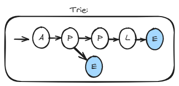
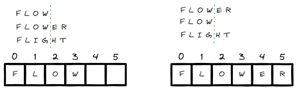

# <a id="home"></a> Trie

Данный раздел посвящён задачам на префиксное дерево (Trie) из **[Leetcode Patterns](https://seanprashad.com/leetcode-patterns/)**.

**Table of Contents:**
- [Implement Trie (Prefix Tree)](#implement)
- [Longest Common Prefix](#longest)
- [Design Add and Search Words Data Structure](#searchWords)
- [Concatenated Words](#concatenated)
- [Palindrome Pairs](#palindromePairs)

----

## [↑](#home) <a id="implement"></a> Implement Trie (Prefix Tree)
Разберём задачу по реализации префиксного дерева: **"[Implement Trie (Prefix Tree)](https://leetcode.com/problems/implement-trie-prefix-tree/)"**.

Рассмотрим пример из двух слов: "apple" и "ape":



Как видно, если мы будем строить дерево из Node, то мы можем отслеживать, как строятся слова. Более того, если хранить флаг "законченное слово" мы можем искать как слово целиком, так и его начальную часть, т.е. префикс. Именно поэтому эта структура называется префиксным деревом.

Каждая нода нашего Trie будет состоять из нескольких полей:
```java
class Trie {
    private boolean isWord;
    private char value;
    // Consist only of lowercase English letters:
    private Trie[] children = new Trie[26];
```

Заполнение будет выглядеть следующим образом:
```java
public void insert(String word) {
    Trie curr = this;
    for (char x : word.toCharArray()) {
        // Calculate index. a = 0, b = 1, etc.
        int index = x - 'a';
        if (curr.children[index] == null) {
            curr.children[index] = new Trie();
            curr.children[index].value = x;
        }
        curr = curr.children[index];
    }
    curr.isWord = true;
}
```
Благодаря ограничению на значение, мы можем немного оптимизировать хранение дочерних нод.

Для поиска нам понадобится вспомогательный метод, который будет возвращать Node для последнего символа в слове:
```java
private Trie getWordTail(String word) {
    Trie curr = this;
    for (char x : word.toCharArray()) {
        int index = x - 'a';
        curr = curr.children[index];
        if (curr == null) return null;
    }
    return curr;
}
```

Благодаря этому методу мы можем реализовать требуемые от нас действия:
```java
public boolean search(String word) {
    Trie res = getWordTail(word);
    return res != null && res.isWord;
}
    
public boolean startsWith(String prefix) {
    Trie res = getWordTail(prefix);
    return res != null;
}
```

----

## [↑](#home) <a id="longest"></a> Longest Common Prefix
Разберём задачу **"[Longest Common Prefix](https://leetcode.com/problems/longest-common-prefix/)"**:
> Дан массив слов (например, "flower","flow","flight"). Нужно найти наибольший общий префикс для всех слов.

Данную задачу можно решить при помощи просто строк:
```java
public String longestCommonPrefix(String[] strs) {
    if (strs.length == 0) return "";
	
    String prefix = strs[0]; // First word our starting prefix
	for (int i = 1; i < strs.length; i++) {
		// String should start from our prefix. If not -> reduce prefix 
        while (strs[i].indexOf(prefix) != 0) {
            // Remove last character from our prefix
			prefix = prefix.substring(0, prefix.length() - 1);
			if (prefix.isEmpty()) return "";
		}  
    }      
	return prefix;
}
```

Однако данную задачу можно решить и при помощи логики Trie:



Если визуализировать задачу, то будет видно, что общий префикс не может быть больше, чем самое короткое слово.\
Кроме того, когда мы видим, что символы не совпадают это значит, что проверяемый префикс сокращается до места нахождения разницы:

```java
public String longestCommonPrefix(String[] strs) {
    // Use String Builder as a trie: []->[]->[]->[]
    StringBuilder sb = new StringBuilder();
        
    for (int i = 0; i < strs.length; i++) {
        // Add the first word as is. We can rely ONLY on word index
        if (i == 0) {
            sb.append(strs[i]);
            continue;
        }
        // Trim string builder to common length
        if (sb.length() > strs[i].length()) sb.setLength(strs[i].length());
            
        // Now we can iterate through all characters
        for (int c = 0; c < sb.length(); c++) {
            if (sb.charAt(c) != strs[i].charAt(c)) {
                sb.setLength(c);
                break;
            }
        }
    }
    return sb.toString();
}
```

----

## [↑](#home) <a id="searchWords"></a> Design Add and Search Words Data Structure
Разберём задачу **"[Design Add and Search Words Data Structure](https://leetcode.com/problems/design-add-and-search-words-data-structure/)"**:
> Нужно реализовать такую структуру, в которую можно добавлять слова, а потом их искать с возможностью замены поиска по конкретному символу на шаблон "точка".

Отличный разбор задачи от NeetCode: [Design Add and Search Words Data Structure](https://www.youtube.com/watch?v=BTf05gs_8iU)

Для решения задачи нам понадобится Trie, поэтому создадим вспомогательный класс:
```java
class TrieNode {
    boolean isWord = false;
    // An Array with length of english alphabet (i.e. 26)
    TrieNode[] children = new TrieNode[26];
}
```

В самой же структуре создадим root элемент:
```java
class WordDictionary {
    private TrieNode root = new TrieNode();
```

Далее, напишем "традиционный" метод по добавлению слова в Trie:
```java
public void addWord(String word) {
    TrieNode cur = root;
    for (char chr : word.toCharArray()) {
        int ind = chr - 'a'; // a - a = 0, b - a = 1, etc
        if (cur.children[ind] == null) {
            cur.children[ind] = new TrieNode();
        }
        cur = cur.children[ind];
    }
    cur.isWord = true;
}
```

Поиск же реализуем при помощи DFS подхода:
```java
public boolean search(String word) {
    return dfs(word, 0, root);
}

private boolean dfs(String word, int index, TrieNode root) {
    TrieNode cur = root;
    for (int i = index; i < word.length(); i++) {
        char curChar = word.charAt(i);
        if (curChar == '.') {
            // '.' means check ALL posible options
            for (TrieNode node : cur.children) {
                if (node == null) continue;
                if (dfs(word, i+1, node)) {
                    return true;
                }
            }
            return false;
        } else {
            if (cur.children[curChar - 'a'] == null) return false;
            cur = cur.children[curChar - 'a'];
        }
    }
    return cur.isWord;
}
```

----

## [↑](#home) <a id="concatenated"></a> Concatenated Words
Разберём задачу **"[Concatenated Words](https://leetcode.com/problems/concatenated-words/)"**:
> Дан массив из уникальных слов. Вернуть список тех слов, которые составлены из других слов.

Разбор от NeetCode: **[Concatenated Words](https://www.youtube.com/watch?v=iHp7fjw1R28)**

Для решения нам понадобится подготовить Hash Set для поиска слов за константное время:
```java
public List<String> findAllConcatenatedWordsInADict(String[] words) {
    // Create a hash set to search for words in constant time
    Set<String> wordsSet = new HashSet<>();
    for (String word : words) {
        wordsSet.add(word);
    }

    List<String> result = new ArrayList<>();
    for (String word : words) {
        if (search(word, wordsSet)) result.add(word);
    }
    return result;
}
```

Сам же поиск выглядит следующим образом:
```java
public boolean search(String word, Set<String> wordsSet) {
    for (int i = 0; i < word.length(); i++) {
        String prefix = word.substring(0, i);
        String suffix = word.substring(i, word.length());
        if (wordsSet.contains(prefix) && wordsSet.contains(suffix)) return true;
        if (wordsSet.contains(prefix) && search(suffix, wordsSet)) return true;
    }
    return false;
}
```

Интересно, что это является корректным решением, но LeetCode его не примет. Нам нужно немного ускорить работу при помощи кэширования:
```java
Map<String, Boolean> cache = new HashMap<>();
for (String word : words) {
    if (search(word, wordsSet, cache)) result.add(word);
}
```        

На входе в метод поиска будем проверять кэш. Если же слова в кэше нет, то будем изначально считать, что найти мы что-то должны:
```java
public boolean search(String word, Set<String> wordsSet, Map<String, Boolean> cache) {
    Boolean cachedValue = cache.get(word);
    if (cachedValue != null) return cachedValue;
    cache.put(word, true);
```

А перед выходом из метода с результатом false не забудем это знание запомнить в кэше:
```java
    cache.put(word, false);
    return false;
}
```

----

## [↑](#home) <a id="palindromePairs"></a> Palindrome Pairs
Разберём задачу **"[Palindrome Pairs](https://leetcode.com/problems/palindrome-pairs/)"**:
> Дан массив из строк. Нужно вернуть индексы тех слов, которые образуют пары, которые являются палиндромом.

Разбор от Coders Camp: [Palindrome Pairs](https://youtu.be/iqM6xYQcsx0?si=N_rIeURrYmk_jp0S&t=168)

Для начала нам понадобится вспомогательный метод, чтобы понять, слово является палиндромом или нет:
```java
private boolean isPalindrome(final String word) {
    int l = 0;
    int r = word.length() - 1;
    while (l < r)
      if (word.charAt(l++) != word.charAt(r--)) return false;
    return true;
}
```

Теперь в основном методе нам понадобится подготовить специальную карту слов:
```java
public List<List<Integer>> palindromePairs(String[] words) {
    Map<String, Integer> map = new HashMap<>(); // {reversed word: its index}
    for (int i = 0; i < words.length; ++i) {
        map.put(new StringBuilder(words[i]).reverse().toString(), i);
    }
```

А дальше используем эту карту, чтобы подготовить результаты:
```java
    List<List<Integer>> ans = new ArrayList<>();
    
    for (int i = 0; i < words.length; ++i) {
      final String word = words[i];
      // a special case to prevent duplicate calculation
      if (map.containsKey("") && map.get("") != i && isPalindrome(word))
        ans.add(Arrays.asList(i, map.get("")));
      for (int j = 1; j <= word.length(); ++j) {
        final String l = word.substring(0, j);
        final String r = word.substring(j);
        if (map.containsKey(l) && map.get(l) != i && isPalindrome(r))
          ans.add(Arrays.asList(i, map.get(l)));
        if (map.containsKey(r) && map.get(r) != i && isPalindrome(l))
          ans.add(Arrays.asList(map.get(r), i));
      }
    }

    return ans;
}
```
