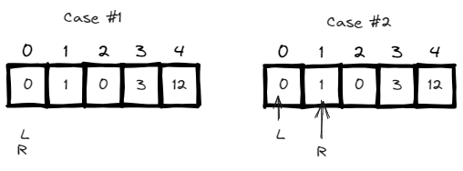
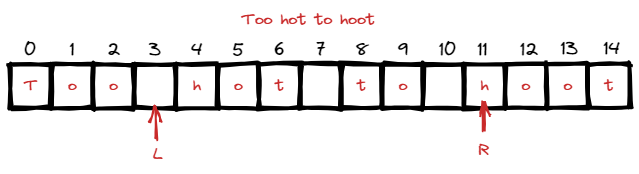
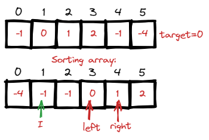
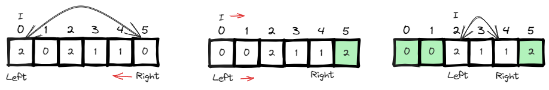
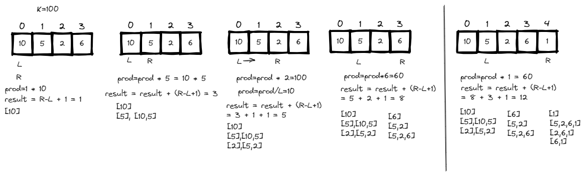

# <a id="home"></a> Two Pointers

Данный раздел посвящён задачам на шаблон **"Two Pointers"**.\
Продолжаем двигаться по [Roadmap](https://neetcode.io/roadmap) от NeetCode.\
Данные задачи входят в том числе в **[Leetcode Patterns](https://seanprashad.com/leetcode-patterns/)**.

**Table of Contents:**
- [Move Zeroes](#zeroes)
- [Squares of a Sorted Array](#squares)
- [Backspace String Compare](#backspace)
- [Is Subsequence](#subsequence)
- [Valid Palindrome](#palindrome)
- [Two Sum II](#twoSum2)
- [3Sum](#3Sum)
- [3Sum Closest](#sum3closest)
- [Container With Most Water](#water)
- [Trapping Rain Water](#trap)
- [Find the duplicate number](#duplicateNumber)
- [Sort colors](#sortColors)
- [Subarray Product Less Than K](#lessthanK)
- [Four sum](#sum4)

----

## [↑](#home) <a id="zeroes"></a> Move Zeroes
Рассмотрим задачу "[Move Zeroes](https://leetcode.com/problems/move-zeroes/)":
> Дан массив чисел. Переместить все нули в конец списка, но сохранять порядок ненулевых элементов.

Разбор задачи от NeetCode: **"[Move Zeroes - Leetcode](https://www.youtube.com/watch?v=aayNRwUN3Do)"**.

Отличная задача как введение в **"Two Pointers"** задачи.\
Пусть одним указателем мы будем итерироваться по массиву. А второй указатель будет указывать на позицию с нулевым элементом, с которым мы будем выполнять обмен мест.



Решение:
```java
public void moveZeroes(int[] nums) {
    int left = 0;
    for (int right = 0; right < nums.length; right++) {
        if (nums[right] != 0) {
            // Swap
            int tmp = nums[left];
            nums[left] = nums[right];
            nums[right] = tmp;
            // nums[left] is not zero, move left to the next element
            left++;
        }
    }
}
```

----

## [↑](#home) <a id="squares"></a> Squares of a Sorted Array
Рассмотрим задачу "[Squares of a Sorted Array](https://leetcode.com/problems/squares-of-a-sorted-array/)":
> Дан массив чисел (положительных или отрицательных) в возрастающем порядке. Нужно вернуть массив квадратов этих чисел в возрастающем порядке.

Тоже интересная задача на два указателя. Разбор от NeetCode: **[Squares of a Sorted Array](https://www.youtube.com/watch?v=FPCZsG_AkUg)**.


```java
public int[] sortedSquares(int[] nums) {
    // Two pointers
    int left = 0, right = nums.length - 1;
    // Iterate over positions in the result array
    int[] result = new int[nums.length];
    for (int i = nums.length - 1; i >= 0; i--) {
        if (nums[left] * nums[left] > nums[right] * nums[right]) {
            result[i] = nums[left] * nums[left];
            left++;
        } else {
            result[i] = nums[right] * nums[right];
            right--;
        }
    }
    return result;
}
```

----

## [↑](#home) <a id="backspace"></a> Backspace String Compare
Рассмотрим задачу "[Backspace String Compare](https://leetcode.com/problems/backspace-string-compare/)":
> Даны две строки, причём знак # в них означает backspace. Проверить, что строки после бэкспэйсов будут одинаковы.

Тоже задача на два указателя. Чтобы обрабатывать меньше пограничных случаев, можно завести два указателя (на каждую строку) и итерироваться с конца в начало:

```java
public boolean backspaceCompare(String s, String t) {
    int left = s.length() - 1, right = t.length() - 1;
    int leftSkip = 0, rightSkip = 0;
    // While we have something to analyze from any of these strings:
    while (left >= 0 || right >= 0) {
        while (left >= 0) {
            if (s.charAt(left) == '#') {
                leftSkip++;
                left--;
            } else if (leftSkip > 0) {
                leftSkip--;
                left--;
            } else {
                break;
            }
        }
        while (right >= 0) {
            if (t.charAt(right) == '#') {
                rightSkip++;
                right--;
            } else if (rightSkip > 0) {
                rightSkip--;
                right--;
            } else {
                break;
            }
        }
        if (left >= 0 && right >= 0 && s.charAt(left) != t.charAt(right)) {
            return false; // should have the same symbol 
        }
        if ((left >= 0) != (right >= 0)) {
            return false; // should reach the end in the same time
        }
        left--;
        right--;
    }
    return true;
}
```

----

## [↑](#home) <a id="subsequence"></a> Is Subsequence
Рассмотрим задачу "[Is Subsequence](https://leetcode.com/problems/is-subsequence/)":
> Дано две строки s и t. Проверить, можно ли получить строку s из строки t путём сохранения порядка символов, но удаления лишних (если надо).

Разбор задачи от NeetCode: [Is Subsequence](https://www.youtube.com/watch?v=99RVfqklbCE).

Решение сводится к тому, что правым указателем мы итерируемся по строке, В которой ищем. А левым - по строке, символы ИЗ которой мы ищем:
```java
public boolean isSubsequence(String s, String t) {
    int left = 0;
    for (int right = 0; right < t.length(); right++) {
        if (left == s.length()) break;
        if (s.charAt(left) == t.charAt(right)) {
            left++;
        }
    }
    return left == s.length();
}
```

----

## [↑](#home) <a id="palindrome"></a> Valid Palindrome
Рассмотрим задачу "[Valid Palindrome](https://leetcode.com/problems/valid-palindrome/)":
> Дана строка (например: "Too hot to hoot "). Нужно проверить, является ли она палиндромом, то есть читается одинаково слева направо и справа налево. При проверке учитываются только буквы и цифры (Character.isLetterOrDigit).

Разбор задачи от NeetCode: [Valid Palindrome](https://www.youtube.com/watch?v=jJXJ16kPFWg).\
Разбор задачи от Nick White: [Valid Palindrome Solution Explained](https://www.youtube.com/watch?v=rYyn9Vc-dBQ).

Палиндром - текст, который слева и справа (то есть у нас есть **ДВЕ** стороны) читается одинаково. Читаем символы из строки по индексу слева (указатель left) и справа (указатель right). То есть классическая задача на два указателя:



Решение:
```java
public boolean isPalindrome(String s) {
    int left = 0, right = s.length() - 1;
    while (left < right) {
        while(left < right && !Character.isLetterOrDigit(s.charAt(left))) {
            left++;
        }
        while(right > left && !Character.isLetterOrDigit(s.charAt(right))) {
            right--;
        }
        if (Character.toLowerCase(s.charAt(left)) != Character.toLowerCase(s.charAt(right))) {
            return false;
        }
        left++;
        right--;
    }
    return true;
}
```

----

## [↑](#home) <a id="twoSum2"></a> Two Sum II
Рассмотрим задачу "[Two Sum II](https://leetcode.com/problems/two-sum-ii-input-array-is-sorted/)":
> Дан отсортированный по возврастанию массив целых чисел. Найти такие два числа, которые в сумме дадут заданный target.

Разбор задачи от NeetCode: [TWO SUM II](https://www.youtube.com/watch?v=cQ1Oz4ckceM).\
Разбор задачи от Nick White: [Two Sum II Solution Explained](https://www.youtube.com/watch?v=sAQT4ZrUfWo).


Рассмотрим частный случай: ``[2,7,11,15]``. Сумма крайних чисел равна 17. Если мы сместим правый указатель влево, то правый элемент уменьшится. А если мы сместим левый указатель вправо, то левый элемент увеличится. Тогда мы можем основывать наше решение на том, что сумма с большим элементом больше, а с меньшим - меньше.

Решение основано на том, что последовательность чисел отсортирована:
```java
public int[] twoSum(int[] numbers, int target) {
    int left = 0, right = numbers.length - 1;
    while (left < right) {
        int curSum = numbers[left] + numbers[right];
        if (curSum > target) {
            right--;
        } else if (curSum < target) {
            left++;
        } else {
            return new int[]{left+1, right+1};
        }
    }
    return new int[]{};
}
```

----

## [↑](#home) <a id="3Sum"></a> 3Sum
Рассмотрим задачу "[3Sum](https://leetcode.com/problems/3sum/)":
> Дан массив целых чисел. Вернуть все триплеты (тройки чисел), сумма которых даёт ноль.

Разбор задачи от NeetCode: [3Sum](https://www.youtube.com/watch?v=jzZsG8n2R9A).\
Разбор задачи от Nick White: [LeetCode 3Sum Solution Explained](https://www.youtube.com/watch?v=qJSPYnS35SE).

Решение данной задачи так же испльзует подход с указателями:



Решение:
```java
public List<List<Integer>> threeSum(int[] nums) {
    Arrays.sort(nums);
    List<List<Integer>> result = new ArrayList<List<Integer>>();

    for (int i = 0; i < nums.length; i++) {
        if (i > 0 && nums[i] == nums[i-1]) continue; // To avoid duplicates
        // Apply two sum solution
        int l = i + 1, r = nums.length - 1;
        while (l < r) {
            int sum = nums[i] + nums[l] + nums[r];
            if (sum > 0) {
                r--;
            } else if(sum < 0) {
                l++;
            } else {
                result.add(Arrays.asList(nums[i],nums[l],nums[r]));
                l++;
                while (nums[l] == nums[l-1] && l < r) {
                    l++;
                }
            }
        }
    }
    return result;
}
```

----

## [↑](#home) <a id="sum3closest"></a> 3Sum Closest
Разберём задачу **"[3Sum Closest](https://leetcode.com/problems/3sum-closest/)"**:
> Дан массив чисел. Надо найти самую близкую к target сумму, полученную путём сложения трёх чисел из массива.

Nick White поможет с пониманием задачи: [LeetCode 3Sum Closest Explained](https://www.youtube.com/watch?v=qBr2hq4daWE).

А само решение похоже на 3Sum, только нам не нужно заботиться о дубликатах:
```java
public int threeSumClosest(int[] nums, int target) {
    int result = nums[0] + nums[1] + nums[2];
    Arrays.sort(nums);
    for (int i = 0; i < nums.length - 2; i++) {
        int aPointer = i + 1;
        int bPointer = nums.length - 1;
        while (aPointer < bPointer) {
            int curSum = nums[i] + nums[aPointer] + nums[bPointer];
            if (curSum > target) {
                bPointer--;
            } else {
                aPointer++;
            }
            if (Math.abs(curSum - target) < Math.abs(result - target)) {
                result = curSum;
            }
        }
    }
    return result;
}
```

----

## [↑](#home) <a id="water"></a> Container With Most Water
Рассмотрим задачу "[Container With Most Water](https://leetcode.com/problems/container-with-most-water/)":
> Дан массив высот, длина которого равна N. Найти самую высокую область, которая ограничена двумя высотами.

Разбор задачи от NeetCode: [Container with Most Water](https://www.youtube.com/watch?v=UuiTKBwPgAo).\
Разбор задачи от Nick White: [Container With Most Water Explained](https://www.youtube.com/watch?v=6PrIRPpTI9Q).\
Разбор задачи от Сергея Пузанкова: [Поиск наибольшего контейнера с водой](https://www.youtube.com/watch?v=GoQFtH5MXLE) 

Главный вопрос: что такое контейнер с водой? Это когда у нас есть высота слева (left) и высота справа (right). Меньшее значение ограничивает высоту, т.к. выше вода вылиывается. А **область** высчитывается как минимальная высота умноженная на дистанцию между правой и левой стенкой.


Решение:
```java
public int maxArea(int[] height) {
    int left = 0, right = height.length - 1;
    int maxArea = 0;
    while (left < right) {
        if (height[left] < height[right]) {
            maxArea = Math.max(maxArea, height[left] * (right - left));
            left++;
        } else {
            maxArea = Math.max(maxArea, height[right] * (right - left));
            right--;
        }
    }
    return maxArea;
}
```

----

## [↑](#home) <a id="trap"></a> Trapping Rain Water
Рассмотрим задачу "[Trapping Rain Water](https://leetcode.com/problems/trapping-rain-water/)":
> Дан массив высот. Найти наибольшее количество воды, которое помещается мимо каких-нибудь двух высот.

Разбор задачи:
- [NeetCode: Trapping Rain Water](https://www.youtube.com/watch?v=ZI2z5pq0TqA)
- [ANDREADI: Trapping Rain Water](https://www.youtube.com/watch?v=OmnSu6hQq-s)
- [Trapping Rain Water (4 Approaches)](https://youtu.be/EdR3V5DBgyo?t=691)
- [Задача с LeetCode про сбор дождевой воды](https://www.youtube.com/watch?v=2xZq8z_A-NQ)

Ниже приведено наиболее логичное для запоминания решение. Куда ставить указатели? Т.к. мы рассматриваем колонку или по левому указателю или по правому, то логично не ставить их на крайние положения, т.к. с них вода выливается. Таким образом left и right будут на шаг дальше. Кроме того, leftMax и rightMax (наши максимумы) должны учитывать и самые крайние положения, т.к. они учитывают именно границы, а не анализируют столбцы. Кроме того, нужно понимать, что надо идти пока Left не встретит Right включая этот случай.

Решение:
```java
public int trap(int[] height) {
    int left = 1, right = height.length - 2;
    int leftMax = height[0], rightMax = height[height.length - 1];
    
    int res = 0;
    while (left <= right) {            
        if (leftMax <= rightMax) {
            leftMax = Math.max(leftMax, height[left]);
            res = res + (leftMax - height[left]);
            left++;
        } else {
            rightMax = Math.max(rightMax, height[right]);
            res = res + (rightMax - height[right]);
            right--;
        }
    }
    return res;
}
```

---

## [↑](#home) <a id="duplicateNumber"></a> Find the duplicate number
Рассмотрим задачу **"[287. Find the Duplicate Number](https://leetcode.com/problems/find-the-duplicate-number/)"**:
> Дан массив из чисел в диапазоне [1, N] и размером на 1 больше, чем N т.к. содержит дубликат. Нужно найти дубликат.

Это интересная задача, т.к. там нельзя модифировать массив. Однако, хитрость в условии. Любое значение (даже n) может быть использовано в качестве индекса, т.к. не выходит за массив. Число 0 не используется, а значит нулевой индекс содержит ссылку на какой-то другой элемент.
Получается, на массив можно посмотреть как на связанный список:


Получается, что можно применить тот же алгоритм поиска цикла с двумя указателями: медленным и быстрым. Благодаря этому мы сможем найти точку пересечения указателей и определить, что у нас есть цикл. Далее оказывается, что от точки пересечения до места образования цикла (т.е. до дубля) такое же расстояние, как и от начала массива.

Подробное объяснение: **"[Find the Duplicate Number - Floyd's Cycle Detection](https://www.youtube.com/watch?v=wjYnzkAhcNk)"**.

Таким образом задача делится на 2 этапа:
- Находим точку пересечения быстрого и медленного указателя (совпадает с пониманием факта обнаружения цикла)
```java
// Move pointers to the start position
int slow = 0, fast = 0;
do {
    slow = nums[slow];
    fast = nums[nums[fast]];
} while(fast != slow);
```
- Заменяем быстрый указатель медленным. Когда он встретится с медленным - мы найдём дубль
```java
// Make fast pointer as slow pointer
fast = 0;
while (fast != slow) {
    slow = nums[slow];
    fast = nums[fast];
}
return slow;
```

----

## [↑](#home) <a id="sortColors"></a> Sort colors
Рассмотрим задачу **"[Sort colors](https://leetcode.com/problems/sort-colors/)"**:
> Дан массив из трёх цифр 0, 1 и 2. Нужно их отсортировать in-place (без дополнительного места).

Разбор решения:
- [NeetCode: Sort colors](https://www.youtube.com/watch?v=4xbWSRZHqac)
- [Nick White: Sort Colors](https://www.youtube.com/watch?v=uvB-Ns_TVis)

Решение:



```java
public void sortColors(int[] nums) {
    int left = 0, right = nums.length - 1;
    int index = 0;
    while (index <= right && left < right) {
        if (nums[index] == 0) {
            nums[index] = nums[left];
            nums[left] = 0;
            left++;
            index++;
        } else if (nums[index] == 2) {
            nums[index] = nums[right];
            nums[right] = 2;
            right--;
        } else {
            index++;
        }
    }
}
```

----

## [↑](#home) <a id="lessthanK"></a> Subarray Product Less Than K
Рассмотрим задачу **"[Subarray Product Less Than K](https://leetcode.com/problems/subarray-product-less-than-k/)"**:
> Дан массив чисел. Найти количество подмассивов, которые меньше заданного числа K

Разбор решения: [Nick White: Subarray Product Less Than K](https://www.youtube.com/watch?v=SxtxCSfSGlo)



Решение:
```java
public int numSubarrayProductLessThanK(int[] nums, int k) {
    if (k <= 1) return 0;
    int prod = 1; // Can't multiply on zero
    int result = 0;

    int left = 0, right = 0;
    while (right < nums.length) {
        prod = prod * nums[right];

        while (prod >= k) {
            prod = prod / nums[left]; // Remove left element from product (shrink window)
            left++;
        }
        result = result + (right - left + 1);
        right++;
    }
    return result;
}    
```

----

## [↑](#home) <a id="sum4"></a> Four sum
Разберём задачу **"[4Sum](https://leetcode.com/problems/4sum/)"**.

У задачи про 3Sum есть логическое продолжение - 4Sum. Они очень похожи:
```java
    public List<List<Integer>> fourSum(int[] nums, int target) {
        List<List<Integer>>ans=new ArrayList<>();
        if(nums==null || nums.length==0) return ans;
        int n=nums.length;
             
        Arrays.sort(nums);
        for(int i=0;i<n;i++){
            long target2=(long)target-(long)nums[i];

            for(int j=i+1;j<n;j++){
                long remaining=(long)target2-(long)nums[j];

                int first=j+1;
                int last=n-1;
                while(first<last){
                    long twoSum=(long)nums[first]+(long)nums[last];
                    if(twoSum<remaining) {
                        first++;
                    }
                    else if(twoSum>remaining) {
                        last--;
                    }
                    else{
                        List<Integer>res=new ArrayList<>();
                        res.add(nums[i]);//num 1
                        res.add(nums[j]);//num 2
                        res.add(nums[first]);//num 3
                        res.add(nums[last]);//num 4
                        ans.add(res);

                        // Processing the duplicates of number 3
                        while(first<last && nums[first]==res.get(2)) first++;

                        // Processing the duplicates of number 4
                        while(first<last && nums[last]==res.get(3)) last--;
                    }
                }
                // Processing the duplicates of number 2
                while(j+1<n && nums[j+1]==nums[j]) j++;
            }
            // Processing the duplicates of number 1
            while(i+1<n && nums[i+1]==nums[i]) i++;
        }
        return ans;
    }
```