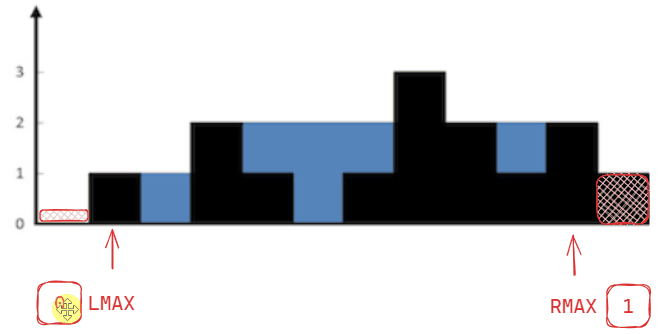

# [←](../README.md) <a id="home"></a> Two Pointers

Данный раздел посвящён задачам на шаблон **"Two Pointers"**.\
Задачи на LeetCode: **"[Two Pointers](https://leetcode.com/problem-list/two-pointers/)"**.


**Table of Contents:**
- [[283] Move Zeroes](#zeroes)
- [[977] Squares of a Sorted Array](#squares)
- [[844] Backspace String Compare](#backspace)
- [[392] Is Subsequence](#subsequence)
- [[125] Valid Palindrome](#palindrome)
- [[167] Two Sum II](#twoSum2)
- [[15] 3Sum](#3Sum)
- [[16] 3Sum Closest](#sum3closest)
- [[75] Sort colors](#sortColors)
- [[11] Container With Most Water](#water)
- [[42] Trapping Rain Water](#trap)
- [[713] Subarray Product Less Than K](#lessthanK)
- [[287] Find the duplicate number](#duplicateNumber)
- [[18] Four sum](#sum4)

----


## [↑](#home) <a id="zeroes"></a> 283. Move Zeroes
Рассмотрим задачу "[283. Move Zeroes](https://leetcode.com/problems/move-zeroes/)":
> Дан массив чисел. Переместить все нули в конец списка, но сохранять порядок ненулевых элементов.

Разбор задачи от NeetCode: **"[Move Zeroes - Leetcode](https://www.youtube.com/watch?v=aayNRwUN3Do)"**.

Отличная задача как введение в **"Two Pointers"** задачи.\
Хочется пробегаться указателем слева, а помещать по указателю справа, который указывает на конец списка\
Это не будет работать, т.к. нам важен порядок. А раз нам важен порядок, будем двигать **left** и **right** вместе, начиная с начала.

Пусть указатель **left** указывает на место, куда мы переносим ненулевой элемент. Это позволит нам идти слева направо и соблюдать порядок.\
Ведь порядок слева направо, значит и идти надо слева направо.

Указатель **right** же будет идти по массиву в поисках ненулевых элементов. Если встречаем ненулевой - перемещаем его в left и идём дальше, сдвинув left.


<details><summary>Решение</summary>

```java
public void moveZeroes(int[] nums) {
    int left = 0;
    for (int right = 0; right < nums.length; right++) {
        if (nums[right] != 0) {
            // Swap
            int tmp = nums[left];
            nums[left] = nums[right];
            nums[right] = tmp;
            // nums[left] is not zero, move left to the next element
            left++;
        }
    }
}
```
</details>

----

## [↑](#home) <a id="squares"></a> 977. Squares of a Sorted Array
Рассмотрим задачу "[977. Squares of a Sorted Array](https://leetcode.com/problems/squares-of-a-sorted-array/)":
> Дан массив чисел (положительных или отрицательных) в возрастающем порядке. Нужно вернуть массив квадратов этих чисел в возрастающем порядке.

Тоже интересная задача на два указателя. Разбор от NeetCode: **[Squares of a Sorted Array](https://www.youtube.com/watch?v=FPCZsG_AkUg)**.

Важно уделить внимание тому, что массив отсортирован. Это значит, что самые минимальные значения будут слева, а максимальны справа.\
Однако, слева может быть такое отрицательное число, квадрат которого будет больше, чем самое правое число.\
Получается, нам нужно смотреть сразу в два места, левый край и правый край и сдвигать диапазон. То есть задача на два указателя.

Заполняем результат справа налево, т.к. будет двигаться от наибольшего числа к наименьшему.\
Если квадрат слева больше, чем квадрат справа - записываем его и сдвигаем левый указатель. Иначе записываем квадрат справа и сдвигаем правый указатель.


<details><summary>Решение</summary>

```java
public int[] sortedSquares(int[] nums) {
    // Two pointers
    int left = 0, right = nums.length - 1;
    // Iterate over positions in the result array
    int[] result = new int[nums.length];
    for (int i = nums.length - 1; i >= 0; i--) {
        if (nums[left] * nums[left] > nums[right] * nums[right]) {
            result[i] = nums[left] * nums[left];
            left++;
        } else {
            result[i] = nums[right] * nums[right];
            right--;
        }
    }
    return result;
}
```
</details>

----

## [↑](#home) <a id="backspace"></a> 844. Backspace String Compare
Рассмотрим задачу "[844. Backspace String Compare](https://leetcode.com/problems/backspace-string-compare/)":
> Даны две строки, причём знак # в них означает backspace. Проверить, что строки после бэкспэйсов будут одинаковы.

Разбор задачи от NeetCode: **"[Backspace String Compare - Leetcode 844](https://www.youtube.com/watch?v=k2qrymM_DOo)"**.

Хорошая задача на два указателя.\
Она показывает то, что в таких задачах важно понять, в какую сторону идти указателями.\
Если идти слева направо, то будет сложно учитывать сдвиги. Поэтому, лучше идти наоборот, справа налево.


Таким образом, главное написать правильную логику "прокрутки" до символа, который надо сравнивать:
```java
public int scroll(String line, int pos) {
    int toSkip = 0;
    while (pos >= 0) {
        if (line.charAt(pos) == '#') {
            toSkip++;
            pos--;
        } else if (toSkip > 0) {
            toSkip--;
            pos--;
        } else {
            break;
        }
    }
    return pos;
}
```

Остаётся только прокручивать до нужного места обе строки и сравнить, пока не получим результат.

<details><summary>Решение</summary>

```java
public boolean backspaceCompare(String s, String t) {
    int left = s.length() - 1, right = t.length() - 1;
    // While we have something to analyze from any of these strings:
    while (left >= 0 || right >= 0) {
        left = scroll(s, left);
        right = scroll(t, right);
        // Condition #1: Should have the same symbol (if in range)
        if (left >= 0 && right >= 0 && s.charAt(left) != t.charAt(right)) {
            return false; 
        }
        // Condition #2: Should reach the end at the same time
        if ((left >= 0) != (right >= 0)) {
            return false;
        }
        // Move pointers
        left--;
        right--;
    }
    return true;
}
```
</details>

----

## [↑](#home) <a id="subsequence"></a> 392. Is Subsequence
Рассмотрим задачу "[392. Is Subsequence](https://leetcode.com/problems/is-subsequence/)":
> Дано две строки s и t. Проверить, можно ли получить строку s из строки t путём сохранения порядка символов, но удаления лишних (если надо).

Разбор задачи от NeetCode: [Is Subsequence](https://www.youtube.com/watch?v=99RVfqklbCE).


В этой задаче главное понять, каким указателем мы итерируемся.\
Левый указатель будем смещать тогда, когда мы найдём совпадение символов.\
Правым указателем будет идти по строке поиска.

<details><summary>Решение</summary>

```java
public boolean isSubsequence(String s, String t) {
    int left = 0;
    for (int right = 0; right < t.length(); right++) {
        if (left == s.length()) break;
        if (s.charAt(left) == t.charAt(right)) {
            left++;
        }
    }
    return left == s.length();
}
```
</details>

----

## [↑](#home) <a id="palindrome"></a> 125. Valid Palindrome
Рассмотрим задачу "[125. Valid Palindrome](https://leetcode.com/problems/valid-palindrome/)":
> Дана строка (например: "Too hot to hoot "). Нужно проверить, является ли она палиндромом, то есть читается одинаково слева направо и справа налево. При проверке учитываются только буквы и цифры (Character.isLetterOrDigit).

Разбор задачи от NeetCode: [Valid Palindrome](https://www.youtube.com/watch?v=jJXJ16kPFWg).\
Разбор задачи от Nick White: [Valid Palindrome Solution Explained](https://www.youtube.com/watch?v=rYyn9Vc-dBQ).

Палиндром - текст, который слева и справа (то есть у нас есть **ДВЕ** стороны) читается одинаково.\
Читаем символы из строки по индексу слева (указатель left) и справа (указатель right). То есть классическая задача на два указателя:


Как видно, тут опять применяется тактика прокрутки указателя до правильной позиции, а потом выполняется само действие. Если left вышло за right - останавливаемся.

<details><summary>Решение</summary>

```java
public boolean isPalindrome(String s) {
    int left = 0, right = s.length() - 1;
    while (left < right) {
        while(left < right && !Character.isLetterOrDigit(s.charAt(left))) {
            left++;
        }
        while(right > left && !Character.isLetterOrDigit(s.charAt(right))) {
            right--;
        }
        if (Character.toLowerCase(s.charAt(left)) != Character.toLowerCase(s.charAt(right))) {
            return false;
        }
        left++;
        right--;
    }
    return true;
}
```
</details>

----

## [↑](#home) <a id="twoSum2"></a> 167. Two Sum II
Рассмотрим задачу "[167. Two Sum II](https://leetcode.com/problems/two-sum-ii-input-array-is-sorted/)":
> Дан отсортированный по возврастанию массив целых чисел. Найти такие два числа, которые в сумме дадут заданный target.

Разбор задачи от NeetCode: [TWO SUM II](https://www.youtube.com/watch?v=cQ1Oz4ckceM).\
Разбор задачи от Nick White: [Two Sum II Solution Explained](https://www.youtube.com/watch?v=sAQT4ZrUfWo).

Тут важно, что массив отсортирован. Получается, что значения идут по возрастанию.\
Таким образом, если поставить два указателя (левый и правый) на самые крайние элементы, то мы получим некоторую сумму.\
Если двигать левый - сумма будет увеличиваться, а если двигать правый - уменьшаться:


<details><summary>Решение</summary>

```java
public int[] twoSum(int[] numbers, int target) {
    int left = 0, right = numbers.length - 1;
    while (left < right) {
        int curSum = numbers[left] + numbers[right];
        if (curSum > target) {
            right--;
        } else if (curSum < target) {
            left++;
        } else {
            return new int[]{left+1, right+1};
        }
    }
    return new int[]{};
}
```
</details>

----

## [↑](#home) <a id="3Sum"></a> 15. 3Sum
Рассмотрим задачу "[15. 3Sum](https://leetcode.com/problems/3sum/)":
> Дан массив целых чисел. Вернуть все триплеты (тройки чисел), сумма которых даёт ноль.

Разбор задачи от NeetCode: [3Sum](https://www.youtube.com/watch?v=jzZsG8n2R9A).\
Разбор задачи от Nick White: [LeetCode 3Sum Solution Explained](https://www.youtube.com/watch?v=qJSPYnS35SE).

Предположим, у нас есть массив ``[-1,0,1,2,-1,-4]``.\
Решение данной задачи так же испльзует подход с указателями, похожий на [Two Sum II](#twoSum2).\
Но для решения задачи нужно сначала отсортировать массив:


Как видно, у нас по сути три указателя: I - указатель на текущую итерацию.\
Внутри этой итерации мы пробегаемся левым указателем, а правый смещаем только если не можем получить нужную сумму.

<details><summary>Решение</summary>

```java
public List<List<Integer>> threeSum(int[] nums) {
    Arrays.sort(nums);

    List<List<Integer>> result = new ArrayList<List<Integer>>();
    for (int i = 0; i < nums.length; i++) {
        if (i > 0 && nums[i] == nums[i - 1]) continue; // To avoid duplicates
        // Apply two sum solution
        int left = i + 1, right = nums.length - 1;
        while (left < right) {
            int sum = nums[i] + nums[left] + nums[right];
            if (sum > 0) {
                right--;
            } else if (sum < 0) {
                left++;
            } else {
                result.add(Arrays.asList(nums[i], nums[left], nums[right]));
                left++;
                // Scroll left
                while (nums[left] == nums[left - 1] && left < right) {
                    left++;
                }
            }
        }
    }
    return result;
}
```
</details>

----

## [↑](#home) <a id="sum3closest"></a> 16. 3Sum Closest
Разберём задачу **"[16. 3Sum Closest](https://leetcode.com/problems/3sum-closest/)"**:
> Дан массив чисел. Надо найти самую близкую к target сумму, полученную путём сложения трёх чисел из массива.

Nick White поможет с пониманием задачи: [LeetCode 3Sum Closest Explained](https://www.youtube.com/watch?v=qBr2hq4daWE).

А само решение похоже на 3Sum, только нам не нужно заботиться о дубликатах.

<details><summary>Решение</summary>

```java
public int threeSumClosest(int[] nums, int target) {
    Arrays.sort(nums);

    int result = nums[0] + nums[1] + nums[2];
    for (int i = 0; i < nums.length - 2; i++) {
        int left = i + 1, right = nums.length - 1;
        while (left < right) {
            int curSum = nums[i] + nums[left] + nums[right];
            if (curSum > target) {
                right--;
            } else {
                left++;
            }
            if (Math.abs(curSum - target) < Math.abs(result - target)) {
                result = curSum;
            }
        }
    }
    return result;
}
```
</details>

----

## [↑](#home) <a id="sortColors"></a> 75. Sort colors
Рассмотрим задачу **"[75. Sort colors](https://leetcode.com/problems/sort-colors/)"**:
> Дан массив из трёх цифр 0, 1 и 2. Нужно их отсортировать in-place (без дополнительного места).

Разбор решения:
- [NeetCode: Sort colors](https://www.youtube.com/watch?v=4xbWSRZHqac)
- [Nick White: Sort Colors](https://www.youtube.com/watch?v=uvB-Ns_TVis)

Решение задачи так же через указатели.\
Left будет указывать на место вставки нуля, Right будет указывать на место вставки двойки.\
Указателем I будем идти по изначальному массиву.


<details><summary>Решение</summary>

```java
public void sortColors(int[] nums) {
    int left = 0, right = nums.length - 1;
    int index = 0;
    while (index <= right && left < right) {
        if (nums[index] == 0) {
            nums[index] = nums[left];
            nums[left]  = 0;
            left++;
            index++;
        } else if (nums[index] == 2) {
            nums[index] = nums[right];
            nums[right] = 2;
            right--;
        } else {
            index++;
        }
    }
}
```
</details>

----

## [↑](#home) <a id="water"></a> 11. Container With Most Water
Рассмотрим задачу "[11. Container With Most Water](https://leetcode.com/problems/container-with-most-water/)":
> Дан массив высот. Найти самую высокую область, которая ограничена двумя высотами.

Разбор задачи от NeetCode: [Container with Most Water](https://www.youtube.com/watch?v=UuiTKBwPgAo).\
Разбор задачи от Nick White: [Container With Most Water Explained](https://www.youtube.com/watch?v=6PrIRPpTI9Q).\
Разбор задачи от Сергея Пузанкова: [Поиск наибольшего контейнера с водой](https://www.youtube.com/watch?v=GoQFtH5MXLE) 

Главный вопрос: что такое контейнер с водой? D этом нам поможет визуализация:


Контейнер ограничен двумя высотами: высота слева (left) и высота справа (right).\
Меньшее значение ограничивает высоту, т.к. выше вода вылиывается.\
А **область** высчитывается как минимальная высота умноженная на дистанцию между правой и левой стенкой.

Таким образом у нас опять задача на два указателя. Основные идеи:
- Если высота слева меньше высоты справа - мы должны двигать левый край в попытке увеличить высоту контейнера.
- Если высота справа меньше (или равна) - мы должны двигать правый край в попытке увеличить высоту контейнера.
- На каждой итерации запоминаем самую максимальную из увиденных областей.

<details><summary>Решение</summary>

```java
public int maxArea(int[] height) {
    int maxArea = 0;
    int left = 0, right = height.length - 1;
    while (left < right) {
        int distance = right - left;
        if (height[left] < height[right]) {
            maxArea = Math.max(maxArea, height[left] * distance);
            left++;
        } else {
            maxArea = Math.max(maxArea, height[right] * distance);
            right--;
        }
    }
    return maxArea;
}
```
</details>

----

## [↑](#home) <a id="trap"></a> 42. Trapping Rain Water
Рассмотрим задачу "[42. Trapping Rain Water](https://leetcode.com/problems/trapping-rain-water/)":
> Дан массив высот. Найти наибольшее количество воды, которое помещается во все полости, образованные высотами.

Разбор задачи:
- [NeetCode: Trapping Rain Water](https://www.youtube.com/watch?v=ZI2z5pq0TqA)
- [ANDREADI: Trapping Rain Water](https://www.youtube.com/watch?v=OmnSu6hQq-s)
- [Trapping Rain Water (4 Approaches)](https://youtu.be/EdR3V5DBgyo?t=691)
- [Задача с LeetCode про сбор дождевой воды](https://www.youtube.com/watch?v=2xZq8z_A-NQ)

Ниже приведено наиболее логичное для запоминания решение.

Для решения данной задачи нужно определиться с тем, какие указатели нам нужны.\
Так как границы у нас две, то нам нужно 2 указателя: left и right.\
Более того, т.к. чтобы вода копилась, нам нужны границы слева и справа, то ставим указатели на 1 позицию дальше от края.

Кроме того, на протяжении всего анализа надо помнить, какую максимальную высоту вы до этого видели.\
Таким образом, нам нужно ещё помнить leftMax и rightMax.\
Минимальный из максимумов будет говорить, с какой стороны вода будет выливаться быстрее.

И тогда логика будет сводиться к тому, что мы проверяем, с какой стороны у нас высота меньше.\
Потому что именно с меньшей стороны вода будет вытекать, т.е. это наше ограничение и наша слабая сторона.\
Мы не можем высчитывать кол-во воды с большей стороны, т.к. нас ограничивает именно меньшая сторона.

Таким образом, мы выбираем сначала меньшую сторону, высчитываем воду и продолжаем так же с меньшей стороны.\
При этом надо не забывать обновлять максимум.



<details><summary>Решение</summary>

```java
public int trap(int[] height) {
    int left = 1, right = height.length - 2;
    int leftMax = height[0], rightMax = height[height.length - 1];

    int res = 0;
    while (left <= right) {
        int delta = 0;
        if (leftMax <= rightMax) {
            leftMax = Math.max(leftMax, height[left]);
            delta = leftMax - height[left];
            left++;
        } else {
            rightMax = Math.max(rightMax, height[right]);
            delta = rightMax - height[right];
            right--;
        }
        res = res + delta;
    }
    return res;
}
```
</details>

----

## [↑](#home) <a id="lessthanK"></a> 713. Subarray Product Less Than K
Рассмотрим задачу **"[713. Subarray Product Less Than K](https://leetcode.com/problems/subarray-product-less-than-k/)"**:
> Дан массив чисел. Найти количество подмассивов, произведение элементов которых СТРОГО меньше заданного числа K.

Разбор решения: [Nick White: Subarray Product Less Than K](https://www.youtube.com/watch?v=SxtxCSfSGlo)\
Решение от NeetCode: [Subarray Product Less Than K](https://www.youtube.com/watch?v=Cg6_nF7YIks)

Решение данной задачи строится на том, что положение элемента в массиве означает то, сколько подмассивов с ним есть.\
Например, со вторым элементом есть 2 массива: [0,1] и [1].\
С третьим элементом есть 3 массива: [0,1,2], [1,2] и [2].

Для решения задачи понадобится 2 указателя, которые будут указывать на границу диапазона (так называемое "окно"):


<details><summary>Решение</summary>

```java
public int numSubarrayProductLessThanK(int[] nums, int k) {
    if (k <= 1) return 0;
    int prod = 1; // Can't multiply on zero
    int result = 0;

    int left = 0, right = 0;
    while (right < nums.length) {
        prod = prod * nums[right];

        while (prod >= k) {
            prod = prod / nums[left]; // Remove left element from product (shrink window)
            left++;
        }
        result = result + (right - left + 1);
        right++;
    }
    return result;
}
```
</details>

---

## [↑](#home) <a id="duplicateNumber"></a> 287. Find the duplicate number
Рассмотрим задачу **"[287. Find the Duplicate Number](https://leetcode.com/problems/find-the-duplicate-number/)"**:
> Дан массив из чисел в диапазоне [1, N] и размером на 1 больше, чем N т.к. содержит дубликат. Нужно найти дубликат.

Это интересная задача, т.к. там нельзя модифировать массив. Однако, хитрость в условии.\
Любое значение (даже n) может быть использовано в качестве индекса, т.к. не выходит за массив.\
Число 0 не используется, а значит нулевой индекс содержит ссылку на какой-то другой элемент.\
Получается, на массив можно посмотреть как на связанный список:


Получается, что можно применить алгоритм поиска цикла с двумя указателями: медленным и быстрым. Благодаря этому мы сможем найти точку пересечения указателей и определить, что у нас есть цикл. Далее оказывается, что от точки пересечения до места образования цикла (т.е. до дубля) такое же расстояние, как и от начала массива.

Подробное объяснение: **"[Find the Duplicate Number - Floyd's Cycle Detection](https://www.youtube.com/watch?v=wjYnzkAhcNk)"**.

Таким образом задача делится на 2 этапа:
- Находим точку пересечения быстрого и медленного указателя (совпадает с пониманием факта обнаружения цикла)
```java
// Move pointers to the start position
int slow = 0, fast = 0;
do {
    slow = nums[slow];
    fast = nums[nums[fast]];
} while(fast != slow);
```
- Заменяем быстрый указатель медленным. Когда он встретится с медленным - мы найдём дубль
```java
// Make fast pointer as slow pointer
fast = 0;
while (fast != slow) {
    slow = nums[slow];
    fast = nums[fast];
}
return slow;
```

----

## [↑](#home) <a id="sum4"></a> 18. Four sum
Разберём задачу **"[18. 4Sum](https://leetcode.com/problems/4sum/)"**.

У задачи про 3Sum есть логическое продолжение - 4Sum. Они очень похожи:
```java
public List<List<Integer>> fourSum(int[] nums, int target) {
    List<List<Integer>> result = new ArrayList<>();
    if (nums == null || nums.length == 0) return result;
        
    Arrays.sort(nums);
    for (int i = 0; i < nums.length; i++) {
        long target2 = (long) target - (long) nums[i];

        for (int j = i + 1; j < nums.length; j++) {
            long remaining = (long) target2 - (long) nums[j];

            int first = j + 1;
            int last = nums.length - 1;
            while (first < last) {
                long twoSum = (long) nums[first] + (long) nums[last];
                if (twoSum < remaining) {
                    first++;
                } else if (twoSum > remaining) {
                    last--;
                } else {
                    List<Integer> entry = new ArrayList<>();
                    entry.add(nums[i]);// num 1
                    entry.add(nums[j]);// num 2
                    entry.add(nums[first]);// num 3
                    entry.add(nums[last]);// num 4
                    result.add(entry);

                    // Processing the duplicates of number 3
                    while (first < last && nums[first] == entry.get(2)) first++;

                    // Processing the duplicates of number 4
                    while (first < last && nums[last] == entry.get(3)) last--;
                }
            }
            // Processing the duplicates of number 2
            while (j + 1 < nums.length && nums[j + 1] == nums[j]) j++;
        }
        // Processing the duplicates of number 1
        while (i + 1 < nums.length && nums[i + 1] == nums[i]) i++;
    }
    return result;
}
```