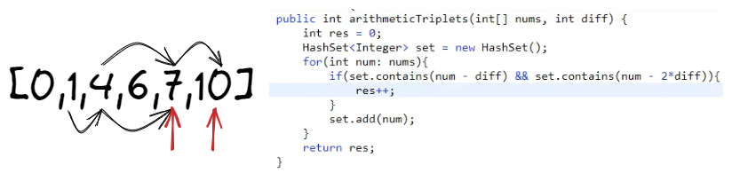

# <a id="home"></a> Two sum

Данный раздел посвящён задачам на двоичный поиск из **[Leetcode Patterns](https://seanprashad.com/leetcode-patterns/)**.\
Далее рассмотрим задачи на [Two Pointers](https://www.youtube.com/watch?v=CWUnvUJ29zw&list=PL1MJrDFRFiKa6ujcwZcMB8DdNzUg29BXy).

**Table of Contents:**
- [Two sum](#twosum)
- [Two sum II](#twosum2)
- [Squares of a Sorted Array](#squares)
- [Backspace String Compare](#backspace)
- [Three sum](#sum3)
- [Number of Arithmetic Triplets](#triplets)
- [Four sum](#sum4)

----

## [↑](#home) <a id="twosum"></a> Two sum
Разберём задачу **"[Two sum](https://leetcode.com/problems/two-sum/)"**.\
Объяснение задачи можно посмотреть у NeetCode: [Two Sum - Leetcode](https://www.youtube.com/watch?v=KLlXCFG5TnA)

```java
public int[] twoSum(int[] nums, int target) {
    Map<Integer, Integer> map = new HashMap<>();
    // We need indicies, so we need a pointer to the index
    for (int i = 0; i < nums.length; i++) {
        int num2 = target - nums[i];
        if (map.containsKey(num2)) {
            return new int[]{map.get(num2), i};
        }
        map.put(nums[i], i);
    }
    return new int[]{};
}
```


## [↑](#home) <a id="twosum2"></a> Two sum II
Разберём продолжение прошлой задачи: **"[Two Sum II](https://leetcode.com/problems/two-sum-ii-input-array-is-sorted/)"**.\
Объяснение задачи можно посмотреть у NeetCode: [NeetCode: TWO SUM II Coding Interview Question](https://www.youtube.com/watch?v=cQ1Oz4ckceM)

Это отличная задача на шаблон Two Pointers:
```java
public int[] twoSum(int[] numbers, int target) {
    int left = 0, right = numbers.length - 1;
    while (left < right) {
        int curSum = numbers[left] + numbers[right];
        if (curSum > target) {
            right--;
        } else if (curSum < target) {
            left++;
        } else {
            return new int[]{left+1, right+1};
        }
    }
    return new int[]{};
}
```


## [↑](#home) <a id="squares"></a> Squares of a Sorted Array
Разберём задачу **"[Squares of a Sorted Array](https://leetcode.com/problems/squares-of-a-sorted-array/)"**.\
Объяснение можно посмотреть как всегда у NeetCode: [Squares of a Sorted Array](https://www.youtube.com/watch?v=FPCZsG_AkUg).

По условию задачи нам нужно на основе отсортированного массива вернуть отсортированный массив квадратов изначальных значений. И всё бы хорошо, но числа могут быть отрицательными. Тогда, можно завести два указателя: Left и Right и заполнять результат от конца к началу, так как мы будем знать точно, где максимальные числа находятся:

```java
public int[] sortedSquares(int[] nums) {
    int[] result = new int[nums.length];
    int l = 0, r = nums.length - 1;
    for (int i = 0; i < nums.length; i++) {
        if (l > r) break;
        if (nums[l] * nums[l] > nums[r] * nums[r]) {
            result[result.length - 1 - i] = nums[l] * nums[l];
            l++;
        } else {
            result[result.length - 1 - i] = nums[r] * nums[r];
            r--;
        }
    }
    return result;
}
```


## [↑](#home) <a id="backspace"></a> Backspace String Compare
Разберём задачу **"[Backspace String Compare](https://leetcode.com/problems/backspace-string-compare/)"**.\
Понять задачу поможет Nick White: [LeetCode Backspace String Compare Solution Explained](https://www.youtube.com/watch?v=vgog1EuEJYQ).

Для решения этой задачи нам понадобится 2 указателя и счётчики пропущенных символов:
```java
int left = s.length() - 1, right = t.length() - 1;
int leftSkip = 0, rightSkip = 0;
```

Далее мы собираемся итерироваться до тех пор, пока есть хотя бы один символ для анализа:
```java
// While we have something to analyze from any of these strings:
while (left >= 0 || right >= 0) {
    // TODO
}
return true;
```

Для каждого указателя (left на первую строчку и right на вторую) выполним "промотку"/сдвиг:
```java
while (left >= 0) {
    if (s.charAt(left) == '#') {
        leftSkip++;
        left--;
    } else if (leftSkip > 0) {
        leftSkip--;
        left--;
    } else {
        break;
    }
}
```

После прокруток остаётся только выполнить проверки и сдвинуть оба указателя:
```java
if (left >= 0 && right >= 0 && s.charAt(left) != t.charAt(right)) {
    return false;
}
if ((left >= 0) != (right >= 0)) {
    return false;
}
left--;
right--;
```

Есть ещё одно хорошее объяснение, но с использованием StringBuilder'а: [Nikhil Lohia: Backspace String Compare](https://www.youtube.com/watch?v=MGOjHoeMlsM).


## [↑](#home) <a id="sum3"></a> Three sum 
Разберём задачу **"[3Sum](https://leetcode.com/problems/3sum/)"**.

Понять задачу помогут вот эти два видео:
- [NeetCode: 3Sum - Leetcode](https://www.youtube.com/watch?v=jzZsG8n2R9A).
- [Nick White: LeetCode 3Sum Solution](https://www.youtube.com/watch?v=qJSPYnS35SE)

В качестве подготовки перед основными действиями нам нужно подготовить переменную для складывания результата, а так же отсортировать исходные массив:
```java
Arrays.sort(nums);
List<List<Integer>> result = new ArrayList<List<Integer>>();
```

Далее непосредственно само решение:
```java
for (int i = 0; i < nums.length; i++) {
    if (i > 0 && nums[i] == nums[i-1]) continue; // To avoid duplicates
    // Apply two sum solution
    int l = i + 1, r = nums.length - 1;
    while (l < r) {
        int sum = nums[i] + nums[l] + nums[r];
        if (sum > 0) {
            r--;
        } else if(sum < 0) {
            l++;
        } else {
            result.add(Arrays.asList(nums[i],nums[l],nums[r]));
            l++;
            while (nums[l] == nums[l-1] && l < r) {
                l++;
            }
        }
    }
}
return result;
```


## [↑](#home) <a id="triplets"></a> Number of Arithmetic Triplets 
Разберём задачу **"[Number of Arithmetic Triplets](https://leetcode.com/problems/number-of-arithmetic-triplets/)"**.

Прежде чем мы её разберём стоит немного порисовать:



Само решение:
```java
public int arithmeticTriplets(int[] nums, int diff) {
    int result = 0;
    Set<Integer> visited = new HashSet<>();
    for (int num : nums) {
        if (visited.contains(num - diff) && visited.contains(num - (diff*2))) {
            result++;
        }
        visited.add(num);
    }
    return result;
}
```


## [↑](#home) <a id="sum4"></a> Four sum
Разберём задачу **"[4Sum](https://leetcode.com/problems/4sum/)"**.

У задачи про 3Sum есть логическое продолжение - 4Sum. Они очень похожи:
```java
    public List<List<Integer>> fourSum(int[] nums, int target) {
        List<List<Integer>>ans=new ArrayList<>();
        if(nums==null || nums.length==0) return ans;
        int n=nums.length;
        
        
        Arrays.sort(nums);
        for(int i=0;i<n;i++){
            long target2=(long)target-(long)nums[i];

            for(int j=i+1;j<n;j++){
                long remaining=(long)target2-(long)nums[j];

                int first=j+1;
                int last=n-1;
                while(first<last){
                    long twoSum=(long)nums[first]+(long)nums[last];
                    if(twoSum<remaining) {
                        first++;
                    }
                    else if(twoSum>remaining) {
                        last--;
                    }
                    else{
                        List<Integer>res=new ArrayList<>();
                        res.add(nums[i]);//num 1
                        res.add(nums[j]);//num 2
                        res.add(nums[first]);//num 3
                        res.add(nums[last]);//num 4
                        ans.add(res);

                        // Processing the duplicates of number 3
                        while(first<last && nums[first]==res.get(2)) first++;

                        // Processing the duplicates of number 4
                        while(first<last && nums[last]==res.get(3)) last--;
                    }
                }
                // Processing the duplicates of number 2
                while(j+1<n && nums[j+1]==nums[j]) j++;
            }
            // Processing the duplicates of number 1
            while(i+1<n && nums[i+1]==nums[i]) i++;
        }
        return ans;
    }
```


## [↑](#home) <a id="sum3closest"></a> 3Sum Closest
Разберём задачу **"[3Sum Closest](https://leetcode.com/problems/3sum-closest/)"**.

Nick White поможет с пониманием задачи: [LeetCode 3Sum Closest Explained](https://www.youtube.com/watch?v=qBr2hq4daWE).

А само решение похоже на 3Sum:
```java
public int threeSumClosest(int[] nums, int target) {
    int result = nums[0] + nums[1] + nums[2];
    Arrays.sort(nums);
    for (int i = 0; i < nums.length - 2; i++) {
        int aPointer = i + 1;
        int bPointer = nums.length - 1;
        while (aPointer < bPointer) {
            int curSum = nums[i] + nums[aPointer] + nums[bPointer];
            if (curSum > target) {
                bPointer--;
            } else {
                aPointer++;
            }
            if (Math.abs(curSum - target) < Math.abs(result - target)) {
                result = curSum;
            }
        }
    }
    return result;
}
```